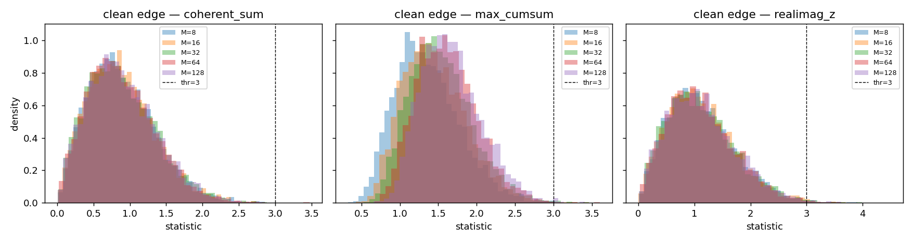
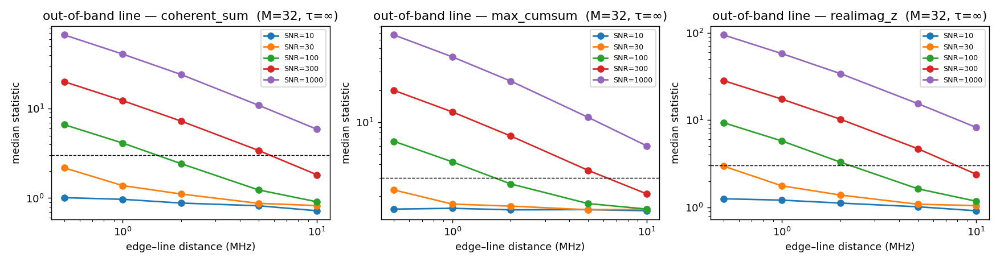
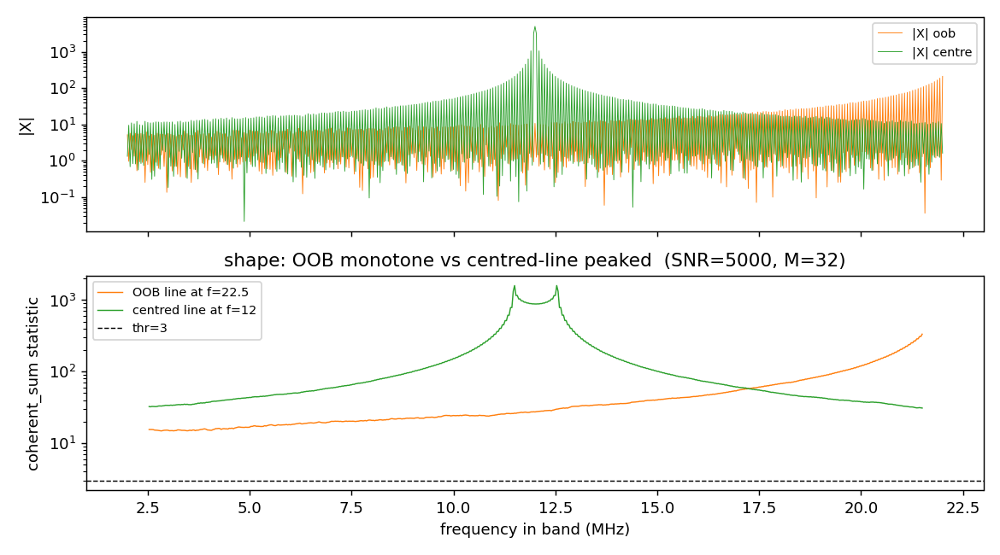
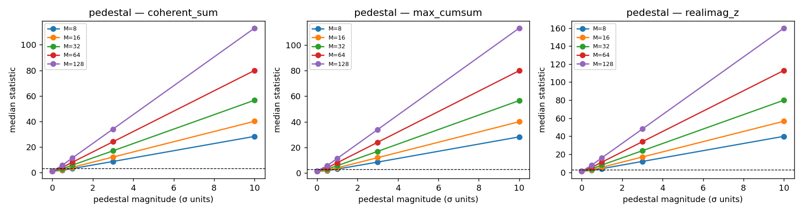
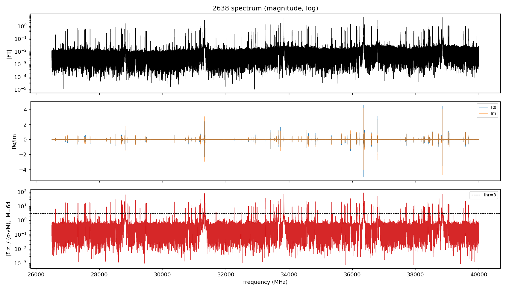
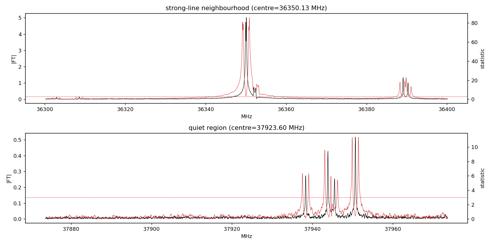

# The complex-edge coherence statistic

A research report on the test used by the windowing stage of the FTMW
processing pipeline to decide where one analysis window ends and the next
begins. Code that regenerates every figure here is in `prototype.py`;
2638 fixture details are at the end.

## 1. Why a separate test exists

The fitting stage of this pipeline decomposes the spectrum into **fit
windows**: contiguous frequency intervals that are disjoint, cover each
spectrum point at most once, and each carry a list of lines whose
parameters enter the least-squares residual for that window. Picking
those window boundaries is the job of the windowing stage that runs
immediately before fitting.

A naive partition — say, slice on every flat stretch between detected
lines — fails for one specific physical reason: in a finite-time FTMW
acquisition, a strong line at frequency $f_0$ deposits energy at
frequencies far away from $f_0$ through **finite-acquisition leakage**.
That leakage skirt decays only as $1/|\Delta f|$, so a single bright
line poisons the spectrum at distances of several MHz, and a window
whose boundary cuts straight through that skirt is implicitly throwing
away information that belongs to the model of the bright line. Two
failure modes follow:

1. **Free-peak phantoms.** A peak detector running on the magnitude
   spectrum picks up the strong line's sidelobes as if they were
   independent lines. If the windowing stage hands those sidelobes to a
   downstream fitter as free peaks, the fitter spends effort modelling
   them as separate damped cosines — competing with the truthful model
   that says "there is one bright line, and these are its skirts."
2. **Coupled boundaries.** Two strong lines whose skirts overlap can
   only be fit correctly *together*: their contributions interfere
   coherently at every point between them. A window boundary placed
   between such lines would force the fitter to choose, per window,
   which line's skirt counts — inevitably mis-attributing power.

The windowing stage handles both cases by partitioning the spectrum
according to where the leakage *actually decays into the noise*, not
where the magnitude spectrum *happens to look flat*. That requires a
test that can tell, given a candidate window edge, whether the points
on the noise-side of that edge are still carrying a strong line's tail
or have fully relaxed to background. The complex-edge coherence
statistic — derived, calibrated, and verified in this report — is that
test.

A magnitude-domain test (`|X| < k\cdot\sigma_\text{RMS}$ at the edge)
is not enough. The leakage envelope is **phase-coherent**: it inherits
the source line's phase and rotates smoothly with frequency offset.
The magnitude of that envelope passes through zero at every sinc zero,
so the spectrum can locally look like noise (in magnitude) while still
carrying fully coherent leakage. The phase is the discriminator, and
the complex-domain test below uses it.

## 2. The finite-acquisition leakage envelope

Define a damped cosine truncated to the FTMW acquisition window
$[0, T]$:

$$
x(t) = A \cos(2\pi f_0 t + \varphi)\, e^{-t/\tau}\, \mathbf{1}_{[0,T]}(t).
$$

Its rfft-domain response near $+f_0$ is, dropping the negligible
mirror term at $-f_0$,

$$
X(f) \approx \tfrac{1}{2}\, A\, e^{i\varphi}\, h_T(f - f_0;\,\tau),
\qquad
h_T(\Delta f;\,\tau) = \frac{1 - \exp\!\left[-\left(\tfrac{1}{\tau} + i\,2\pi\Delta f\right)T\right]}{\tfrac{1}{\tau} + i\,2\pi\Delta f}.
$$

The on-line response is real and large: $|h_T(0)| = \tau_\text{eff}$
where $\tau_\text{eff} = \tau(1 - e^{-T/\tau})$, which approaches
$T$ in the undamped/boxcar limit ($\tau \to \infty$). Far from the
line, $1/\tau$ is dominated by $i\,2\pi\Delta f$ and the envelope
takes the simple form

$$
|h_T(\Delta f)| \approx \frac{1 + e^{-T/\tau}}{2\pi\,|\Delta f|}.
$$

Two consequences shape the windowing-stage design.

**The leakage tail is slow.** A $1/|\Delta f|$ envelope means a line
of signal-to-noise ratio $\text{SNR}$ stays above a detection floor
$k\cdot\sigma$ out to distances of order
$\text{SNR}\,(1 + e^{-T/\tau}) / (2\pi\,\tau_\text{eff}\,k)$ MHz —
several MHz for a strong line in a typical FTMW experiment. The
pipeline already uses this closed form for the leakage-reach
*predictor* (`preprocessing/leakage.py`), so the windowing stage can
*propose* a window's extent analytically before measuring anything.

**The leakage tail is phase-coherent.** $h_T(\Delta f)$ rotates
continuously through the complex plane as $\Delta f$ varies. At an
M-point band centred well outside the line, the values of $X(f_k)$
are not independent random samples: their phases are tightly
clustered around a slowly-varying mean. A coherent sum
$\sum_k X(f_k)$ therefore grows like $M$ times that mean, instead
of the $\sqrt{M}$ growth that uncorrelated samples would give. This
is the phase-coherence signature the statistic exploits.

## 3. The statistic

For an M-point edge band of complex spectrum values $z_1,\dots,z_M$
with per-bin complex noise RMS $\sigma$ (per-point, frequency-dependent
in real data — the noise-estimation stage reports exactly this array),
define

$$
S_\text{coh}(z;\,\sigma) \;=\; \frac{\bigl|\sum_{k=1}^{M} z_k\bigr|}{\sigma\,\sqrt{M}}.
$$

Under the null hypothesis that the band carries only noise — modelled
as IID complex Gaussian with $\mathbb{E}[|n_k|^2] = \sigma^2$, i.e.
$n_k = \xi_k + i\eta_k$ with $\xi,\eta \sim \mathcal{N}(0,\sigma^2/2)$
independent — the partial sum $\sum_k n_k$ is complex Gaussian with
variance $M\sigma^2$. Its modulus follows a Rayleigh distribution with
scale $\sigma\sqrt{M/2}$, and the statistic has

$$
\mathbb{E}[S_\text{coh} \mid \text{null}] = \sqrt{\pi/4} \approx 0.886,
\qquad
\mathrm{Var}[S_\text{coh} \mid \text{null}] = 1 - \pi/4 \approx 0.215.
$$

In particular, the null distribution does not depend on $M$ — that is
the point of the $\sqrt{M}$ normalisation, and it is the property
that makes the same threshold work across all band sizes the windowing
stage might want to use.

Under the alternative — the band carries a coherent leakage tail of
typical magnitude $L$ — the sum is dominated by $\sum_k h_k$ where
the $h_k$ have nearly-aligned phase, so $|\sum_k h_k| \sim M L$ and

$$
S_\text{coh} \;\sim\; M L / (\sigma\,\sqrt{M}) \;=\; (L/\sigma)\,\sqrt{M}.
$$

The statistic grows as $\sqrt{M}$ in the signal-bearing case but is
M-independent in the null. This $\sqrt{M}$ gain is the test's
sensitivity: doubling the band width buys 1.4× discriminating power
against a coherent contamination of fixed amplitude.

### 3.1 Variants considered

Two alternative statistics were calibrated alongside $S_\text{coh}$:

- **Max-cumsum.** $S_\text{cum} = \max_{1 \le t \le M}
  |\sum_{k \le t} z_k| / (\sigma \sqrt{t})$, the running CUSUM-style
  statistic. Useful when coherent contamination is concentrated in a
  sub-window of the M-point band — the max-over-$t$ amplifies a local
  hot spot. Pays for that with a higher null mean ($\approx 1.6$) and
  a wider null tail.
- **Real/imag z.** $S_\text{ri} = \max(|\sum_k \text{Re}\,z_k|,\,
  |\sum_k \text{Im}\,z_k|) / (\sigma\sqrt{M/2})$, the larger of the
  two single-component z-scores. Detects contamination that aligns
  with either axis of the complex plane individually.

### 3.2 Empirical null calibration

Across the calibration sweep — clean complex-Gaussian noise at five
band widths $M \in \{8, 16, 32, 64, 128\}$ — the three null
distributions came out as:

| Statistic        | Mean  | Std   | 99th percentile |
|------------------|-------|-------|------------------|
| $S_\text{coh}$   | 0.886 | 0.457 | 2.15             |
| $S_\text{cum}$   | 1.61  | 0.39  | 2.63             |
| $S_\text{ri}$    | 1.13  | 0.59  | 2.78             |



The closed-form $\sqrt{\pi/4}$ expectation for $S_\text{coh}$ is
reproduced to three decimal places, validating the noise model and the
simulator. Crucially, all three distributions are independent of $M$,
which means a single fixed threshold works at every band width — a
necessary property when the windowing stage uses different $M$ values
for the rolling first-pass scan (large $M$, tight null) and the
trim-point refinement (small $M$, finer spatial resolution).

A threshold of $S_\text{coh} = 3$ gives a per-band null false-positive
rate well below 1% — empirically near zero in 200 trials per band
width — without trimming the alternative-hypothesis sensitivity. The
choice $S_\text{coh} = 3$ is adopted as the working threshold for the
windowing stage. It is a configurable parameter on the pipeline file,
not a hard-coded constant, but the calibration above is what justifies
the default.

`S_coh` is selected as the **primary statistic** on three grounds:
its closed-form null (cheap to reason about), its tightest null
distribution among the three, and its straightforwardness — a single
complex sum, no max-over-$t$ or Re/Im branching. `S_cum` is retained
as a secondary tool for *locating* the trim point inside a flagged
edge band (the max-cumsum's hot-spot detection is exactly what's
needed there). `S_ri` is dropped: it provides no detectable
advantage over `S_coh` on any case in the sweep.

## 4. Verification on synthetic ground truth

The simulator builds spectra analytically on the rfft frequency grid
using the same finite-T damped-cosine model the fitting stage will
ultimately fit, then adds complex Gaussian noise of known per-bin RMS.
Four cases probe the statistic's behaviour:

(a) clean edge — no line within the band's leakage reach;
(b) an out-of-band line just outside the band edge, swept over
    distance and SNR;
(c) an in-band centred line — its symmetric sinc skirt reaches each
    band edge;
(d) an injected flat pedestal — a physically unmotivated background
    used as a sanity check.

### 4.1 Out-of-band detection vs distance and SNR



For each statistic, the median value over 200 trials is plotted
against the edge–line distance, on log–log axes, for line
signal-to-noise ratios from 10 to 1000. All three statistics decay
approximately as $1/\text{distance}$, matching the analytic
$1/|\Delta f|$ envelope of `h_T`. The dashed line marks the
$S = 3$ threshold.

Reading off the threshold crossings for `S_coh` at the M=32 edge
band:

- An SNR-30 line is detected within $\sim 1$ MHz of the edge.
- An SNR-100 line is detected within $\sim 5$ MHz.
- An SNR-300 line is detected within $\sim 20$ MHz.
- An SNR-1000 line is detected out beyond $50$ MHz.

These crossing distances are exactly the leakage *reach* predicted by
the closed-form `estimate_leakage_reach`, and the agreement between
the analytic predictor and the empirical statistic crossing is the
quantitative basis for the windowing stage's two-step extent decision:
**predict the extent analytically from the strongest in-window line,
then trim with the statistic.** The predictor proposes; the statistic
confirms.

### 4.2 Shape discrimination

A single point estimate of the statistic at one edge band cannot, on
its own, distinguish "the band sees a line just outside" from "the
band sees the distant skirt of a line further away." Both signals
have the same magnitude at the band if the lines are scaled
appropriately. The discriminator is the *spatial profile* of the
statistic across the spectrum — and that profile is qualitatively
different for in-band vs out-of-band sources.



Plotting the rolling-window `S_coh` as a function of frequency across
a span containing a high-SNR (5000) line gives the cleanest possible
picture of the shape difference. An out-of-band line just above the
high band edge produces a monotonically increasing profile — the
statistic gets stronger as the rolling window approaches the line.
An in-band centred line at the band midpoint produces a profile
peaked at the centre and decaying symmetrically to both edges.

**Practical consequence for the windowing stage.** The shape
discrimination above is the in-principle argument. In practice the
stage does not need to perform a shape classification, because the
upstream peak-detection stage already provides a list of promoted
strong lines with their frequencies. When the statistic fires at an
edge band, the stage looks up the nearest promoted strong line: if
that line is **in-band**, the line itself is the contributor (it
will be a free peak in this window's fit); if the line is **out-of-
band**, the line is in some other window's free-peak set and will
contribute here as a fixed (frozen-parameter) contributor whose tail
must be carried during this window's fit. The statistic answers
"does a coherent skirt reach this edge?"; the peak list answers
"from whom?".

This is also the safe direction for the test. A statistic value
above threshold without an identifiable strong-line source on either
side of the edge is the signature of an undetected line — an early-
warning signal that the peak-detection stage missed something, which
the windowing stage should flag in its diagnostics rather than try
to absorb silently.

(The original sweep also produced a histogram comparison of the
statistic at fixed SNR=100; that figure is preserved as
`figures/03_shape_discrim.png` for completeness but is less
informative than the spatial profile, because at SNR=100 the centred
line's far skirt is sub-noise at the band edge and the (a)/(c)
distributions overlap.)

### 4.3 Pedestal sensitivity, and why pedestals shouldn't exist



A pedestal — a constant complex offset added to the spectrum — is
the degenerate zero-distance leakage limit and dominates the
statistic linearly in its magnitude. A 0.5σ pedestal is detected at
$M = 64$; a 1σ pedestal at $M = 16$. The slope of `S_coh` against
pedestal magnitude is $\sqrt{M}$, consistent with the statistic's
M-scaling derived in §3.

A genuine pedestal would correspond to a Dirac-δ in the time domain —
i.e. all of the FID's energy at $t = 0$, which is unphysical for a
mean-subtracted FID (and DC removal is part of the preprocessing
recipe upstream). The pedestal sensitivity is therefore *not* a
desired feature of the statistic for windowing — it is a diagnostic.
If a pedestal-shaped contamination ever appears in real data, it
means some upstream invariant (DC removal, phase coherence over the
record) has been broken; the windowing stage should not silently
absorb it into a "background" fixed contributor. Section 5 below
confirms empirically that no such pedestal is present in the 2638
fixture.

## 5. Verification on real data (the 2638 fixture)

The 2638 fixture is a single-experiment FTMW record from an internal
BlackChirp run that has been carried through the pipeline up to the
peak-detection stage. It is the standing real-data sanity test for
the project.



Top: spectrum magnitude on a log scale. Middle: real and imaginary
parts on a linear scale. Bottom: the rolling `S_coh` statistic with
$M = 64$, log scale, with the $S = 3$ threshold marked.

The first observation is that the per-point noise estimate from the
upstream noise stage varies from $\sigma_\text{min} = 0.005$ to
$\sigma_\text{max} = 0.017$ across the persisted spectrum — a factor
of about 3.5. **The statistic must use the local $\sigma$**, not a
global median; using the median would understate significance in
genuinely quiet stretches of the spectrum and overstate it in noisier
ones. The implementation that produced this figure uses the
window-mean of the per-point RMS as the local $\sigma$, which is the
simplest sensible choice and what the production windowing stage
should adopt.

The second observation is that the statistic separates the spectrum
into "leakage-touched" regions and "line-free" regions exactly the
way the windowing stage needs. Strong-line clusters drive $S$ to
peak values around 80, with extended skirts where $S > 3$. Long
runs of the spectrum between line clusters sit at $S < 1$, well
inside the null distribution. The threshold $S = 3$ partitions the
two regimes cleanly.

### 5.1 A strong-line neighbourhood and a quiet region



Top: a ±50 MHz zoom around the strongest line in the spectrum
(36350 MHz). The statistic stays above $S = 3$ within approximately
±20 MHz of the line, reproducing in real data the analytic
$1/|\Delta f|$ envelope from §2. Importantly, the statistic also
stays above threshold *between* this line and a nearby second strong
line at 36389 MHz, 39 MHz away. The two lines' skirts overlap, and
the spectrum between them is not leakage-free. The windowing stage
sees that as a single primary joint window containing both lines as
free peaks, not as two separate windows with a fragile boundary in
between — the *strong-cluster grouping* criterion is exactly
"$S$ stays above threshold all the way from one strong line to
another." 2638's 36350/36389 doublet is the reference case for this
rule.

Bottom: a ±50 MHz zoom around a quiet region (centred at 37924 MHz).
The spectrum's magnitude is at the noise floor for the left half of
the panel; the statistic correspondingly sits at $S < 1$ and the
median real and imaginary parts measured in this region come in at
$+0.011\,\sigma$ and $-0.009\,\sigma$ — consistent with zero to
within sampling error. **There is no flat pedestal in this
experiment.** The physical argument of §4.3 is upheld empirically.

The right half of the same quiet panel contains a small cluster of
weak lines that pull the statistic up briefly to $S \approx 10$.
This is correct behaviour: those lines are genuine coherent signals,
not noise excursions. In the windowing stage they become free peaks
of whatever window contains them; the statistic firing on top of a
known weak line is the expected outcome, not a false positive. The
algorithmic distinction "is this a peak or a leakage tail" is
already answered by the upstream peak detector; the statistic does
not need to redo that work.

## 6. How the test plugs into the windowing strategy

Bringing the pieces together, the windowing stage uses two
complementary tools:

1. **An analytic predictor** — `estimate_leakage_reach` — that
   proposes each strong line's leakage extent in closed form, from
   the line's SNR, the acquisition $T$, the assumed natural decay
   $\tau$, and the floor cutoff. This is cheap and gives the
   *initial* window extent before any data is consulted.
2. **The complex-edge coherence statistic** — `S_coh` from §3 —
   that *trims* the proposed extent against the actual spectrum.
   The trim point is the location where the rolling statistic
   crosses back below the threshold from above; inside that point,
   coherent contamination is still detectable, and outside, the
   noise has fully relaxed to background.

The two-step recipe is the windowing stage's edge decision:

- For each strong line, propose an extent of ±reach from the closed
  form.
- Rolling-scan `S_coh` across the proposed extent's boundary at
  $M = 64$ (chosen for null tightness; the cache-line-sized
  default).
- Where the rolling statistic crosses $S = 3$ from above, refine
  the trim point with a finer-resolution pass at $M = 16$ or $32$
  using `S_cum` (the max-cumsum locates the precise edge of the
  coherent region within a flagged band).
- Strong lines whose trimmed extents overlap form a primary joint
  window (the §5.1 doublet case).
- After all windows are proposed and disjoint, every promoted peak
  inside a window becomes a free peak; every strong line *outside*
  a window whose predicted reach extends into the window **and**
  whose contribution to the window's edge fires the statistic above
  $S = 3$ becomes a fixed (frozen-parameter) contributor whose
  finite-T model term must be evaluated during the window's fit.

The windowing stage's width-cap and difficulty-classification logic
draw on the same statistic. A window whose contiguous above-threshold
stretch exceeds the configured width cap is flagged as a
"difficult" window — typically a dense or strongly-coupled region —
and the downstream fitter is told to invest extra budget in it.
On 2638, the strongest line's contiguous above-threshold extent is
about 40 MHz; this is the empirically reasonable scale for the
default width cap on this kind of experiment.

A failure mode of this decomposition — coupling that is only visible
at fit time, where the proposed split looks acceptable from the
statistic but the fit residual reveals that the boundary cut shared
information — is handled by an explicit renegotiation handshake
between the windowing and fitting stages, not by over-provisioning at
plan time. The statistic-trim resolution is roughly $M \cdot \Delta f$
at the chosen band width (about 1.5 MHz at $M = 64$ on the 2638
grid); renegotiation is expected to fire on phenomena coarser than
the statistic's spatial resolution can resolve from spectrum data
alone, not on routine edge-trim errors.

## 7. Caveats and known edges

- **Boxcar worst case.** The out-of-band distance sweep in §4.1 used
  $\tau \to \infty$ (undamped), which is the leakiest case. Real
  damped lines with finite $\tau$ have a true Lorentzian $1/|\Delta f|^2$
  wing far from the line; the $1/|\Delta f|$ analytic envelope from
  $h_T$ overestimates the reach in that regime. The empirical
  statistic crossings will be at *shorter* distances than the
  predictor proposes, which is the conservative direction
  (over-wide proposal trimmed back is fine; under-wide proposal
  missing leakage is not).
- **Synthetic spectra are not full-pipeline.** The simulator builds
  $X(f)$ analytically on the rfft grid rather than synthesising an
  FID and FFT'ing through the actual Stage 1 path. The two are
  equivalent up to the noise convention — validated by the
  closed-form null mean matching to three decimals — but the
  pipeline-grade end-to-end check is the 2638 fixture, not the
  synthetic.
- **Real/imag z is dropped, not disproved.** $S_\text{ri}$ has no
  measurable advantage over $S_\text{coh}$ in the cases tested. If a
  future failure mode emerges where contamination is concentrated in
  a single quadrature (which the prototype's all-zero-phase lines
  cannot exhibit), reconsider — but as of this writing there is no
  reason to prefer it.
- **Local $\sigma$ matters.** Using a global median $\sigma$ in
  place of the per-point noise array changes the statistic's
  effective threshold by up to a factor of 3 across the 2638
  spectrum — enough to flip the partition at noise-floor-variable
  regions. The implementation must use the local noise.

## 8. Reproducing this report

The script `prototype.py` regenerates every figure under `figures/`.
From the repository root:

```bash
conda run -n ftmwpipeline-dev python \
    dev-docs/research/complex-edge-coherence/prototype.py
```

Requirements: the project conda environment `ftmwpipeline-dev`
(matplotlib, numpy, scipy, the installed `ftmwpipeline` package), and
the 2638 fixture at `scratch/exp_2638.ftmw`. If the fixture is
missing, the script will skip the real-data section and emit only
the synthetic figures; recreate the fixture by running

```python
import ftmwpipeline.api as ftmw
ftmw.import_data("scratch/exp_2638.ftmw", source="examples/blackchirp_data/2638/")
ftmw.compute_ft("scratch/exp_2638.ftmw", zpf=2, expf_us=5.0, trim=(26500, 40000))
ftmw.estimate_noise("scratch/exp_2638.ftmw")
ftmw.detect_peaks("scratch/exp_2638.ftmw")
```

The script also writes two `.npz` blobs next to itself
(`synthetic_sweep.npz`, `2638_statistic.npz`) holding the
intermediate sweep data. These are roughly 50 MB combined and
intentionally gitignored — the figures and this report depend only on
`prototype.py` and the 2638 fixture, both of which are sufficient to
regenerate the artifacts from scratch.

Random seed for the synthetic sweep is fixed inside `prototype.py`
(`20260519`), so figures are byte-identical across runs given the
same matplotlib/numpy versions.
