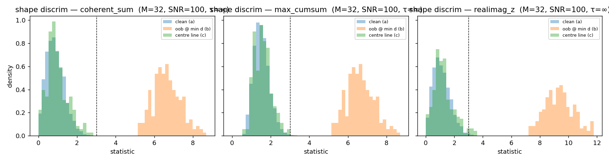

# The complex-edge coherence statistic

A research report on the test used by the windowing stage of the FTMW
processing pipeline to decide where one analysis window ends and the next
begins. Code that regenerates every figure here is in `prototype.py`;
2638 fixture details are at the end.

> **D8 update.** §4 and §5 were re-run after the de-ramp result. The
> statistic and its §3 null calibration were never wrong, but the
> report's original synthetic verification silently built every line
> over `[0, T]` — it assumed the active signal starts at the digitiser
> `t = 0`. Real pipeline data starts at `t₀ = start_us ≠ 0`, and the
> resulting turn-on phase ramp makes a strong line's leakage skirt
> oscillate, so a coherent sum cancels on it. The fix is to **de-ramp**
> the complex spectrum to the active-region turn-on before the statistic
> (`deramp_to_active_start` in `preprocessing/leakage.py`). §2 introduces
> the turn-on; §4 re-verifies on `t₀ ≠ 0` synthetics; §5 re-runs the
> 2638 fixture; §6 is rewritten for the current windowing algorithm; the
> operating threshold is recalibrated to `T_edge = 8` (§3.2, §5). The §3
> null derivation is unaffected and stands.

## 1. Why a separate test exists

The fitting stage of this pipeline decomposes the spectrum into **fit
windows**: contiguous frequency intervals that are disjoint, cover each
spectrum point at most once, and each carry a list of lines whose
parameters enter the least-squares residual for that window. Picking
those window boundaries is the job of the windowing stage that runs
immediately before fitting.

A naive partition — say, slice on every flat stretch between detected
lines — fails for one specific physical reason: in a finite-time FTMW
acquisition, a strong line at frequency $f_0$ deposits energy at
frequencies far away from $f_0$ through **finite-acquisition leakage**.
That leakage skirt decays only as $1/|\Delta f|$, so a single bright
line poisons the spectrum at distances of several MHz, and a window
whose boundary cuts straight through that skirt is implicitly throwing
away information that belongs to the model of the bright line. Two
failure modes follow:

1. **Free-peak phantoms.** A peak detector running on the magnitude
   spectrum picks up the strong line's sidelobes as if they were
   independent lines. If the windowing stage hands those sidelobes to a
   downstream fitter as free peaks, the fitter spends effort modelling
   them as separate damped cosines — competing with the truthful model
   that says "there is one bright line, and these are its skirts."
2. **Coupled boundaries.** Two strong lines whose skirts overlap can
   only be fit correctly *together*: their contributions interfere
   coherently at every point between them. A window boundary placed
   between such lines would force the fitter to choose, per window,
   which line's skirt counts — inevitably mis-attributing power.

The windowing stage handles both cases by partitioning the spectrum
according to where the leakage *actually decays into the noise*, not
where the magnitude spectrum *happens to look flat*. That requires a
test that can tell, given a candidate window edge, whether the points
on the noise-side of that edge are still carrying a strong line's tail
or have fully relaxed to background. The complex-edge coherence
statistic — derived, calibrated, and verified in this report — is that
test.

A magnitude-domain test (`|X| < k\cdot\sigma_\text{RMS}$ at the edge)
is not enough. The leakage envelope is **phase-coherent**: it inherits
the source line's phase and rotates smoothly with frequency offset.
The magnitude of that envelope passes through zero at every sinc zero,
so the spectrum can locally look like noise (in magnitude) while still
carrying fully coherent leakage. The phase is the discriminator, and
the complex-domain test below uses it.

## 2. The finite-acquisition leakage envelope

Define a damped cosine truncated to the FTMW acquisition window
$[0, T]$:

$$
x(t) = A \cos(2\pi f_0 t + \varphi)\, e^{-t/\tau}\, \mathbf{1}_{[0,T]}(t).
$$

Its rfft-domain response near $+f_0$ is, dropping the negligible
mirror term at $-f_0$,

$$
X(f) \approx \tfrac{1}{2}\, A\, e^{i\varphi}\, h_T(f - f_0;\,\tau),
\qquad
h_T(\Delta f;\,\tau) = \frac{1 - \exp\!\left[-\left(\tfrac{1}{\tau} + i\,2\pi\Delta f\right)T\right]}{\tfrac{1}{\tau} + i\,2\pi\Delta f}.
$$

The on-line response is real and large: $|h_T(0)| = \tau_\text{eff}$
where $\tau_\text{eff} = \tau(1 - e^{-T/\tau})$, which approaches
$T$ in the undamped/boxcar limit ($\tau \to \infty$). Far from the
line, $1/\tau$ is dominated by $i\,2\pi\Delta f$ and the envelope
takes the simple form

$$
|h_T(\Delta f)| \approx \frac{1 + e^{-T/\tau}}{2\pi\,|\Delta f|}.
$$

Two consequences shape the windowing-stage design.

**The leakage tail is slow.** A $1/|\Delta f|$ envelope means a line
of signal-to-noise ratio $\text{SNR}$ stays above a detection floor
$k\cdot\sigma$ out to distances of order
$\text{SNR}\,(1 + e^{-T/\tau}) / (2\pi\,\tau_\text{eff}\,k)$ MHz —
several MHz for a strong line in a typical FTMW experiment. This closed
form is `estimate_leakage_reach` in `preprocessing/leakage.py`; it is a
cheap analytic *estimate* of a strong line's extent, but D8 measured it
several-fold too narrow on real data, so it is no longer the windowing
stage's extent or masking authority — the de-ramped statistic below is
(§6).

**The leakage tail is phase-coherent.** $h_T(\Delta f)$ rotates
continuously through the complex plane as $\Delta f$ varies. At an
M-point band centred well outside the line, the values of $X(f_k)$
are not independent random samples: their phases are tightly
clustered around a slowly-varying mean. A coherent sum
$\sum_k X(f_k)$ therefore grows like $M$ times that mean, instead
of the $\sqrt{M}$ growth that uncorrelated samples would give. This
is the phase-coherence signature the statistic exploits.

**The active-region turn-on must be referenced out.** The model above
places the line on $[0, T]$ — the acquisition starting at the digitiser
time origin. Real pipeline data does not: Stage 1 rfft's the whole
zero-padded record, and the active signal occupies $[t_0, t_0 + T]$ with
$t_0 = \text{start\_us}$ (2.35 µs on the 2638 fixture). A signal shifted
by $t_0$ carries an extra factor $e^{-i 2\pi f t_0}$ on every rfft bin —
a *ramp* whose phase winds linearly with $f$. Over an M-point band that
ramp rotates the leakage skirt through several full turns, so the
coherent sum $\sum_k z_k$ the next section relies on **cancels** on
genuine leakage instead of growing. The cure is exact and cheap:
multiply the spectrum by $e^{+i 2\pi f t_0}$ — *de-ramping* it to the
active-region turn-on — before the statistic. This is
`deramp_to_active_start` in `preprocessing/leakage.py` (it forms the
baseband frequency as $|f - f_\text{probe}|$, so it is sideband-correct);
being a unit-modulus phase multiply it cannot move the noise null. Every
verification in §4–§5 feeds the statistic the de-ramped spectrum, as the
production windowing stage does. **This turn-on, omitted from the
report's original synthetic model, is the single thing the D8 rework
corrects.**

## 3. The statistic

For an M-point edge band of complex spectrum values $z_1,\dots,z_M$
with per-bin complex noise RMS $\sigma$ (per-point, frequency-dependent
in real data — the noise-estimation stage reports exactly this array),
define

$$
S_\text{coh}(z;\,\sigma) \;=\; \frac{\bigl|\sum_{k=1}^{M} z_k\bigr|}{\sigma\,\sqrt{M}}.
$$

Under the null hypothesis that the band carries only noise — modelled
as IID complex Gaussian with $\mathbb{E}[|n_k|^2] = \sigma^2$, i.e.
$n_k = \xi_k + i\eta_k$ with $\xi,\eta \sim \mathcal{N}(0,\sigma^2/2)$
independent — the partial sum $\sum_k n_k$ is complex Gaussian with
variance $M\sigma^2$. Its modulus follows a Rayleigh distribution with
scale $\sigma\sqrt{M/2}$, and the statistic has

$$
\mathbb{E}[S_\text{coh} \mid \text{null}] = \sqrt{\pi/4} \approx 0.886,
\qquad
\mathrm{Var}[S_\text{coh} \mid \text{null}] = 1 - \pi/4 \approx 0.215.
$$

In particular, the null distribution does not depend on $M$ — that is
the point of the $\sqrt{M}$ normalisation, and it is the property
that makes the same threshold work across all band sizes the windowing
stage might want to use.

Under the alternative — the band carries a coherent leakage tail of
typical magnitude $L$ — the sum is dominated by $\sum_k h_k$ where
the $h_k$ have nearly-aligned phase, so $|\sum_k h_k| \sim M L$ and

$$
S_\text{coh} \;\sim\; M L / (\sigma\,\sqrt{M}) \;=\; (L/\sigma)\,\sqrt{M}.
$$

The statistic grows as $\sqrt{M}$ in the signal-bearing case but is
M-independent in the null. This $\sqrt{M}$ gain is the test's
sensitivity: doubling the band width buys 1.4× discriminating power
against a coherent contamination of fixed amplitude.

### 3.1 Variants considered

Two alternative statistics were calibrated alongside $S_\text{coh}$:

- **Max-cumsum.** $S_\text{cum} = \max_{1 \le t \le M}
  |\sum_{k \le t} z_k| / (\sigma \sqrt{t})$, the running CUSUM-style
  statistic. Useful when coherent contamination is concentrated in a
  sub-window of the M-point band — the max-over-$t$ amplifies a local
  hot spot. Pays for that with a higher null mean ($\approx 1.6$) and
  a wider null tail.
- **Real/imag z.** $S_\text{ri} = \max(|\sum_k \text{Re}\,z_k|,\,
  |\sum_k \text{Im}\,z_k|) / (\sigma\sqrt{M/2})$, the larger of the
  two single-component z-scores. Detects contamination that aligns
  with either axis of the complex plane individually.

### 3.2 Empirical null calibration

Across the calibration sweep — clean complex-Gaussian noise at five
band widths $M \in \{8, 16, 32, 64, 128\}$ — the three null
distributions came out as:

| Statistic        | Mean  | Std   | 99th percentile |
|------------------|-------|-------|------------------|
| $S_\text{coh}$   | 0.886 | 0.457 | 2.15             |
| $S_\text{cum}$   | 1.61  | 0.39  | 2.63             |
| $S_\text{ri}$    | 1.13  | 0.59  | 2.78             |


The closed-form $\sqrt{\pi/4}$ expectation for $S_\text{coh}$ is
reproduced to three decimal places, validating the noise model and the
simulator. Crucially, all three distributions are independent of $M$,
which means a single fixed threshold works at every band width — a
necessary property when the windowing stage uses different $M$ values
for the rolling first-pass scan (large $M$, tight null) and the
trim-point refinement (small $M$, finer spatial resolution).

The null bounds the threshold from *below*: any $S_\text{coh} = 3$
already gives a per-band null false-positive rate well below 1%
(empirically near zero in 200 trials per band width), and a higher
threshold only makes the null rate smaller still. The null does not, by
itself, fix the *working* threshold — that is set by how large a real
coherent leakage the stage should *act* on, and the D8 recalibration
adopts **$T_\text{edge} = 8$** ($= \sqrt{M}$ at the default $M = 64$):
the per-bin leakage amplitude at the detection boundary is
$L/\sigma = T_\text{edge}/\sqrt{M}$, so $T_\text{edge} = 8$ flags
coherent leakage of at least $\sim 1\sigma$ per bin. The original
report's $3$ flags sub-noise ($0.38\sigma$) leakage and reads roughly
half the 2638 spectrum as touched — operationally over-sensitive. The
threshold is a configurable parameter on the pipeline file; §5 and
`dev-docs/planning/leakage-detection-rework.md` carry the calibration.

`S_coh` is selected as the **primary statistic** on three grounds:
its closed-form null (cheap to reason about), its tightest null
distribution among the three, and its straightforwardness — a single
complex sum, no max-over-$t$ or Re/Im branching. `S_cum` is retained
as a secondary tool for *locating* the trim point inside a flagged
edge band (the max-cumsum's hot-spot detection is exactly what's
needed there). `S_ri` is dropped: it provides no detectable
advantage over `S_coh` on any case in the sweep.

## 4. Verification on synthetic ground truth

The simulator builds spectra analytically on the rfft frequency grid
using the finite-T damped-cosine model of §2, **with the active region
starting at a realistic turn-on $t_0 = 2.35$ µs** (the 2638
`start_us`), then adds complex Gaussian noise of known per-bin RMS. Each
band is scored two ways: the production path — the statistic of the
*de-ramped* band — and, for contrast, the raw band as-is. Four cases
probe behaviour:

(a) clean edge — no line within the band's leakage reach;
(b) an out-of-band line just outside the band edge, swept over
    distance and SNR;
(c) an in-band centred line — its symmetric sinc skirt reaches each
    band edge;
(d) an injected flat pedestal — a physically unmotivated background
    used as a sanity check.

**The de-ramp does not move the null.** The clean-edge distribution
(case a, figure 01) is unchanged from the §3 calibration: de-ramped,
`coherent_sum` at $M = 64$ has mean 0.888, std 0.466, 99th percentile
2.15 — and the raw clean-edge mean is 0.886, the two agreeing to within
sampling error, because the de-ramp is a unit-modulus phase multiply
and the noise is isotropic. The null is still M-independent. §3's
calibration holds verbatim at $t_0 \ne 0$; what the de-ramp changes is
only the *signal* path.

### 4.1 Out-of-band detection vs distance and SNR


The two panels plot the median `coherent_sum` over 200 trials against
edge–line distance, by line SNR, at $M = 32$: the **de-ramped** band on
the left (the production path) and the **raw** band on the right.

The de-ramped statistic decays as $1/\text{distance}$, tracking the
analytic $1/|\Delta f|$ envelope of `h_T` — the same behaviour the
report's original $t_0 = 0$ sweep measured. Reading the
$T_\text{edge} = 8$ crossings:

- SNR-30 and weaker stay at the null at every distance.
- An SNR-100 line peaks at $\approx 6.8$ even ½ MHz from the edge and
  never clears $T_\text{edge} = 8$ at this band width.
- An SNR-300 line clears threshold out to $\approx 1.7$ MHz from the
  edge (20.1 at ½ MHz, 12.4 at 1 MHz, 7.2 at 2 MHz).
- An SNR-1000 line, to $\approx 7$ MHz — and, extrapolating the
  $1/\text{distance}$ envelope past the 10 MHz sweep limit, to several
  tens of MHz.

These crossings are shorter than the report's original figures because
the threshold rose from 3 to 8, *not* because of the de-ramp: the
de-ramped curve is the $t_0 = 0$ curve.

The raw panel is the verification's central result. With $t_0 \ne 0$
and no de-ramp the coherent sum collapses: an SNR-300 line that the
de-ramped statistic reports at 12.4 one MHz from the edge reads **1.86
raw — at the noise null**. Even an SNR-1000 line barely clears
threshold raw, and only at the closest distance. Without the de-ramp
the statistic is blind to exactly the leakage it exists to detect — and
the report's original §5 ran the raw statistic on the 2638 fixture, so
its leakage map was invalid (§5 is re-run below).

### 4.2 Shape discrimination

A single point estimate of the statistic at one edge band cannot, on
its own, distinguish "a line just outside the band" from "the distant
skirt of a line further away" — appropriately scaled, both present the
same band-edge magnitude. The discriminator is the *spatial profile* of
the rolling statistic, qualitatively different for the two.


The lower panel plots the rolling `coherent_sum` across a band holding
a high-SNR (5000) line built with $t_0 = 2.35$ µs. The **raw** profile
of the centred line (dashed) oscillates violently — it swings from far
above threshold down through the null between sinc-spaced lobes,
because the turn-on ramp un-aligns the coherent sum lobe by lobe. The
**de-ramped** profile of the same line (solid) is smooth: peaked at the
line centre, decaying monotonically to both edges. The de-ramped
out-of-band line gives the other signature — a profile rising
monotonically toward the band edge nearest the line. The two de-ramped
shapes, peaked versus monotone, are the in-principle in-band/out-of-band
discriminator; the raw profile discriminates nothing.



Figure 03 is the histogram view of the same comparison at SNR = 100,
$M = 32$ (de-ramped): the clean (a), out-of-band (b) and centred-line
(c) distributions. It is kept for completeness but is less informative
than the spatial profile — at SNR = 100 the centred line's far skirt is
sub-noise at the band edge and the (a)/(c) distributions overlap.

**Practical consequence for the windowing stage.** In practice the
stage does not perform a shape classification, because the upstream
peak-detection stage already provides a list of promoted strong lines
with their frequencies. When the statistic fires at an edge band, the
stage looks up the nearest promoted strong line: an **in-band** line is
the contributor itself (a free peak in this window's fit); an
**out-of-band** line contributes here as a fixed (frozen-parameter)
contributor whose tail must be carried during the fit. The statistic
answers "does a coherent skirt reach this edge?"; the peak list answers
"from whom?". A statistic above threshold with no identifiable
strong-line source on either side is the signature of an undetected
line — a diagnostic flag, not something to absorb silently.

### 4.3 Pedestal sensitivity, and why pedestals shouldn't exist


A pedestal — a constant complex offset added to the spectrum — is the
degenerate zero-distance leakage limit and dominates the statistic
linearly in its magnitude. A 0.5σ pedestal is detected at $M = 64$, a
1σ pedestal at $M = 16$, and the slope of `S_coh` against pedestal
magnitude is $\sqrt{M}$, consistent with the M-scaling of §3. (A DC
pedestal is a $t = 0$ time-domain Dirac, not an $[t_0, t_0+T]$ line;
case (d) is built without the turn-on ramp, so it stays the pure
degenerate-leakage diagnostic.)

A genuine pedestal would correspond to all of the FID's energy at
$t = 0$, which is unphysical for a mean-subtracted FID (DC removal is
part of the upstream preprocessing). The pedestal sensitivity is a
*diagnostic*, not a desired feature: a pedestal-shaped contamination in
real data means an upstream invariant has broken, and the windowing
stage should surface it rather than absorb it into a "background" fixed
contributor. §5 confirms empirically that no pedestal is present in the
2638 fixture.

## 5. Verification on real data (the 2638 fixture)

The 2638 fixture is a single-experiment FTMW record from an internal
BlackChirp run carried through the pipeline up to the peak-detection
stage. It is the standing real-data sanity test for the project. Its
active region starts at $t_0 = \text{start\_us} = 2.35$ µs, so the
de-ramp of §2 is essential here.


Top: spectrum magnitude (log; phase-invariant, so de-ramping does not
change it). Middle: real and imaginary parts of the **de-ramped**
spectrum. Bottom: the rolling `S_coh` at $M = 64$ — **de-ramped** (the
production statistic) and, in grey, **raw** — with the
$T_\text{edge} = 8$ threshold marked.

The first observation is the de-ramp itself. The **raw** statistic
clears threshold over just **0.8 %** of the spectrum: on the
full-record rfft the leakage skirts oscillate and the coherent sum
cancels, exactly as the synthetic raw panel of §4.1 showed. The
**de-ramped** statistic clears threshold over **11.3 %** — it sees the
leakage the raw statistic is blind to. The report's original §5 ran
the raw statistic on this fixture and reported a leakage map that was,
in hindsight, mostly the 0.8 % the raw test can still see; that map was
invalid. Everything below uses the de-ramped statistic.

The second observation concerns the noise. The per-point noise estimate
from the upstream noise stage (the high-pass scatter estimator; see
[the noise SNR-scaling report](../noise-snr-scaling/report.md))
varies from $\sigma_\text{min} \approx 0.004$ to $\sigma_\text{max}
\approx 0.027$ across the spectrum — a factor of about 6. **The
statistic must use the local $\sigma$**, the window-mean of the
per-point RMS, not a global median; a median would understate
significance in genuinely quiet stretches and overstate it in noisier
ones.

With the de-ramp and the local $\sigma$, the statistic separates the
spectrum into "leakage-touched" and "line-free" regions the way the
windowing stage needs. Strong-line clusters drive `S_coh` to peaks in
the hundreds, with skirts extending tens of MHz; long runs between
clusters sit near the rolling-band null ($S_\text{coh} \approx 2$ on
this real-noise grid). $T_\text{edge} = 8$ partitions the two regimes;
the recalibration from the report's original 3 is in §3.2 and
`dev-docs/planning/leakage-detection-rework.md`.

### 5.1 A strong-line neighbourhood and a quiet region


Top: a ±50 MHz zoom around the strongest line in the spectrum
(36350 MHz). The de-ramped statistic peaks near 350 at the line and
holds above $T_\text{edge} = 8$ over a contiguous ≈36 MHz run
(≈36333–36370 MHz) — the real-data realisation of the $1/|\Delta f|$
envelope of §2. A second strong line sits at 36389 MHz, 39 MHz away.

This doublet is instructive. At the report's original threshold of 3,
the statistic stayed above threshold *all the way between* the two
lines, and the windowing stage's strong-cluster rule — "`S_coh` stays
above threshold from one strong line to the next" — grouped them into a
single joint window. At the recalibrated $T_\text{edge} = 8$ they
**decouple**: the statistic between 36350 and 36389 dips to ≈6 (it
exceeds 8 over only ~80 % of the gap), so the contiguous run of the
36350 line stops ≈19 MHz short of 36389 and the two lines fall in
separate windows. This is the deliberate behaviour at $T_\text{edge} =
8$; whether the doublet should be re-coupled for fitting is a Stage 5
question, recorded in the leakage-detection-rework plan. Each line is
still carried into the other's window as a fixed contributor (§6).

Bottom: a ±50 MHz zoom around a quiet region (centred near 29008 MHz).
The spectrum magnitude is at the noise floor across most of the panel
and the statistic sits near the null; the median real and imaginary
parts of the de-ramped spectrum measured there come in at
$+0.007\,\sigma$ and $-0.002\,\sigma$ — consistent with zero. **There
is no flat pedestal in this experiment**; the physical argument of §4.3
is upheld empirically. A small cluster of weak lines near the panel
edge pulls the statistic up locally — genuine coherent signals,
correctly flagged, not noise excursions or false positives. The
"is this a peak or a leakage tail" distinction is already answered by
the upstream peak detector; the statistic does not redo that work.

## 6. How the test plugs into the windowing strategy

The windowing stage runs the statistic **de-ramped**: it forms the
de-ramped spectrum once (§2), rolls `S_coh` across it at $M = 64$, and
thresholds the result at $T_\text{edge} = 8$ into a set of
*leakage-touched intervals* — the contiguous above-threshold runs,
`leakage_touched_intervals` in `preprocessing/leakage.py`. That
interval map, not the statistic value at any single candidate edge, is
what the stage consumes.

> The original report described a two-step edge decision: *propose* a
> window's extent from the closed-form `estimate_leakage_reach`, then
> *trim* it where the rolling statistic crosses back below threshold.
> The D8 rework retired that recipe. The closed form was measured
> 7–25× too narrow against the de-ramped map on real data, and window
> *extents* turned out not to want the leakage map at all — see below.

Window **extents** are deliberately *not* set from the leakage-touched
map. A single strong line's touched run is tens of MHz wide (§5.1:
≈36 MHz for the 36350 line); a window that wide for one line is wrong.
Extents are instead the tight peak-clustering extents of the
peak-detection output — each promoted peak's core plus a fixed minimum
half-width, overlapping extents merged into disjoint windows. The
leakage-touched map drives the three things that genuinely need it:

1. **Strong-cluster grouping.** Strong lines that share one
   leakage-touched interval are mutually coupled — their skirts
   interfere coherently across the whole interval — and are forced into
   one joint window. The 36350/36389 doublet is the reference case:
   coupled at a low threshold, decoupled at $T_\text{edge} = 8$ (§5.1).
2. **Fixed contributors.** A strong line whose leakage-touched interval
   reaches into another window is attached to that window as a fixed
   (frozen-parameter) contributor, and a fit-dependency edge is
   recorded. The window's fit then carries that line's finite-T leakage
   term without having to widen to reach the line.
3. **Difficulty.** A window overlapping a large or strongly-coupled
   touched region is classified harder, and the downstream fitter is
   told to budget for it.

`S_cum` (the max-cumsum variant, §3.1) is retained for one job: once an
interval is flagged, its hot-spot detection locates the precise edge of
the coherent stretch inside it at a finer band width ($M = 32$).

The closed-form `estimate_leakage_reach` survives only as a cheap
analytic *proposal* of a strong line's extent — no longer the masking
or extent authority for either Stage 3 or Stage 4 (§"D8 update", §5.1).

A failure mode of any plan-time decomposition — coupling that only
shows up at fit time — is handled by an explicit renegotiation
handshake between the windowing and fitting stages, not by
over-provisioning at plan time.

## 7. Caveats and known edges

- **The de-ramp needs the turn-on.** The statistic is only valid on the
  de-ramped spectrum, and the de-ramp needs $t_0 = \text{start\_us}$
  and the probe frequency — both persisted pipeline parameters, so this
  is not a free parameter. The de-ramp assumes a *single* active window
  per record (one turn-on); that holds for the one-acquisition FTMW
  model the pipeline targets. A multi-segment or re-triggered FID would
  break the single-$t_0$ assumption and is out of scope.
- **Boxcar worst case.** The out-of-band distance sweep in §4.1 used
  $\tau \to \infty$ (undamped), the leakiest case. Real damped lines
  with finite $\tau$ have a true Lorentzian $1/|\Delta f|^2$ wing far
  from the line, so their empirical reach is *shorter* than the boxcar
  sweep shows — the conservative direction for a leakage detector.
- **Synthetic spectra are not full-pipeline.** The simulator builds
  $X(f)$ analytically on the rfft grid — now including the $t_0$
  turn-on ramp — rather than synthesising an FID and FFT'ing through
  the actual Stage 1 path. The two are equivalent up to the noise
  convention (validated by the closed-form null mean matching to three
  decimals); the pipeline-grade end-to-end check is the 2638 fixture.
- **Real/imag z is dropped, not disproved.** $S_\text{ri}$ has no
  measurable advantage over $S_\text{coh}$ in the cases tested. If a
  future failure mode emerges where contamination is concentrated in
  a single quadrature (which the prototype's all-zero-phase lines
  cannot exhibit), reconsider — but as of this writing there is no
  reason to prefer it.
- **Local $\sigma$ matters.** Using a global median $\sigma$ in
  place of the per-point noise array changes the statistic's
  effective threshold by up to a factor of 3 across the 2638
  spectrum — enough to flip the partition at noise-floor-variable
  regions. The implementation must use the local noise.

## 8. Reproducing this report

The script `prototype.py` regenerates every figure under `figures/`.
From the repository root:

```bash
conda run -n ftmwpipeline-dev python \
    dev-docs/research/complex-edge-coherence/prototype.py
```

Requirements: the project conda environment `ftmwpipeline-dev`
(matplotlib, numpy, scipy, the installed `ftmwpipeline` package), and
the 2638 fixture at `scratch/exp_2638.ftmw`. If the fixture is
missing, the script will skip the real-data section and emit only
the synthetic figures; recreate the fixture by running

```python
import ftmwpipeline.api as ftmw
ftmw.import_data("scratch/exp_2638.ftmw", source="examples/blackchirp_data/2638/")
ftmw.detect_start_time("scratch/exp_2638.ftmw", band=(26500, 40000), stamp=True)
ftmw.compute_ft("scratch/exp_2638.ftmw", trim=(26500, 40000))
ftmw.estimate_noise("scratch/exp_2638.ftmw")
```

`run_2638` reads the fixture's persisted FT settings, loads its FID for
the probe frequency and `start_us`, and de-ramps the spectrum before
the statistic — so the fixture only needs to be carried through
`estimate_noise`.

The script also writes two `.npz` blobs next to itself
(`synthetic_sweep.npz`, `2638_statistic.npz`) holding the intermediate
sweep data — the synthetic rows (each with the de-ramped `value` and
the un-de-ramped `value_raw`) and the 2638 raw/de-ramped spectra and
rolling statistics. They are large and intentionally gitignored; the
figures and this report depend only on `prototype.py` and the fixture.

Random seed for the synthetic sweep is fixed inside `prototype.py`
(`20260519`), so figures are byte-identical across runs given the
same matplotlib/numpy versions.
