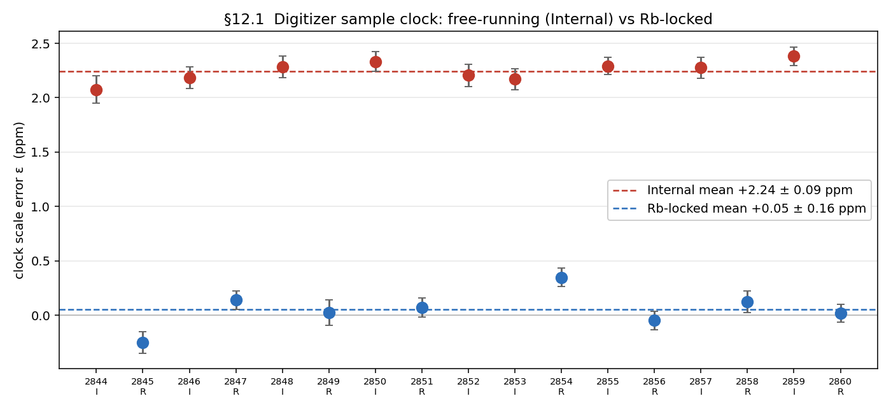
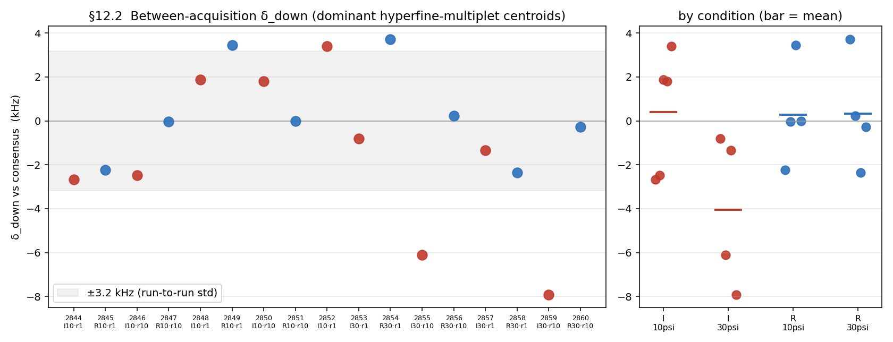
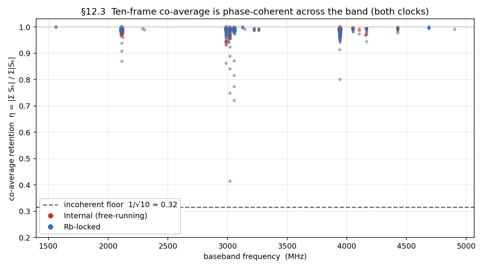

# Frequency calibration and the σ_f uncertainty budget

A self-contained evidence record for how this pipeline assigns a frequency
uncertainty to each fitted line, why the reported σ_f is honest *precision*, and
why the dominant *accuracy* limit is documented but not self-calibratable. The
engineering decision this analysis produced — report precision, expose a
user-owned accuracy floor (default 0) — is shipped and recorded in
[`../../planning/stage6-reports.md`](../../planning/stage6-reports.md) §B; this
report is the evidence behind it, not a new decision.

Every quantitative claim is regenerated by the companion `reproduce.py` from the
checked-in `.ftmw` fixtures and catalogs; figures are written to a gitignored
output directory.

## Summary

The reported per-line σ_f is the Cramér–Rao precision of the nonlinear fit. On a
clean ruler (the vinyl-cyanide catalog) it looks 60–77× too optimistic, but that
gap is not a fitting bug — it is an *uncorrected systematic* in the measured
frequencies, plus the catalog's own accuracy. The frequency axis carries two
instrumental terms from an unlocked digitizer:

- **A multiplicative baseband scale error ε ≈ 2 ppm** (free-running sample
  clock). It produces `Δf = ε·f_baseband` — simultaneously a ~20 kHz offset and a
  ~2–3 kHz/GHz tilt, one parameter. It self-calibrates: the clock-spur lattice
  recovers the same ε the catalog regression does, prior-free.
- **An additive per-acquisition absolute offset `δ_down`**, flat in frequency. It
  is *not* self-calibratable — no in-band spur reaches it through the
  downconversion mixer — and it varies run to run. A controlled 17-acquisition
  grid (§12) shows it is a **small (~3 kHz run-to-run), unbiased, random**
  per-acquisition draw with no stable per-instrument component and no dependence
  on the digitizer clock; it is documented, not corrected, by default.

Two direct reproducibility measurements bound the random and systematic parts
separately. **Within** an acquisition, splitting into independent
sub-measurements (kept-separate frames, or Blackchirp backup differencing) and
refitting against the frozen model gives the random floor directly: sub-kHz at
the co-average level, and — in the statistics-limited regime — empirical scatter
equal to ~1.25× the reported CRB across 1.5 decades of shots, validating σ_stat.
**Between** acquisitions, differencing two independent vinyl-cyanide runs
(catalog-free) gives random reproducibility shrinking with SNR toward ~2.7 kHz
*plus* the flat δ_down (≈ 4.5 kHz for the one archival pair). The
within-acquisition test is structurally blind to δ_down; only the
between-acquisition test sees it — and the 17-acquisition grid of §12 resolves it
as a small, random, clock-independent per-acquisition draw.

The budget is therefore `σ_f = sqrt(σ_stat² + (σ_ε·f_baseband)² + σ_floor²)`:
σ_stat the CRB, σ_ε·f_baseband the propagated timebase-parameter uncertainty, and
σ_floor a user-declared accuracy floor (default 0) whose random component is
measured sub-kHz and whose systematic component (δ_down) is not self-calibratable.

## 1. The symptom

Reported σ_f is ~60–77× too optimistic against the vinyl-cyanide catalog: on
fixture 1512 the median |Δf| to catalog is ~16 kHz while the reported σ_f is
~0.2 kHz. Taken at face value the fit claims a precision the measurements do not
reproduce against an external standard. Sections 2–3 show the gap is a real,
single-parameter instrumental systematic in the *frequencies*, not an
underestimate of the *fit* uncertainty.

## 2. Ruled-out causes (the important negatives)

- **Not a covariance bug.** `fit_window` inverts the full joint noise-weighted
  `JᵀJ` (all peaks + shared τ + baseline), so each per-line σ already
  marginalizes the off-diagonals. σ_f is honest Cramér–Rao precision.
- **Not χ²-scaling.** √χ²ᵣ closes only a fraction of the gap, and the catalog
  residual is **SNR-independent** (~9–15 kHz flat from SNR 90 → 5900 while σ_f
  falls 0.33 → 0.06 kHz). Statistical errors shrink with SNR; this does not.
- **Not blend-fitting.** Isolated lines carry the bias *more* (signed) than
  blended lines, whose neighbours scatter it. The blend hypothesis is rejected.
- **Not catalog uncertainty alone.** The catalog's quoted uncertainties are small
  (median ~0.25–0.35 kHz), but those are *model* precision, not single-line
  accuracy (§6).

The defining signature is the SNR-independence: a systematic, not a statistical,
error.

## 3. The calibration mechanism — an unlocked sample clock

The digitizer sample clock is free-running, with a fractional scale error ε. Every
measured frequency reads `f_meas = f_true·(1 + ε)` in the *sampled* (baseband)
domain. For the lower-sideband downconversion (`f_baseband = probe − f_mol`,
probe 40960 MHz) the molecular-frame error is

  `Δf = ε·(probe − f_mol) = ε·f_baseband`,

one parameter producing both a constant-looking offset and a baseband tilt. Two
independent determinations agree:

- **Catalog regression** of Δf on f_baseband: ε ≈ +1.9 ppm (1512) / +2.0 ppm (655).
- **Prior-free clock spurs** (`calibrate_timebase`, demodulating the Rb-locked
  clock-spur lattice): ε = +2.20 ppm (1512) / +1.98 ppm (655), σ_ε 0.08–0.12 ppm —
  reproduced through the production build with no catalog. On 655 the prior-free
  spur ε (1.98) and the catalog ε (1.99) agree to better than 0.02 ppm.

Applying `f_corr = f_meas + ε·f_baseband` drops the median catalog residual
~21 → 5 kHz (1512) and ~23 → 2 kHz (655). The timebase machinery measures and
persists ε; the final-products surface applies it (see
[`../../planning/instrument-clock-declaration.md`](../../planning/instrument-clock-declaration.md)).
The 17-acquisition grid of §12 turns this inference into a proof: Rb-locking the
digitizer collapses ε from +2.24 ppm to +0.05 ppm, and the prior-free spur ε
tracks that control to zero with no catalog.

## 4. The σ_f budget

Three terms in quadrature:

  `σ_f = sqrt(σ_stat² + (σ_ε·f_baseband)² + σ_floor²)`

1. **σ_stat** — the NLS diagonal (`frequency_error`), the Cramér–Rao precision.
   It *is* the CRB: Spearman ρ = +0.96 vs `linewidth/√SNR` on isolated lines, and
   (§7) the empirical sub-acquisition scatter equals ~1.25× the reported σ_stat
   across 1.5 decades of shots. Dominant only at low SNR (≲30).
2. **σ_ε·f_baseband** — the timebase *parameter* uncertainty propagated per line
   (σ_ε ~ 0.06–0.12 ppm → ~1–1.5 kHz at 14 GHz baseband, ~0.1 kHz near the probe).
   This is the shared-ε uncertainty, not the line-fit covariance.
3. **σ_floor** — a user-declared accuracy floor, default 0. Its *random*
   component is directly measured sub-kHz (§7); its *systematic* component
   (δ_down) is real but not independently determinable from the data in hand
   (§9), so the default stays 0 rather than asserting accuracy we cannot defend.

## 5. The SNR relationship

σ_stat tracks the CRB and shrinks with SNR. The *accuracy* residual (the catalog
gap of §1, and the flat δ_down of §8) does not — its SNR-independence (§2) is the
operational test that separates a systematic from a statistical error. The
re-bin sweep of §7 makes this explicit on one fixture: the empirical scatter
falls as ~n^−0.45 (statistics) while the flat offset stays put.

## 6. The catalog ruler cannot be trusted at the kHz level

Catalog uncertainties (~0.35 kHz) are *model* precision — a global-Hamiltonian
parameter covariance projected per transition — not single-measurement accuracy
(the underlying cavity-FTMW line centres are eyeballed, ~4–10 kHz). Quadrature on
the catalog-free run-to-run result (§8) implies the catalog's own accuracy is
≈ 3 kHz: `5 ≈ sqrt(cat² + 4.2² + 2.7²)` ⇒ cat ≈ 3 kHz. So most of the apparent
"~5 kHz catalog floor" is the catalog, which is why the catalog-free
between-acquisition ruler (§8) is the trustworthy one.

## 7. Within-acquisition reproducibility — the random floor, measured

A single acquisition is split into independent sub-measurements, each refit
against the **frozen co-average model** (the targeted, pruned-window Stage 5 fit:
keep only the windows containing the chosen reference lines, match results by
frequency rather than window id since Stage 5 re-plans per fit). The per-line
frequency scatter across sub-measurements is the within-acquisition
reproducibility; compared to the per-fit CRB across an SNR range it separates
statistics (1/SNR roll-off) from a flat floor (a high-SNR plateau).

**Sub-acquisition providers.** Two, sharing the same downstream pipeline:

- *Kept-separate frames* — a segmented scope record co-averaged from N frames,
  loaded one frame at a time.
- *Blackchirp backup differencing* — backups store raw **cumulative ADC sums**, so
  disjoint shot chunks are the *exact* shot-weighted difference of consecutive
  backups, `(avg_k·N_k − avg_{k−1}·N_{k−1})/(N_k − N_{k−1})`. Caching the
  cumulative sums gives **free re-binning**: regroup into fatter/fewer chunks to
  trade per-chunk SNR against sample count without re-acquiring. Fixture 655
  retains six backup frames and supports this directly on checked-in data; richer
  external acquisitions (100 backups) extend it.

**Two regimes observed.**

- *Drift-dominated.* On a high-per-frame-SNR direct-sampling record, frame
  scatter is 5–25× the CRB and decomposes into a coherent within-acquisition
  timebase ramp (a per-frame common offset, significant linear drift) plus a
  residual per-line floor ~0.6–1 kHz. The time-ordering of the frames is what
  exposes the drift; a plain standard deviation would hide it in the scatter.
- *Statistics-limited.* On a downconversion record (Rb-locked LO, free-running
  digitizer), chunk scatter tracks the CRB at every grouping. The re-bin sweep
  (45k → 900k shots/chunk) shows the empirical std falling as ~n^−0.45 and the
  *excess* `sqrt(std² − CRB²)` **shrinking** with shots — the opposite of a
  shot-independent floor. The empirical scatter is a steady **~1.25× the reported
  CRB** across 1.5 decades, directly validating σ_stat (§4).

In both regimes the co-average random floor is **sub-kHz** (~0.2–0.6 kHz). This
is the direct measurement of σ_floor's random component. It is, by construction,
blind to any offset common to all sub-measurements of one acquisition — that is
δ_down, which only §8 sees.

On checked-in data the reproducer demonstrates this on fixture 655's five backup
chunks (~360k shots each), but the molecule matters: vinyl cyanide's main
isotopologue carries **¹⁴N nuclear-quadrupole hyperfine** (I = 1), and at low J
the splitting is partially resolved. A nearest-fitted-peak isolation test does
*not* catch this — an unresolved hyperfine multiplet fits as one line whose
centre wanders between chunks. The catalog confirms it: the high-scatter targets
are all `v0_main` (¹⁴N) lines, and the worst (36535 MHz, ~5 kHz scatter) is a
catalog *triplet* spanning 22 kHz. So the 1–5 kHz "line-specific" scatter is
hyperfine, **not** the pedestal/leakage of §10 (the pedestal environment is shared
by the clean lines below).

The genuinely clean reproducibility comes from the **¹⁵N isotopologue** lines,
which are hyperfine-free (¹⁵N is spin-½: no quadrupole moment, no quadrupole
hyperfine). Split by species, the five ¹⁵N lines have a median scatter of
**0.30 kHz** (best 0.18) and are *all* statistics-limited (std ≈ CRB, ratio ≤ 1.4),
while the ¹⁴N-bearing lines have a median of 1.0 kHz inflated to ~5 kHz on the
resolved multiplets. The ¹⁵N lines are a serendipitous hyperfine-free probe inside
the same spectrum, and they set the sub-kHz within-acquisition floor here. A
hyperfine-free molecule would be the ideal clean-floor target; the ¹⁵N lines fill
that role. The re-bin sweep and the steady 1.25×-CRB validation require many
backups (the external 100-backup acquisition); 655's five backups bound the floor
but do not resolve the sweep.

## 8. Between-acquisition reproducibility (the catalog-free ruler)

Two independent vinyl-cyanide acquisitions (1512, 655) and two MTBE (360, 363),
each independently ε-corrected (§3), are differenced pairwise on their common
lines — no catalog. Matching by ε-corrected frequency (151 common lines for
655↔1512, 57 isolated in both), the difference has two parts:

- **Random reproducibility** that shrinks with SNR — per-measurement
  `std(Δf)/√2` falling 8.8 → 6.8 → 6.0 → ~4 kHz as the paired-minimum SNR rises,
  trending toward the ~2.6–2.7 kHz high-SNR floor (corroborated by the MTBE pair).
  The high-SNR bin is shallow here because the low-shot 1512 caps the paired SNR.
- **A flat absolute offset δ_down ≈ −4.5 kHz** (655−1512; +4.2 kHz as 1512−655).
  It is flat in frequency: a Doppler shift would scale with f_mol and a residual ε
  with f_baseband, but those two regressors are *exactly collinear*
  (`f_baseband = probe − f_mol`) so within one pair only the flat term separates —
  and the tilt that does appear is small and low-R² (~0.2). The MTBE pair shows
  the same flat-offset structure (−12.2 kHz), corroborating that a flat
  per-acquisition offset is the dominant between-acquisition term; but the two
  MTBE runs were taken at *different backing pressures*, so their supersonic
  expansions differ (rotational temperature, density) and the offset is not a
  clean instrumental-only measurement — it folds in whatever changes with
  expansion conditions. The cleanest δ_down test is same-molecule, same-conditions
  repeats; see §11.

## 9. δ_down is irreducible from self-calibration

ε (a multiplicative baseband scale) self-cals from the spurs; the additive
absolute offset needs an RF-native spur carried *through* the downconversion
mixer, and the clock lattice cannot pin it. The candidate spur
`6400 = probe − 3×upconvLO` fails two ways: (i) it carries `δ_down − 3·δ_up`,
contaminated by the third harmonic of the *upconversion* LO that the molecule
never sees (a 2-LO solve does not rescue it); and (ii) `6400 = 5×1280` sits on the
δ-free downconversion-derived 1280-comb (`40960 = 32×1280`), so its deviation is
diluted toward zero — the 2-LO reconstruction under-predicts the clean
instrumental pair (+0.5 vs +4.2 kHz, the dilution signature). Only an in-spectrum
absolute reference (a trusted catalog line, a live-injected Rb tone, or a comb
tooth) can remove δ_down per acquisition.

## 10. Pedestal influence (tested, rejected as the driver)

Hypothesis: an asymmetric leakage pedestal under a line biases its fitted centre
and could masquerade as δ_down. On the 7–10 isolated VC lines common to 1512/655
(SNR > 50 in both), three independent pedestal *suppressors* converge on the same
inter-acquisition offset — production leakage-wing-baseline fit +4.4…+6.3 kHz,
explicit polynomial-baseline refit +4.7…+6.9 kHz, Hann-apodized centroid
+6.0…+6.7 kHz (std ≤ 3.6) — while pedestal-*exposed* estimators (no-baseline fit,
boxcar centroid) are wildly unstable (per-line 30–75 kHz jumps; inter-acq std
10–51 kHz). Conclusions: (a) δ_down does *not* collapse under pedestal
suppression — it is a genuine per-acquisition absolute-reference offset; (b) the
pedestal bias itself is larger in the dense 655 than the noisy 1512, so it is
driven by neighbour-line leakage density, not absolute noise level; (c) the
production per-window fit already agrees with the apodized centre, so production
δ_down is the post-mitigation residual.

## 11. Conclusions and the shipped decision

Separate **precision** (σ_stat = CRB, σ_ε, and the directly-measured
within-acquisition random floor) from **accuracy** (δ_down). The precision terms
are honest and now independently validated — empirically against the CRB (§7) and
against an external ruler once ε is applied (§3). The dominant accuracy limit,
δ_down, is real, per-acquisition, and not self-calibratable; it is documented and
exposed as a user-owned accuracy floor (default 0), not silently baked in. The
catalog pull `(f_corr − f_cat)/σ_f` is a user calibration tool, read knowing the
catalog adds ~3 kHz — not a validation gate.

**The grid closed the open questions (§12).** What was a single pair (n = 2) is
now 17 controlled acquisitions, and all three planned tests resolved: (i) the
free-running-vs-Rb-locked clock arm **proved** ε is the digitizer sample clock
(Rb-locking collapses ε to zero, §12.1); (ii) the multi-frame arm **refuted** the
predicted co-average signal-loss mechanism — ten-frame co-averaging is
phase-coherent to η ≈ 0.99 across the band for both clocks (§12.3), because the
free-running error is a fixed per-acquisition offset, not intra-acquisition
jitter; and (iii) the pairwise δ_down draws settled the **stable-vs-random**
question — δ_down is a small (~3 kHz run-to-run), unbiased, clock-independent
random draw with no stable per-instrument component (§12.2), so no fixed
correction is possible and none is warranted. The two-backing-pressure arm did
not resolve an expansion-dependent shift at this SNR (below a few kHz).

**Still open.** A hyperfine-free molecule (or the ¹⁵N lines at high shot count,
§7) would sharpen the within-acquisition floor, since VyCN's ¹⁴N hyperfine caps
the clean-line set — the low-shot grid could reach only the ¹⁴N-bearing lines. A
second-spectrometer comparison (shared catalog cancels) and a bench counter test
on the downconversion LO would characterize the absolute (common) δ_down that the
catalog-free differential tests are structurally blind to.

## 12. The reproducibility grid — a controlled 17-acquisition test

The evidence above rests on two archival acquisitions (1512, 655) plus the MTBE
pair. A dedicated grid of **17 vinyl-cyanide acquisitions on the home
instrument** was acquired to turn the single-pair δ_down and the *inferred* clock
mechanism into controlled tests: a 2×2×2 factorial — free-running **Internal** vs
**Rb-locked** digitizer sample clock × **10 vs 30 psi** backing pressure × **1 vs
10** stored records — with two replicates per cell, plus one high-objective run.
Natural-abundance vinyl cyanide; each 10-record file is co-averaged across its ten
phase-locked frames (lossless — §12.3) before the standard pipeline (trim
26.5–40 GHz, timebase calibration, review). The exported acquisitions are
low-shot (~2 200–3 450 shots/frame, below 1512), so the analysis leans on the
brightest common lines. The raw grid is user-held external data (like the
100-backup acquisition of §7); what is committed beside this report is the Stage 6
final-products CSV of each acquisition plus a small frame-coherence artifact
(`data/`), from which every §12 number and figure regenerates (see *Reproducer*).

### 12.1 ε is the digitizer sample clock (the mechanism, proven)

§3 *inferred* that ε is a free-running sample-clock scale error. The grid proves
it by controlling the clock directly:

| digitizer clock | ε (prior-free spurs) | ε (catalog regression) | n |
|---|---|---|---|
| Internal (free-running) | **+2.24 ± 0.09 ppm** | +2.18 ± 0.23 ppm | 9 |
| Rb-locked | **+0.05 ± 0.16 ppm** | +0.04 ± 0.20 ppm | 8 |

Locking the digitizer to the Rb standard collapses ε to zero. Three things
follow. (i) ε is *exactly* the unlocked sample clock — nothing else. (ii) The
prior-free spur calibration (`calibrate_timebase`) measures the **true** clock
error: within each group it agrees with the catalog regression, and it tracks the
Rb control to zero **with no catalog input**. (iii) The Internal ε (+2.24 ppm)
reproduces the archival 1512/655 values (~2.0–2.28 ppm) and is itself stable to
±0.09 ppm across nine acquisitions — a fixed clock offset, not a jittering one
(consistent with §12.3).

### 12.2 δ_down is a small, unbiased, random per-acquisition draw

§8 saw one δ_down (+4.2 kHz, 655−1512) and could not separate a **stable**
per-instrument offset from a **random** per-acquisition draw. The grid answers
it, catalog-free.

**The anchor lines are hyperfine multiplets.** Every spectrum carries the same
~6 dominant VyCN lines at SNR 500–2900, but each is a ¹⁴N quadrupole-hyperfine
multiplet the fitter splits into 2–3 components 50–250 kHz apart. The reproducible,
split-invariant quantity is therefore the multiplet **centroid** (SNR-weighted
first moment), not any single component — an "isolated single peak" criterion
rejects the dominant lines outright and leaves only sparse incidental ones. Each
ε-corrected acquisition is referred to the cross-acquisition consensus of ~12
dominant multiplet centroids (present in ≥ 12 of 17); its median residual is
δ_down. (The ¹⁵N lines, the hyperfine-free probe of §7, are sub-SNR at ~3 000
shots and never enter — the grid measures the ¹⁴N-bearing lines only.)

- **All 17 acquisitions anchor on the same centroids** — no line-poor runs to
  exclude. The individual multiplet centroid wanders ~17 kHz run-to-run
  (hyperfine fit-decomposition at low SNR, the §7 effect), but the per-acquisition
  **common** offset is small: **run-to-run std 3.2 kHz, mean ≈ 0**, because the
  wander is line-specific and averages out of the 12-line median while the shared
  shift survives.
- **No clock-dependent offset** (Internal −1.6 ± 3.7, Rb +0.3 ± 2.3 kHz — the
  means overlap; Rb-locked runs are modestly tighter) → δ_down is not the
  digitizer, consistent with §9's downconversion-side offset. **No resolved
  pressure shift** (10 psi +0.4 ± 2.4, 30 psi −1.9 ± 3.7 kHz); the
  expansion-dependent term MTBE hinted at is below a few kHz here.

The single 655↔1512 +4.2 kHz was therefore one draw from a **small (~3 kHz
run-to-run), unbiased, random** per-acquisition distribution with no stable
component — confirming §11's prediction that no fixed δ_down correction is
possible. And 3.2 kHz ≈ the ~2.7 kHz between-acquisition random floor of §8 and
the catalog's own ~3 kHz accuracy (§6): at this precision δ_down *is* that random
floor. Reaching it on 17 sub-1512-SNR acquisitions, from hyperfine-blended lines,
makes the "no large stable offset" conclusion the stronger for it.

The one visible clustering — the two Internal / 30 psi / 10-record replicates
(2855, 2859) both at ≈ −6 to −8 kHz while the matching Rb cell sits at ≈ 0 — is a
two-point cell and not resolvable from a coincident pair of random draws; it is
the sole hint of a possible condition interaction and would need a dedicated
repeat to confirm.

### 12.3 Multi-frame co-averaging is phase-coherent (a predicted loss, refuted)

§11 predicted that a free-running sampler's per-frame sub-sample timing scatter
would imprint a baseband-dependent phase incoherence
`η(f) ≈ exp(−½(2π f σ_δt)²)`, eroding the co-average toward the band edge. The
ten-record files test it directly: for each, the co-average amplitude retention
`η(f) = |Σ_frames S(f)| / Σ_frames |S(f)|` (1 = phase-coherent; 1/√10 ≈ 0.32 =
the incoherent noise floor). Across all eight, at both low and high baseband and
for **both** clock references, **η ≈ 0.99 with no roll-off** (noise floor 0.34, as
expected). There is no measurable co-average signal loss and no
Internal-vs-Rb difference. The ten frames of one acquisition share a single clock
over the ~ms it takes to record them, so the free-running error is a *fixed
per-acquisition offset* (§12.1), not intra-acquisition jitter — and multi-frame
co-averaging is lossless regardless of clock reference.

## Reproducer

`reproduce.py` (beside this report) regenerates every number and figure from the
checked-in fixtures + catalogs, writing figures to a gitignored output dir. It
orchestrates: the ε catalog-regression and prior-free spur ε and the
residual-reduction table (§3); the SNR-independence figure (§2/§5); the
within-acquisition floor + re-bin sweep + CRB-validation on 655's backups (§7);
the catalog-vs-run-to-run quadrature (§6); the between-acquisition offset table
and figure (§8); the lattice spur reconstruction (§9); and the pedestal
cross-method convergence table (§10). The development seeds it consolidates live
under gitignored `scratch/` (`floor-uxr/`, `floor-bc/`, `vycn-crossacq/`,
`unc_*.py`, `lattice_intercept*.py`, `pedestal-test/`).

The grid of §12 is **self-contained from committed artifacts** — the raw
17-acquisition export is too large and is user-held. The `grid` section reads
only `data/` beside this report: `grid_meta.csv` (the design), `lines/<exp>.csv`
(one Stage 6 final-products export per acquisition — the `report_table` CSV,
carrying `epsilon_ppm`, `frequency_raw_mhz`, `f_baseband_mhz`, and `snr`), and
`coherence/<exp>.csv` (per-frame co-average retention η at the signal bins, the
one quantity that needs the raw frames). From those it regenerates the
ε clock-control table (§12.1), the δ_down centroid decomposition (§12.2), the
frame-coherence retention (§12.3), and the three embedded figures under
`figures/`. The `export-grid` section regenerates `data/` from the raw export
(`$FREQCAL_GRID`, default `scratch/vycn_repro`) and is run only when the raw data
is on hand; the committed CSVs are what the report actually depends on.
