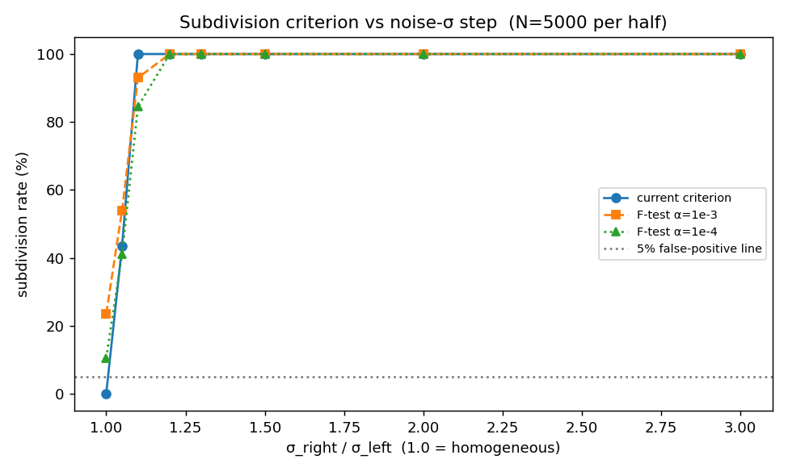
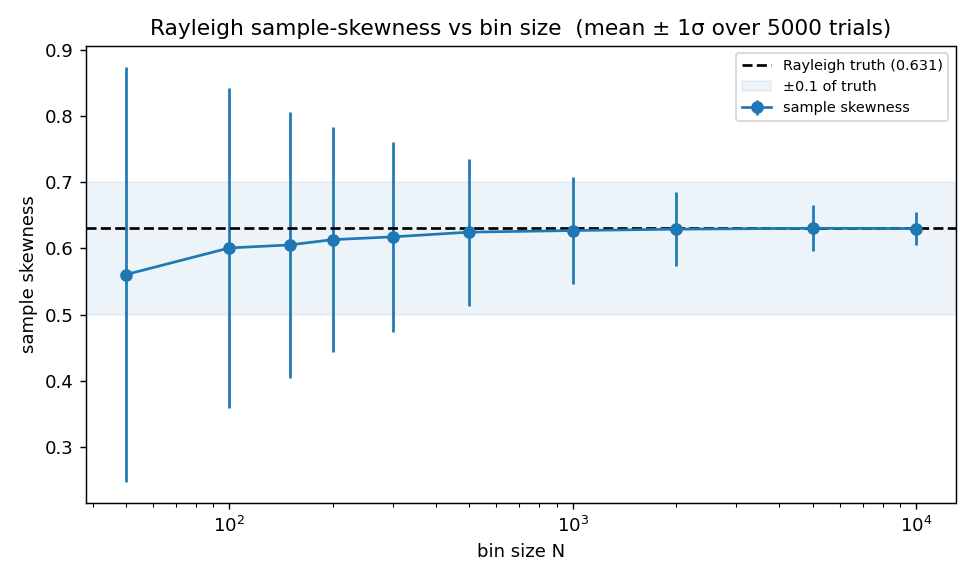
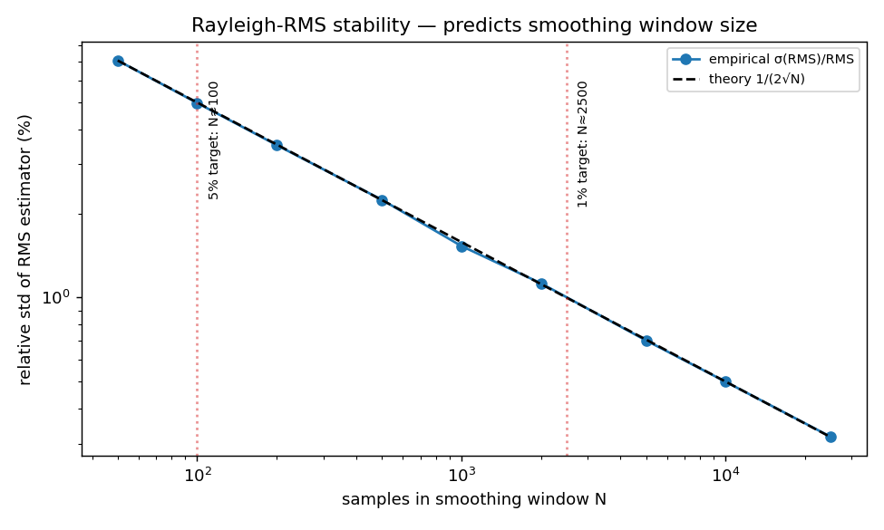
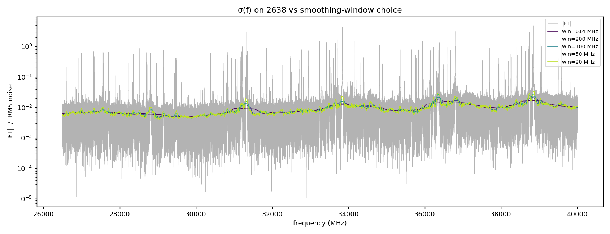

# Noise-estimation heuristic audit

A research report on the five load-bearing heuristics in the
noise-estimation stage of the FTMW processing pipeline
(`src/ftmwpipeline/preprocessing/noise_estimation.py`). Each is examined
in turn against synthetic ground truth and the 2638 fixture: three were
preserved with empirical justification, two were replaced with
sample-count-driven defaults derived from closed-form statistical
stability bounds. Code that regenerates every figure here is in
`prototype.py`; reproducibility details at the end.

## 1. Algorithmic context

The noise stage produces a per-point RMS noise estimate `rms_noise[k]`
by three steps:

1. **Recursive bisection** of the magnitude spectrum into bins. A region
   is split when its two noise-trimmed halves are statistically
   distinguishable in mean or variance, *and* both halves still have
   enough non-line points.
2. **Skewness-targeted trimming** inside each final bin. The magnitudes
   of a noise-only region in a complex FT are Rayleigh-distributed,
   with analytic skewness $\sqrt{\pi/(4-\pi)}\,(2\sqrt{\pi} - 3) / (4-\pi) \approx 0.6311$.
   The bin is trimmed from the top in 1%-rank steps until the kept
   points' sample skewness drops below that target; the kept points
   form the noise mask.
3. **Smoothed RMS** computed by convolving squared kept-magnitudes with
   a uniform window on the noise-masked grid, then interpolating back
   to the full grid.

The Rayleigh skewness target is principled — it is an analytic constant
of the distribution, not a tuning knob. The convolution-based RMS
estimator is a textbook moving-window operation, correct given the
mask. The remainder of this report covers the five tuning choices that
sit around those two principled cores.

## 2. The bin-split criterion

`_compute_variance_based_bins.should_subdivide` splits a region when
**both halves have enough noise points** *and* their noise-trimmed mean
and variance differ "significantly", where significant is **any** of:

- Means differ by ≥ 20% (relative).
- Means differ by ≥ 5σ on a pooled-SE z-test.
- Variances differ by ≥ 20% (relative).
- Variance ratio $F$ ≥ 2.

The OR-of-four structure is awkward — four magic constants OR'd
together, two formal tests undercut by relative-percentage overrides.
The natural simplification is a single principled test at a calibrated
significance level: a Welch's t-test on means, or an F-test on
variances at fixed $\alpha$.

**Calibration.** On 5000 synthetic Rayleigh samples per half with a
controlled $\sigma$ step between halves (`prototype.py` §3), the
detection rate vs $\sigma$ step is:

| $\sigma_R / \sigma_L$ | current | F-test $\alpha = 10^{-3}$ | F-test $\alpha = 10^{-4}$ |
|-----------------------|---------|---------------------------|---------------------------|
| 1.0 (null)            | **0%**  | 23.5%                     | 10.5%                     |
| 1.05                  | 44%     | 54%                       | 41%                       |
| 1.10                  | 100%    | 93%                       | 85%                       |
| ≥ 1.20                | 100%    | 100%                      | 100%                      |



The current criterion is strictly better than either F-test
alternative: zero false-positives on truly homogeneous noise, and 100%
detection above a 10% step. The F-tests' high false-positive rate on
homogeneous data is the diagnostic — the kept-data variance is no
longer χ²-distributed because the top-trimming distorts the
distribution. The canonical F-test assumes Gaussian (or Rayleigh)
samples from the unfiltered tails; trimming breaks that, and the test
becomes biased. A properly-calibrated test for trimmed-data variance
comparison is a non-trivial research problem and is not justified by
any observed failure mode of the current criterion.

**Decision: keep as-is.** The OR-of-four is hard to reason about
*a priori*, but its empirical operating point is good. Recorded here so
a future reader does not repeat the F-test-substitution attempt.

## 3. The bin-size lower bound

Bin sizes are bounded below by `max(int(n_points * min_bin_fraction),
ABS_MIN_BIN_SIZE)`. The relative floor `min_bin_fraction = 1/64` is a
configurable tuning knob; the absolute floor `ABS_MIN_BIN_SIZE` is the
target of this section.

The relevant stability is the **sample skewness** of a Rayleigh draw of
size N. The asymptotic variance is $\mathrm{Var}(\hat\gamma_1) \approx 6/N$,
giving standard deviation roughly $\sqrt{6/N}$. The trimmed-bin
skewness test asks whether this sample skewness has dropped below the
Rayleigh value 0.6311; the test only has discriminating power if the
estimator's noise is small compared to the gap between Rayleigh and
the next plausible distribution (a half-Gaussian, with skewness ≈ 1.0).

**Calibration.** Sample skewness of `n_trials = 5000` Rayleigh draws
per bin size (`prototype.py` §1):

| N     | $\sigma(\hat\gamma_1)$ | bias    | 5–95% range          |
|-------|------------------------|---------|----------------------|
| 50    | 0.314                  | -0.071  | [0.10, 1.09]         |
| 100   | 0.242                  | -0.030  | [0.24, 1.02]         |
| 200   | 0.171                  | -0.018  | [0.36, 0.91]         |
| 300   | 0.144                  | -0.014  | [0.40, 0.87]         |
| 500   | 0.111                  | -0.007  | [0.45, 0.81]         |
| 1000  | 0.080                  | -0.004  | [0.50, 0.77]         |
| 5000  | 0.035                  | -0.001  | [0.58, 0.69]         |



At the previous floor of 100 points, the skewness estimator has
$\sigma \approx 0.24$ — comparable to the gap from Rayleigh (0.631) to
its next plausible competitor and large enough that the trim
termination is effectively random. At N = 300 it drops to $\sigma
\approx 0.14$, about six times tighter than the threshold gap.

**Decision: raise the absolute floor from 100 to 300.** On real FTMW
spectra the relative floor (`n_points · min_bin_fraction`) almost
always dominates anyway: 2638's 566 K-point spectrum gets ~8800-point
bins, well above either floor. The change matters only for unusually
small spectra (< ~19 K points), where the previous absolute floor used
to produce a noisy mask.

## 4. The smoothing window

The previous default `smoothing_window_mhz = 2 × avg_bin_width` was a
dimensionally-natural heuristic but disconnected from any precision
target. The relevant target is the **Rayleigh-RMS estimator
stability**: the moving-window RMS is

$$
\hat{R}_M(f) = \sqrt{\tfrac{1}{N}\sum_{k\in W(f)} |X_k|^2},
$$

over the $N$ kept (noise-mask) samples in the window $W(f)$. By the
delta method on the variance of $\hat E[X^2] = \tfrac{1}{N}\sum X_k^2$
for a Rayleigh process with variance $\mathrm{Var}(X^2) = 4s^4$ (and
$s^2 = R^2/2$), the relative standard deviation of $\hat R$ is

$$
\frac{\sigma(\hat R)}{R} \approx \frac{1}{2\sqrt{N}}.
$$

This sets a direct sample-count → stability mapping: 100 samples gives
5%, 500 samples gives 2.2%, 2500 samples gives 1.0%, 25 000 samples
gives 0.32%.

**Calibration.** Simulating Rayleigh draws and comparing the empirical
RMS standard deviation to the closed-form prediction (`prototype.py`
§2) shows the formula is essentially exact across four decades in N:

| N (samples) | $\sigma(\hat R)/R$ (empirical) | $1/(2\sqrt{N})$ (theory) |
|-------------|---------------------------------|--------------------------|
| 50          | 7.07%                           | 7.07%                    |
| 100         | 4.98%                           | 5.00%                    |
| 500         | 2.24%                           | 2.24%                    |
| 2 500       | 1.00%                           | 1.00%                    |
| 25 000      | 0.32%                           | 0.32%                    |



On the 2638 fixture the previous `2 × avg_bin_width` default produced
an effective smoothing window of ≈ 614 MHz (~25 700 spectrum points,
~24 000 noise samples). At that size $\sigma(\hat R)/R \approx 0.32\%$
— about an order of magnitude tighter than the 1% precision the
downstream consumers (windowing-stage edge-coherence test,
peak-detection SNR cutoff) actually need. Over-tightening this
estimator pays in *under-tracked* spectral variation: real features in
$\sigma(f)$ at the few-tens-of-MHz scale get smoothed away.

**Verification on 2638.** Comparing the previous default against
narrower windows (`prototype.py` §6) shows real local σ-variation that
the 614 MHz default obscures:



The 614 MHz curve (purple) is visibly smoother — and visibly *flatter*
in the 31–36 GHz region than the 100 MHz curve (teal) reveals the
underlying spectrum to be. The 100 MHz, 50 MHz, and 20 MHz curves
agree in shape, indicating real local structure; only the 20 MHz curve
shows visible high-frequency jitter from the falling sample-count
budget.

**Decision: tie the default to a sample-count target.** The new
default is `DEFAULT_SMOOTHING_SAMPLES = 2500`, picked for ~1% RMS
stability — matching the precision target while giving σ(f) enough
freedom to track real variation. On 2638 this resolves to ≈ 64 MHz
coverage and a σ range of 0.0043–0.0267 (vs the prior over-smoothed
0.0049–0.0168). An explicit `smoothing_window_mhz` parameter overrides
the default in full-grid MHz units, unchanged from before.

## 5. The 1%-rank step granularity

`_filter_by_skewness_cached` scans cutoffs in 1%-rank increments
(`inc = 0.01`). The vectorised inner loop (sort-once +
cumulative-moments) makes per-point granularity essentially free,
which raises the question of whether the 1% step is leaving precision
on the table.

**Calibration on 2638.** Running noise estimation with the 1%-step
default and with a per-point-cutoff variant (`prototype.py` §4):

- 1%-step:    44 bins, noise fraction 0.93137.
- per-point:  43 bins, noise fraction 0.93640.
- Mask agreement: 99.50%.
- `rms_noise` relative difference: median 0.8%, p95 3.1%, max 5.9%.

The change is meaningful — a 6% maximum difference is not negligible
— but without a ground truth there is no evidence per-point granularity
is *better*, only that it is *different*. The 1% step is what the
integration tests are calibrated against.

**Decision: keep at 1%.** The vectorised inner loop makes per-point
trivially available as a one-line edit if a future calibration ever
wants it.

## 6. The fallback paths

The pre-audit implementation had two fallback branches:

- A `cutoff ≥ 0.9` branch that keeps the bottom 10% of points by
  magnitude.
- A position-based fallback that keeps the first $\lceil N/10 \rceil$
  points by *position* (a one-sided bias that would never give a
  correct mask).

**Calibration on 2638.** Instrumenting the inner loop to count branch
firings (`prototype.py` §5):

- 102 total calls.
- All 102 converged inside the skewness scan; zero fallback
  engagements.
- Chosen cutoffs: median 6%, 95th percentile 17%, maximum 24%.

The scan terminates well below the 90% guard on every bin of 2638. The
backstop never fires on real-shaped spectra.

**Decision: position-based fallback removed; magnitude-10% fallback
kept defensively.** The position-based path was eliminated in the
vectorised rewrite — it had no realistic firing condition and would
have produced a corrupt mask if it ever did fire. The magnitude-10%
backstop remains, because removing it would silently mask a
pathological future input rather than producing a clearly-degenerate
output.

## 7. Constants and where they live

The two new constants land at module top of
`src/ftmwpipeline/preprocessing/noise_estimation.py`:

```python
DEFAULT_SMOOTHING_SAMPLES = 2500   # §4: 1% RMS stability per σ(R̂)/R ≈ 1/(2√N).
ABS_MIN_BIN_SIZE = 300             # §3: skewness-estimator σ ≈ 0.14 floor.
```

Both are calibrated against the closed-form Rayleigh stability bounds
and verified empirically. Their docstrings reference this report.

## 8. Reproducing this report

The script `prototype.py` regenerates every figure under `figures/`
and the empirical numbers cited above. From the repository root:

```bash
conda run -n ftmwpipeline-dev python \
    dev-docs/research/noise-heuristic-audit/prototype.py
```

Requirements: the project conda environment `ftmwpipeline-dev`
(matplotlib, numpy, scipy, the installed `ftmwpipeline` package), and
the 2638 fixture at `scratch/exp_2638.ftmw`. Sections 1–3 are
purely synthetic and do not need the fixture; sections 4–6 do.

Random seed for the synthetic sweeps is fixed inside `prototype.py`
(`20260520`), so the synthetic figures are byte-identical across runs
given the same matplotlib/numpy versions. The 2638 sections depend on
the live state of the noise-estimation code, so numerical values may
shift slightly with future changes to the algorithm; the qualitative
findings (the decisions in §2–§6) are not expected to change unless
the underlying physics or the consumer-precision targets change.

A future, broader research report on the noise stage — covering
varying experiment classes, acquisition regimes, and sample-skewness
bias at small N — would absorb this audit along with the additional
calibration work it would require.
