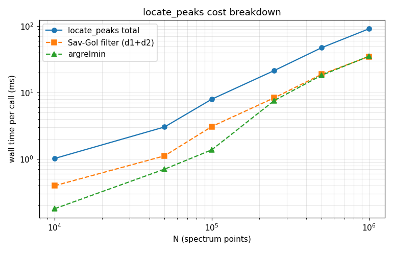
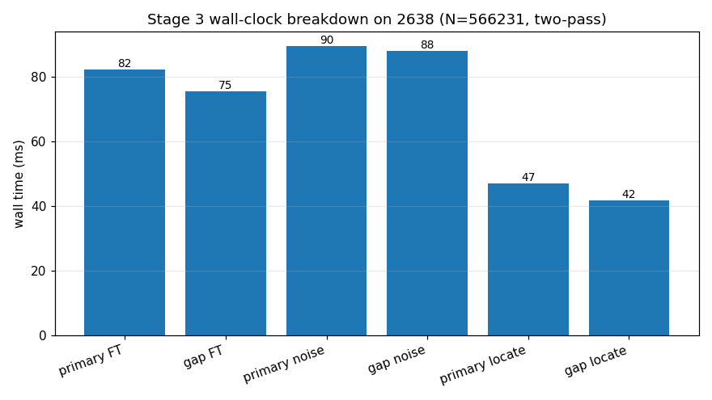
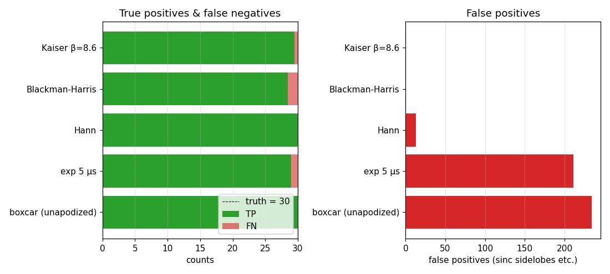
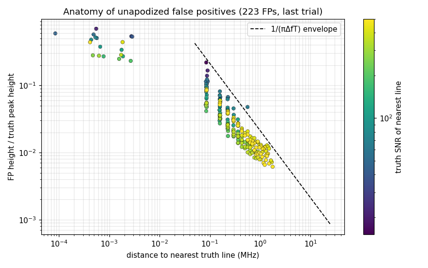
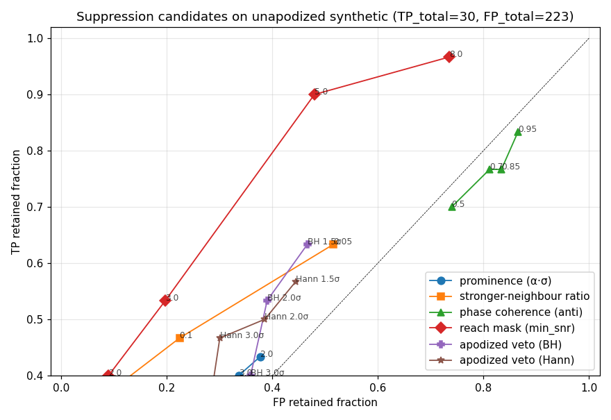
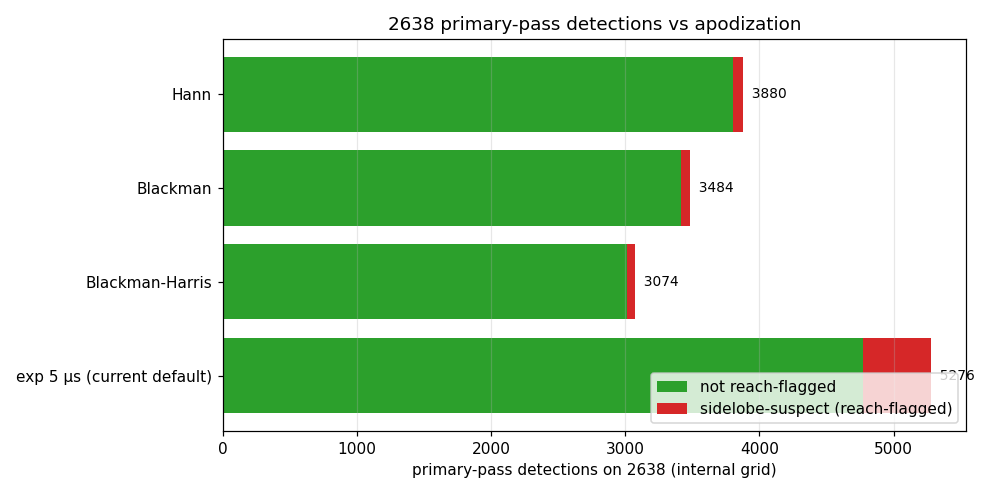

# The peak-detection algorithm: cost, correctness, and the sidelobe problem

A research report on the detector used by the peak-detection stage of
the FTMW processing pipeline — the smoothed second-derivative locator
(`locate_peaks`) and the two-pass driver (`detect_peaks`) around it.
The investigation profiles the detector, characterises why it
over-produces on unapodized (boxcar-truncated) spectra, tests whether
that over-production can be cheaply suppressed, and verifies a concrete
fix on the 2638 fixture. Code that regenerates every figure here is in
`prototype.py`; reproducibility details at the end.

## 1. Algorithmic context

The peak-detection stage produces an ordered list of classified peaks
that (a) seed the downstream analysis windows and (b) ensure no line
above the SNR floor is missed. It is deliberately allowed to be coarse:
the windowing and fitting stages resolve close lines that detection
smears together. Two pieces do the work.

**`locate_peaks` — the locator.** A Savitzky-Golay filter smooths the
magnitude spectrum and returns its 1st and 2nd derivatives. Peaks are
the local minima of the negative-clipped 2nd derivative — points that
are both sharply concave-down and locally extremal. An optional
per-point threshold (`min_snr · σ`) drops sub-threshold detections, and
a split/merge heuristic collapses a pair that straddles one strong
feature. It is a textbook concavity detector; the concavity test is
what rejects noise shoulders on the side of a strong line.

**`detect_peaks` — the two-pass driver.** Real FTMW spectra are
*unapodized* downstream (full resolution, boxcar truncation), and a
boxcar-truncated strong line carries sinc-shaped truncation sidelobes
whose envelope decays only as `1/Δf`. Running the locator directly on
that spectrum detects those sidelobes as lines. The driver's answer:

1. **Primary pass** — run the locator on an *apodized* spectrum, where
   apodization suppresses the sidelobes, for a robust strong-line list.
2. **Gap pass** — run the locator on the *unapodized* spectrum to
   recover weak lines apodization smeared away, but drop any detection
   inside `±leakage_reach` of a primary peak (the closed-form reach
   estimator of [the windowing report's](../complex-edge-coherence/report.md)
   §2, shared verbatim from `preprocessing/leakage.py`).

This report asks three questions of that design: is it *fast enough*,
is it *correct*, and can the residual false positives — the user-facing
complaint, and a pain point for the sibling BlackChirp project, which
runs a single-pass detector on unapodized spectra — be cheaply
suppressed.

## 2. Cost profile

`locate_peaks` is linear in the spectrum length and cheap. On white
noise from 10 K to 1 M points (`prototype.py` §1):

| N         | total    | Sav-Gol (d1+d2) | argrelmin |
|-----------|----------|-----------------|-----------|
| 10 000    | 1.0 ms   | 0.4 ms          | 0.2 ms    |
| 100 000   | 7.5 ms   | 2.9 ms          | 1.3 ms    |
| 500 000   | 46.6 ms  | 18.5 ms         | 18.3 ms   |
| 1 000 000 | 89.5 ms  | 34.7 ms         | 36.9 ms   |



Cost is split roughly evenly between the Savitzky-Golay convolution and
`argrelmin`, with the threshold/merge tail making up the rest. There is
no superlinear term and no pathological case.

**The detector is not the stage's bottleneck.** On the 2638 fixture
(N ≈ 566 K), the two `locate_peaks` calls cost ~88 ms combined, but the
stage spends far more recomputing its inputs (`prototype.py` §2):



| step                | wall time |
|---------------------|-----------|
| primary FT recompute | 76 ms    |
| gap FT recompute     | 70 ms    |
| primary noise        | 88 ms    |
| gap noise            | 86 ms    |
| primary `locate_peaks` | 47 ms  |
| gap `locate_peaks`   | 41 ms     |

The two FFT recomputes (~150 ms) and the two full noise re-estimations
(~175 ms) dominate; the peak finder is ~25 % of the measured work. If
the stage's latency ever needs to come down, the redundant input
recomputes are the target — not the detector. Two cheap detector-side
options exist but are not pressing: the 1st-derivative Sav-Gol
convolution is used only by the merge heuristic's sign test and could
be elided when the merge does not fire, and `argrelmin` with
`order = window//2` rescans a wide neighbourhood that a single-pass
comparison would not. Neither is worth doing until the recompute cost
is addressed first.

**Decision: leave the detector's performance alone.** It is linear,
predictable, and a minority of the stage cost. Recorded here so a
future optimisation pass starts at the FFT/noise recomputes.

## 3. Why unapodized spectra over-produce

The synthetic test bed builds a baseband spectrum from a known line
list (30 lines, peak SNR log-spaced 5–500, minimum separation 3 MHz,
T = 15 µs acquisition) by summing truncated cosines in the time domain,
applying an apodization, and forward-FFT'ing — the same path the
pipeline's Stage 1 takes. Complex Gaussian noise is added in the time
domain before apodization. The locator runs at a 3σ floor; a detection
within 0.5 MHz of a truth line is a true positive (`prototype.py` §3).

| apodization          | true positives | false positives |
|----------------------|----------------|-----------------|
| boxcar (unapodized)  | 30             | **234**         |
| exponential 5 µs     | 29             | **211**         |
| Hann                 | 30             | 13              |
| Blackman-Harris      | 28.5           | **0**           |
| Kaiser β = 8.6       | 29.5           | **0**           |



The user's report is confirmed and quantified: a boxcar spectrum yields
roughly **8× the false positives** of a Blackman-Harris or Kaiser one,
for the same true-positive recovery. The strong windows pay for that
with a small handful of false negatives (the weakest lines, broadened
below the floor) — an acceptable trade for a *position-finding* pass
whose misses are backfilled by the gap pass.

The critical row is **exponential 5 µs: 211 false positives** — almost
as bad as boxcar. A mild exponential filter barely dents the near
sidelobes. This row matters because it is the apodization the
pipeline's primary pass currently uses (§6).

## 4. Anatomy of the false positives

Every unapodized false positive is a sinc sidelobe. Taking the boxcar
case and measuring each false positive's distance to, and height
relative to, its nearest truth line (`prototype.py` §4):



- **99.6 %** of false positives (222 of 223) lie within the closed-form
  leakage reach of some truth line.
- Median distance to the nearest truth line is **0.30 MHz**; 95th
  percentile **1.3 MHz**.
- Median height is **2.6 %** of the parent line's peak; 95th percentile
  33 %.
- The scatter tracks the analytic `1/(πΔf·T)` boxcar sidelobe envelope.

The false positives are not noise excursions and not a detector defect.
They are real, coherent spectral features — the truncation sidelobes
the finite acquisition genuinely puts there. The locator is correctly
reporting concave-down maxima above the noise floor; those maxima
simply are not independent lines.

## 5. Why no cheap local test suppresses them

The decisive negative result of this investigation: **a sinc sidelobe
and a genuine weak line are locally indistinguishable.** Both are
concave-down maxima of width ≈ 1/T; their heights overlap (a sidelobe
of a strong line is far brighter than a weak real line). Nothing
measurable in a neighbourhood of one candidate separates the two
classes. Four single-spectrum suppression heuristics were swept on the
boxcar synthetic, plus an apodized-companion veto (`prototype.py` §5):

| candidate                       | best operating point      | TP kept / 30 | FP kept / 223 |
|----------------------------------|---------------------------|--------------|---------------|
| prominence ≥ α·σ                 | α = 2σ                    | 13           | 84            |
| stronger-neighbour height ratio  | α = 0.05                  | 19           | 115           |
| phase anti-coherence vs neighbour| thr = −0.95               | 25           | 193           |
| closed-form reach mask (self)    | min_snr = 5               | 27           | 107           |
| apodized-amplitude veto (BH)     | k = 1.5σ                  | 19           | 104           |



Every curve hugs the diagonal — removing false positives costs true
positives at nearly 1:1. Three results are worth recording so they are
not re-attempted:

- **Prominence fails** because a sinc sidelobe sits between two sinc
  zeros, so its prominence *is* essentially its full height; meanwhile
  a genuine weak line riding the skirt of a strong one has *low*
  prominence. The test removes real lines preferentially.
- **Phase gives no cheap separator.** The truncation phase factor
  `exp(−iπΔf·T)` winds at the *same rate* at a real line's own centre
  and at a distant line's sidelobe — there is no phase-gradient or
  anti-coherence cut that holds. (This is *not* a contradiction of the
  windowing stage's complex-edge coherence statistic: that statistic
  works because it integrates a *known, oriented* M-point band against
  a strong line of *known location*. It needs the strong-line list as
  input — which is exactly the provenance information a local test by
  definition lacks.)
- **The apodized veto fails on close-in sidelobes.** A sidelobe within
  ~1 MHz of its parent hides under the *broadened* apodized main lobe
  of that parent, so the apodized magnitude there is high and the veto
  keeps it; meanwhile a genuine weak line, broadened by apodization,
  can drop below the veto floor. The veto alone is no better than the
  diagonal.

The **closed-form reach mask is the only candidate above the
diagonal**, and only mildly so. The reason it is not better, applied to
a single detection list, is structural: the reach of a strong line
covers several MHz, and any genuine weak line that happens to sit
inside that skirt is masked along with the sidelobes. There is no way
around this *from one spectrum* — the information needed to tell a
masked weak line from a masked sidelobe is simply not present in the
boxcar spectrum at that location.

**This is why the two-pass design exists, and the investigation
vindicates it.** The apodized primary pass is an *independent
measurement channel* in which the strong line's skirt is gone, so a
weak line sitting inside that skirt becomes visible on its own merits.
The gap pass then masks the boxcar spectrum by the *primary's*
strong-line list — provenance supplied externally, exactly the input
no local test can synthesise. No bolt-on suppressor improves on this;
the two-pass architecture *is* the fix, and it should be kept.

## 6. The primary pass is not clean — and the fix

The two-pass design is sound, but its current *configuration* on the
pipeline undercuts it. The primary pass apodizes with the user's Stage
1 `expf_us` — 5 µs on the 2638 fixture, with no window function. That
is the **exponential-5 µs row of §3: 211 false positives.** The
"clean" pass is not clean: it detects its own sidelobes as lines, which
both pollutes the returned peak list and corrupts the strong-line list
that seeds the gap-pass reach mask.

Verified directly on 2638 by recomputing the primary spectrum under
four apodizations and counting detections, with the self-consistent
reach mask flagging sidelobe-suspects (`prototype.py` §7):



| primary apodization        | detections | reach-flagged sidelobe-suspects |
|----------------------------|------------|---------------------------------|
| exponential 5 µs (current) | 5276       | 503 (9.5 %)                     |
| Blackman-Harris            | 3074       | 58 (1.9 %)                      |
| Blackman                   | 3484       | 72 (2.1 %)                      |
| Hann                       | 3880       | 79 (2.0 %)                      |

Switching the primary pass to Blackman-Harris cuts its detection count
by ~42 % (2200 fewer detections) and its sidelobe-suspect fraction by
~5× on the real 2638 spectrum. Those ~2200 removed detections are
overwhelmingly sidelobes the current mild apodization fails to
suppress.

**Recommendation: the primary pass should apodize with a strong window
(Blackman-Harris is the natural default; Kaiser or Blackman are
equivalent), independent of the user's Stage 1 `expf_us`.** The
primary pass's sole job is robust strong-line *position* finding —
amplitude, SNR, and the leakage reach are all measured downstream on
the unapodized spectrum, so the primary apodization has no effect on
any reported quantity except *which positions* are found and *which
strong lines seed the mask*. For that job the most sidelobe-suppressing
window available is unambiguously correct, and the planning doc's
current default ("Stage 1 `expf_us`-equivalent") is the defect. The
change is a one-line default in the stage's orchestration and is the
single highest-value correctness fix this investigation found.

The false negatives a strong window introduces (§3: Blackman-Harris
missed ~1.5 of 30 synthetic lines) are not a concern: those are the
weakest lines, and recovering weak lines is precisely the gap pass's
job. A strong primary window shifts work to the gap pass by design.

## 7. A single-pass recipe for BlackChirp

The sibling BlackChirp project runs a single-pass detector on
unapodized spectra and has no apodized companion to lean on. Section 5
shows it cannot be fixed by a local test. The best available cheap
hardening is a **self-consistent reach mask**:

1. Detect all concave-down maxima above the SNR floor (the existing
   `locate_peaks`).
2. Sort detections by SNR, descending.
3. For each detection, compute its closed-form leakage reach from its
   own SNR and the acquisition T.
4. Drop any *weaker* detection that falls within a *stronger*
   detection's reach.

This is `O(N log N)`, needs no second FFT, and on the boxcar synthetic
removes roughly half the false positives while keeping 27 of 30 lines
(§5, reach mask at `min_snr = 5`). It is strictly imperfect — it
masks genuine weak lines sitting inside a strong line's skirt, the same
structural limit as §5 — but for a *window-seeding* detector that is an
acceptable loss, and it is a large improvement over the raw boxcar
output (234 false positives → ~110). BlackChirp should also be offered
the full two-pass option: if it can afford one extra apodized FFT, the
apodized-primary + reach-masked-gap architecture of this pipeline is
the genuinely correct answer and removes essentially all sidelobe
false positives (§3: Blackman-Harris primary → 0).

The reach-mask building block — `estimate_leakage_reach` — is already
factored out in `preprocessing/leakage.py` with a self-contained
derivation in its module docstring, so the recipe ports without
dragging the rest of the pipeline along.

## 8. Where the residual pipeline false positives come from

With a clean (strong-window) primary pass, the pipeline's remaining
false positives are bounded. The gap pass masks every primary strong
line's reach, and a strong line is by definition caught by the primary
pass (apodization cannot push a *strong* line below the floor). The
sidelobes that survive into the final list are therefore sidelobes of
**medium lines whose reach the analytic estimator slightly
under-covers**, plus the genuine ambiguity of §5 — a sidelobe within a
strong skirt that is indistinguishable from a real weak line and is
*kept* rather than masked (the safe direction: the windowing stage
treats an over-list of seeds far more gracefully than a missed line).

On 2638 the unapodized gap grid carries 4569 raw detections, 3216 of
them below SNR 3 (`prototype.py` §6) — the low-SNR tail the windowing
stage already expects to absorb. The reach mask at 3σ retains 92 % of
them; this is the population the planning doc deliberately tolerates as
window seeds. The improvement that actually matters is upstream, in §6:
a clean primary pass means the *strong-line list* — the part of the
output the windowing stage trusts most — is no longer 9.5 % sidelobes.

## 9. Caveats and known edges

- **Synthetic noise convention.** The synthetic adds time-domain noise
  before apodization, so apodized cases have slightly lower per-bin
  noise (the window reduces `Σw²`); the noise estimator absorbs this
  and the SNR scale shifts marginally between apodizations. The
  true-positive/false-positive *counts* are robust to this; precise
  SNR-at-detection values are not directly comparable across the §3
  rows.
- **Undamped lines.** The synthetic uses undamped (boxcar-truncated)
  cosines — the leakiest case. Real damped lines have a true Lorentzian
  `1/Δf²` far wing, so their sidelobes are weaker and the false-positive
  counts in §3 are an upper bound. The qualitative finding (no local
  test works; the two-pass design is necessary) does not depend on it.
- **The 0.5 MHz match tolerance** in §3 is generous relative to the
  boxcar peak shift; tightening it moves a few true positives into the
  false-positive column but does not change any decision.
- **`locate_peaks` window/order** were held at the pipeline defaults
  (`window = 11`, `order = 3`) throughout. A sweep of those parameters
  is out of scope here — they affect the smoothing scale, not the
  sidelobe problem, which is a property of the spectrum, not the
  filter.

## 10. Reproducing this report

The script `prototype.py` regenerates every figure under `figures/`
and the empirical numbers cited above. From the repository root:

```bash
conda run -n ftmwpipeline-dev python \
    dev-docs/research/peak-detection/prototype.py
```

Requirements: the project conda environment `ftmwpipeline-dev`
(matplotlib, numpy, scipy, the installed `ftmwpipeline` package), and
the 2638 fixture at `scratch/exp_2638.ftmw`. Sections 1 and 3–5 are
synthetic and need no fixture; sections 2, 6 and 7 use it and are
skipped with a printed notice if it is absent. Recreate the fixture
with:

```python
import ftmwpipeline.api as ftmw
ftmw.import_data("scratch/exp_2638.ftmw", source="examples/blackchirp_data/2638/")
ftmw.compute_ft("scratch/exp_2638.ftmw", zpf=2, expf_us=5.0, trim=(26500, 40000))
ftmw.estimate_noise("scratch/exp_2638.ftmw")
```

Random seeds for the synthetic sweeps are fixed inside `prototype.py`
(line list `20260601`, per-trial noise `20260700 + trial`), so the
synthetic figures are stable across runs given the same numpy/scipy
versions. The 2638 sections depend on the live noise-estimation and
FT code, so numerical values may shift slightly with future changes;
the qualitative findings (§5's negative result, §6's recommendation)
are not expected to change unless the underlying physics does.
