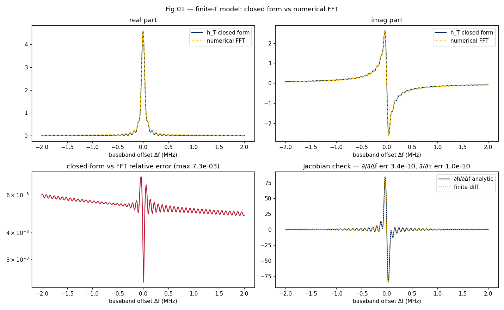
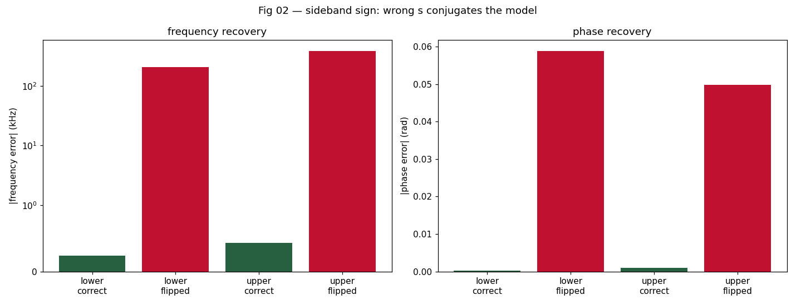
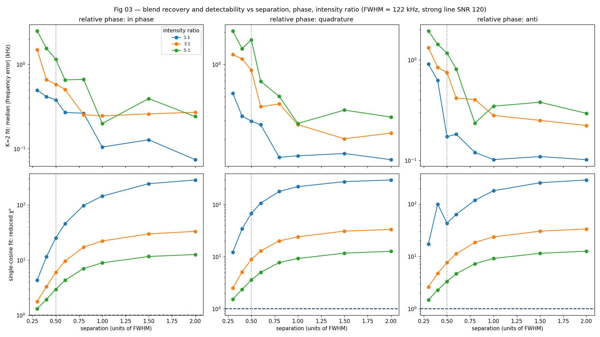
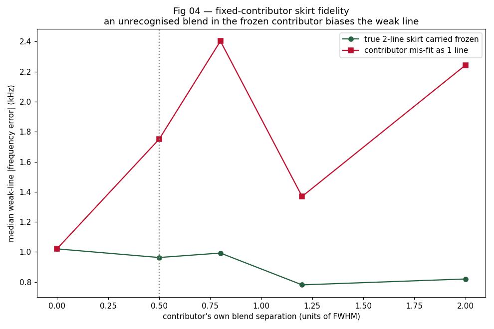
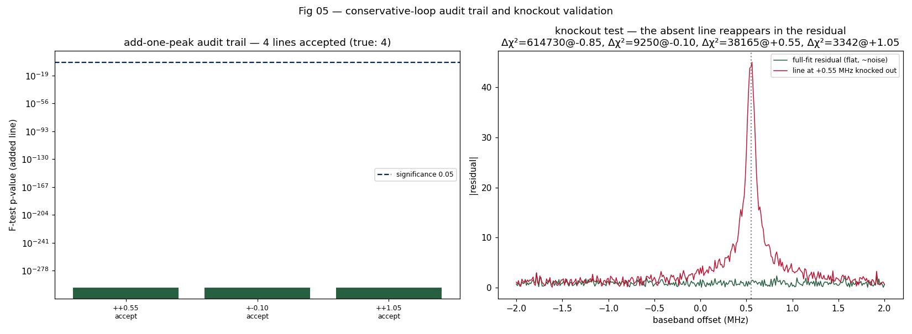

# Stage 5 per-window fitting — prototype findings

A research report on the per-window fitting stage of the FTMW processing
pipeline: the line-shape model it fits, the demodulation/sideband mapping it
depends on, and — the reason this prototype exists — how the fixed-contributor
architecture holds up against blended lines. Code that regenerates every
figure is in `prototype.py`; it is fully synthetic, so the ground truth is
exact. This report feeds task 1 of
[`../../planning/stage5-fitting.md`](../../planning/stage5-fitting.md); the
open-question references (O5-N, D-N) point back to that plan.

## 1. Why this prototype

Stage 5 fits each analysis window to a sum of finite-acquisition damped
cosines. Two things had to be settled before committing the production
algorithm:

1. **The model and its riskiest convention.** The model is the closed-form
   FFT of a damped cosine, `h_T`; the fit is parameterised in a demodulated
   *baseband* frequency offset, and the lower/upper sideband enters as a sign.
   Getting that sign wrong is a silent, catastrophic failure mode — it had to
   be derived and tested explicitly.
2. **Blending.** The pipeline fits *unwindowed* spectra precisely so that
   barely-resolved lines stay resolvable. But the Stage 4 fixed-contributor
   model freezes a strong line's fitted skirt and carries it into neighbouring
   windows — and if that strong line is itself an unrecognised blend, the
   frozen skirt is wrong. Blends are also routinely *unequal* (the nitrogen
   quadrupole 3:5:1 hyperfine pattern is the canonical case) and carry no
   fixed inter-line phase relation. How the fitter and the fixed-contributor
   model behave on blends is the load-bearing question.

All work is at the 2638 fixture's scale: active acquisition `T = 12.65 µs`,
effective decay `τ = 5 µs` (the `expf_us = 5` apodization dominates), FT bin
spacing ≈ 12 kHz. The resulting magnitude line shape has **FWHM ≈ 122 kHz**;
"separation in units of FWHM" below is in those units.

## 2. The model and the sideband mapping

A molecular line is a damped cosine truncated to the acquisition `[0, T]`. Its
exact rfft-domain response, in baseband frequency offset `Δf` from line
centre, is the finite-T envelope of the
[complex-edge-coherence report](../complex-edge-coherence/report.md) §2:

```
X(Δf) ≈ ½ A e^{iφ} · h_T(Δf; τ),   h_T(Δf;τ) = [1 - e^{-(1/τ + i2πΔf)T}] / (1/τ + i2πΔf)
```



`h_T` is the closed form of "the FFT of a damped cosine on an effective time
axis" — so the model spectrum is `h_T` evaluated directly on the window grid,
no numerical FFT needed (O5-1). **Fig 01** confirms this: `h_T` against a
literal numerical FFT of a synthesized FID agrees to a relative error of
**7×10⁻³**, and that residual is entirely the numerical FFT's finite-grid
interpolation error — the closed form is exact. The analytic derivatives of
`h_T` (w.r.t. offset and τ) match central finite differences to **3×10⁻¹⁰**,
so the production fit can use an analytic Jacobian from the start (O5-7).

A unit convention worth stating because it caused a real bug during this
prototype: work entirely in **µs and MHz**. A frequency in MHz times a time in
µs is dimensionless, so `h_T` carries units of µs and `h_T(0) = τ_eff` in µs.
Mixing in SI (Hz, s) silently rescales the on-line response by 10⁶.

**The sideband mapping (the riskiest piece).** The persisted spectrum is on a
*molecular* frequency grid `f`; the line physically sits at baseband frequency
`f_bb = s·(f − f_probe)`, with `s = −1` for the lower sideband (2638) and
`s = +1` for the upper. A window is fit about a reference frequency `f_c`;
each line is fit by its signed baseband offset `δ = s·(f − f_c)` — a small,
signed number, not an absolute ~36 GHz frequency (the D-1 reparameterisation).
The model term is `½ A e^{iφ} h_T(u − δ; τ)` with `u = s·(f − f_c)`.



The sign is load-bearing because **`h_T(−Δf) = conj(h_T(Δf))` exactly**: using
the wrong `s` conjugates every line shape — the imaginary part flips. **Fig
02** fits a synthetic line on each sideband with the correct and the flipped
sign. With the correct sign the frequency is recovered to **±0.2–0.4 kHz**;
with the sign flipped it is biased by **−208 kHz (lower) / +385 kHz (upper)**.
The fit still *converges* and the magnitude residual still looks plausible —
this is a silent failure. The production code must convert the window grid to
signed baseband offset on entry and unit-test it on synthetic lines of both
sidebands (O5-1 / the plan's mandated test).

## 3. The fitter

The fit is a complex-domain least-squares: the model `h_T` against the window
data, real and imaginary parts stacked into one residual vector, solved with
`scipy.optimize.least_squares` and the analytic Jacobian.

**Noise weighting (D-8).** The complex noise has per-bin RMS σ, so its real
and imaginary parts each carry variance σ²/2. The stacked residual must be
weighted by **σ/√2**, not σ, for every element to be unit-variance — then
reduced χ² ≈ 1 and the F-test is calibrated. (Weighting by σ leaves reduced
χ² ≈ 0.5 and doubles the F-statistic. The surviving bcfitting reference
applied a 1.53 magnitude-to-complex factor for the same reason; with a
genuine complex per-bin σ the correct factor is simply √2 and nothing else.)

> *Calibration scope.* This prototype's noise model is i.i.d. complex
> gaussian per bin — uncorrelated across bins by construction, because the
> synthetic spectrum is built on an explicit frequency grid rather than via
> a zero-padded FFT. That matches the **active-portion FT** Stage 5 actually
> fits on (planning doc §"Spectral domain for the fit", ROADMAP D9), where
> bins are independent. It does *not* match the persisted Stage 1 spectrum
> (zero-padded; Dirichlet-correlated bins), so the σ/√2 calibration here is
> directly applicable to production fitting only because Stage 5 works in
> the active-FT frame — no further α-correction needed.

The conservative add-one-peak loop is ported from the bcfitting shell:
seed with the strongest line, add the strongest residual candidate, accept it
only on an F-test (p < 0.05) *and* an AIC decrease, with a peak-separation
constraint. One property matters for everything below: **in the complex
matched-filter domain the F-test is decisive.** A real line's leakage skirt
contributes coherently across many bins, so its *integrated* significance is
far above its peak SNR; a genuinely resolved line is overwhelmingly
significant and an unresolvable one is overwhelmingly insignificant. There is
almost no "marginal" middle ground.

## 4. Blending



**Fig 03** sweeps a two-line blend over separation (0.3–2.0 FWHM), relative
phase (in-phase, quadrature, anti-phase) and intensity ratio (1:1, 3:1, and
5:1 — the faint-component limit of the 3:5:1 hyperfine pattern). It separates
two questions that have very different answers.

**Recovery — given K = 2, how well are the lines fit?** (top row). Fit jointly
with both lines free, the blend is recovered to **of order 1 kHz or better
down to 0.5 FWHM**, and still to ~1–2.5 kHz at 0.3 FWHM — a quarter of the
linewidth. Equal blends recover best (down to ~0.1 kHz once separated);
the faint 5:1 component is the hardest (~1–2 kHz) but never fails. Relative
phase barely matters for recovery. **The model resolves blends far below the
apodized-resolution limit** — this is the positive result that justifies
fitting the unwindowed spectrum.

**Blend signature — does a single cosine fail visibly?** (bottom row). A
single damped cosine has one fixed line shape; a blend it cannot match leaves
an **elevated reduced χ²**. That elevation is large and smooth across the
whole separation range and every phase/ratio — a clean, observable trigger.
And the 1-vs-2-line F-test p-value (recorded, not plotted — it sits at the
numerical floor everywhere): once the pair is fit with a proper K=2
initialisation, the second line is *always* statistically required, even at
0.3 FWHM. **Detectability is never the limit.**

The limit is **initialisation, not significance.** The conservative
add-one-peak loop fits one cosine, lets it drift to the blend centroid, then
adds a second from that drifted state — and for a tight near-equal in-phase
blend that sequential path lands in a degenerate basin where the two cosines
collapse together, so the loop reports one line. The blend was always
detectable (elevated 1-cosine χ²) and always recoverable (top row); the loop
simply did not initialise the K=2 fit well enough to find the resolved
solution. The fix is a **blend-aware seeder**: when a single-cosine fit leaves
an elevated reduced χ² at a seed, retry K=2 (and K=3) initialised at *two
positions straddling the feature*, not at the drifted centroid plus one
candidate. This is the main design recommendation for O5-2/O5-5.

A reassuring corollary for the fixed-contributor model: the blend the loop is
most likely to miss is the *equal-intensity, in-phase, sub-0.5-FWHM* one — and
that is the blend whose composite is most nearly a single symmetric line, so
fitting it as one cosine yields very nearly the right skirt anyway. The blends
that genuinely distort a skirt are the asymmetric, unequal ones — and those
leave the largest 1-cosine χ² signature, so the seeder catches them.

## 5. Fixed-contributor skirt fidelity



**Fig 04** is the direct test of the Stage 4 architecture. A strong line is
fit, frozen, and carried as a leakage contributor into a neighbouring window
where a weak line is fit. When the strong line is itself a two-line blend,
its blend separation is swept, and the weak line's recovered frequency is
compared between carrying the *true* (two-line) frozen skirt and carrying the
*mis-fit* (single-cosine) skirt.

Carrying the true skirt, the weak line's frequency error sits at the
**~0.8–1.0 kHz noise floor** regardless of the contributor's internal
structure. Carrying a single-cosine mis-fit of a blended contributor, the
error rises to **~1.4–2.4 kHz** — an attributable systematic of roughly
**1 kHz**, growing with the contributor's blend separation (trial-to-trial
scatter aside). It is a real, one-sided bias, not catastrophic but well above
the statistical floor.

The conclusion the plan should carry: an unrecognised blend in a frozen
contributor *does* corrupt dependent windows, at the ~1 kHz level. The
mitigations are already in the design — the blend-aware seeder of §4 (the
contributor is fit in *its own* window, where the seeder applies) and the
post-fit residual edge-coherence check, which will see a mis-carried skirt as
coherent residual and can trigger renegotiation. Freeze-eligibility
(`min_freeze_snr`) bounds the rest.

## 6. Validation views



**Fig 05** exercises the two diagnostics the production loop must expose.

The **audit trail** records every add-one-peak iteration — the candidate, the
χ² drop, the F-test p-value, the decision. On a representative four-line
window the loop accepts 4/4 lines, each at a p-value far below any plotting
floor — the matched-filter decisiveness of §3 made visible.

The **knockout test** removes each fitted line in turn, holding all other
parameters frozen, and measures the χ² increase. Every line leaves a large,
unambiguous increase (Δχ² of 3×10³ to 6×10⁵ on the test window) and the
residual reacquires that line's shape at its frequency — the right panel shows
the flat full-fit residual against a single-line knockout, the absent line
standing back up cleanly at its offset. The knockout test is a sound per-line
"is this line real?" validator and should be persisted with the fit.

## 7. Recommendations for the Stage 5 plan

- **Model (O5-1).** Use the closed-form `h_T` evaluated on the window grid,
  with the analytic Jacobian — both verified here. Work in µs/MHz.
- **Sideband (O5-1).** Convert the window grid to signed baseband offset
  `s·(f − f_c)` on entry; unit-test on synthetic lines of both sidebands. A
  wrong sign is a silent 200–400 kHz frequency bias.
- **Noise weighting (D-8).** Weight the stacked Re/Im residual by σ/√2.
- **Blending (O5-2).** Joint K-known recovery is excellent (~1 kHz to 0.5
  FWHM); blends are always statistically detectable. Add a **blend-aware
  seeder**: when a single-cosine fit leaves an elevated reduced χ², retry K=2
  and K=3 initialised at positions straddling the feature. The plain
  add-one-peak loop's sequential initialisation is the real failure mode, not
  significance.
- **Patience (O5-5).** Assessed and found marginal: the decisive matched-filter
  F-test leaves no individually-insignificant/jointly-significant regime for a
  patience parameter to exploit. Keep it as zero-cost insurance (default 1)
  but do not rely on it; the blend-aware seeder is the real fix.
- **Fixed contributors.** An unrecognised blended contributor biases dependent
  windows by ~1 kHz. The blend-aware seeder (applied in the contributor's own
  window) plus the residual edge-coherence renegotiation check keep this
  bounded; the plan's open-item §"D8 open items" stands.
- **Validation.** Adopt the knockout test as a per-line post-fit validator and
  persist the add-one-peak audit trail.

## 8. Reproducing this report

From the repository root, in the project conda env:

```bash
conda run -n ftmwpipeline-dev python \
    dev-docs/research/stage5-fitting/prototype.py
```

It regenerates every figure under `figures/` in a few minutes; no external
fixture is needed. The random seed is fixed inside `prototype.py`
(`20260521`), so the figures are reproducible across runs given the same
numpy/scipy/matplotlib versions.
