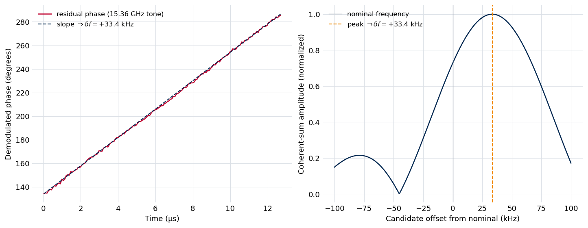
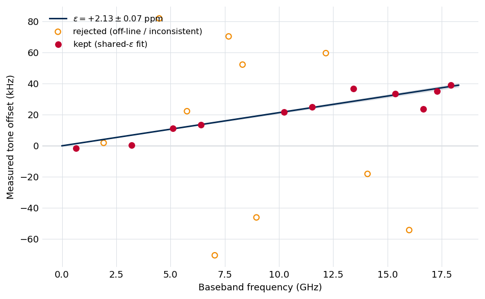

.. index::
   single: clock declaration
   single: clock source
   single: clock lattice
   single: spur; lattice prior
   single: timebase calibration
   single: digitizer clock; scale error
   single: frequency calibration; epsilon

Clocks and Frequency Calibration
================================

Every spectrometer carries a small set of reference clocks — the synthesizer
that drives the up- and down-conversion chain, the arbitrary-waveform generator,
the digitizer sample clock. Those clocks leave deterministic fingerprints in the
spectrum: narrow, non-decaying tones at frequencies set by clock arithmetic
(harmonics, mixing products, sample-rate images). They are *spurs*, not molecular
lines, and the :doc:`Stage 5 <stage5_fitting>` spur gate already removes the ones
it can recognize. Declaring the instrument's clocks turns that recognition from
an empirical guess into physics.

A clock declaration buys two things:

- **A sharper spur prior.** The declared clock fundamentals generate a *lattice*
  of frequencies where spurs are expected. The spur gate uses the lattice both to
  know where to look and to lower its burden of proof on a tone that lands exactly
  where the clocks predict — so it catches instrumental tones an unprimed gate
  leaves behind. Any fitted line that lands on the lattice is flagged for review.
- **A self-calibrated frequency axis.** A digitizer that is *not* locked to the
  laboratory frequency standard runs at a slightly wrong rate, which stretches the
  frequency axis by a constant fractional factor. That scale error is measurable —
  prior-free — from the Rb-locked clock spurs themselves, because their true
  frequencies are known exactly. The timebase calibration recovers it and
  :doc:`Stage 6 <stage6_review>` applies it.

Both are *additive prior knowledge*. With no declaration the pipeline behaves
exactly as it does without one (the spur gate falls back to a coarse integer-MHz
anchor, and the frequency axis is reported as measured); the results are
byte-identical. Declaring the clocks only ever adds information.

The instrument clock tree
-------------------------

The home instrument the example data come from is a useful worked example. Its
clocks are:

- an **up-conversion** synthesizer at 5760 MHz (doubled to the 11520 MHz LO,
  multiplied to the excitation band after a lower-sideband mix);
- a **down-conversion** synthesizer at 5120 MHz (multiplied to the 40960 MHz
  probe LO);
- an **arbitrary-waveform generator** clocked at 16000 MHz;
- a **digitizer** sampling at 50 GSa/s (eight interleaved 6.25 GSa/s ADCs).

The first three are referenced to a 10 MHz rubidium standard; the digitizer is
free-running. Every cross-fixture recurring spur in the example data is a direct
identity of one of these clocks — in one of two frames:

- the **baseband** frame, the frequency a tone enters the digitizer at, where the
  molecular frequency maps as :math:`f_\text{bb} = |f_\text{mol} - f_\text{probe}|`
  (a synthesizer reference at 5120 MHz, a mixing product at 2×5120, the AWG
  half-rate at 8000 MHz, an ADC image at 2×6250);
- the **molecular (RF)** frame, harmonics radiating directly into the receiver
  (5×5760, 6×5760).

All of the Rb-locked tones fall on a single comb — the **intermodulation
lattice** of the locked fundamentals, whose spacing is their greatest common
divisor. The free-running digitizer is the one source that *drifts*: its tones
wander relative to the Rb-locked comb from one acquisition to the next.

This is the structure a declaration makes available to the pipeline.

Declaring the clocks
--------------------

A declaration is a short list of clock *sources*, each a frequency in MHz, a
``locked`` flag (referenced to the laboratory standard or not), and an optional
label. The ``clocks`` object manages it:

.. code-block:: console

   # Show the current declaration
   $ ftmwpipeline clocks show exp.ftmw

   # Replace it (token: freq[:locked|free[:label]])
   $ ftmwpipeline clocks set exp.ftmw 5760:locked:upconv 5120:locked:downconv \
                                      16000:locked:awg 6250:free:digitizer

   # Append, remove by frequency, or clear
   $ ftmwpipeline clocks add exp.ftmw 8000:locked:awg-half
   $ ftmwpipeline clocks remove exp.ftmw 6250
   $ ftmwpipeline clocks clear exp.ftmw

The same operations are available on the functional API and the ``Pipeline``
object:

.. code-block:: python

   import ftmwpipeline.api as ftmw

   ftmw.set_clock_sources(
       "exp.ftmw",
       [
           {"freq_mhz": 5760, "locked": True, "label": "upconv"},
           {"freq_mhz": 5120, "locked": True, "label": "downconv"},
           {"freq_mhz": 16000, "locked": True, "label": "awg"},
           {"freq_mhz": 6250, "locked": False, "label": "digitizer"},
       ],
   )
   ftmw.get_clock_sources("exp.ftmw")

Two conventions matter:

- **Declare fundamentals, not products.** A harmonic or mixing product is
  *generated* from the fundamentals, so the lattice produces it for free. Declare
  the 5760 MHz synthesizer, not the 11520 MHz LO it is doubled to. Frequency
  *division* is the exception — a half-rate tone (here the AWG's 8000 MHz) is not a
  generated harmonic, so if the instrument produces one it is declared as its own
  fundamental.
- **Integer-MHz fundamentals.** Rb-locked synthesizers are set to exact
  frequencies; the lattice is built from the integer greatest common divisor of
  the declared locked clocks, so declare them as integers.

Where the declaration lives
~~~~~~~~~~~~~~~~~~~~~~~~~~~~~

The ``clocks`` verbs write the **recommended** settings layer — the same layer an
importer populates from instrument metadata. In the resolution order
(:doc:`settings_and_presets`), an explicit fit-time clock argument and a
*persisted* Stage 5 spur declaration both outrank it, so the recommended
declaration is the "declare before you fit" baseline rather than an override. If a
Stage 5 fit already exists when you change the declaration, the change does not
retroactively alter that fit; rerun the fit to apply it. The CLI warns when this
is the case.

Automatic population from Blackchirp
~~~~~~~~~~~~~~~~~~~~~~~~~~~~~~~~~~~~~~

A Blackchirp experiment records its synthesis chain directly. The loader reads
the clock chain and the digitizer sample rate at import and writes the
recommended declaration, so for the example data the lattice fundamentals are
already declared before you touch the ``clocks`` verbs. The one fact the metadata
does not carry is whether the digitizer is locked, which defaults per the
instrument preset.

The spur lattice prior
----------------------

From the declared *locked* clocks the pipeline computes the lattice spacing
:math:`g` (their greatest common divisor) and predicts spurs wherever
:math:`f_\text{mol}` or :math:`f_\text{bb}` is a multiple of :math:`g`, in both
frames. For the home instrument's three locked synthesizers
(:math:`\gcd(5120, 5760, 16000) = 640` MHz) this is a few dozen in-band points — a
far tighter prior than "any integer MHz," which spans tens of thousands of
candidates. Because the locked tones are exact, the match tolerance is the
*measurement* tolerance (about one analysis bin), not a clock tolerance.

Declaring a divided clock can tighten the lattice further: the AWG's half-rate
(8000 MHz) is itself a strong tone and, declared as its own fundamental, brings the
spacing down to :math:`\gcd(5120, 5760, 8000) = 320` MHz.

Each *unlocked* clock contributes a **drifting** sub-lattice: multiples of its
fundamental, matched within a wider window (the measured drift scale). Membership
marks a candidate as *expected to drift*; it never sharpens a frequency test.

The gate uses the lattice in four ways:

- **Where to look.** With a declaration the gate's frequency sweep runs over the
  lattice points (together with the legacy integer-MHz anchors as a union, so
  off-lattice instrumental tones — confirmed by the decay probe — keep gating).
- **Burden of proof.** On a locked-lattice point the prior odds of a spur are far
  higher, so the gate relaxes its evidence bar: an on-lattice tone is gated unless
  the decay probe shows it *clearly* decays like a molecular line.
- **The drifting family.** A wandering digitizer tone defeats a fixed-frequency
  decay probe, so an unlocked-lattice match is adjudicated by a drift-tolerant
  statistic (a late-versus-early band-power ratio) instead. This is what gates the
  drifting digitizer spur the example data carry.
- **Line annotation.** Any *fitted* line that lands on the lattice is stamped with
  the matched identity (for example ``640x8 (bb)`` — the eighth multiple of a
  640 MHz lattice, in the baseband frame). The annotation is the conservative half
  of the feature: it never removes a line automatically. It appears as a marker in
  ``fit show``, as a flagged column in the :doc:`Stage 6 report <stage6_review>`
  line tables, and makes an on-lattice line a one-command review removal.

An annotated line is a *candidate* instrumental artifact, not a verdict — a real
molecular line can coincide with a lattice point. Treat the flag as a prompt to
look, especially when the same identity recurs across experiments.

Timebase self-calibration
-------------------------

A free-running digitizer samples at a rate that is slightly off its nominal value,
by a fractional **scale error** :math:`\varepsilon`. Because frequency is measured
in units of the sample rate, the whole baseband axis is stretched by the same
factor:

.. math::

   \Delta f = \varepsilon \, f_\text{bb},

a tilt that grows with baseband frequency — zero near the probe and largest at the
far edge of the band. On the home instrument :math:`\varepsilon \approx 2` parts
per million, which is tens of kilohertz of frequency error at the top of the
band — the dominant accuracy term, not a noise floor.

The elegant part is that :math:`\varepsilon` is measurable **without a catalog**.
The Rb-locked clock spurs sit at frequencies that are known exactly; their
*measured* offsets are :math:`\varepsilon \, f_\text{bb}` by the same relation, so
a line through the locked-tone offsets recovers :math:`\varepsilon` directly. The
``timebase`` object does this:

.. code-block:: console

   # Measure epsilon from the Rb-locked spur lattice and persist it
   $ ftmwpipeline timebase run exp.ftmw

   # Print the summary and the per-tone diagnostic table
   $ ftmwpipeline timebase show exp.ftmw

.. code-block:: python

   import ftmwpipeline.api as ftmw

   result = ftmw.calibrate_timebase("exp.ftmw")
   result.epsilon, result.sigma_epsilon      # fractional scale error +/- 1 sigma

How the measurement works
~~~~~~~~~~~~~~~~~~~~~~~~~~~

The frequency of each tone is read from its **phase**, not from a fitted
lineshape. For each locked-lattice multiple up to the digitizer Nyquist, the
calibration **demodulates** the raw FID at the tone's exact predicted frequency —
multiplying by :math:`e^{-2\pi i f_\text{bb} t}`. A clock tone does not decay, so
its phase advances linearly across the whole record; after demodulation a tone
exactly on its predicted frequency leaves a constant (DC) term, while a tone offset
by :math:`\delta f` leaves a slow residual rotation
:math:`e^{-2\pi i\, \delta f\, t}` — a **phase ramp** whose slope is the offset.
The calibration measures that slope: it block-averages the demodulated record and
scans a fine grid of candidate offsets for the one whose complex sinusoid best
correlates with the residual rotation (a maximum-likelihood single-tone frequency
estimate — the peak of the coherent sum, refined by parabolic interpolation). No
sinc or Lorentzian magnitude lineshape is ever fit. Reading the offset from the
phase evolution over the full acquisition time :math:`T`, rather than from a line
width, is what makes it precise — the per-tone uncertainty is the Cramér–Rao bound
:math:`\sigma_f \approx (\sqrt{6}/\pi)/(T\,\mathrm{SNR})`, parts in
:math:`10^{8}` for the strong tones.

   The measurement on the strongest clock tone of the example experiment. *Left:*
   after demodulating at the tone's nominal frequency, the block-averaged phase
   advances linearly in time — a residual phase ramp whose slope is the frequency
   offset (the dashed line is that slope). *Right:* the coherent-sum amplitude as a
   function of candidate offset; its sharp peak is the maximum-likelihood offset.
   Both panels read the same offset from the tone's phase evolution, with no
   lineshape fit.

Each tone's offset divided by its baseband frequency is one estimate of
:math:`\varepsilon`; a weighted, shared-\ :math:`\varepsilon` fit across all the
tones — with a per-tone systematic floor and 4-:math:`\sigma` consistency rejection
of outliers — gives the consensus value and its uncertainty. A few features make it
robust:

- **Out-of-band tones are the primary anchors.** The strongest locked tones sit
  *above* the molecular band, where the chirp never excites and no line can pull
  the measurement; these tones are stable across the record and carry the most
  leverage.
- **The drifting family identifies itself.** A digitizer-derived tone sits at an
  exact rational frequency in *sample* space, so it does **not** share the common
  :math:`\varepsilon` of the Rb-locked tones — it falls off the shared-\
  :math:`\varepsilon` line and is rejected automatically. The same consistency test
  that cleans the fit is the drifting-family discriminant.
- **The scale error is per acquisition.** :math:`\varepsilon` is a property of one
  recording, not a fixed instrument constant; the calibration is run (and
  persisted) per file.

   Timebase self-calibration on the example experiment. Each point is one
   Rb-locked clock tone: its measured frequency offset against its baseband
   frequency. The offsets fall on a straight line through the origin whose slope is
   the digitizer scale error :math:`\varepsilon`; a tone that does not share the
   common slope — an inconsistent or off-nominal tone, or a drifting
   digitizer-derived control — is rejected. The shaded band is the
   1-:math:`\sigma` uncertainty on the fitted :math:`\varepsilon`.

What the calibration produces, and reading ``timebase show``
~~~~~~~~~~~~~~~~~~~~~~~~~~~~~~~~~~~~~~~~~~~~~~~~~~~~~~~~~~~~~~~

A completed run persists :math:`\varepsilon` and its uncertainty, the lattice
spacing, and a per-tone table. ``timebase show`` prints the summary and groups the
tones into those **kept** in the fit, those **rejected** for inconsistency (above
the detection floor but off the shared-\ :math:`\varepsilon` line), and the
**drift controls** (unlocked multiples, never in the fit). Each row carries the
tone's baseband frequency, its harmonic index, the measured offset and its
uncertainty, the signal-to-noise ratio, and the implied per-tone
:math:`\varepsilon`. A healthy calibration shows the kept tones clustered tightly
in :math:`\varepsilon` with the drift controls clearly separated.

The calibration depends only on the raw FID and the clock declaration, so it needs
no fit; it runs after import. With every clock declared as locked (a fully
Rb-referenced instrument) the calibration returns :math:`\varepsilon \approx 0` —
the expected null — and the frequency axis needs no correction.

How the correction reaches the line list
----------------------------------------

The timebase calibration *measures and persists* :math:`\varepsilon`; it does not
alter the spectrum. The correction is applied by :doc:`Stage 6 <stage6_review>`
when it consolidates the final-products table: each frequency is mapped back to the
locked frame, and the calibration uncertainty enters the reported per-line budget
as one of its three terms,

.. math::

   \sigma_f = \sqrt{\sigma_\text{stat}^2 + (\sigma_\varepsilon \, f_\text{bb})^2
                    + \sigma_\text{floor}^2}.

The Stage 6 page covers that budget in full. The short version: the pipeline
reports **precision**, and treats a measured :math:`\varepsilon` as a precision
input. It does **not** silently assert an accuracy it cannot determine — a
per-acquisition flat absolute offset remains that the clock lattice cannot pin — so
the systematic accuracy floor :math:`\sigma_\text{floor}` defaults to zero and is
the user's declaration to make. The frequency-calibration *state* a report prints
(absolutely calibrated, self-calibrated, or uncalibrated) is derived from the clock
declaration and whether a timebase calibration was run.

Interfaces
----------

Everything on this page is read-only with respect to the fit. The two objects
behave identically across the CLI, the functional API, and the ``Pipeline`` class:

- ``clocks`` — ``show`` / ``set`` / ``add`` / ``remove`` / ``clear``
  (``get_clock_sources`` / ``set_clock_sources`` / ``remove_clock_sources`` /
  ``clear_clock_sources``).
- ``timebase`` — ``run`` / ``show`` (``calibrate_timebase`` /
  ``load_timebase_calibration``).

The clock declaration is persisted with the file and travels with it; the timebase
calibration is persisted as its own record and consumed by Stage 6.
