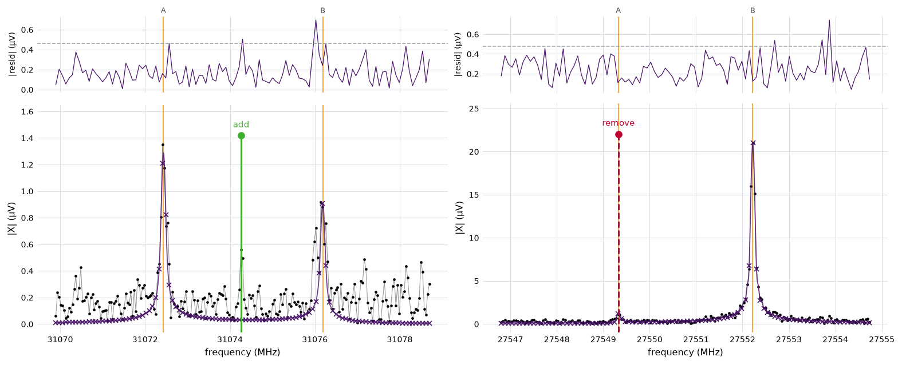

.. index::
   single: curation
   single: curation file
   single: curation cart
   single: HTML report
   single: report
   single: batch editing
   single: review apply

Fit Curation
============

The pipeline through :doc:`Stage 6 <stage6_review>` produces a fitted line list
and renders it as a self-contained report. Curation is the act of correcting
that fit (adding a line the detector missed, removing a spurious one,
adjudicating a blend) and folding the corrections back into the ``.ftmw`` file.
The Stage 6 page covers the individual edit verbs and the rule that binds them:
every edit re-runs the affected window's nonlinear least-squares fit, so a
curated line is fit as honestly as an automatic one, and each decision is
recorded with its provenance.

This page documents the two surfaces built for curating at production scale,
where a spectrum may carry hundreds of windows and thousands of lines: the
portable HTML report a reader works through in a browser, and the curation file
that batches a session of edits into one reproducible command.

Anatomy of the HTML report
--------------------------

``report run`` writes one portable ``<stem>_report.html``. It is assembled
internally as a set of linked pages, then folded into a single document with the
stylesheet inlined and every figure base64-embedded, so the cross-page links
become in-document anchors. The result has no external dependencies: it opens in
any browser, archives beside the ``.ftmw`` file, and mails to a collaborator as
a single attachment, with no server and no asset directory.

The report carries three kinds of content:

- **An index.** A summary block (the experiment's calibration state, line count,
  and worklist tally), a clickable full-spectrum overview with the
  attention-flagged windows shaded, a windows table, an **applied-edits** table
  when the file already carries curation decisions (see below), and the finalized
  line list.
- **A methods-and-results page.** The per-stage algorithm prose with this
  experiment's own numbers folded in, a diagnostic figure for each stage —
  including the Stage 3 detections drawn over both the active FT and the
  primary-pass (Blackman-Harris) detection spectrum the detector localizes on,
  so a leakage-dominated regime is legible — distribution histograms of the
  fitted parameters, and rendered display math.
- **One page per fit window.** The fit panels (real, imaginary, and magnitude
  data with the model and residuals), the fitted lines with their raw and
  calibrated frequencies, the parameter covariance, the candidate ledger, the
  recorded decisions, and the fit history. Where a window carries an attention
  flag with a definite locus, the magnitude panel is annotated with a small
  caret and one-letter tag at that frequency — **C** for a missed-line
  (candidate) residual, **S** for a line sitting on a gated spur, **M** for an
  auto-merged pair — so it is obvious *where* to look; hover the caret for the
  reason detail.

The single-file report carries a sticky navigation bar. Besides the section
links and the **Jump to window** picker, a **Freq MHz** box jumps to the window
nearest a typed frequency, and a pair of **window** buttons step to the previous
/ next window. Keyboard shortcuts mirror these: ``j`` / ``k`` move to the next /
previous window. Both the buttons and the keys skip windows hidden by the tag
filter, so the filter selects which window types you step through. The controls
are inert when scripting is disabled; the anchors still work. Each window's own
title bar also carries **index** / prev / next buttons and a **Full spectrum**
toggle that reveals — hidden by default — the clickable full-spectrum overview
inside the window header, with this window highlighted.

Each window header carries a row of **tag chips** classifying the window at a
glance — ``attention`` (in the review queue), ``edited`` / ``reviewed`` (its
curation provenance), ``cascade-edit`` (changed only because another window's
edit propagated into it), ``merged`` (an auto-merged degenerate pair),
``high-χ²ᵣ`` / ``high-ε`` (fit-quality outliers), and ``catalog-match`` (a
catalog hit, when a catalog was supplied). A **Filter** menu in the navigation
bar lists the tags present in the report; ticking one or more hides every window
whose tags do not include any of the ticked ones (``Show all`` clears the
filter). The keyboard and window-step navigation skip the hidden windows while a
filter is active.

Three flags scope the output for large spectra, where rendering a detail page
for every window is neither fast nor useful:

- ``--summary`` keeps the index and the methods page only, with no per-window
  detail.
- ``--windows attention`` renders detail pages only for the windows the review
  flagged, so a spectrum with thousands of windows still produces a report sized
  to the analyst's worklist.
- ``--level1-only`` writes the data table alone, with no HTML; ``--no-table``
  writes the HTML alone.

.. code-block:: console

   $ ftmwpipeline report run exp_2638.ftmw
   report run: wrote table to exp_2638_lines.csv
   report run: wrote self-contained full HTML report to exp_2638_report.html

Curating in the browser
-----------------------

The report opens **read-only**. A ``Curate`` toggle in the navigation bar flips
it into curation mode, revealing an inline control on each fitted-line and
candidate-ledger row and making the per-window plots clickable. Every control
only *queues* an edit; nothing edits the ``.ftmw`` file from the page. Queued
edits collect in a docked **cart**, grouped by window, and each one draws a
marker on its window plot, color-coded by action and removable with a click:

   The report's own magnitude panels for two windows, overlaid with a curation
   cart exported from the browser (the marker colors match the in-report
   controls). Each panel shows the fitted model on the display grid above a
   residual strip, with the per-peak labels the report assigns. Add and remove
   are the cart's whole grammar. On the left window, an **add** (green, solid)
   seeds a line the detector missed in the gap between two faint fitted lines;
   on the right, a **remove** (red, dashed) drops an SNR 5.2 line the reviewer
   declines to claim, well away from the window's bright line. The markers are
   queued intentions, not yet applied: exporting the cart writes them to a
   curation file that ``review apply`` refits.

The cart's **Download .csv** and **Copy** controls export the queued edits as a
**curation file** (``<stem>_curation.csv``) and print the ``review apply``
command that replays it. The frequency a control emits is the line's raw
Stage 5 model frequency, the value the edit verbs match on, not the calibrated
value shown in the table. The browser never writes to the file; it only composes
the curation file that the command-line tool applies.

Several convenience controls speed a long worklist. Each window's title bar
carries **Mark reviewed**, **Reviewed & next** (marks it reviewed and advances to
the next window, honouring the tag filter), and **Clear window edits** (drops just
that window's queued ops); the index windows table gains a per-row **reviewed**
button, in its own column on attention windows, so they can be triaged from the
overview without scrolling to each. Marking a window reviewed (from either place)
also clears its attention tint from the overview, and the two buttons stay in
sync. A cart entry is clickable — it scrolls to its originating window and flashes
the row. In curation mode the
magnitude plots take keyboard shortcuts that act on the peak nearest the pointer,
mirroring click-to-add: hover the plot near a line, then press ``r`` to remove
it; ``a`` arms (and disarms) click-to-add on that plot. The affected line flashes
and its marker appears on the plot. The cart lists these keys for reference.

There is no separate split or merge control, in the row, on the plot, or on the
keyboard: the cart's whole grammar is add and remove. Clicking a point on the
armed plot near an existing line queues an add there, and that add reads as a
split of the line once ``review apply`` runs it (see :ref:`stage6-edit` on the
Stage 6 page) — which is deliberately the common path, since a reader will more
often point at a plot than type a frequency. Checking two close lines' rows and
removing both, then adding one frequency in their span, reads as a merge the
same way.

Applied edits and rollback
--------------------------

When a report is generated from a ``.ftmw`` that already carries curation edits,
the index lists them in an **Applied edits** table — the file's recorded decision
log, in execution order, with each edit's window, action, and frequency anchor.
This is a read-only record of the file's curation state and is always shown. In
curation mode each row gains an **Undo** button; queuing one does not enter the
curation file (a rollback is a different operation) but instead makes the cart
surface a ``review undo`` command alongside the ``review apply`` one:

.. code-block:: console

   ftmwpipeline review undo exp_2638.ftmw --id 3 5

``review undo`` restores the automatic-fit baseline snapshot and replays every
surviving decision, so undoing by id is exact and order-independent; the ids
shown in the table are the ones to pass.

Curation files
--------------

A curation file is a small CSV that records an ordered sequence of edits, one
per row. It is the canonical interchange for a curation session: diffable,
hand-editable, and independent of the report that may have authored it. The
browser cart writes one, and a curation file is equally well written by hand or
generated by a script.

The header is ``action,window,freqs,params``. Each row names one action, the
integer ``window`` id it targets, the molecular frequencies it carries (a
``;``-separated list, in MHz), and any ``;``-separated ``key=value`` modifiers.
Blank lines and lines beginning with ``#`` are ignored, and a leading header row
is optional.

.. list-table::
   :header-rows: 1
   :widths: 14 14 40 32

   * - ``action``
     - ``freqs``
     - Effect
     - ``params``
   * - ``add``
     - one
     - Revive the nearest ledger candidate within tolerance, or seed a fresh
       line at the frequency.
     - none
   * - ``remove``
     - one
     - Drop the fitted line nearest the frequency.
     - none
   * - ``accept``
     - none
     - Dismiss the window as reviewed with no change, or revive a named
       candidate.
     - ``candidate=F`` to revive

``merge`` and ``split`` are **not** row actions -- a file naming either is
refused, at parse time, before anything is touched. Both are read from what an
``add``/``remove`` combination does to a window's peak set, not typed:

- An ``add`` within snap tolerance of a fitted peak that is **not itself being
  removed** is applied as a **split** of that peak into two, seeded at (the
  existing peak's position, the requested position).
- Removing two or more mutually-close fitted peaks (within snap tolerance of
  each other -- the components of one feature) while adding exactly one
  frequency inside their span is applied as a **merge**, seeded at the
  requested frequency (or at a recorded doublet-alternative seed, when the
  removed pair matches one).

The decision log records which reading was used (``kind="split"``/``"merge"``)
and stamps the frequency that was requested, so the log reports the
reinterpretation rather than hiding it. See :ref:`stage6-edit` on the Stage 6
page for the exact rule.

A representative curation file:

.. code-block:: text

   action,window,freqs,params
   remove,42,26613.6131,
   add,42,26614.20,
   remove,17,9001.100,
   add,5,12000.4875,
   remove,17,9001.130,
   add,17,9001.115,
   accept,8,,candidate=15001.4

Window 42's ``add`` seeds a fresh line clear of its other peaks, an ordinary
add. Window 5's ``add`` is unrelated, interleaved between window 17's rows.
Window 17's two ``remove`` rows and its ``add`` between them remove a pair of
lines 30 kHz apart -- mutually inside a 49.4 kHz snap tolerance, so the two
components of one feature -- and add one frequency in their span, which is read
as a merge. The interleaved window 5 row does not break that run, because
coalescing tracks each window independently.

Edits on one window are **coalesced** before they are applied. A maximal run of
``add`` and ``remove`` rows on one window collapses into a single refit rather
than one refit per row, so the two rows for window 42 become one edit, the
three (non-adjacent) rows for window 17 become one edit, and window 5's row
becomes its own edit -- three edits from six add/remove rows. An ``accept``
(or ``create``) on a window flushes that window's pending edit first, since
it changes the file in its own right; a plain add/remove never does, even
when curation-intent inference will read the coalesced result as a split or a
merge once the batch actually runs.

Applying a curation file
------------------------

``review apply`` executes a curation file's resolved plan as a single batch. It
loads the Stage 5 fit and builds the active-FT fit context once, applies every
action to that fit in memory, cascades the dependents of all directly-edited
windows in one combined pass, and persists the result once. Nothing is written
until every action has succeeded, so a plan that fails partway through leaves
the file untouched.

A curated file therefore holds only two states: the base it started from — the
automatic fit, or the automatic baseline when ``review undo`` is replaying onto
it — and the revised state the whole edit set produces. The set is applied in
one canonical order rather than the order the rows happen to be written in.
``create`` rows run first, since they install the structure later rows name, and
the remaining actions run grouped by ascending window id. Within a single window
the specified order is preserved, because an ``accept`` composes on the peak set
a preceding coalesced add/remove group left behind. Two curation files listing
the same per-window edits in different row orders reach the same fitted state
and the same decision log.

That end state is what the guarantee covers. The batch reproduces the *result*
of running the resolved plan by hand, not its sequence of intermediate refits;
and because an edit changes the leakage skirt its neighbors froze, the peaks of
one edit are not guaranteed to land where they would have had that edit been
applied on its own. Edits are reproducible together, not independent of each
other.

``--dry-run`` prints the resolved, coalesced plan in the file's own row order,
along with any frequency-resolution warnings, without touching the file. The
plan is pre-inference — every coalesced add/remove group prints as ``edit``,
even one that will read as a split or a merge once the batch actually runs, so
this preview shows what was typed, not yet the reinterpretation:

.. code-block:: console

   $ ftmwpipeline review apply exp_2638.ftmw exp_2638_curation.csv --dry-run
   review apply (dry run): resolved plan
       1. edit window 42: add 26614.2000; remove 26613.6131
       2. edit window 17: add 9001.1150; remove 9001.1000, 9001.1300
       3. edit window 5: add 12000.4875
       4. accept window 8: candidate 15001.4000
   4 action(s) would be applied (nothing written).

The warnings catch the ways an action fails to resolve against the file. For
``remove`` that is the target frequency: one that matches no fitted peak within
tolerance (the edit would fail), or one that sits within tolerance of more than
one peak (the nearest is taken, which may not be the intended line). An ``add``
creates its peak and so has no target to match, but it does name a *window*,
and that is what goes stale — window ids are
reassigned whenever Stage 4 re-plans, and a plan window whose peaks all failed
their Stage 5 gate carries no fit to edit at all. So an ``add`` is checked for
the two conditions the refit will enforce: the window is live, and the frequency
lies on its data (with the snap tolerance allowed as slack, so only an add that
cannot land however it snaps is flagged). An ``add`` into a window a ``create``
in the same file installs is left to the apply, since its geometry does not
exist yet. Revived candidates are not checked: the window's own ledger supplies
the frequency.

Previewing all of this before the refit is the reason ``--dry-run`` exists — but
the preview is advisory, not a gate. The apply is what enforces; it just does so
without writing anything unless every action succeeds.

Dropping ``--dry-run`` applies the plan, refitting each affected window in place:

.. code-block:: console

   $ ftmwpipeline review apply exp_2638.ftmw exp_2638_curation.csv
   review apply: plan
       1. edit window 42: add 26614.2000; remove 26613.6131
       ...
   applied 4 action(s).

Each applied edit appends an anchored entry to the
:ref:`Stage 6 decision log <stage6-decisions>`, exactly as the interactive verbs
do, so a curation file's effects carry their provenance and survive re-running
an upstream stage. This is where a split or merge reading actually shows up —
the plan printed above and by ``--dry-run`` is pre-inference, but ``review
log`` afterward reports window 17's coalesced edit as ``kind=merge`` and
window 5's as ``kind=split``, each with the frequency that was requested. The
same Python entry points are available on the functional API and the
``Pipeline`` class:

.. code-block:: python

   import ftmwpipeline.api as ftmw

   preview = ftmw.review_apply("exp_2638.ftmw", "exp_2638_curation.csv", dry_run=True)
   for action in preview.plan:
       print(action.kind, action.window_id)
   print(preview.warnings)

   result = ftmw.review_apply("exp_2638.ftmw", "exp_2638_curation.csv")
   print(result.applied)   # number of actions refit
