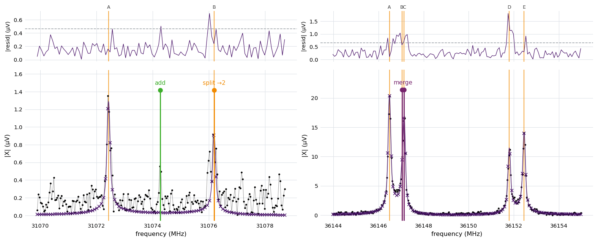

.. index::
   single: curation
   single: curation file
   single: curation cart
   single: HTML report
   single: report
   single: batch editing
   single: review apply

Fit Curation
============

The pipeline through :doc:`Stage 6 <stage6_review>` produces a fitted line list
and renders it as a self-contained report. Curation is the act of correcting
that fit (adding a line the detector missed, removing a spurious one,
adjudicating a blend) and folding the corrections back into the ``.ftmw`` file.
The Stage 6 page covers the individual edit verbs and the rule that binds them:
every edit re-runs the affected window's nonlinear least-squares fit, so a
curated line is fit as honestly as an automatic one, and each decision is
recorded with its provenance.

This page documents the two surfaces built for curating at production scale,
where a spectrum may carry hundreds of windows and thousands of lines: the
portable HTML report a reader works through in a browser, and the curation file
that batches a session of edits into one reproducible command.

Anatomy of the HTML report
--------------------------

``report run`` writes one portable ``<stem>_report.html``. It is assembled
internally as a set of linked pages, then folded into a single document with the
stylesheet inlined and every figure base64-embedded, so the cross-page links
become in-document anchors. The result has no external dependencies: it opens in
any browser, archives beside the ``.ftmw`` file, and mails to a collaborator as
a single attachment, with no server and no asset directory.

The report carries three kinds of content:

- **An index.** A summary block (the experiment's calibration state, line count,
  and worklist tally), a clickable full-spectrum overview with the
  attention-flagged windows shaded, a windows table, an **applied-edits** table
  when the file already carries curation decisions (see below), and the finalized
  line list.
- **A methods-and-results page.** The per-stage algorithm prose with this
  experiment's own numbers folded in, a diagnostic figure for each stage —
  including the Stage 3 detections drawn over both the active FT and the
  primary-pass (Blackman-Harris) detection spectrum the detector localizes on,
  so a leakage-dominated regime is legible — distribution histograms of the
  fitted parameters, and rendered display math.
- **One page per fit window.** The fit panels (real, imaginary, and magnitude
  data with the model and residuals), the fitted lines with their raw and
  calibrated frequencies, the parameter covariance, the candidate ledger, the
  recorded decisions, and the fit history. Where a window carries an attention
  flag with a definite locus, the magnitude panel is annotated with a small
  caret and one-letter tag at that frequency — **C** for a missed-line
  (candidate) residual, **S** for a line sitting on a gated spur, **M** for an
  auto-merged pair, **E** for a Stage 3 peak in a window the fit left empty — so
  it is obvious *where* to look; hover the caret for the reason detail.

  A window the review flags ``empty_window_residual`` or ``empty_window_spur``
  (the fit holds no line in it, yet Stage 5 measured a coherent residual on its
  edge; see :doc:`stage6_review`) has no fit of its own, but still gets a page
  (under ``--windows attention`` only when it is queued, as for any advisory
  window): its data on
  the window's range in the same panels (with nothing fitted, the residual strip
  is the data), the Stage 3 peaks the plan put there with their SNR and the
  gated spur each sits on, if any, and how to act on it. The page has no add control,
  since an add names a window the fit holds: create a window at the line and add
  it there, or mark the window reviewed.

The single-file report carries a sticky navigation bar. Besides the section
links and the **Jump to window** picker, a **Freq MHz** box jumps to the window
nearest a typed frequency, and a pair of **window** buttons step to the previous
/ next window. Keyboard shortcuts mirror these: ``j`` / ``k`` move to the next /
previous window. Both the buttons and the keys skip windows hidden by the tag
filter, so the filter selects which window types you step through. The controls
are inert when scripting is disabled; the anchors still work. Each window's own
title bar also carries **index** / prev / next buttons and a **Full spectrum**
toggle that reveals — hidden by default — the clickable full-spectrum overview
inside the window header, with this window highlighted.

Each window header carries a row of **tag chips** classifying the window at a
glance — ``attention`` (in the review queue), ``edited`` / ``reviewed`` (its
curation provenance), ``cascade-edit`` (changed only because another window's
edit propagated into it), ``merged`` (an auto-merged degenerate pair),
``high-χ²ᵣ`` / ``high-ε`` (fit-quality outliers), and ``catalog-match`` (a
catalog hit, when a catalog was supplied). A **Filter** menu in the navigation
bar lists the tags present in the report; ticking one or more hides every window
whose tags do not include any of the ticked ones (``Show all`` clears the
filter). The keyboard and window-step navigation skip the hidden windows while a
filter is active.

Three flags scope the output for large spectra, where rendering a detail page
for every window is neither fast nor useful:

- ``--summary`` keeps the index and the methods page only, with no per-window
  detail.
- ``--windows attention`` renders detail pages only for the windows the review
  flagged, so a spectrum with thousands of windows still produces a report sized
  to the analyst's worklist.
- ``--level1-only`` writes the data table alone, with no HTML; ``--no-table``
  writes the HTML alone.

.. code-block:: console

   $ ftmwpipeline report run exp_2638.ftmw
   report run: wrote table to exp_2638_lines.csv
   report run: wrote self-contained full HTML report to exp_2638_report.html

Curating in the browser
-----------------------

The report opens **read-only**. A ``Curate`` toggle in the navigation bar flips
it into curation mode, revealing an inline control on each fitted-line and
candidate-ledger row and making the per-window plots clickable. Every control
only *queues* an edit; nothing edits the ``.ftmw`` file from the page. Queued
edits collect in a docked **cart**, grouped by window, and each one draws a
marker on its window plot, color-coded by action and removable with a click:

   The report's own magnitude panels for two windows, overlaid with a curation
   cart exported from the browser (the marker colors match the in-report
   controls). Each panel shows the fitted model on the display grid above a
   residual strip, with the per-peak labels the report assigns. Add and remove
   are the cart's whole grammar. On the left window, an **add** (green, solid)
   seeds a line the detector missed in the gap between two faint fitted lines;
   on the right, a **remove** (red, dashed) drops an SNR 5.2 line the reviewer
   declines to claim, well away from the window's bright line. The markers are
   queued intentions, not yet applied: exporting the cart writes them to a
   curation file that ``review apply`` refits.

The cart's **Download .csv** and **Copy** controls export the queued edits as a
**curation file** (``<stem>_curation.csv``) and print the ``review apply``
command that applies it. A **remove** exports the line's ``peak_uid`` as a
``uid:N`` token, which names that peak exactly rather than by proximity: a
neighboring line inside the snap tolerance cannot be matched instead, and the
frame does not enter into it. Everything else a control emits -- an **add**, and
a **remove** on a fit predating ``peak_uid`` -- is the line's raw Stage 5 model
frequency, the value the edit verbs match on, not the calibrated value shown in
the table; the exported file declares that frame in its own ``# frame:`` header.
The browser never writes to the file; it only composes the curation file that
the command-line tool applies.

Several convenience controls speed a long worklist. Each window's title bar
carries **Mark reviewed**, **Reviewed & next** (marks it reviewed and advances to
the next window, honoring the tag filter), and **Clear window edits** (drops just
that window's queued ops); the index windows table gains a per-row **reviewed**
button, in its own column on attention windows, so they can be triaged from the
overview without scrolling to each. Marking a window reviewed (from either place)
also clears its attention tint from the overview, and the two buttons stay in
sync. A cart entry is clickable — it scrolls to its originating window and flashes
the row. In curation mode the
magnitude plots take keyboard shortcuts that act on the peak nearest the pointer,
mirroring click-to-add: hover the plot near a line, then press ``r`` to remove
it; ``a`` arms (and disarms) click-to-add on that plot. The affected line flashes
and its marker appears on the plot. The cart lists these keys for reference.

There is no separate split or merge control, in the row, on the plot, or on the
keyboard: the cart's whole grammar is add and remove. Clicking a point on the
armed plot near an existing line queues an add there, and that add reads as a
split of the line once ``review apply`` runs it (see :ref:`stage6-edit` on the
Stage 6 page) — which is deliberately the common path, since a reader will more
often point at a plot than type a frequency. Checking two close lines' rows and
removing both, then adding one frequency in their span, reads as a merge the
same way.

Applied edits and rollback
--------------------------

When a report is generated from a ``.ftmw`` that already carries curation edits,
the index lists them in an **Applied edits** table — the file's recorded decision
log, in execution order, with each edit's window, action, and frequency anchor.
This is a read-only record of the file's curation state and is always shown. In
curation mode each row gains an **Undo** button; queuing one does not enter the
curation file (a rollback is a different operation) but instead makes the cart
surface a ``review undo`` command alongside the ``review apply`` one:

.. code-block:: console

   ftmwpipeline review undo exp_2638.ftmw --id 2 3

``review undo`` restores the automatic-fit baseline snapshot and replays every
surviving decision onto it in log order, one user action at a time (the
entries of one multi-line edit replay jointly), so any decisions can be undone,
not only the latest; the ids shown in the table are the ones to pass, and the
surviving decisions are renumbered afterwards (see :ref:`stage6-decisions`).

.. _curation-frames:

Frames: which frequency you are typing
--------------------------------------

Every curation verb resolves a frequency you supply against the lines already
in the file. That only works if both sides agree on what the number *means*,
and there are two frequencies for every line:

``raw``
   The frame the Stage 5 fit, the Stage 3 candidate ledger, and every persisted
   value (the decision log, created windows) live in. Values are stored raw
   permanently, because ``epsilon`` is recomputable and a stored calibrated
   value would silently change meaning after a timebase re-run.

``calibrated``
   ``f_corr = probe + (f_raw - probe) / (1 + eps)`` — the frame the final
   products table and the reports present.

Every frequency-bearing entry point across the three interfaces — ``add`` /
``remove``, ``accept``'s ``candidate_freq``, ``create``'s anchor, and a curation
file's frequencies — takes a ``frame`` argument of type
:data:`~ftmwpipeline.core.curation.Frame`, defaulting to ``"raw"``:

.. code-block:: python

   import ftmwpipeline.api as ftmw

   # The same line of exp_2638, named in each frame
   ftmw.review_edit("exp_2638.ftmw", 5, remove=[26879.5009], frame="raw")
   ftmw.review_edit("exp_2638.ftmw", 5, remove=[26879.5317], frame="calibrated")

On an ``rb_locked`` or ``uncalibrated`` file ``epsilon`` is ``0.0``, the two
frames coincide, and ``frame`` is inert. On a ``self_calibrated`` file it is
not — and the failure is a quiet one. A calibrated frequency submitted as raw
still resolves, and to the *right* peak, but seeds or anchors it wrong by the
difference between the frames, ``|f - probe| * eps/(1 + eps)`` (the line's
baseband offset times ``epsilon``): under the snap tolerance, so it matches,
and over the statistical σ, so the error shows up in the result without ever
announcing itself.

The two numbers above are 30.8 kHz apart, on a file whose snap tolerance is
49.1 kHz (``epsilon`` = 2.19 × 10⁻⁶, probe 40960 MHz, lower sideband, so this
line sits 14080 MHz from the probe). Submitting the calibrated one as raw finds
the same line — and then seeds it 30.8 kHz off.

Because that mistake is invisible, **omitting ``frame`` on a frequency-bearing
call is a hard error on a ``self_calibrated`` file** rather than a silent
assumption:

.. code-block:: text

   BadSettingError: frame is required on a self_calibrated file: pass
   frame="raw" or frame="calibrated" explicitly rather than relying on the
   default. ...

The refusal is ``bad_setting`` (``BadSettingError``, also a ``ValueError``),
with ``path`` ``frame`` for a call or a curation file and ``actions[<i>].frame``
for the i-th action of an ``actions=`` batch.
Passing ``frame="raw"`` explicitly is never an error on any file, so a script
that always declares its frame works everywhere. Use
:func:`~ftmwpipeline.api.frequency_calibration` (or ``ftmwpipeline timebase
state``) to read a file's calibration state and epsilon before deciding.

A curation file declares its frame in the file itself, since it is the one
place a calibrated frequency becomes a durable artifact — see
:ref:`curation-file-header` below.

One further safety net applies to a whole batch. If a plan's targets all
resolve with a residual matching what *this* file's epsilon predicts for an
omitted conversion — at least three matched targets, all displaced the same
direction, each within 25 % of the predicted offset — ``review apply`` and
``review preview`` emit an advisory naming the suspicion. Only targets
submitted in the raw frame are judged: a calibrated file is never diagnosed,
and a batch of ``CurationAction`` objects is judged action by action, so its
raw actions are still checked when others in the batch are calibrated. It never
blocks anything: it is a heuristic, and a heuristic that refused would be worse
than none.

.. _curation-snap-tolerance:

The snap tolerance
------------------

A ``remove`` does not need the exact fitted frequency, and an ``add`` beside an
existing line is read as a split of it. Both readings are governed by one
constant, the **snap tolerance** — and it is defined in **active-FT bins**, not
in MHz:

.. code-block:: console

   $ ftmwpipeline review snap-tolerance exp_2638.ftmw
   snap tolerance: 0.049097 MHz (49.1 kHz)
     0.625 active-FT bins @ df = 0.078555 MHz
     T_active = 12.73000 us

:data:`~ftmwpipeline.core.curation.REFIT_SNAP_TOL_BINS` is ``0.625`` bins, so
the frequency it works out to is a property of one file rather than a fixed
number: ~49 kHz at a 12.7 µs acquisition, but ~6.3 kHz at 100 µs. There is no
such thing as "the" snap tolerance in MHz.

**Read the resolved value; do not multiply the bin count by a spacing of your
own.** Three reads give the same answer, all derived from the same active
region the curation verbs themselves consult:

.. code-block:: python

   import ftmwpipeline.api as ftmw
   from ftmwpipeline import Pipeline

   ftmw.refit_snap_tol_mhz("exp_2638.ftmw")            # -> 0.049097...
   Pipeline.open("exp_2638.ftmw").refit_snap_tol_mhz()  # the same value

``ftmwpipeline review snap-tolerance --format json`` returns the same values
plus the bin count, bin spacing, and ``T_active`` for a script to record.

Within the tolerance a requested frequency resolves to the **nearest** fitted
peak or ledger candidate; beyond it, ``remove`` is a hard error naming the
closest peak and its distance, while ``add`` seeds a fresh line at the typed
frequency — which is what a genuine new line wants anyway. The tolerance is
deliberately looser than the 0.25-bin candidate-dedup window, so two fitted
peaks *can* both fall inside it; that is resolved nearest-wins, and
``review apply --dry-run`` reports the multi-match as an advisory so the
ambiguity is visible before the batch runs. Addressing the line by
``uid:N`` instead sidesteps the question entirely.

The tolerance is a property of the file, not of a call: no verb, batch or
replay takes one of its own. The decision log records no tolerance, so a value
given to one edit would read that edit differently when ``review undo`` or a
log-prefix apply replays it. To reach a peak farther from the frequency you
have, name it by ``uid:N`` or by the fitted frequency ``review show`` prints.

Curation files
--------------

A curation file is a small CSV that records an ordered sequence of edits, one
per row. It is the canonical interchange for a curation session: diffable,
hand-editable, and independent of the report that may have authored it. The
browser cart writes one, and a curation file is equally well written by hand or
generated by a script.

The header is ``action,window,freqs,params``. Each row names one action, the
integer ``window`` id it targets, the molecular frequency it carries (in MHz),
and any ``;``-separated ``key=value`` modifiers. Blank lines and lines
beginning with ``#`` are ignored, and a leading header row is optional.

On an ``add`` or ``remove`` row, the ``window`` column is optional: leave it
blank (or write ``new``, ``auto``, or ``-``) and the window is derived from
the row's own frequency (or ``uid:N``, below) instead of named -- the live
window whose range covers it, since windows never overlap. A ``remove`` whose
frequency (or ``uid:N``) no live window covers is an error naming it, rather
than a silent do-nothing: ``remove`` never implies creating a window, since
there is nothing there to remove. An ``add`` whose frequency no live window
covers instead **mints the window it needs** (or widens an adjacent one, when
the gap is too narrow to hold a new one) and applies the add into it --
exactly what a separate ``review create`` row followed by an ``add`` row
would produce, except recorded as the ONE decision the user actually made
rather than two: the create is a mechanism the engine chose, not something the
user decided. This only fires when the ``window`` column was OMITTED; naming a
window explicitly is still an assertion, and naming one whose range does not
cover the row's frequency is still an error even if some other live window
would have. A run of several omitted-window rows that resolve to the same
EXISTING live window still coalesces into one edit, exactly as a run of
explicitly-named rows does. Two omitted-window ``add`` rows in the same
window-free gap each imply their own create when resolved independently, but
within one plan the second is checked against the window the first one's
create is about to install: if that window would already cover the second
row's frequency, no second window is minted -- the second row instead becomes
an ordinary ``add`` into the window the first row's create just built, giving
the same one-window, two-decision outcome as running the two edits
sequentially. Two rows whose frequencies land in different gaps (or too far
apart in the same gap to share one window) still each get their own create.
``accept`` and ``create`` still require the window column: there it names the
window being acted on (or, for ``create``, may take the same blank/``new``/
``auto``/``-`` tokens to mean "mint a new one"), not a coordinate derived from
a frequency.

A ``remove`` row may name its target by identifier instead of by frequency,
writing ``uid:N`` for the line whose
:attr:`~ftmwpipeline.core.data_structures.FittedPeak.peak_uid` is ``N`` --
``remove,117,uid:12402900,`` (the 31216.9682 MHz line of ``exp_2638``). That names the line exactly rather than by
proximity, so a neighbor inside the snap tolerance cannot be matched instead
and the file's frame does not enter into it. The browser cart writes this form;
the identifier is also the ``peak_uid`` column of ``report table``. Every other
action is frequency-only, and a ``uid:N`` token elsewhere is refused at parse
time -- an identifier names a line that already exists, and ``add``,
``create`` and ``accept``'s ``candidate=`` all name one that does not.

.. list-table::
   :header-rows: 1
   :widths: 14 14 40 32

   * - ``action``
     - ``freqs``
     - Effect
     - ``params``
   * - ``add``
     - one
     - Revive the nearest ledger candidate within tolerance, or seed a fresh
       line at the frequency.
     - none
   * - ``remove``
     - one
     - Drop the fitted line nearest the frequency, or -- given a ``uid:N``
       token instead of a frequency -- the line carrying that ``peak_uid``.
     - none
   * - ``accept``
     - none
     - Dismiss the window as reviewed with no change, or revive a named
       candidate.
     - ``candidate=F`` to revive

.. _curation-file-header:

Declaring the file's frame
~~~~~~~~~~~~~~~~~~~~~~~~~~

A curation file is the one place a calibrated frequency becomes a **durable**
artifact — everywhere else ``frame`` is a per-call argument that leaves no
trace. So the file declares its own frame, as a whole-line comment anywhere in
it:

.. code-block:: text

   # frame: raw
   action,window,freqs,params
   remove,5,26879.5009,

A ``# frame:`` directive declares the frame every frequency in that file is
expressed in, which is what makes the file self-describing: it can be mailed to
a colleague, committed to a repository, or applied a year later without the
frame having to be remembered separately. The browser cart writes
``# frame: raw`` for exactly this reason, and a file carrying the directive
needs no ``frame`` argument even on a ``self_calibrated`` file.

The header and the ``frame`` argument do not override one another. Whichever is
given alone decides; if both are given and **disagree**, the apply refuses
rather than picking a winner, naming both. Both directives are optional — a
file with no header falls back to the ordinary per-call resolution described in
:ref:`curation-frames`.

When the frame is ``calibrated``, the file **must** also stamp the epsilon it
was written under:

.. code-block:: text

   # frame: calibrated
   # epsilon: 2.2e-6

That stamp is what lets a later apply or preview notice that the calibration
has moved — a timebase re-run, say — and refuse rather than silently resolving
against the wrong peaks:

.. code-block:: text

   BadSettingError: curation file frame drift: this file was staged
   frame=calibrated at epsilon=2.200000e-06, but the target file's current
   epsilon is 2.190879e-06. The calibration has changed since this file was
   written (e.g. a timebase re-run) -- re-stage the curation file against the
   current calibration rather than applying it as-is.

The refusal is ``bad_setting`` whose ``path`` is the stamp's own line,
``curation[line 2].epsilon``.

``# epsilon:`` without ``# frame: calibrated`` is rejected at parse time: an
epsilon stamp is meaningless with no calibrated-frame declaration to attach it
to.

Inferred actions
~~~~~~~~~~~~~~~~

``merge`` and ``split`` are **not** row actions -- a file naming either is
refused, at parse time, before anything is touched. Both are read from what an
``add``/``remove`` combination does to a window's peak set, not typed:

- An ``add`` within snap tolerance of a fitted peak that is **not itself being
  removed** is applied as a **split** of that peak into two, seeded at (the
  existing peak's position, the requested position).
- Removing two or more mutually-close fitted peaks (within snap tolerance of
  each other -- the components of one feature) while adding exactly one
  frequency inside their span is applied as a **merge**, seeded at the
  requested frequency (or at a recorded doublet-alternative seed, when the
  removed pair matches one).

The decision log records which reading was used (``kind="split"``/``"merge"``)
and stamps the frequency that was requested, so the log reports the
reinterpretation rather than hiding it. See :ref:`stage6-edit` on the Stage 6
page for the exact rule.

A representative curation file, written against ``exp_2638`` (saved as
``exp_2638_curation.csv``):

.. code-block:: text

   # frame: raw
   action,window,freqs,params
   remove,117,31216.9682,
   add,249,36848.5529,
   add,117,31214.36,
   accept,188,,candidate=34155.13

Window 117's rows remove a weak (SNR 6.7) line and add one at the window's
residual candidate, 31214.36 MHz, which lies 161 kHz from the nearest fitted
line — beyond the 49.1 kHz snap tolerance, so it is an ordinary add. Window
249 carries the ``auto_merged_review`` advisory: Stage 5 merged a degenerate
pair there into the line at 36848.5433 MHz. The add at 36848.5529 MHz lies
9.6 kHz from that line, inside the snap tolerance, so it is read as a **split**
of it — the re-split the advisory invites. Window 188's ``accept`` revives its
ledger candidate at 34155.13 MHz.

There is no merge in this file because ``exp_2638`` offers none: Stage 5
already merges every pair of lines closer than the snap tolerance, so no window
holds two fitted lines within 49.1 kHz of each other. On a fit that does, a
merge is written as two ``remove`` rows for the pair and one ``add`` in their
span, on the same window.

Edits on one window are **coalesced** before they are applied. A maximal run of
``add`` and ``remove`` rows on one window collapses into a single refit rather
than one refit per row, and the run tracks each window independently, so window
249's row between them does not break window 117's run: the two rows for window
117 become one edit and window 249's row its own edit — two edits from three
add/remove rows. An ``accept`` (or ``create``) on a window flushes that window's
pending edit first, since it changes the file in its own right; a plain
add/remove never does, even when curation-intent inference will read the
coalesced result as a split or a merge once the batch actually runs.

.. _curation-as-data:

Curation as data
~~~~~~~~~~~~~~~~

A program does not have to write a CSV to curate. ``review_apply`` and
``review_preview`` take ``actions=``, a sequence of
:class:`~ftmwpipeline.CurationAction`, in place of the curation-file path. Each
action is one curation-file row, typed:

.. code-block:: python

   from ftmwpipeline import CurationAction, Pipeline

   actions = [
       CurationAction("remove", peak_uid=12402900),       # remove,auto,uid:12402900,
       CurationAction("add", freq_mhz=31214.36),          # add,auto,31214.36,
       CurationAction("accept", window_id=188),           # accept,188,,
       CurationAction("create", freq_mhz=30719.94),       # create,new,30719.94,
   ]
   result = Pipeline.open("exp_2638.ftmw").review_apply(actions=actions, frame="raw")

The fields are ``action`` (``add``, ``remove``, ``accept`` or ``create``),
``window_id``, ``freq_mhz``, ``peak_uid``, ``candidate_mhz``, ``frame`` and
``epsilon``. A
``window_id`` of ``None`` means "derive it" on ``add`` / ``remove`` (the file's
``auto``) and "a new window" on ``create``; ``accept`` needs one. Construction
checks what the parser checks of a row -- one frequency, or one ``peak_uid`` on
``remove``; no frequency on ``accept``; no ``peak_uid`` outside ``remove``; no
``candidate_mhz`` outside ``accept`` -- and refuses with a ``BadSettingError``
whose ``path`` names the field.

**Each action carries its own frame.** ``frame=None`` takes the call's
``frame=``; when both are ``None``, the usual rule applies to that action --
raw on a file whose ``epsilon`` is 0, refused on a ``self_calibrated`` file when
the action carries a frequency (see :ref:`the frame rules <curation-frames>`).
So one batch may mix raw and calibrated frequencies. Each is converted to raw
before anything resolves, exactly as a file's frequencies are. An explicit
action frame that disagrees with an explicit call ``frame=`` is refused, as a
file header that disagrees with it is. A calibrated action may carry
``epsilon``, the stamp a ``# epsilon:`` header gives a file: when given, a
calibration that has moved since (a timebase re-run) refuses the action as
drift, exactly as it refuses the file.

**Same plan, same result.** The same actions given as a file and as data give
equal results, decision logs and files. ``to_row()`` writes an action as its CSV
row, and parsing a file yields the actions ``CurationAction.from_dict`` gives of
their dicts. ``to_dict()`` is the JSON wire form, schema
``ftmw/curation_action@1`` (see :doc:`machine_contract`). Pass exactly one of
the curation path and ``actions``; both or neither is refused
(``BadSettingError``, ``path`` ``"actions"``).

From the command line, ``--actions FILE`` gives the same batch as a JSON array
of those dicts, in place of the CSV (``-`` reads standard input):

.. code-block:: console

   $ ftmwpipeline review preview exp_2638.ftmw --actions edits.json
   $ generate-edits | ftmwpipeline review apply exp_2638.ftmw --actions - --frame raw

Applying a curation file
------------------------

``review apply`` executes a curation file's resolved plan as a single batch. It
loads the Stage 5 fit and builds the active-FT fit context once, applies every
action to that fit in memory, cascades the dependents of all directly-edited
windows in one combined pass, and persists the result once. Nothing is written
until every action has succeeded, so a plan that fails partway through leaves
the file untouched.

A curated file therefore holds only two states: the base it started from — the
automatic fit, or the automatic baseline when ``review undo`` is replaying onto
it — and the revised state the whole edit set produces. The set is applied in
one canonical order rather than the order the rows happen to be written in.
``create`` rows run first, since they install the structure later rows name, and
the remaining actions run grouped by ascending window id. Within a single window
the specified order is preserved, because an ``accept`` composes on the peak set
a preceding coalesced add/remove group left behind. Two curation files listing
the same per-window edits in different row orders reach the same fitted state
and the same decision log.

That end state is what the guarantee covers. The batch reproduces the *result*
of running the resolved plan by hand, not its sequence of intermediate refits;
and because an edit changes the leakage skirt its neighbors froze, the peaks of
one edit are not guaranteed to land where they would have had that edit been
applied on its own. Edits are reproducible together, not independent of each
other.

``--dry-run`` prints the resolved, coalesced plan, along with any
frequency-resolution warnings, without touching the file. The plan lists each
``create`` and ``accept`` at the position of its row, and each window's
coalesced edit where it closes: just before an ``accept`` or ``create`` on the
same window, or otherwise after the last row, in the order the windows first
appear. That is neither the file's row order nor the execution order above. The
plan is also pre-inference — every coalesced add/remove group prints as
``edit``, even one that will read as a split or a merge once the batch actually
runs, so this preview shows what was typed, not yet the reinterpretation:

.. code-block:: console

   $ ftmwpipeline review apply exp_2638.ftmw exp_2638_curation.csv --dry-run
   review apply (dry run): resolved plan
       1. accept window 188: candidate 34155.1300
       2. edit window 117: add 31214.3600; remove 31216.9682
       3. edit window 249: add 36848.5529
   3 action(s) would be applied (nothing written).

The warnings catch the ways an action fails to resolve against the file. For
``remove`` that is the target frequency: one that matches no fitted peak within
tolerance (the edit would fail), or one that sits within tolerance of more than
one peak (the nearest is taken, which may not be the intended line). A
``uid:N`` target is checked the same way but by identity rather than by
distance -- the window either holds a fitted peak carrying that ``peak_uid`` or
it does not, so there is no ambiguity case, only an unmatched one (which
includes a window fitted before ``peak_uid`` existed, where nothing can carry
an identifier). An ``add``
creates its peak and so has no target to match, but it does name a *window*,
and that is what goes stale — window ids are
reassigned whenever Stage 4 re-plans, and a plan window whose peaks all failed
their Stage 5 gate carries no fit to edit at all. So an ``add`` is checked for
the two conditions the refit will enforce: the window is live, and the frequency
lies on its data (with the snap tolerance allowed as slack, so only an add that
cannot land however it snaps is flagged). An ``add`` into a window a ``create``
in the same file installs is left to the apply, since its geometry does not
exist yet. Revived candidates are not checked: the window's own ledger supplies
the frequency.

Previewing all of this before the refit is the reason ``--dry-run`` exists — but
the preview is advisory, not a gate. The apply is what enforces; it just does so
without writing anything unless every action succeeds.

Dropping ``--dry-run`` applies the plan, refitting each affected window in place:

.. code-block:: console

   $ ftmwpipeline review apply exp_2638.ftmw exp_2638_curation.csv
   review apply: plan
       1. accept window 188: candidate 34155.1300
       2. edit window 117: add 31214.3600; remove 31216.9682
       3. edit window 249: add 36848.5529
   windows:
     window  117  [  direct]  actions=2         peaks 12->12  chi2r 8.710->7.449
     window  188  [  direct]  actions=1         peaks 2->3  chi2r 7.944->5.940
     window  249  [  direct]  actions=3         peaks 2->3  chi2r 7.094->2.517
   applied 3 action(s).

The ``windows:`` block is the live apply's per-window outcome, in the shape
``review preview`` prints and on the same fields: which plan actions (by
their number) targeted the window, whether it was reached directly
(``direct``) or as a cascaded dependent (``cascaded``, with ``actions=-``;
``exp_2638`` has no dependency edges, so nothing cascades here), the peak
count and χ²ᵣ on each side, and a warning line if its fit did not converge (a
window left with no peak has no fit to converge, so it gets none). It
is ``CurationApplyResult.windows`` on the Python interfaces, keyed by window
id, so a caller can check the count arithmetic (after == before + adds −
removes) or confirm that a preview and its apply agreed — field for field, on
the fields both shapes carry — without re-reading the file. A ``--dry-run``
fits nothing and a bare-``accept`` plan touches no fit, so both report an empty
block rather than a fabricated one; the preview's own ``peaks`` are not
repeated here, since an apply persists the final-products table and the file is
the place to read it.

Each applied edit appends anchored entries to the
:ref:`Stage 6 decision log <stage6-decisions>`, exactly as the interactive verbs
do, so a curation file's effects carry their provenance. This is where a split
or merge reading actually shows up — the plan printed above and by
``--dry-run`` is pre-inference, but ``review log`` afterward reports window
249's edit as a ``split``, anchored at the line it split (its evidence records
the requested 36848.5529 MHz), and the revived candidate as an ``add``:

.. code-block:: console

   $ ftmwpipeline review log exp_2638.ftmw
   review log (user decisions, execution order):
       id   action  window    freq (MHz)
     ------------------------------------
        0      add     117    31214.3600
        1   remove     117    31216.9682
        2      add     188    34155.1300
        3    split     249    36848.5433

The log, like the rest of Stage 6, belongs to the fit it was made on: re-running
``fit`` or any earlier stage discards it. The curation file is what outlives the
fit — apply it again to the new fit to reproduce the curation. The same Python
entry points are available on the functional API and the ``Pipeline`` class:

.. code-block:: python

   import ftmwpipeline.api as ftmw

   preview = ftmw.review_apply("exp_2638.ftmw", "exp_2638_curation.csv", dry_run=True)
   for action in preview.plan:
       print(action.kind, action.window_id)
   print(preview.warnings)

   result = ftmw.review_apply("exp_2638.ftmw", "exp_2638_curation.csv")
   print(result.applied)   # -> 3, the plan's actions
   for wid, w in sorted(result.windows.items()):
       print(wid, w.origin, w.n_peaks_before, "->", w.n_peaks_after, w.converged)
   # 117 direct 12 -> 12 True
   # 188 direct 2 -> 3 True
   # 249 direct 2 -> 3 True

A live apply is one unit. A cancel (Ctrl-C, or a cancel token) is honoured
before each action, and a cancel, a failing row or a failing events callback
discards the whole batch, leaving the file exactly as it was; on the command
line a cancel exits 130, ``--events`` streams the progress events, and
``--json`` prints the result (or the error) as JSON.

.. _curation-refusals:

What a refusal tells a program
~~~~~~~~~~~~~~~~~~~~~~~~~~~~~~

Every refusal leaves the file exactly as it was, and each is a typed error a
program can route on by its ``code`` rather than its message; each is also
still the ``ValueError`` (or, for a missing import source, the
``FileNotFoundError``) it would otherwise be. In outline:

* a **malformed row, directive or field** is ``bad_setting``, whose ``path``
  names the cell, for example ``curation[line 3].freqs`` (or the field of an
  ``actions=`` batch, ``actions[1].freq_mhz``);
* a **target that does not resolve** — a frequency or ``uid:N`` matching no
  fitted peak, a window id the fit does not have, an undo id the log does not
  hold — is ``not_found``, listing every such target of the request at once;
* a **valid request that conflicts with the file's review state** is
  ``curation_conflict``, with a stable ``reason`` slug such as
  ``target_outside_window`` (an ``add`` whose seed falls outside the window it
  names) or ``line_already_fitted``;
* an edit on a fit from another analysis epoch is ``epoch_mismatch``, and a
  call that loses a race with another process writing the file is
  ``write_conflict`` (see :doc:`stage6_review`).

Inside a batch the refusal keeps its type and the message names the action
(``curation action 2 (edit window 4: ...) failed: ...``). The complete
vocabulary — every ``path`` form, ``not_found`` kind and ``reason`` slug, with
what each carries in ``ids`` — is in :doc:`machine_contract`.

.. _curation-preview:

Previewing the fitted outcome
-----------------------------

``--dry-run`` answers "does this plan resolve against the file?" — it prints the
coalesced actions, any resolution warnings, and the structure any ``create``
in the plan would install, and stops there. It never fits anything, so it
cannot tell you whether the edits *improve* the fit.

``review preview`` answers that second question. It runs the resolved plan to
completion in memory — every applier, the one combined cascade, and the same
derive step a live apply's persist would have used — and reports the fitted
outcome, without writing a byte:

.. code-block:: console

   $ ftmwpipeline review preview exp_2638.ftmw exp_2638_curation.csv
   review preview (nothing written):
     window  117  [  direct]  actions=2         peaks 12->12  chi2r 8.710->7.449
     window  188  [  direct]  actions=1         peaks 2->3  chi2r 7.944->5.940
     window  249  [  direct]  actions=3         peaks 2->3  chi2r 7.094->2.517

Each row is one affected window, read *after* the cascade rather than
per-action: which plan actions touched it, whether the batch reached it
``direct`` (an action named it) or as a cascaded dependent, how its peak count
changed, and χ²ᵣ before and after. Here all three edits lower χ²ᵣ, the split
of window 249 most of all — the judgment the dry run cannot offer. A
window this batch *created* has no "before", and prints ``-`` on that side
rather than a ``0.000`` that would read as a perfect fit.

A window whose joint fit did not converge prints a ``WARNING`` line under its
row, and reports ``PreviewWindowResult.converged`` (``RefitWindowResult.converged``
for a single-window verb) as ``False``. A failed nonlinear least-squares returns
the window's seed positions verbatim with an infinite χ²ᵣ (reported as
``Absent.UNDEFINED`` and printed ``undefined``), so every number on that row
describes a fit that did not happen: treat the peaks as seeds rather than
measurements, and do not fold them into anything downstream. The flag is read
off the same post-cascade fit ``chi2r_after`` is, and is ``Absent.NOT_RUN`` —
like ``chi2r_after`` and for exactly the same windows — when a window carries
no fit on the after side at all, and ``Absent.UNDEFINED`` when the window is
left with no peak (created empty, or every peak removed): no solver ran, so
there is no convergence outcome, and no warning is printed. On the wire that is
``null`` with ``"converged_absent": "undefined"``. ``Absent`` is truthy, so test the flag with
``converged is False``, never ``not converged``.

An ``add`` whose frequency no live window covers implies the window it needs
rather than erroring (above, under "Curation files"), and a file's own
``create`` row installs one explicitly. Either way the preview reports what
got built, not just that something did — the acceptance condition for
letting an ``add`` create structure on its own is that a typo'd frequency
shows up here as a stray window rather than silently landing somewhere
plausible:

For example, with a file whose second ``add`` names no window and falls on the
range of window 100, which the fit left empty (its only Stage 3 peak sits on a
gated spur; see :doc:`stage6_review`):

.. code-block:: text

   # frame: raw
   action,window,freqs,params
   add,117,31214.36,
   add,,30719.94,

.. code-block:: console

   $ ftmwpipeline review preview exp_2638.ftmw implied_create.csv
   review preview (nothing written):
     window  117  [  direct]  actions=2         peaks 12->13  chi2r 8.710->7.320
     window  297  [  direct]  actions=1,3       peaks 0->1  chi2r -->0.857
     Window 297 created: [30717.4234, 30722.4509] MHz (65 points, 0 frozen contributor(s))

The created window takes the next free id, 297, one past the plan's highest.

The extra line only appears on a window the batch created or widened —
``PreviewWindowResult.created_window_mode`` is ``"created"`` or ``"widened"``
there, and ``Absent.NOT_RUN`` (no line) for a window the batch only edited, merged,
split, accepted, or cascaded into. When present, ``created_window_freq_range``
/ ``created_window_n_points`` / ``created_window_n_contributors`` /
``created_window_depends_on`` carry the rest of the structural facts, straight
off the create that ran in memory — a UI can render "this add creates a
window at A–B MHz" from these fields alone, without re-deriving anything.
``review apply --dry-run`` reports the same facts for a plan that implies (or
explicitly names) a create, and so does a live ``review apply`` for the window
it just installed — both on ``CurationApplyResult.created_windows``, one entry
per window the plan installs or grows, carrying that same mode, extent, grid
point count, contributor count and dependency list, plus the anchor it was
resolved for. ``ReviewPreviewResult.created_windows`` carries that identical
list for a preview, so all three rungs report one structure. Prefer it over
the per-window fields when you need the **anchor**: the anchor belongs to the
row that implied the create, not to the window it landed in, and two ``add``
rows coalescing into one created window are both inside its extent while only
one of them caused it. The dry run gets them from the window planner directly rather
than by fitting, so it pays for the proposal and not for a preview; the live
apply reads them off the create that actually ran. Because the proposal is the
apply's own, a dry run also refuses what the apply would refuse — an anchor
outside the analysis band, or a create whose window cannot be placed — so a
dry run that returns is a pre-flight rather than a plan echo.

A preview is not a weaker apply. It shares the appliers, so it raises the same
per-action error on the same failures, and it is epoch-gated by the same check,
so it cannot show you numbers whose apply is guaranteed to refuse. The one
thing it does not do is take the undo baseline snapshot, because it writes
nothing to snapshot against. A plan of nothing but bare ``accept`` rows touches
no fit and previews as ``(no fit-mutating actions; nothing to preview)``.

.. code-block:: python

   import ftmwpipeline.api as ftmw
   from ftmwpipeline.contract import Absent

   preview = ftmw.review_preview("exp_2638.ftmw", "exp_2638_curation.csv")
   for wid, w in sorted(preview.windows.items()):
       print(wid, w.n_peaks_before, "->", w.n_peaks_after, w.chi2r_after)
       if w.created_window_mode is not Absent.NOT_RUN:
           lo, hi = w.created_window_freq_range
           print(f"  {w.created_window_mode}: {lo:.4f}-{hi:.4f} MHz")

The three form a ladder, each answering the next question: ``--dry-run`` —
does the plan resolve? ``review preview`` — what does it fit to?
``review apply`` — commit it.

.. _curation-sessions:

Review sessions
---------------

Every fit-mutating Stage 6 verb rebuilds the same active-FT context before it
can do anything: roughly 420 ms of the ~516 ms an interactive single-window
edit costs cold. Stepping through a worklist one window at a time pays that
over and over.

A **review session** builds it once and reuses it across every verb issued
against the same file:

.. code-block:: python

   from ftmwpipeline import Pipeline

   # worklist: [(window_id, "uid:N" of the line to drop), ...]
   with Pipeline.open("exp_2638.ftmw").review_session() as session:
       for wid, target in worklist:
           result = session.review_edit(wid, remove=[target], frame="raw")
           print(wid, result.chi2r_before, "->", result.chi2r_after)
       session.review_accept(12)

The session hosts the whole verb set — ``review_edit``, ``review_accept``,
``review_create``, ``review_undo``, ``review_preview`` and ``review_apply`` —
not just the batch door, since an interactive click otherwise pays the full
price. Each takes the same arguments and returns the same result as the
``Pipeline`` method of the same name. The session is always obtained from
``review_session()``, never constructed, but its class is exported as
:class:`ftmwpipeline.ReviewSession` so you can annotate a function that takes
one. Warm-up happens synchronously in ``__enter__``; the session retains
about 26 MB of active-FT arrays for its lifetime, which is entirely yours to
control. Use the ``with`` block, or call ``close()``. There is no module-level
cache, so a session never opened costs nothing.

**Correctness never depends on the reuse.** Before every verb the session
re-reads a cheap on-disk fingerprint (~0.8 ms); if anything has moved — a
foreign writer touched the file — it rebuilds from scratch, which is
byte-for-byte the rebuild a sessionless caller gets on every call anyway. After
each of the session's own writes the fingerprint is re-read from disk rather
than predicted, so a foreign writer landing in the same instant is still caught
on the next call. A session holds no lock across calls. Each verb's write is
checked when it commits, as every write is: if another process wrote the file
while the verb ran, the verb is refused with ``write_conflict``, its changes are
discarded and the other write stands, and the next verb sees the moved
fingerprint and rebuilds.

Preview then apply
~~~~~~~~~~~~~~~~~~

Inside a session the preview above becomes more than advisory. ``review_preview``
stages its finished, cascaded, never-persisted outcome, so an immediately
following ``review_apply`` of the *identical* plan against an unmoved base
persists that result directly instead of computing it a second time:

.. code-block:: python

   from ftmwpipeline.contract import Absent

   with Pipeline.open("exp_2638.ftmw").review_session() as session:
       preview = session.review_preview("exp_2638_curation.csv")
       fitted = [w.chi2r_after for w in preview.windows.values()
                 if not isinstance(w.chi2r_after, Absent)]
       if fitted and max(fitted) < 2.0:
           result = session.review_apply("exp_2638_curation.csv")

The bytes persisted are then guaranteed to be exactly the ones the preview
showed, rather than a second computation trusted to agree with the first.

The staging is dropped the moment it stops being valid: a different curation
file (or different ``actions``), a different ``frame``, a resolved plan that differs, or a base that moved
(a foreign write, or another mutating verb issued on the session in between).
Any of those falls back to a full ordinary apply, identical to the sessionless
one — nothing is lost but the saving. When a staged preview was dropped
specifically because the base moved, the result's ``base_changed`` flag says
so, which is the cue to re-run the preview and look again before trusting it.
