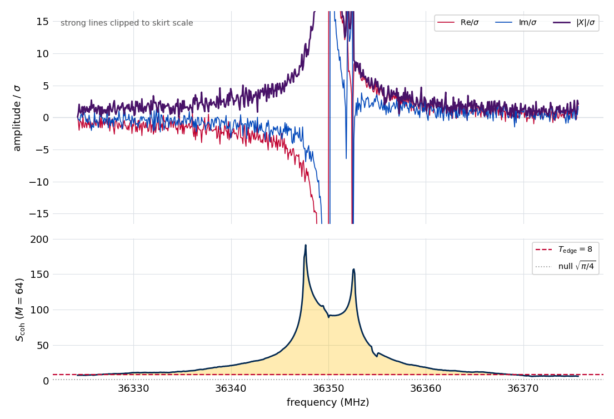

.. index::
   single: edge-coherence statistic
   single: leakage-touched region
   single: phase coherence
   single: window assignment; edge test
   single: active-FT frame

Complex-edge coherence statistic
================================

The :doc:`Stage 4 <../stage4_windows>` windowing stage cuts the spectrum into
disjoint fit windows, and a boundary must fall where a strong line's leakage has
actually decayed into the noise — not merely where the magnitude spectrum looks
flat. A finite acquisition spreads a bright line's energy through truncation
leakage whose skirt decays only as :math:`1/|\Delta f|`, several megahertz wide,
and a boundary drawn through that skirt mis-attributes the line's power to the
neighboring window.

The leakage is invisible to a magnitude test. Its skirt is **phase-coherent** — it
inherits the source line's phase and rotates smoothly with frequency offset — so
its magnitude passes through zero at every sinc null, and a fully coherent leakage
tail can look exactly like noise in :math:`|X|`. The discriminator is phase: a
coherent sum of complex bins grows like the *number* of bins over a leakage tail
(the phases align), but only like the *square root* of the number of bins over
noise (the phases are random).

Stage 4 therefore screens each band with a normalized coherent sum — the
edge-coherence statistic — whose null distribution is known in closed form. This
note derives that null, calibrates the operating threshold from the leakage
amplitude the stage should act on, shows why the statistic must be scored in the
active-region frame (and what de-ramping it a second time does), and validates it
on the reference experiment. The figures and numbers are regenerated by
``docs/source/methods/edge_coherence/generate.py``; see
:ref:`edge-coherence-reproducing`.

Coherent sum and closed-form null
---------------------------------

For an :math:`M`-point band of complex spectrum values :math:`z_1,\dots,z_M` with
per-bin complex noise RMS :math:`\sigma`, the **edge-coherence statistic** is the
modulus of the coherent sum, normalized so that pure noise gives an
:math:`O(1)` value independent of the band width:

.. math::

   S_\text{coh} = \frac{\bigl|\sum_{k=1}^{M} z_k\bigr|}{\sigma\,\sqrt{M}}.

Under the null hypothesis that the band carries only noise — independent complex
Gaussian bins :math:`n_k` with :math:`\mathbb{E}[|n_k|^2]=\sigma^2` — the partial
sum :math:`\sum_k n_k` is itself complex Gaussian with variance :math:`M\sigma^2`.
Its modulus is Rayleigh-distributed with scale :math:`\sigma\sqrt{M/2}`, so
dividing by :math:`\sigma\sqrt{M}` gives a statistic whose moments are

.. math::

   \mathbb{E}[S_\text{coh}\mid\text{null}] = \sqrt{\pi/4}\approx 0.886,
   \qquad
   \mathrm{Var}[S_\text{coh}\mid\text{null}] = 1-\pi/4\approx 0.215.

Both are **independent of** :math:`M`. That independence is the purpose of the
:math:`\sqrt{M}` normalization: it lets a single threshold serve every band width
the stage might use. Sampling clean complex-Gaussian noise across band widths
reproduces the closed form:

.. figure:: edge_coherence/figures/fig1_null_m_independence.png
   :width: 80%
   :align: center

   The null mean and 99th percentile of :math:`S_\text{coh}` on clean noise,
   across band widths :math:`M=8` to :math:`128`. The mean sits on
   :math:`\sqrt{\pi/4}` and the 99th percentile on :math:`\approx 2.15`, both flat
   in :math:`M`.

Signal growth and the operating threshold
-----------------------------------------

Under a coherent leakage tail of per-bin amplitude :math:`L`, the bins add nearly
in phase, so :math:`|\sum_k z_k|\sim ML` and the statistic grows as the square
root of the band width against a contamination of fixed amplitude:

.. math::

   S_\text{coh} \sim \frac{ML}{\sigma\sqrt{M}} = \frac{L}{\sigma}\,\sqrt{M}.

The null stays put while this climbs, so doubling the band width buys
:math:`\sqrt{2}` more discriminating power.

.. figure:: edge_coherence/figures/fig2_signal_growth.png
   :width: 80%
   :align: center

   :math:`S_\text{coh}` over a coherent band of per-bin amplitude :math:`L`,
   versus band width, for three :math:`L/\sigma`. The coherent value climbs as
   :math:`\sqrt{M}` while the null (dotted) stays at :math:`\sqrt{\pi/4}`; a
   per-bin leakage of :math:`1\sigma` reaches the operating threshold at
   :math:`M=64`.

The null only bounds the threshold from *below*. At :math:`S_\text{coh}=3` the
per-band false-positive rate is already well under a percent (the null 99th
percentile is :math:`\approx 2.15`), and a higher threshold makes it smaller
still. What fixes the *working* threshold is instead how large a real leakage the
stage should act on. Inverting the signal relation, the per-bin leakage flagged at
a threshold :math:`T_\text{edge}` over a band of width :math:`M` is

.. math::

   \frac{L}{\sigma} = \frac{T_\text{edge}}{\sqrt{M}},

so the defaults :math:`T_\text{edge}=8` and :math:`M=64` flag coherent leakage of
at least about one :math:`\sigma` per bin — the :math:`L/\sigma=1` curve in the
figure crossing the threshold exactly at :math:`M=64`. A threshold near the null,
say 3, would instead act on sub-:math:`\sigma` leakage and read a large fraction
of a line-dense spectrum as touched.

Scoring frame: the active-region transform
------------------------------------------

A coherent sum is only coherent in the right reference frame. A line that turns on
at :math:`t_0=` ``start_us`` inside the record carries a phase ramp
:math:`e^{-i 2\pi f t_0}` on every bin of a **full-record** transform; across a
64-bin band that ramp winds through several full turns, so a coherent sum over a
full-record spectrum would cancel on genuine leakage and collapse the statistic to
the null.

The statistic must therefore be referenced to the active-region turn-on, which the
pipeline gets for free: it is scored on the canonical **active FT** — the
transform of just the active region :math:`[t_0,\,t_0+T]` — which begins at the
turn-on, so the spectrum is already in the line's own :math:`[0, T]` frame and
carries no ramp. The coherent sum is taken directly. The corollary is that the
statistic must be evaluated in exactly one frame: scoring it on a full-record
transform, or de-ramping the active FT a *second* time, reintroduces the ramp and
collapses :math:`S_\text{coh}` to the null.

Validation on the reference experiment
--------------------------------------

On the reference active FT the statistic separates the spectrum as intended.
Strong lines tower over the threshold — the line near 36350 MHz reaches
:math:`S_\text{coh}\approx 89` with a contiguous above-threshold run several
megahertz wide — while long stretches between clusters sit near the rolling-band
null. Thresholding at :math:`T_\text{edge}=8` marks about 6.6 % of the band as
leakage-touched.

   The 36350 MHz strong line on the reference active FT, in local-SNR units. The
   magnitude :math:`|X|/\sigma` is clipped so the leakage skirt reads: away from
   the core the magnitude decays toward the noise, yet the real and imaginary
   parts keep oscillating coherently across it. The rolling :math:`S_\text{coh}`
   (lower panel, :math:`M=64`) towers far above the :math:`T_\text{edge}=8`
   threshold across the whole leakage-touched span (gold fill), settling back
   toward the null :math:`\sqrt{\pi/4}` only well away from the line.

The twin-peaked profile in the lower panel is a property of the statistic, not a
pair of separate detections. In a line's skirt the leakage is nearly pure
dispersion — the quadrature lineshape, which is odd about the line center — so a
band centered exactly on the line sums equal and opposite dispersive
contributions that cancel, leaving only the smaller absorptive part. Shifted to
either side the cancellation breaks and the net dispersive sum lifts
:math:`S_\text{coh}`, so the statistic peaks just off the line and dips at its
center; a synthetic isolated line reproduces the same symmetric pair. The blend
here (a weaker companion near 36352.5 MHz) reinforces the right peak.

Two properties matter for trusting it there. First, the per-bin noise must be the
**local** value: the Stage 2 noise varies by a factor of :math:`\approx 2.6`
across this spectrum, so a global median would understate significance in quiet
stretches and overstate it in noisy ones. Second, there must be **no pedestal**: a
constant complex offset would dominate the coherent sum linearly, but in a quiet
region the median real and imaginary parts come in at :math:`-0.02\,\sigma` and
:math:`+0.08\,\sigma` — consistent with zero, as a mean-subtracted FID requires.

Caveats
-------

* **One turn-on per record.** The active-FT frame assumes a single active window;
  a multi-segment or re-triggered acquisition would carry more than one turn-on
  and is out of scope.
* **The statistic locates, it does not identify.** A reading above threshold says
  a coherent skirt reaches the band; *which* line it belongs to comes from the
  :doc:`Stage 3 <../stage3_peaks>` promoted-peak list. A threshold crossing with no
  nearby strong line is the signature of an undetected line — a diagnostic flag,
  not something to absorb silently.
* **The map drives grouping, not attachment.** The leakage-touched regions decide
  which strong lines are mutually coupled (the strong-cluster grouping); the fixed
  contributors a window carries are chosen separately, by the predicted skirt
  amplitude on that window's grid (see :doc:`../stage4_windows`).
* **Interference can locally suppress the statistic.** A coherent sum can be
  pulled down where leakage is still present: the dispersive cancellation at a
  line center, or destructive interference between two lines' leakage in a blend,
  dips :math:`S_\text{coh}` — in principle below threshold — and can split or
  shorten a leakage-touched run. The :math:`M`-bin band smooths the statistic and
  a strong line's central dip stays well above threshold (in the figure it falls
  only to :math:`S_\text{coh}\approx 90`), so this bites only on finely-tuned
  cancellations, but a boundary drawn at such a dip would sit in still-contaminated
  spectrum.

.. _edge-coherence-reproducing:

Reproducing this note
---------------------

The synthetic calibration and the 2638 application both call the shipped
:func:`~ftmwpipeline.preprocessing.edge_coherence.coherence_statistic` and
:func:`~ftmwpipeline.preprocessing.edge_coherence.active_edge_coherence`.
Regenerate the figures and ``results.json`` from the repository root with::

    python docs/source/methods/edge_coherence/generate.py

The synthetic null and signal-growth sweeps are a few seconds; the 2638 section
builds the example experiment through noise estimation. Two fast, data-free
invariants are exercised by the unit suite — the closed-form null mean and its
:math:`M`-independence, and the :math:`\sqrt{M}` signal growth — and the 2638
numbers are guarded against drift by a ``slow``-marked test.
