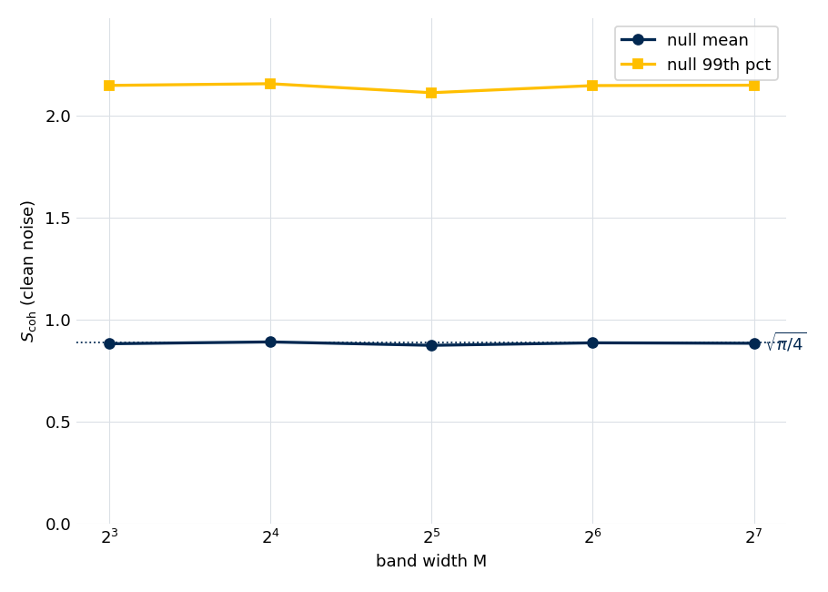
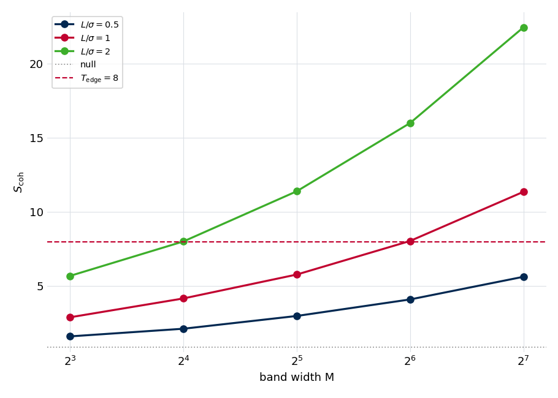

.. index::
   single: edge-coherence statistic
   single: leakage-touched region
   single: phase coherence
   single: window assignment; edge test
   single: active-FT frame

The complex-edge coherence statistic
====================================

This note explains the test the :doc:`Stage 4 <../stage4_windows>` windowing stage
uses to decide whether a stretch of spectrum is clean noise or is still carrying a
strong line's coherent leakage skirt, and on what basis its threshold can be
trusted. The stage page states the statistic and quotes its null mean; this note
derives that null in closed form, calibrates the threshold, explains why the
statistic is scored on the active-region transform without a de-ramp (and what goes
wrong if it is de-ramped anyway), and validates it on the reference experiment. The
figures and numbers are regenerated by
``docs/source/methods/edge_coherence/generate.py`` from the shipped statistic; see
:ref:`edge-coherence-reproducing`.

Why phase, not magnitude
------------------------

A finite acquisition spreads a strong line's energy far from its center through
truncation leakage whose skirt decays only as :math:`1/|\Delta f|` — several
megahertz for a bright line. A window boundary cut through that skirt mis-attributes
the line's power, so the windowing stage must find where the leakage has actually
decayed into the noise, not where the magnitude spectrum merely looks flat.

A magnitude test cannot do this. The leakage envelope is **phase-coherent**: it
inherits the source line's phase and rotates smoothly with frequency offset, so its
magnitude passes through zero at every sinc null. The spectrum can look like noise in
magnitude while still carrying fully coherent leakage. The phase is the
discriminator — a coherent sum of complex bins grows like the number of bins over a
leakage tail (the phases align) but only like the square root of the number of bins
over noise (the phases are random).

The statistic and its null
--------------------------

For an :math:`M`-point band of complex spectrum values :math:`z_1,\dots,z_M` with
per-bin complex noise RMS :math:`\sigma`, the **edge-coherence statistic** is

.. math::

   S_\text{coh} = \frac{\bigl|\sum_{k=1}^{M} z_k\bigr|}{\sigma\,\sqrt{M}}.

Under the null hypothesis that the band carries only noise — independent complex
Gaussian bins with :math:`\mathbb{E}[|n_k|^2]=\sigma^2` — the partial sum
:math:`\sum_k n_k` is itself complex Gaussian with variance :math:`M\sigma^2`. Its
modulus is Rayleigh-distributed with scale :math:`\sigma\sqrt{M/2}`, and dividing by
:math:`\sigma\sqrt{M}` gives a statistic whose moments are

.. math::

   \mathbb{E}[S_\text{coh}\mid\text{null}] = \sqrt{\pi/4}\approx 0.886,
   \qquad
   \mathrm{Var}[S_\text{coh}\mid\text{null}] = 1-\pi/4\approx 0.215.

Both are **independent of** :math:`M` — that is the point of the :math:`\sqrt{M}`
normalization, and it is what lets one threshold serve every band width the stage
might use. Sampling clean complex-Gaussian noise across band widths reproduces this:

   The null mean and 99th percentile of :math:`S_\text{coh}` on clean noise, across
   band widths :math:`M=8` to :math:`128`. The mean sits on :math:`\sqrt{\pi/4}` and
   the 99th percentile on :math:`\approx 2.15`, both flat in :math:`M`.

The :math:`\sqrt{M}` gain and the threshold
-------------------------------------------

Under a coherent leakage tail of per-bin amplitude :math:`L`, the bins add nearly in
phase, so :math:`|\sum_k z_k|\sim ML` and

.. math::

   S_\text{coh} \sim \frac{ML}{\sigma\sqrt{M}} = \frac{L}{\sigma}\,\sqrt{M}.

The statistic grows as :math:`\sqrt{M}` against a contamination of fixed amplitude
while the null stays put — doubling the band width buys :math:`\sqrt{2}` more
discriminating power.

   :math:`S_\text{coh}` over a coherent band of per-bin amplitude :math:`L`, versus
   band width, for three :math:`L/\sigma`. The coherent value climbs as
   :math:`\sqrt{M}` while the null (dotted) stays at :math:`\sqrt{\pi/4}`; a per-bin
   leakage of :math:`1\sigma` reaches the operating threshold at :math:`M=64`.

The null only bounds the threshold from *below*: :math:`S_\text{coh}=3` already has a
per-band false-positive rate well under a percent (the 99th percentile is
:math:`\approx 2.15`), and a higher threshold makes it smaller still. What fixes the
*working* threshold is how large a real leakage the stage should act on. Since the
per-bin leakage at the detection boundary is :math:`L/\sigma=T_\text{edge}/\sqrt{M}`,
the default :math:`T_\text{edge}=8` at the default :math:`M=64` flags coherent
leakage of at least about one :math:`\sigma` per bin — visible in the figure as the
:math:`L/\sigma=1` curve crossing the threshold exactly at :math:`M=64`. A threshold
of 3 (well above the null) would instead act on sub-:math:`\sigma` leakage and read a
large fraction of a line-dense spectrum as touched.

The active-FT reference frame
-----------------------------

A coherent sum is only coherent in the right reference frame. A line that turns on at
:math:`t_0=` ``start_us`` inside the record carries a phase ramp
:math:`e^{-i 2\pi f t_0}` on every bin of a **full-record** transform; across a
64-bin band that ramp winds through several full turns, so a coherent sum over a
full-record spectrum would cancel on genuine leakage. The statistic must therefore be
referenced to the active-region turn-on.

The pipeline gets this for free: the statistic is scored on the canonical **active
FT** — the transform of just the active region :math:`[t_0,\,t_0+T]` — which begins
at the turn-on, so the spectrum is already in the line's own :math:`[0, T]` frame and
carries no ramp. The coherent sum is taken directly. (The corollary is that the
statistic must be evaluated in exactly one frame: scoring it on a full-record
transform, or de-ramping the active FT a second time, reintroduces the ramp and
collapses the statistic to the null.)

Validation on the reference experiment
--------------------------------------

On the reference active FT the statistic separates the spectrum as intended. Strong
lines tower over the threshold — the line near 36350 MHz reaches
:math:`S_\text{coh}\approx 89` with a contiguous above-threshold run several
megahertz wide — while long stretches between clusters sit near the rolling-band
null. Thresholding at :math:`T_\text{edge}=8` marks about 6.6 % of the band as
leakage-touched.

Two properties matter for trusting it there. First, the per-bin noise must be the
**local** value: the Stage 2 noise varies by a factor of :math:`\approx 2.6` across
this spectrum, and a global median would understate significance in quiet stretches
and overstate it in noisy ones. Second, there is **no pedestal**: a constant complex
offset would dominate the statistic linearly, but in a quiet region the median real
and imaginary parts of the de-ramped spectrum come in at :math:`-0.02\,\sigma` and
:math:`+0.08\,\sigma` — consistent with zero, as a mean-subtracted FID requires.

Caveats
-------

* **One turn-on per record.** The active-FT frame assumes a single active window;
  a multi-segment or re-triggered acquisition would carry more than one turn-on and
  is out of scope.
* **The statistic locates, it does not identify.** A reading above threshold says a
  coherent skirt reaches the band; *which* line it belongs to comes from the
  :doc:`Stage 3 <../stage3_peaks>` promoted-peak list. A threshold crossing with no
  nearby strong line is the signature of an undetected line — a diagnostic flag, not
  something to absorb silently.
* **The map drives grouping, not attachment.** The leakage-touched regions decide
  which strong lines are mutually coupled (the strong-cluster grouping); the fixed
  contributors a window carries are chosen separately, by the predicted skirt
  amplitude on that window's grid (see :doc:`../stage4_windows`).

.. _edge-coherence-reproducing:

Reproducing this note
---------------------

The synthetic calibration and the 2638 application both call the shipped
:func:`~ftmwpipeline.preprocessing.edge_coherence.coherence_statistic` and
:func:`~ftmwpipeline.preprocessing.edge_coherence.active_edge_coherence`.
Regenerate the figures and ``results.json`` from the repository root with::

    python docs/source/methods/edge_coherence/generate.py

The synthetic null and signal-growth sweeps are a few seconds; the 2638 section
builds the example experiment through noise estimation. Two fast, data-free
invariants are exercised by the unit suite — the closed-form null mean and its
:math:`M`-independence, and the :math:`\sqrt{M}` signal growth — and the 2638
numbers are guarded against drift by a ``slow``-marked test.
