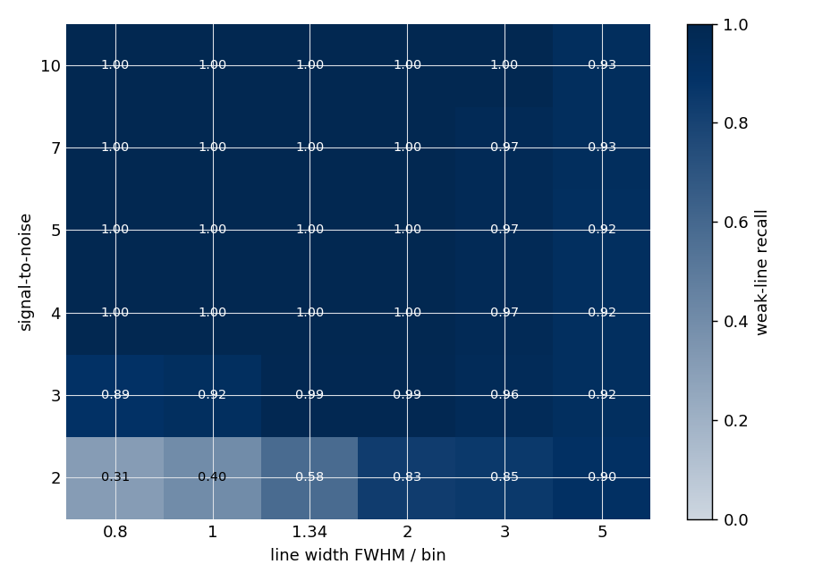
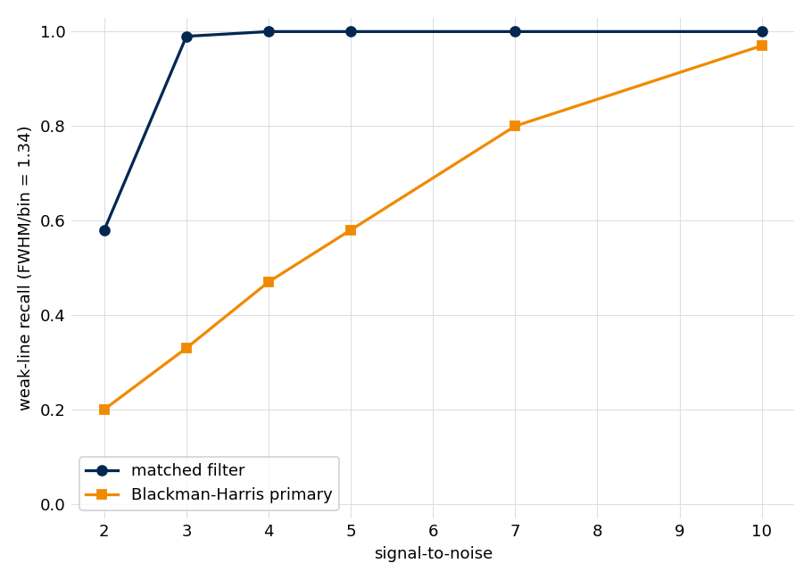
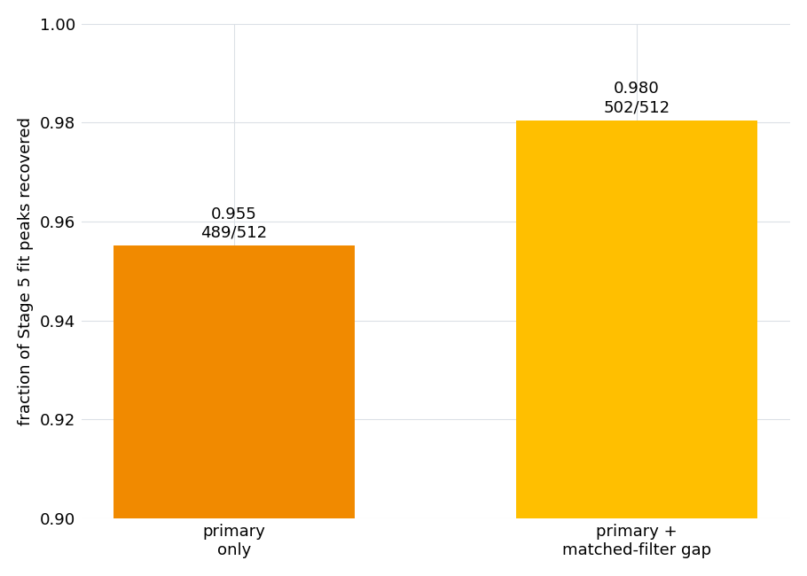

.. index::
   single: matched filter
   single: peak detection; matched filter
   single: gap pass
   single: Neyman-Pearson detector
   single: apodized FFT

Matched filter as a peak detector
=================================

The :doc:`Stage 3 <../stage3_peaks>` detector runs two passes: a strong-window
(Blackman-Harris) primary pass for robust strong-line positions, and a *gap pass*
that recovers the weak lines the strong window broadens away. The gap pass detects
with an exponentially-apodized transform — a **matched filter** — and the choice
is forced by two facts about detecting a weak, finite-duration decaying line.

First, the optimal linear statistic for deciding whether such a line sits at a
given frequency is the matched filter, and on a finite record that filter is
*exactly* an apodized FFT, so the optimal detector costs one transform rather than
:math:`N` projections. Second, a matched filter thresholded on its own
over-produces: a bright line clears any fixed per-bin threshold across its whole
leakage skirt, manufacturing a picket fence of spurious weak lines. The gap pass
therefore pairs the matched filter's per-bin optimality with the concave-down
locator the stage page describes, which keeps line centers and rejects skirts.

This note derives the matched-filter/apodized-FFT identity, shows why it is the
Neyman-Pearson optimal detector, quantifies the skirt false-positive problem that
forces the pairing, and validates the recall on synthetic ground truth and the
reference experiment. The figures and numbers are regenerated by
``docs/source/methods/matched_filter_detection/generate.py``; see
:ref:`matched-filter-reproducing`.

Matched filter as an apodized FFT
---------------------------------

A finite acquisition records a decaying line as a damped sinusoid
:math:`s(t) = A\,e^{-t/\tau}\cos(2\pi f t + \phi)` over the active region
:math:`[0, T]`. The optimal way to decide whether such a line sits at a frequency
:math:`f_c` is to project the data onto a copy of the expected line shape there
and measure the overlap. Written on the spectrum :math:`z(f)`, that projection is

.. math::

   \mathcal{T}(f_c) = \frac{\langle h_T(f - f_c;\,\tau, T),\ z(f)\rangle_\sigma}
                           {\langle h_T,\ h_T\rangle_\sigma},

where :math:`h_T(f - f_c;\,\tau, T)` is the finite-:math:`T` line shape (the
transform of the decay envelope) centered at :math:`f_c`, the inner product runs
over the frequency axis :math:`f`, and the :math:`\sigma` subscript marks it as
noise-weighted. Evaluating this at *every* candidate frequency looks like
:math:`N` separate projections — an :math:`O(N^2)` cost. By Parseval's theorem on
the finite record, the numerator is

.. math::

   \langle h_T(f - f_c;\,\tau, T),\ z(f)\rangle
       = \int_0^T e^{-t/\tau}\,\mathrm{FID}(t)\,e^{-i 2\pi f_c t}\,dt,

which is exactly **the Fourier transform of the FID after apodizing it by the
decay envelope** :math:`e^{-t/\tau}`, read off at :math:`f_c`. Computing it at
every frequency at once is therefore a single FFT (:math:`O(N\log N)`), not
:math:`N` projections, and the noise weighting reduces to a per-bin division of
the magnitude by the local noise. The detector is one apodized transform.

The identity is exact, not approximate: regenerating the explicit projection sum
and the apodized FFT and comparing them bin for bin agrees to floating-point
precision (relative error :math:`\sim 2\times10^{-14}`).

Why it is the optimal detector
------------------------------

Under white time-domain noise the matched filter is the Neyman-Pearson optimal
detector for a signal of known shape: no linear statistic separates a
damped-sinusoid signal from noise at a higher signal-to-noise ratio. The
apodization weight is what makes it optimal — weighting each time sample by the
signal's own envelope concentrates the line's energy, which an unweighted (boxcar)
transform spreads across the transform's skirt. The optimum is reached when the
filter matches the line's true envelope, both its **shape** and its decay time.
The gap pass takes both from the :doc:`Stage 2b <../stage2b_tau>` calibration:
when the line-shape vote is Gaussian the matched window is itself Gaussian,
:math:`\exp(-(t/\tau_G)^2)` with the Gaussian decay time, and otherwise it is the
exponential :math:`\exp(-t/\tau)` of a Lorentzian line — the true matched filter
for the recommended shape, not an exponential filter fed a Gaussian decay time.
The gain is not in the signal — apodization slightly lowers the on-line amplitude
— but in the noise: the apodized transform's per-bin noise falls faster than the
signal does, so the per-bin signal-to-noise rises.

The line shape changes little else about detection. On the reference experiment a
Stage 3 audit across the Lorentzian and Gaussian paths finds the detection
defaults — the promotion floors, the gap-mask edge threshold, the primary-pass
exclusion radius — shape-invariant to within a few percent, so matching the window
to the recommended shape is the whole of the adaptation and no Gaussian-specific
tuning is warranted.

Once the data are reduced to a per-bin signal-to-noise statistic, the detection
threshold has a clean statistical reading. In a line-free region the magnitude of
the complex spectrum is Rayleigh-distributed, so a per-component threshold of four
corresponds to a tail probability of :math:`\approx 3.4\times10^{-4}`; over the
:math:`\sim 10^5` bins of a reference-sized active spectrum that is a budget of
order thirty pure-noise false positives — a fixed, signal-independent floor.

Why a per-bin threshold is not enough
-------------------------------------

The optimality above is *per bin*. A real strong line, though, clears any fixed
per-bin threshold not only at its center but across its skirt. A Lorentzian of
on-line signal-to-noise :math:`S` and half-width :math:`w` bins has magnitude
:math:`S / (1 + (\Delta/w)^2)` at an offset of :math:`\Delta` bins, so it stays
above a threshold of four out to

.. math::

   \Delta_\text{max} \approx w\,\sqrt{S/4 - 1}\quad\text{bins per side}.

At :math:`S = 10^4` and :math:`w = 1` bin that is fifty bins on each side. A
detector that keeps every local maximum above the threshold reports those skirt
bins as a picket fence of spurious weak lines, and the count grows with the
strength of the lines. In the synthetic sweep below the matched filter's
false-positive count climbs from a handful at low signal-to-noise to over a
hundred per realization in the strong, wide-line cells — entirely skirt bins of
real lines, not noise.

This is why the gap pass does not threshold the matched-filter statistic
directly. It runs the same **concave-down second-derivative locator** the stage
page describes: a line center is concave down, but a monotonically decaying skirt
is not a local minimum of the second derivative, so the locator keeps the centers
and rejects the skirts. The matched filter supplies the optimal per-bin
signal-to-noise; the concavity test supplies the structural discrimination the
threshold alone cannot. (A coherence-projection screen was considered as the
discriminator instead and rejected: a skirt bin sits on a real Lorentzian — the
strong line's own shape — so it projects as coherently as an on-line bin, and the
screen cannot tell them apart.)

Synthetic validation
--------------------

The decisive test holds the detector fixed and sweeps the two parameters that
govern detectability: the per-line signal-to-noise and the line width measured in
transform bins (FWHM/bin). The line width per bin is a design choice — set by the
record length and any zero-padding — and detectability is best when the bin is of
order the half-width at half-maximum, FWHM/bin :math:`\approx` 1–2. The noise is
white regardless of bin size, so a coarser grid throws away resolution for
nothing, while a finer grid spreads each line's energy over more bins and lowers
the per-bin signal-to-noise. A well-designed FTMW acquisition therefore operates
in that regime, with weak lines around signal-to-noise 3–10. The matched-filter
kernel is compared against a strong-window (Blackman-Harris) detector — the
primary pass's behavior, which suppresses sidelobes by broadening every line.
Recall is the fraction of injected lines recovered within tolerance, averaged over
fixed-seed realizations.

   Matched-filter weak-line recall across the signal-to-noise × line-width plane.
   Above signal-to-noise four the matched filter recovers essentially every weak
   line across the whole width range; it only softens in the lowest
   signal-to-noise rows and at the widest lines.

Across the grid the matched filter recovers at least 92 % of weak lines once the
signal-to-noise reaches four (at least 97 % for FWHM/bin up to three), and holds
89 % or better at signal-to-noise three. The strong-window detector, by contrast,
collapses precisely in the optimal FWHM/bin :math:`\approx` 1–2 regime: it broadens
the well-sampled lines below its own detection floor and merges wider ones.

   Recall against signal-to-noise at FWHM/bin = 1.34, near the optimal-sampling
   regime. The matched filter saturates near complete recall by
   signal-to-noise four; the strong-window detector recovers under half the lines
   there and reaches comparable recall only by signal-to-noise ten.

At this width the matched filter recovers every weak line by signal-to-noise
four, where the strong-window detector recovers under half (0.47); at a wider
FWHM/bin of two and signal-to-noise five the gap is 1.00 against 0.33. The two
passes are complementary by construction: the strong window gives clean,
sidelobe-free positions for the strong lines, and the matched-filter gap pass
recovers the weak lines the window buried.

On the reference experiment
---------------------------

On real data the test is whether the gap pass recovers lines that are genuinely
real. The Stage 5 fitted line list is the outside reference: for each fitted line,
the nearest promoted Stage 3 peak within tolerance is found and labeled by the
pass that detected it.

   Fraction of the reference experiment's fitted lines recovered by the primary
   pass alone and by the primary plus the matched-filter gap pass. The axis is
   truncated near the top to show the lift on an already-high primary recall; bars
   carry the absolute counts.

The primary pass alone recovers 489 of the 512 fitted lines (95.5 %). Adding the
matched-filter gap pass lifts that to 502 (98.0 %): thirteen real lines are
recovered **only** by the gap pass — weak lines the sidelobe-suppressing primary
broadened away. The gap pass earns its place even on a high-signal-to-noise
spectrum where the primary already does well; the synthetic sweep shows its
contribution grows on weaker-line spectra. The cost is more raw candidates near
the strong lines (the skirt bins of the preceding section), which the concavity
locator, the leakage-aware floor, and the per-window fit downstream resolve.

Caveats
-------

* **The matched filter is matched to a shape and a decay.** Its optimality assumes
  the line shape and the decay time it is given, both taken from the Stage 2b
  calibration; it falls back to an exponential window at a default decay when that
  is absent. A badly wrong decay degrades the gain, but the synthetic sweep shows
  recall is insensitive to the basis decay over a factor of several, so the
  fallback is safe.
* **Optimality is per bin, not per line.** The structural discrimination against a
  strong line's own skirt comes from the concave-down locator, not the matched
  filter; the two are a pair, and neither alone is sufficient.
* **The grid sets the floor.** The matched filter detects on the active spectrum's
  native bin spacing; a line that falls between bins is recovered only to the
  precision that grid allows, which is why detection is a coarse seeding step and
  the per-window fit, not the detector, sets the final line positions.

.. _matched-filter-reproducing:

Reproducing this note
---------------------

The synthetic detectors call the shipped
:func:`~ftmwpipeline.utils.signal_processing.matched_filter_window` and
:func:`~ftmwpipeline.preprocessing.peak_detection.locate_peaks`, so the note
exercises the production kernels. Regenerate the figures and ``results.json``
from the repository root with::

    python docs/source/methods/matched_filter_detection/generate.py

The synthetic sweep and the projection-identity check are a few seconds; the
reference-experiment section builds the example experiment through Stage 5 (a few
minutes). Two fast, data-free invariants are exercised by the unit suite — the
projection equals the apodized FFT to precision, and the matched filter beats the
strong-window detector in the narrow-line regime — and the synthetic recall grid
plus the reference-experiment lift are guarded against drift by a ``slow``-marked
test.
