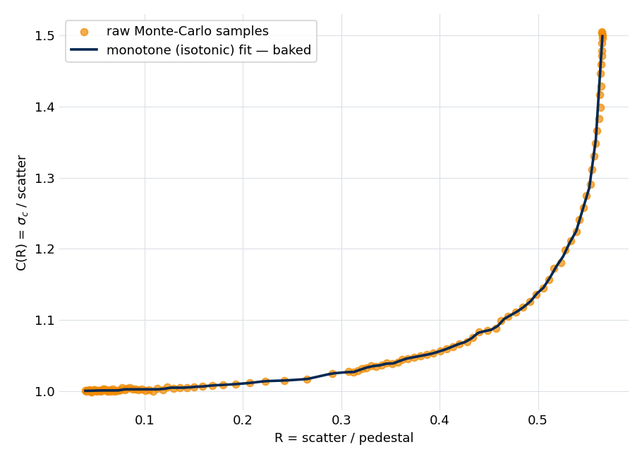
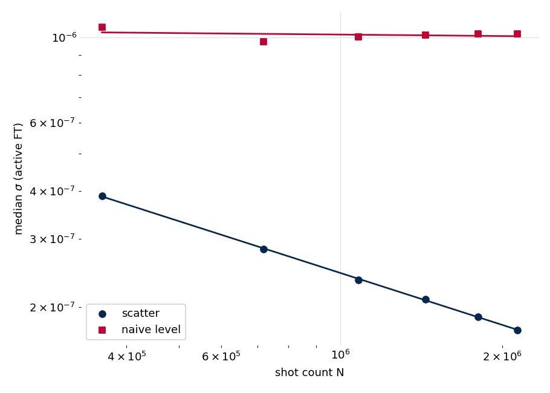
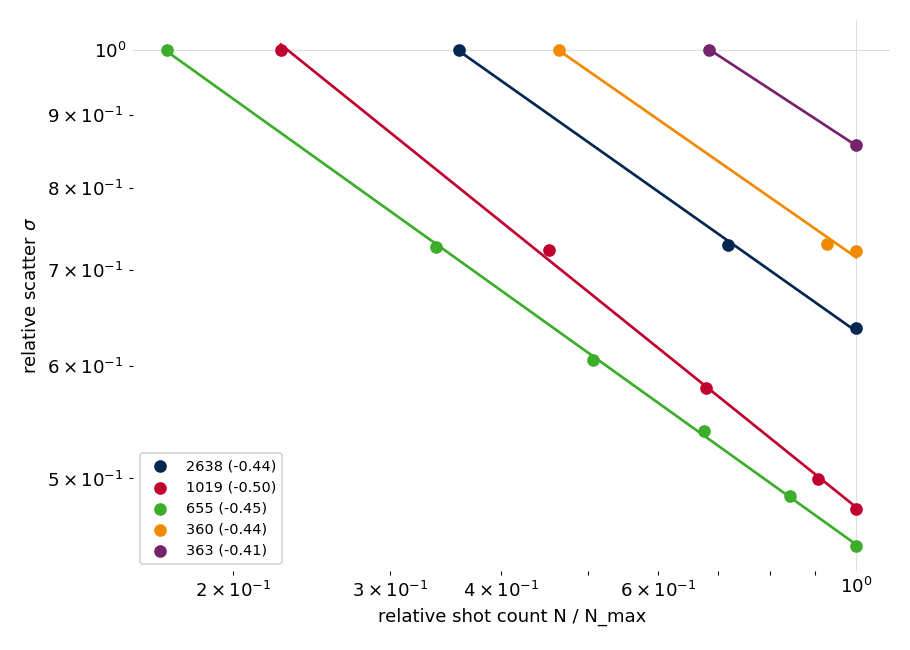
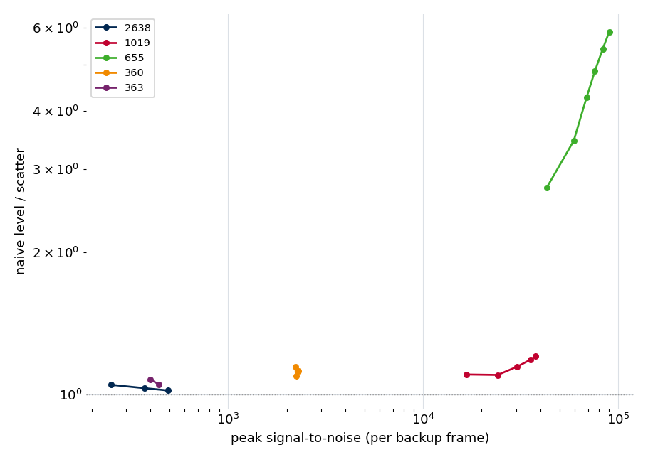
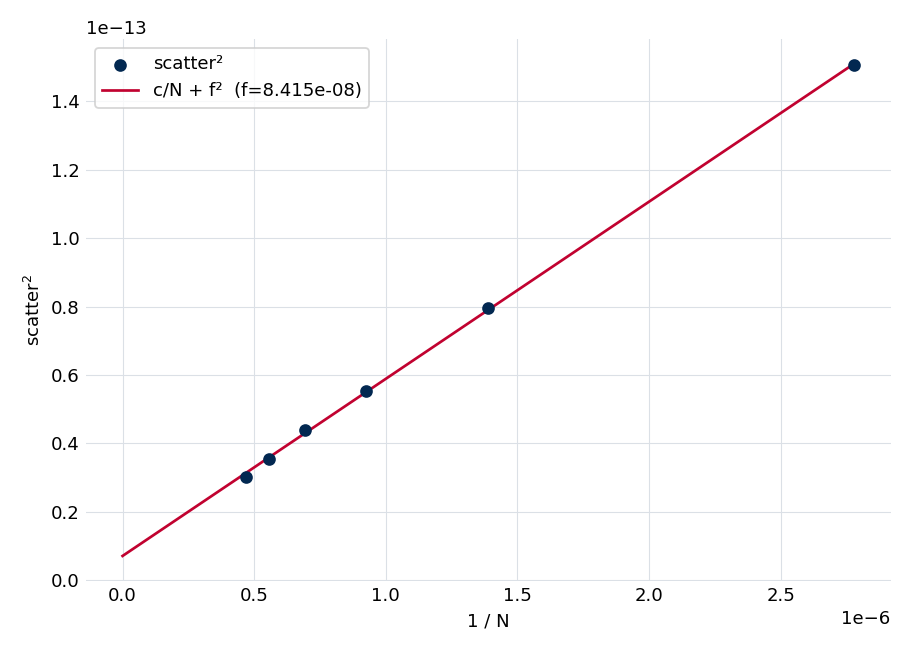

.. index::
   single: leakage pedestal
   single: noise estimation; high signal-to-noise
   single: shot-count scaling
   single: Rician correction

Noise estimation at high signal-to-noise
========================================

The noise estimate from :doc:`Stage 2 <../stage2_noise>` is the statistical
reference for everything downstream: the per-bin :math:`\sigma(f)` sets every
detection threshold, every reduced :math:`\chi^2`, and every fitted uncertainty.
It is measured on the canonical unapodized spectrum, whose bins carry
independent noise (apodization or zero-padding would correlate them).

On a sparse or low signal-to-noise spectrum :math:`\sigma` can be read straight
from the empty bins. On a high signal-to-noise, line-dense spectrum it cannot:
the summed truncation-leakage skirts of many strong lines raise a smooth
*pedestal* in the bins between the lines, and the obvious level estimator — a
running median of :math:`|X|` — measures that pedestal rather than the noise,
overstating :math:`\sigma` by up to a factor of six exactly where the spectrum
is richest.

Stage 2 estimates :math:`\sigma` instead from the bin-to-bin *scatter* of the
magnitude, which separates the white noise from the smooth pedestal, with a
regime-dependent Rician correction from the magnitude scatter to the underlying
per-quadrature noise. This note states the pedestal problem quantitatively,
derives the estimator and its correction, and validates both against the
shot-count scaling of the checked-in fixtures, where the true noise must fall as
:math:`1/\sqrt{N}` while a pedestal-bound estimate cannot. The figures and quoted
numbers are regenerated from the fixtures by
``docs/source/methods/noise_snr_scaling/generate.py``; see
:ref:`noise-snr-reproducing`.

Leakage pedestals defeat a level estimator
------------------------------------------

A boxcar transform of a line of amplitude :math:`A` does not vanish away from the
line center: its truncation-leakage skirt has a magnitude envelope that decays
only as :math:`1/|\Delta f|`. Any one line's far wings are negligible, but on a
dense, high signal-to-noise spectrum the **sum** over hundreds of strong lines is
a smooth pedestal that fills every quiet bin,

.. math::

   P(f) \;=\; \sum_j A_j\, g(f - f_j),
   \qquad g(\Delta f)\ \sim\ \frac{1}{|\Delta f|}.

A bin between the lines therefore holds the pedestal plus the random noise. The
level of the magnitude there — a running median of :math:`|X|`, the natural noise
estimate — responds to both in quadrature,

.. math::

   \hat{\sigma}_\text{level}(f)\ \approx\ \sqrt{\sigma(f)^2 + P(f)^2},

so it reports the noise only while the noise dominates the pedestal. The taller
the lines, the larger :math:`P`, and the worse the overstatement — precisely on
the spectra where the estimate matters most.

That the two terms separate cleanly is what makes the failure diagnosable. The
random noise is incoherent and averages down with the shot count :math:`N`, while
the pedestal is proportional to the coherently averaged signal amplitude and is
independent of :math:`N`:

.. math::

   \sigma(N) = \frac{\sigma_1}{\sqrt{N}}, \qquad P\ \text{constant in } N
   \;\;\Longrightarrow\;\;
   \hat{\sigma}_\text{level}(N) = \sqrt{\frac{\sigma_1^2}{N} + P^2}.

A true noise estimate must fall as :math:`1/\sqrt{N}`; the level estimate tracks
that slope while the noise dominates, then plateaus at :math:`P` once the pedestal
does. This :math:`N`-scaling is the assumption-free test the validation section
applies, and it is the property the estimator below is built to satisfy.

Estimating σ from magnitude scatter
-----------------------------------

The pedestal is smooth along the frequency axis; the noise is white, varying bin
to bin. A high-pass therefore separates them. The estimator subtracts a broad
running-median pedestal :math:`P(f)` from the magnitude and measures the robust
scatter of the residual over a sliding window,

.. math::

   s(f) \;=\; 1.4826\,\operatorname{MAD}_{f' \in W(f)}
            \!\bigl[\,|X(f')| - P(f')\,\bigr],

where :math:`W(f)` is the set of non-line bins in a window about :math:`f` and the
factor :math:`1.4826` rescales the median absolute deviation to a Gaussian
standard deviation. Lines are removed by a self-mask rather than a peak list
(Stage 2 runs before detection): the bins kept are those with
:math:`|X| - P < k\,s` for :math:`k = 8`, iterated to convergence. The mask is
deliberately loose, for the reason given in :ref:`noise-line-mask` below.

Because line power and boxcar sidelobes can only *raise* the local scatter, never
lower it, the true noise floor is the **lower envelope** of these local estimates.
A broad moving median over the per-region values, robust to up to 50 % per-window
line contamination, rides that floor straight through line-dense bands instead of
bumping up under them, and a final Gaussian smoothing removes the median's
staircase. The floor is a slowly varying receiver property, so a broad smoothing
window does not erase real structure. The step-by-step algorithm and its tunable
widths are on the :doc:`../stage2_noise` page.

Rician correction from scatter to σ
~~~~~~~~~~~~~~~~~~~~~~~~~~~~~~~~~~~~~

The scatter :math:`s` is a property of the *magnitude* :math:`|X|`, which is
Rician, so the factor relating it to the underlying per-quadrature noise
:math:`\sigma_c` depends on the local regime. Under a strong line the pedestal
dominates and the magnitude is locally Gaussian, so :math:`1.4826\,\mathrm{MAD}`
already equals :math:`\sigma_c` and the factor is unity; in a pure-noise
(Rayleigh) region the same statistic underestimates :math:`\sigma_c`, and the
factor rises to about :math:`1.5`. A single fixed factor is therefore wrong in a
regime-dependent way — worst by roughly 20 % at exactly the under-line bins where
the fit later evaluates its :math:`\chi^2`.

The correction needs no extra data. The dimensionless ratio of the two quantities
already in hand indexes the regime,

.. math::

   R(f) = \frac{s(f)}{P(f)}, \qquad
   \sigma_c(f) = C\!\bigl(R(f)\bigr)\, s(f), \qquad
   \sigma_x(f) = \sqrt{2}\,\sigma_c(f),

where :math:`C(R) = \sigma_c/s` runs monotonically from :math:`1.0` under strong
lines to :math:`\approx 1.5` in the Rayleigh limit, and :math:`\sigma_x` is the
per-bin complex RMS every later stage consumes. :math:`C(R)` is smooth and
monotone increasing by Rician theory, so it is built once by simulating the
Rician magnitude over a grid of pedestal-to-noise ratios and reducing the
Monte-Carlo cloud to its monotone (isotonic) fit, baked into the estimator as
constants. Near the Rayleigh limit :math:`R` saturates and the raw simulation is
noisy; the monotone fit is the physically correct curve there.

   The Rician correction :math:`C(R)`: the raw Monte-Carlo samples and the
   monotone fit baked into the estimator, running from :math:`\approx 1.0` under
   strong lines to :math:`\approx 1.5` in pure-noise (Rayleigh) regions.

Validation: shot-count scaling
------------------------------

Each fixture retains its progressive backup frames, so the same spectrum can be
re-estimated at a series of increasing shot counts with its line content held
fixed. This isolates the signal-to-noise dependence from line density and turns
the :math:`N`-scaling derived above into a direct, assumption-free test: on
log–log axes the true noise must fall with slope :math:`-1/2`, while a
pedestal-bound estimate must flatten.

   The high signal-to-noise fixture (655). The scatter estimate falls as
   :math:`1/\sqrt{N}`; the naive level estimate is flat — it is measuring the
   constant pedestal, not the averaging-down noise.

On the highest signal-to-noise fixture the level estimate has a slope near zero
while the scatter estimate falls with a slope near :math:`-1/2`, and the scatter
estimator holds that behavior across every multi-frame fixture:

   Shot-count scaling of the scatter estimate across the multi-frame fixtures
   (per-fixture slope in the legend); all sit near the ideal :math:`-1/2`.

Comparing the level estimate to the scatter estimate on the same spectrum
isolates the pedestal contamination directly. Within every fixture the level
estimate's over-report grows with signal-to-noise: near unity at low
signal-to-noise (no pedestal to speak of), climbing to roughly a factor of six on
the highest-signal-to-noise fixture, while the scatter estimate stays on the
:math:`1/\sqrt{N}` floor. The level a given sample reaches depends on its line
content, so this is a family of curves, one per fixture, not a single universal
line.

   Within each fixture (one curve per fixture, traced over its backup frames),
   the level estimate's over-report relative to the scatter estimate grows with
   peak signal-to-noise — from near unity to roughly six on the highest.

The scatter estimate's slope is not *exactly* :math:`-1/2` on the densest
spectra, because a second, additive term sits beneath the averaging-down noise.
Modeling the scatter as

.. math::

   s(N)^2 = \frac{c}{N} + \beta^2

separates the averaging-down noise (:math:`c/N`) from a constant floor
(:math:`\beta`): the weak, undetected lines that pepper a spectrum this dense and
sit in the bins counted as line-free. The floor does not average down, so it
slightly flattens the slope at the highest shot counts.

   The scatter-squared is linear in :math:`1/N`; the intercept is the additive
   weak-line floor :math:`\beta^2`.

This floor is small — far below the multiplicative pedestal error the scatter
estimate exists to remove — and stricter line masking shrinks it slightly. It is
irreducible on an extremely dense spectrum without a blank (sample-free)
acquisition; that, not a tighter threshold, is the principled way to remove it.

.. _noise-line-mask:

Choosing the line-mask threshold
--------------------------------

The self-mask is deliberately loose: at :math:`k = 8` it removes only the
sharpest excursions, leaving many visible lines in the bins the estimator treats
as line-free. This is correct for two reasons. The windowed scatter is a robust
statistic, insensitive to the minority of line bins that survive the mask, so
masking every visible line is unnecessary; and line power can only *raise* a
window's local scatter, so the broad lower-envelope median that rides the floor
across regions, not the mask, is the real defense against contamination — it
stays beneath the contaminated windows rather than having to find and remove
every line first.

A tighter threshold is not merely unnecessary but harmful. The mask is one-sided:
it keeps the bins whose residual lies *below* :math:`k\,s`, so lowering :math:`k`
toward 3–5 begins excluding the upper tail of the genuine noise itself,
truncating the noise distribution and biasing :math:`\sigma` **low** — the
opposite of the feared inflation, and the wrong direction for honest
signal-to-noise and :math:`\chi^2`. The only cost of the loose mask is the small
additive weak-line floor above, which sits far below the multiplicative pedestal
error the scatter estimate removes. The default is set past that knee.

Caveats
-------

* **Noise under the lines** is not measured directly — no method can, with the
  sample present. The estimator interpolates the floor across line positions,
  which is sound because the noise is a smooth, slowly varying receiver property;
  the definitive direct check would be a blank-FID series.
* **The weak-line floor** :math:`\beta` is irreducible on an extremely dense
  spectrum without a blank acquisition.
* **Instrument dependence.** The window and smoothing widths are calibrated for
  the reference spectrometer; the Rician table and the
  :math:`\sigma_x = \sqrt{2}\,\sigma_c` conversion are analytic and not tunable.

.. _noise-snr-reproducing:

Reproducing this note
---------------------

The figures and the quoted numbers are regenerated from the checked-in fixtures
under ``examples/blackchirp_data/`` (each retains its progressive backup frames)
by::

    python docs/source/methods/noise_snr_scaling/generate.py

which writes ``figures/*.png`` and ``results.json`` beside the script (a few
seconds over all fixtures). Two fast, data-free invariants are exercised by the
unit suite — the Monte-Carlo :math:`C(R)` table matches the baked constants, and
a synthetic pedestal-plus-noise series reproduces the slope split (scatter near
:math:`-1/2`, level near zero). The full fixture regeneration is guarded against
drift by a ``slow``-marked test that re-runs the harness and compares
``results.json`` within tolerance.
