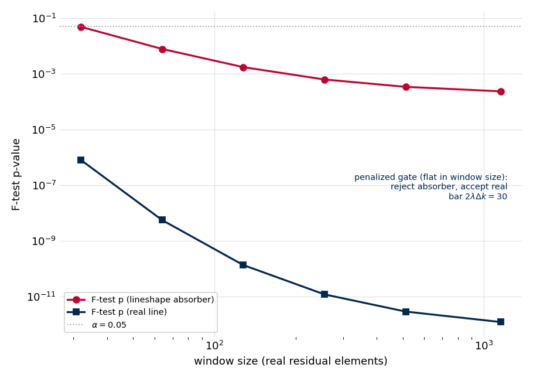
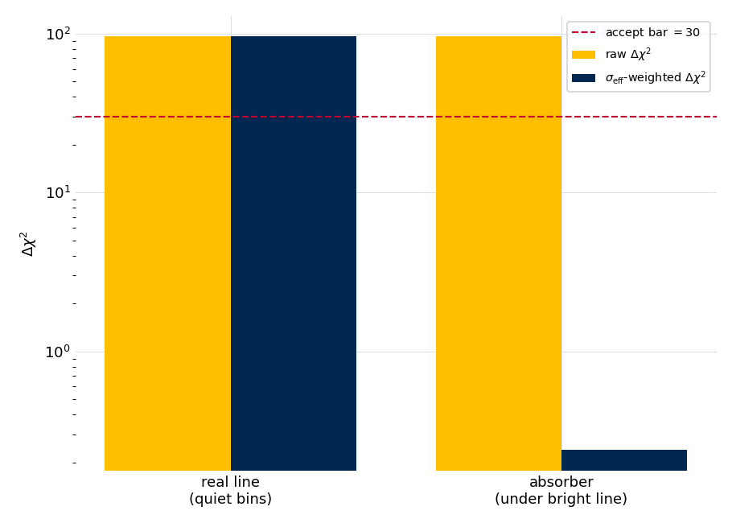
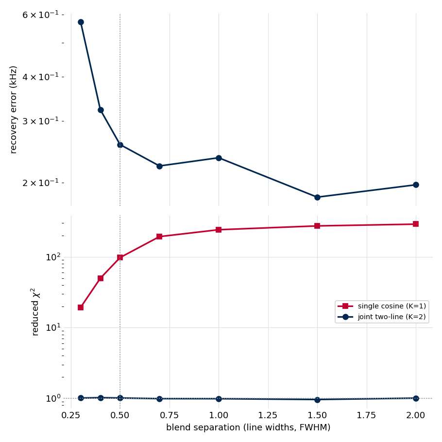
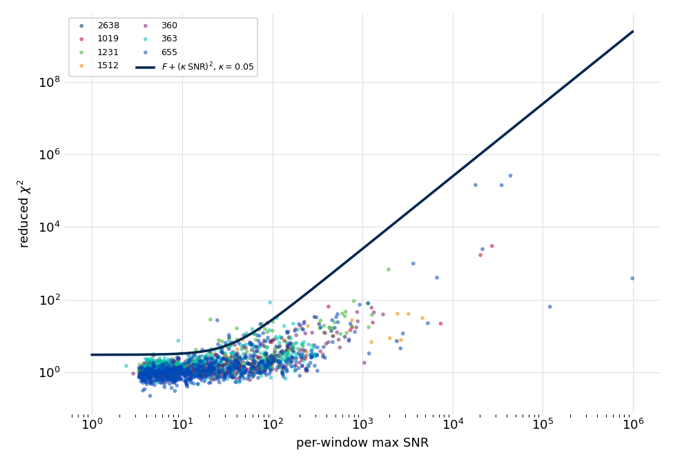

.. index::
   single: peak fitting; acceptance gate
   single: context-invariant gate
   single: penalized chi-squared
   single: effective sample size
   single: F-test; denominator bias
   single: blend recovery
   single: residual rescue
   single: SNR-aware acceptance
   single: shape-error fraction

Stage 5 fitting: gates, blends, and SNR-aware acceptance
========================================================

Stage 5 (:doc:`../stage5_fitting`) turns each window's detected peaks into a
fitted model by growing the model one line at a time, accepting a new line only
when the evidence warrants it, with no molecular-physics prior to lean on. Two
properties make that decision hard to get right. The accept test must be **immune
to window size**, or the windowing choices of :doc:`Stage 4 <../stage4_windows>`
would silently change which lines survive; and the usual measure of a good fit, a
reduced :math:`\chi^2` near one, breaks down at the high signal-to-noise where the
analytic line shape sits hundreds of standard deviations from a real line.

This note derives the acceptance gate that meets the first requirement and the
health criterion that meets the second, shows how one gate handles the two
discovery problems a prior-free fitter faces — blended lines and under-complete
candidate lists — and validates the whole stage across roughly three decades of
signal-to-noise on the seven checked-in experiments. The figures and numbers are
regenerated from the shipped fitting code by
``docs/source/methods/stage5_fitting/generate.py``; see
:ref:`stage5-fitting-reproducing`.

A window-size-invariant acceptance gate
---------------------------------------

Every add-one-line step asks the same question: do the data support another line,
or is the apparent improvement just the extra freedom of a larger model fitting
noise? Too lenient and the fit sprouts spurious lines on every strong line's skirt
and every noise excursion; too strict and it misses the weak lines detection
worked to find. The test must also return the same verdict in a tight two-bin
feature and in a wide window padded with hundreds of quiet bins — otherwise
Stage 4's window boundaries would change which lines survive.

The classical choice is the nested-model **F-test**: the more-complex model adds
parameters and lowers the chi-squared, and the F-statistic

.. math::

   F = \frac{\Delta\chi^2 / \Delta k}{\chi^2_{K+1} / (n_\text{data} - k_{K+1})}

gates the addition through its p-value. It carries a structural bias that makes it
the wrong tool here. The numerator is the *local* evidence for the candidate — the
chi-squared drop :math:`\Delta\chi^2`, which lives in the handful of bins the new
line informs. The denominator is the more-complex model's reduced chi-squared over
the **whole window**, which a converged fit drives toward one as the window fills
with quiet bins at the noise, while the F-distribution's second degree of freedom
grows with the same bin count. Both effects push one way: for a *fixed* amount of
local evidence, padding the window with quiet noise lowers the p-value.
Significance is manufactured from empty bins.

   F-test p-value against window size for two candidates of fixed local evidence,
   padded with progressively more quiet bins. A marginal candidate absorbing a
   bright line's irreducible lineshape misfit (red) starts at
   :math:`\alpha = 0.05` in a tight window and is driven to high significance
   purely by padding — the F-test would accept it on a wide window. The shipped
   penalized gate compares the same local :math:`\Delta\chi^2` to a fixed bar and
   returns the same verdict (reject the absorber, accept the real line) at every
   window size.

The figure makes the failure concrete: a candidate carrying a fixed
:math:`\Delta\chi^2 = 20` — a line really just absorbing the lineshape floor under
a bright neighbor — has an F-test p-value of about :math:`0.048` in the tightest
window and about :math:`2\times10^{-4}` once the window is padded to a thousand
bins. Same line, same evidence; the verdict flips with the window geometry.

The fix is to gate on the quantity that does *not* depend on window size. Because
the :math:`K`-line and :math:`(K{+}1)`-line models compared at a step share the
same window bins, the chi-squared *difference* :math:`\Delta\chi^2` is purely the
local likelihood-ratio statistic of the added line — the quiet bins contribute
equally to both models and cancel. Stage 5 accepts the more-complex model when

.. math::

   \Delta\chi^2 \;>\; 2\,\lambda\,\Delta k,

a penalized-chi-squared bar with a single global strictness :math:`\lambda`. At
:math:`\lambda = 1` this is the textbook AIC rule
(:math:`\Delta\chi^2 > 2\,\Delta k`); the shipped :math:`\lambda = 5` is a
stricter, BIC-like bar. The reference experiment carries no ground-truth line
list, so :math:`\lambda` is not tuned to a target count; it is set so the gate's
borderline calls fall where a spectroscopist's judgment is also uncertain, while
plainly real and plainly spurious lines land decisively on either side. One added
line costs :math:`\Delta k = 3` parameters
(amplitude, offset, phase; the decay time is shared at window level), so the bar
is :math:`\Delta\chi^2 > 30`. It has no :math:`n_\text{data}`, no
:math:`n_\text{eff}`, and no window geometry in it at all — the property the
F-test lacked.

The gate replaced an intermediate form the audit trail still carries. The first
fix for the F-test bias kept the AIC framework but shrank its sample size: an
information-weighted effective sample size :math:`n_\text{eff}` weighting each bin
by :math:`\log(1 + \text{SNR})`, fed into the small-sample-corrected AICc. That
removed the dilution but left the bar drifting with the weight distribution;
scoring the window-size-independent :math:`\Delta\chi^2` directly is the cleaner
statement of the same idea. The classical F-statistic and its p-value are still
computed and recorded at every step as a familiar diagnostic, but they no longer
gate the decision.

Localizing the gate against the lineshape floor
-----------------------------------------------

A bare :math:`\Delta\chi^2` bar has one remaining blind spot. At high
signal-to-noise the finite-acquisition line shape is never a perfect fit to a real
line — a sub-percent core residual is irreducible — and that misfit is
*reducible-looking*: a spurious extra component placed on a bright line's core can
soak up the residual and earn a large :math:`\Delta\chi^2`, clearing the bar for
the wrong reason. The discriminator is **location**. Residual sitting under a
bright model component is the irreducible lineshape floor; residual sitting where
the model is small is a genuine missing line. Stage 5 scores the gate's
chi-squared against a fidelity-inflated per-bin noise

.. math::

   \sigma_\text{eff}^2(f) = \sigma^2(f) + \bigl(\kappa\,|\text{model}(f)|\bigr)^2,

with :math:`\kappa` the tolerated fractional model deficit. Where the model is
bright, :math:`\kappa\,|\text{model}|` dominates and the residual's evidence is
shrunk to the fidelity budget; where the model is small,
:math:`\sigma_\text{eff} \to \sigma` and the evidence keeps full weight. A
frozen-skirt budget covers bright structure subtracted from the data and invisible
to :math:`|\text{model}|`.

   The same candidate evidence, scored two ways. Both candidates carry an
   identical raw :math:`\Delta\chi^2` well above the accept bar (gold). Under the
   :math:`\sigma_\text{eff}` weighting (blue), a real line over quiet bins keeps
   its full evidence and is accepted, while a candidate absorbing the lineshape
   floor under a bright line (on-line SNR 400) is discounted to a fraction of the
   bar and rejected.

In the synthetic test both candidates start at raw :math:`\Delta\chi^2 = 96`. Over
quiet bins the :math:`\sigma_\text{eff}` evidence is unchanged at :math:`96`,
comfortably above the bar of :math:`30`; under the bright line's core it collapses
to :math:`0.24`, three orders of magnitude below the bar. The gate keeps the real
line and rejects the absorber on the same nominal evidence, by reading where the
residual sits.

One gate at every site
----------------------

This penalized, localized gate is a single function applied at all four places
Stage 5 weighs adding or removing a line: the conservative add-one-line accept
test, the blend-aware seeder's :math:`K{=}2`/:math:`K{=}3` escalation, the
per-line knockout test, and the merge of close pairs. Using one criterion
everywhere is what makes the fit's behavior coherent — a line the accept gate
admits is one the knockout gate will not immediately remove, because they ask the
same question with the same bar.

Blends: detectable, but easy to mis-initialize
----------------------------------------------

The hardest discovery a prior-free fitter faces is a blend: two lines closer than
a linewidth. Fitting the unwindowed spectrum (the reason the :doc:`canonical FT
<../stage1_ft>` is left unapodized) is what makes it possible at all, but it raises
two questions with very different answers — *can* a close blend be recovered, and
*will* the sequential loop find it.

   A 1:1 in-phase blend swept over separation, in line widths. Top: the frequency
   error of a joint two-line fit started at the true positions — recovery holds at
   the sub-kHz level down to 0.3 of a linewidth. Bottom: the reduced chi-squared
   of a single-cosine fit to the same blend (red) is elevated by one to two orders
   of magnitude across the whole range, while the joint two-line fit (blue) sits
   at one — so a blend always leaves an unmistakable single-line signature.

Recovery is excellent: given the right number of lines, a joint fit recovers a 1:1
blend at on-line SNR 120 to better than :math:`0.6` kHz even at 0.3 of a
linewidth, and to :math:`0.2`–:math:`0.3` kHz from half a linewidth outward — far
below the nominal resolution. Detectability is never the limit either: a single
damped cosine has one fixed shape, and a blend it cannot match leaves a reduced
chi-squared of :math:`19` at 0.3 FWHM rising to nearly :math:`290` at 2 FWHM,
against :math:`1` for the correct two-line fit. The elevation is large, smooth, and
present at every separation.

The limit is **initialization**. The conservative loop fits one cosine, lets it
drift to the blend centroid, then tries to add a second from that drifted state —
and for a tight, near-equal, in-phase blend that sequential path lands in a basin
where the two cosines collapse together. The blend was always recoverable (top
panel) and always detectable (bottom panel); the loop simply did not start the
two-line fit well enough. This is why Stage 5 carries a **blend-aware seeder**:
when a single-cosine fit leaves an elevated reduced chi-squared, it retries with
two (then up to three) lines *straddling* the feature rather than stacked at the
centroid. That escalation, not a large patience budget, is what resolves real
doublets; the per-window line count is otherwise unbounded, and a width bound, not
a count, holds the forest.

Residual rescue
---------------

The detector runs on the magnitude spectrum and trusts its candidate list. When
that list is under-complete — a hyperfine multiplet whose strongest member masked
the others, a line on a strong neighbor's shoulder — the conservative loop
converges to a model that absorbs the missing lines, leaving an above-noise,
phase-coherent residual. The **rescue** is a second pass that re-examines that
residual, and its structure is what keeps it well posed. Each round computes the
residual against a properly **joint** refit of every line accepted so far, never a
recursion on a shrinking residual against an ever-more-wrong model: recursing on
the residual of the initial fit would propagate that fit's errors (its wrong decay,
its wrong amplitudes) forward as structure the rescue then chases. The rescue
nominates generously from residual prominence, folds the candidates into the joint
fit, gates each through the same penalized gate the main loop uses, and drops any
line the refit no longer supports. It seeds from the converged decay time, except
when the initial fit pinned the decay at its bound — the signature of a broken fit
absorbing unmodeled residual — in which case it falls back to the calibrated
:doc:`Stage 2b <../stage2b_tau>` value.

A **leakage-wing baseline**, a low-order complex polynomial added only on an F-test or
edge-coherence trigger, carries the smooth pedestal that hundreds of distant lines'
summed leakage leaves under a window and that the discrete contributor set cannot model.

Amplitude VIF collapse
-----------------------

A sub-resolution pair the fit split into two lines is adjudicated after the fit
(and after rescue, when it ran) by the amplitude
**variance-inflation factor** :math:`\text{VIF} = (\sigma_A/A)\cdot\text{SNR}`
(``amplitude_vif``, gated in
:mod:`ftmwpipeline._internal.stage5_impl`, not the rescue module), the
diagnostic that separates a resolved doublet from a least-squares over-split. When two
components sit within a resolution element their amplitudes trade against one another: the
covariance inflates and a member's VIF climbs. A genuinely resolved doublet keeps its
amplitudes individually constrained — across the catalog-checked fixtures its VIF stays
moderate (:math:`\lesssim 20`) — while an unidentifiable pair drives a member's VIF far
higher, so a threshold (default :math:`25`) collapses only the unambiguously degenerate
pairs to a single centroid line carrying a spread-inflated frequency uncertainty, and
leaves the borderline ones split but flagged for review.

The bias toward merging is deliberate and asymmetric. In the ambiguous sub-resolution
band a prior-free least-squares split is far more often a canceling near-duplicate
artifact than a real doublet, and the two errors are not equal: merging a genuinely
resolved doublet destroys a real line and cannot be recovered downstream, whereas a
flagged over-split is recovered by review. The threshold therefore sits well above the
resolved-doublet VIF range so only unidentifiable structure collapses, guarded by a
footprint test that forbids a merge from folding across a real gap into a neighbor, and
iterated to a fixed point. This does **not** contradict the sub-linewidth recovery above:
the *fitter* can resolve a pair to 0.3 of a linewidth when told there are two lines (the
blend study), while this criterion governs whether the pipeline *keeps* a sub-resolution
split with no prior — a curation decision it surfaces rather than forces.

An SNR-aware health criterion
-----------------------------

Judging a converged fit by a reduced chi-squared near one fails at high
signal-to-noise, and fails where it matters: it would condemn the best fits in the
spectrum. At on-line SNR of :math:`10^4`–:math:`10^5` the per-bin noise is so small
that the irreducible sub-percent lineshape misfit is hundreds of standard
deviations per bin, so a perfectly good fit of a bright line has a reduced
chi-squared in the thousands. The honest health metric has two regimes,

.. math::

   \chi^2_r \;\le\; F + (\kappa\cdot\text{SNR}_\text{max})^2,

the **SNR-aware acceptance gate**. At low SNR the deficit term vanishes and the
gate is the noise-regime allowance :math:`\chi^2_r \le F` (with :math:`F = 3`
budgeting for the sampling scatter of a good fit); at high SNR the
:math:`(\kappa\cdot\text{SNR})^2` term governs and a bright line that fits to its
lineshape floor passes. The honest, SNR-independent measure of fit quality is then
the fractional core residual

.. math::

   \varepsilon = \frac{\sqrt{\max(\chi^2_r - F,\, 0)}}{\text{SNR}_\text{max}},

how far the analytic shape departs from the real line. The :math:`\kappa` here is
the same fidelity budget that localizes the accept gate above: the window-level
allowance and the per-bin :math:`\sigma_\text{eff}` are two views of one number.

   Per-window reduced chi-squared against per-window max SNR for every window of
   the seven checked-in experiments, each fit in its recommended line shape. The
   cloud follows the :math:`F + (\kappa\cdot\text{SNR})^2` gate (blue), flat at the
   noise floor where lines are faint and rising as the lineshape floor at the
   bright cores. The same cloud looks "bad" under a flat :math:`\chi^2_r \approx 1`
   standard and healthy under the SNR-aware one.

Cross-fixture validation
------------------------

The defaults are tuned on one experiment (the gaussian-shaped reference at SNR up
to a few hundred), so the question is whether they generalize. The seven
checked-in fixtures span vinyl cyanide at SNR above :math:`30{,}000`, three
methyl-rotor spectra, and several sparse ones — built fresh through Stage 5, each
in the line shape its :doc:`Stage 2b <../stage2b_tau>` vote recommends, with no
hand-tuning. Across all seven the SNR-aware gate clears at least 95 % of every
fixture's windows (pass rate :math:`0.95`–:math:`1.00`), and the per-window reduced
chi-squared median stays between :math:`1.1` and :math:`1.6`, from the sparse
low-SNR spectra up to vinyl cyanide. The defaults calibrated on one experiment hold
across the whole set without adjustment.

The two vinyl-cyanide fixtures carry a ground-truth catalog, which is what lets
the cross-fixture set probe the two failure modes a line count cannot: **overfitting**
(a fitted line with no catalog counterpart) and **blend discrimination** (whether a
cataloged close pair is resolved or merged correctly). The catalog also bounds
completeness directly: the fit recovers :math:`34` % of the catalog's in-band lines
on the sparse fixture and :math:`52` % on the dense, extreme-SNR one — a recall
bounded by *detectability*, not fit quality, since the catalog includes lines below
the spectrum's noise that no fit can recover. Where a
line is detected, its frequency is recovered to the instrument's accuracy floor,
and that floor — a few kilohertz of clock drift — is a property of the instrument,
not the pipeline; the formal fit precision is far tighter, and the gap between them
is the subject of the :doc:`clock declaration <../clock_declaration>` and the
Stage 6 reports.

Caveats
-------

* **The gate is calibrated, not derived from first principles.** The reference
  experiment has no ground-truth line list, so the strictness :math:`\lambda = 5`
  and the fidelity budget :math:`\kappa = 0.05` are not tuned to a target count.
  They are set so the gate decides the clear cases — plainly real or plainly
  spurious lines — correctly, leaving as borderline only the lines a spectroscopist
  cannot adjudicate either without a catalog or a spectral model; the catalog
  fixtures then cross-check overfitting and blend discrimination. A genuinely
  different instrument family could warrant its own calibration, which is why both
  are settings.
* **Recovery assumes the right number of lines.** The blend study's sub-kHz
  recovery is for a joint fit told there are two lines; on real data the seeder has
  to *discover* that count, and where the evidence for a sub-resolution split is
  ambiguous Stage 5 merges and flags for review rather than guessing. The
  doublet-versus-single adjudication is a curation decision, not a fit decision.
* **The SNR-aware gate is a fidelity floor, not a defect.** A window failing
  :math:`\chi^2_r \le F + (\kappa\cdot\text{SNR})^2` at high SNR is reporting that
  the analytic line shape departs from the real line at the part-in-:math:`10^5`
  level — real, but not something the fit can drive to zero. The fractional
  residual :math:`\varepsilon`, not the raw :math:`\chi^2_r`, is the quantity to
  read there.

.. _stage5-fitting-reproducing:

Reproducing this note
---------------------

The synthetic gate, :math:`\sigma_\text{eff}`, and blend studies call the shipped
:func:`~ftmwpipeline.fitting.validation.calculate_chi_squared_improvement`,
:func:`~ftmwpipeline.fitting.validation.sigma_eff_chi2`, and
:func:`~ftmwpipeline.fitting.window_fit.fit_window`; the cross-fixture roll-up
drives the shipped Stage 5 fit and the SNR-aware validator. Regenerate the figures
and ``results.json`` from the repository root with::

    python docs/source/methods/stage5_fitting/generate.py                  # full
    python docs/source/methods/stage5_fitting/generate.py --no-cross-fixture

The synthetic half is a few seconds; the cross-fixture roll-up builds all seven
fixtures through Stage 5 and takes several minutes. Three fast, data-free
invariants are exercised by the unit suite — the gate's window-size invariance
against the F-test bias, the :math:`\sigma_\text{eff}` discounting of an absorber,
and the single-cosine blend signature — and the cross-fixture snapshot is guarded
against drift by a ``slow``-marked test.
