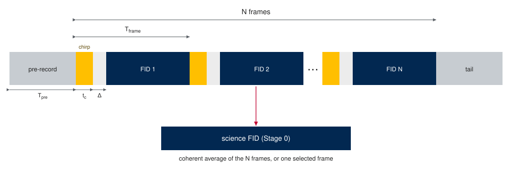

.. index::
   single: scope record
   single: raw scope import
   single: acquisition layout
   single: pre-record
   single: interleave cleanup
   single: chirp-response spur lane
   single: keysight-mat

Scope-Record Import
===================

Some instruments do not hand back a single averaged free-induction decay. A
direct-sampling oscilloscope captures one long record — a quiet pre-record, a
run of chirp/FID frames at a fixed repetition period, and a dead tail — and
leaves the averaging and segmentation to the analyst. The segmentation is
operator knowledge: nothing in the file says where the frames begin. Scope-record
import brings such a capture into the pipeline, performs the record-changing
transforms (frame averaging, ADC-offset cleanup) *inside* the pipeline so they
land in the provenance, and keeps the diagnostic segments the later stages need.

The governing rule is that **any transform that changes the science record happens
in-pipeline**. You can always average a scope record into a bare FID offline and
import that through the generic :doc:`csv or ftmw-hdf5 path <input_formats>`, but
then the provenance and the diagnostic segments are lost. Importing the raw record
keeps both.

The segmented record
--------------------

   A segmented scope record (schematic, not to scale). One long capture holds a
   quiet **pre-record**, :math:`N` **chirp/FID frames** at a fixed period, and a
   dead **tail**; each frame is a chirp excitation, a hold-off while the chamber
   settles, then the molecular FID. The science FID handed to Stage 0 is the
   coherent average of the frames, or a single selected frame. The pre-record — a
   stretch with no chirp excitation — is kept as a diagnostic segment because it
   anchors the chirp-response spur test. Symbols: :math:`T_\text{pre}` pre-record
   duration; :math:`T_\text{frame}` frame period; :math:`N` frame count;
   :math:`t_c` chirp duration; :math:`\Delta` start hold-off (ring-down settling
   plus margin) after the chirp.

The import is parameterized by what the operator knows about the capture:

- ``pre_record_us`` — the duration of the quiet segment before the first chirp;
- ``frame_period_us`` — the repetition period of the frames;
- ``n_frames`` — how many frames the record holds.

From those three the record is sliced into the pre-record, the per-frame array,
and the tail. By default the frames are coherently averaged into the science FID
(the averaging gain that a hardware-averaging instrument would have applied
itself). Two options change that:

- ``frame=k`` imports a single frame ``k`` as the science FID instead of the
  average — one ``.ftmw`` per frame, for per-frame or time-dependent analysis
  (it batches the same way Blackchirp writes one record per frame);
- ``keep_frames`` retains the full per-frame array in the file (off by default;
  the frames are large and are discarded after averaging unless asked for).

The averaging is a plain mean — no robust averaging or frame rejection.

Importing a Keysight record
---------------------------

The shipped loader is ``keysight-mat``, for Keysight oscilloscope ``.mat`` files
(MATLAB v7.3, which is HDF5 underneath). It reads the raw samples and the sample
clock, vertical scaling, and instrument identity, and is auto-detected from the
``.mat`` extension and the file's channel structure. It is a thin vendor loader —
other vendors' raw formats are future sibling loaders, not options on this one.

.. code-block:: console

   $ ftmwpipeline data import exp.ftmw scope.mat --format keysight-mat \
       --pre-record-us 12.5 --frame-period-us 20 --n-frames 19 \
       --interleave-factors 16,512

   # Import one frame as the science FID instead of the average:
   $ ftmwpipeline data import exp_f3.ftmw scope.mat --format keysight-mat \
       --pre-record-us 12.5 --frame-period-us 20 --n-frames 19 --frame 3

The same parameters flow through the functional API and the ``Pipeline``
constructor:

.. code-block:: python

   import ftmwpipeline.api as ftmw

   ftmw.import_data(
       "exp.ftmw",
       source="scope.mat",
       format_name="keysight-mat",
       pre_record_us=12.5,
       frame_period_us=20.0,
       n_frames=19,
       interleave_factors=[16, 512],
   )

A multi-channel file needs an explicit ``--channel`` (it defaults to the sole
channel when only one is present). After import, ``data show`` prints the
acquisition-segment map — the pre-record and tail lengths, the frame period and
count, and whether the per-frame data was retained — alongside the usual FID
summary.

Direct-sampling instruments digitize the molecular band directly (no
down-conversion), so the probe frequency is zero and the digitized baseband *is*
the molecular frequency. The rest of the pipeline treats the result like any other
Stage 0 FID; the only difference is what import recorded along the way.

What import persists
--------------------

Alongside the science FID, Stage 0 stores the acquisition segments — the
pre-record, the tail, the segment map, and (only under ``keep_frames``) the
frames — plus the ADC-cleanup patterns if cleanup ran. The source provenance
records the layout parameters, the frame selection, and the cleanup factors, so a
re-import of the same source with the same parameters is a safe no-op, while a
different frame selection or layout is recognized as a different import and
re-runs the affected stages (see :doc:`Stage 0 <stage0_import>` for the
re-import contract).

The pre-record as a spur anchor
-------------------------------

Keeping the pre-record pays off in :doc:`Stage 5 <stage5_fitting>`. A molecular
line only exists if a chirp excited it, so a real line is absent from the
pre-record (or weak, decaying from the previous frame's chirp). An external
interfering tone — a clock or LO leakage — is present in the pre-record at full
strength because it does not need the chirp. Comparing the band power at a
candidate frequency in the pre-record against the FID window is therefore a direct
test of whether a "line" is instrumental:

- ratio near one → present without the chirp → **gate** it as interference;
- ratio near zero → only appears with the chirp → **protect** it as molecular;
- in between → **inconclusive**, and the other spur lanes (the clock lattice, the
  decay probe) decide.

This chirp-response test runs ahead of the decay probe, because a modulated
carrier can mimic an FID decay and fool a decay test — but it cannot hide from
the pre-record. It only arbitrates tones bright enough to rise above the
pre-record's own noise floor (which is worse than the averaged FID's by roughly
the square root of the frame count); weaker candidates fall to the other lanes.

Interleave-offset cleanup
-------------------------

A high-rate digitizer is built from several slower ADCs interleaved in turn. Tiny
fixed voltage offsets between those sub-converters repeat every ``M`` samples and
appear in the spectrum as a comb of tones at multiples of ``f_s / M``. Because the
offsets are a fixed per-phase DC pattern, they can be estimated and removed:
``--interleave-factors`` (for example ``16,512``) declares the interleave depths,
and the import estimates each per-phase mean on the **raw pre-record samples**
(before voltage scaling, where the pattern is cleanest) and subtracts the tiled
pattern from the whole record before slicing.

The cleanup is partial by design — part of the comb rides the signal path, not
just the ADC, so the subtraction reduces but does not erase it. What it leaves
behind is handled by the clock-lattice gate: the cleanup's own ``f_s / M`` comb
frequencies are written to the recommended clock declaration (as locked sources),
so the :doc:`spur lattice <clock_declaration>` knows to expect them.

One subtlety matters for trusting the spur lane. The cleanup estimates its pattern
*on the pre-record*, so it nulls those comb frequencies in the stored pre-record
exactly — a manufactured silence. An unguarded chirp-response test would read that
silence as "absent without the chirp" and wrongly protect a clock tone. The probe
therefore returns *inconclusive* at the cleanup-comb frequencies and lets the
lattice and decay lanes decide. The general lesson is worth stating: any
preprocessing estimated on a reference segment manufactures absence in that segment
at its own correction frequencies, and any later statistic on that segment must
exclude them.

The chirp window and the FID start
----------------------------------

The FID must start only after the excitation chirp and the switch ring-down have
cleared. How long that takes is a property of the instrument — how quickly its
chamber and switches settle — not of the digitizer; some instruments settle in a
fraction of a microsecond, others ring for several (the example Keysight record is
one of the latter, its chamber being lightly absorbed). Scope-record import lets
you declare the chirp window at import time (``--chirp-start-us`` /
``--chirp-end-us`` / ``--start-margin-us``), and the margin is where you allow for
whatever ring-down your instrument has.

This feeds the same declared-chirp-window path :doc:`Stage 0 start-time detection
<stage0_import>` already uses: a declared chirp end sets the recommended start to
``chirp_end + margin`` and is treated as authoritative, with the energy-sweep
detector running only as a cross-check that warns on disagreement. See the Stage 0
page for the detection mechanics; here the point is simply that the declaration
travels in from the import. (A Blackchirp import derives the same window from the
experiment configuration automatically.)

Interfaces
----------

Scope-record import is the same Stage 0 import surface used everywhere, with the
layout parameters added:

- CLI — ``data import <file> <source> --format keysight-mat`` with
  ``--pre-record-us`` / ``--frame-period-us`` / ``--n-frames`` (required) plus the
  optional ``--frame`` / ``--keep-frames`` / ``--channel`` /
  ``--interleave-factors`` / ``--chirp-start-us`` / ``--chirp-end-us`` /
  ``--start-margin-us``; ``data show`` surfaces the segment map.
- Functional API and ``Pipeline`` — ``import_data(...)`` /
  ``Pipeline.create(...)`` take the same parameters as keyword arguments.

The segments and cleanup patterns travel with the ``.ftmw`` file, so a recipient
reproduces the fit — including the spur decisions that depend on the pre-record —
from the file alone.
