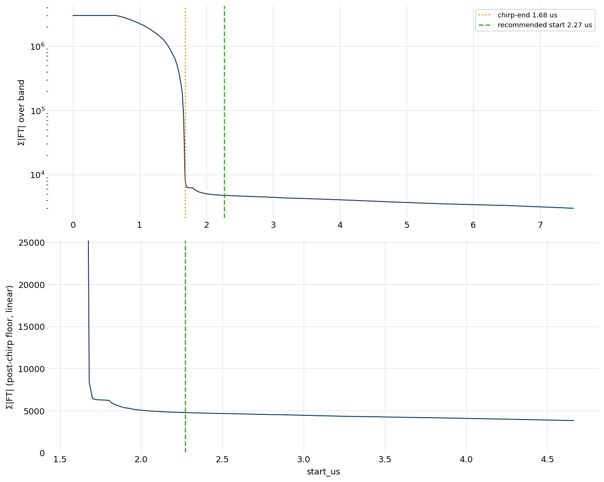

.. index::
   single: data import
   single: free-induction decay
   single: data loaders
   single: format detection
   single: start-time detection
   single: source provenance

Stage 0: Data Import
====================

Importing is the first step of every analysis: it reads a raw free-induction
decay (FID) from an instrument format and writes it, with its acquisition
parameters and a record of where it came from, into a new ``.ftmw`` file. No
signal processing happens here — the FID is stored losslessly — but two things
are decided that the rest of the pipeline depends on: which format the data is
in, and where the molecular signal begins.

What import produces
--------------------

A single import creates the file and populates its Stage 0 content: the raw
time-series, the acquisition metadata (sample spacing, probe frequency,
sideband, shot count, and the derived point count and duration), and the
:ref:`source-provenance record <input-provenance>`. Any format-supplied hints —
a recommended processing start, declared clock sources, a declared chirp window
— are persisted alongside it. The structure of the resulting file, and what is
stored versus recomputed later, is described on :doc:`file_format`.

Running an import
-----------------

The command names the file to create and the data source:

.. code-block:: console

   $ ftmwpipeline data import exp_2638.ftmw examples/blackchirp_data/2638/

The same operation is available on the Python interfaces:

.. code-block:: python

   import ftmwpipeline.api as ftmw
   ftmw.import_data("exp_2638.ftmw", source="examples/blackchirp_data/2638/")

   # or, object-oriented
   from ftmwpipeline import Pipeline
   Pipeline.create("exp_2638.ftmw", source="examples/blackchirp_data/2638/")

Formats and detection
---------------------

The data source is matched against a registry of format loaders. By default the
format is detected automatically; ``--format`` selects one explicitly, which is
also how an ambiguous source is disambiguated. The registered formats are:

.. list-table::
   :header-rows: 1
   :widths: 20 80

   * - Format
     - Source
   * - ``blackchirp``
     - A native Blackchirp experiment directory; acquisition parameters are read
       from the experiment's own metadata, and the instrument clock tree is
       extracted automatically.
   * - ``ftmw-hdf5``
     - The native self-describing HDF5 input format — the recommended no-code
       path for other instruments. See :doc:`input_formats`.
   * - ``csv``
     - A column of voltage samples, with metadata supplied as options or in a
       sidecar. See :doc:`input_formats`.
   * - ``keysight-mat``
     - A Keysight oscilloscope record (MATLAB ``-v7.3``). Raw scope records have
       their own page, :doc:`scope_record_import`.

``ftmwpipeline formats`` lists the registered formats and their load options.
Importing data from an instrument not covered here is a matter of shaping it
into ``ftmw-hdf5`` or ``csv``, or writing a small loader — all three are
documented on :doc:`input_formats`, which is the reference for the input layouts,
the metadata sidecar, and declaring instrument clock sources.

.. _input-provenance:

Source provenance and safe re-import
------------------------------------

The file records where its data came from: the source path, the source
modification time, a content hash, the import timestamp, the format name, and
the load options. This record makes re-import deterministic. Re-importing the
*same* source onto an existing file is recognized and is non-destructive — the
existing analysis is reused, so re-running an import cell in a notebook does not
discard downstream work — while importing a *different* source onto an existing
file is refused unless overwriting is requested explicitly (``--force``). The
provenance record and the error conditions are detailed on :doc:`file_format`.

.. index::
   single: chirp; start detection
   single: ring-down

Start-time detection
--------------------

A chirped-pulse experiment often records the excitation chirp and the switch
ring-down *before* the molecular FID. Fourier-transforming from the very start
of the record folds that broadband transient into the spectrum, so the pipeline
processes the FID from a start time chosen to clear it. Stage 0 determines that
start time.

The detector sweeps a candidate start across the record and, at each position,
integrates the Fourier-transform magnitude over the active band. While the
analysis window still contains the chirp, the integrated magnitude sits on a
high plateau; once the window clears the chirp, it collapses by two to three
decades to a post-chirp floor. The detector locates that collapse — the chirp
end — and adds a short instrument-specific guard margin for the switch ring-down
to yield the recommended start.

   Start-time detection on the example experiment. *Top:* the integrated
   FT magnitude across candidate start times (log scale) — the pre-chirp
   plateau, the two-to-three-decade collapse at the chirp end (dotted), and the
   recommended start past the ring-down guard margin (dashed). *Bottom:* a
   linear zoom on the post-chirp floor where the ring-down shoulder settles into
   the molecular tail.

When the source declares its chirp timing (a ``chirp_end_us``, from a Blackchirp
experiment, a scope import, or the :ref:`chirp window <input-chirp-window>` of a
generic import), that declaration sets the recommended start directly and the
sweep runs only as a cross-check, warning if the two disagree. A declared start
is the dependable choice on very high signal-to-noise data, where the magnitude
plateau and floor are less cleanly separated.

The detection is inspected and adjusted through the ``start`` command:

.. code-block:: console

   $ ftmwpipeline start show exp_2638.ftmw     # plot the sweep and the chosen start
   $ ftmwpipeline start run exp_2638.ftmw       # (re)compute the recommended start

The recommended start becomes the default ``start_us`` for :doc:`Stage 1
<stage1_ft>`; like every stage parameter it can be overridden, and how those
overrides resolve against the recommendation is described on
:doc:`settings_and_presets`.
