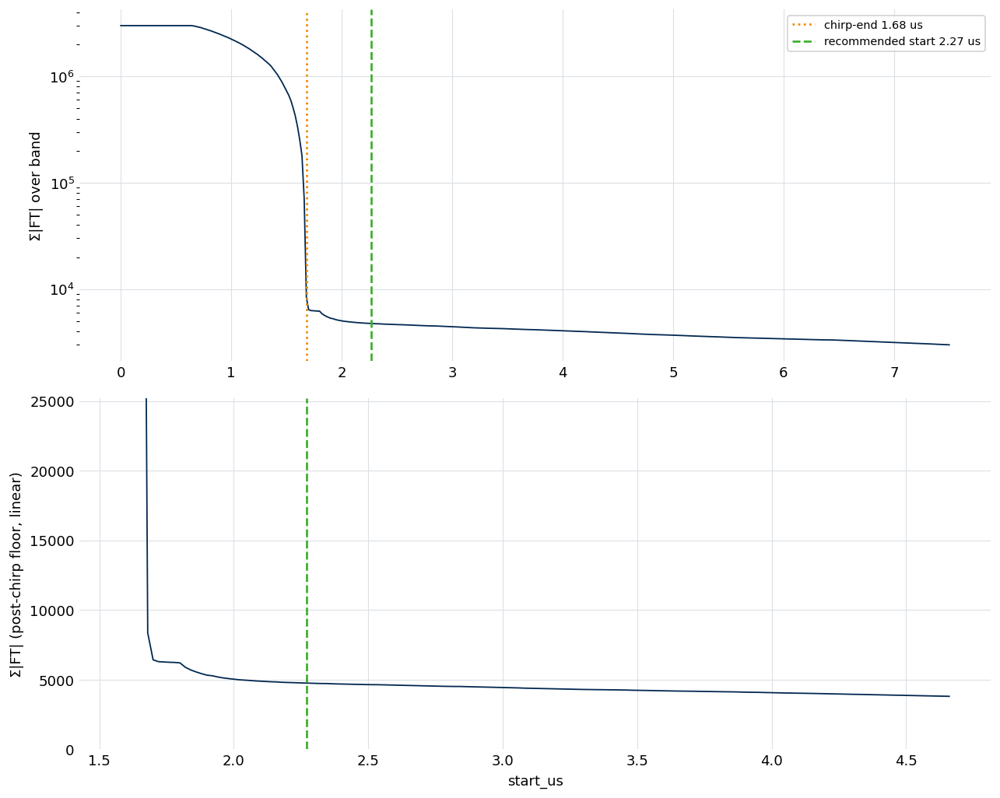

.. index::
   single: data import
   single: free-induction decay
   single: data loaders
   single: format detection
   single: start-time detection
   single: source provenance

Stage 0: Data Import
====================

Overview
--------

Stage 0 is the entry point of every analysis: it reads a raw free-induction decay
(FID) from an instrument format and writes it, with its acquisition parameters and
a record of its origin, into a new ``.ftmw`` file. No signal processing occurs
here; the FID is stored losslessly. Two decisions are made that the rest of the
pipeline depends on: which format the data is in, and where the molecular signal
begins.

The import creates the file and populates its Stage 0 content: the raw time-series,
the acquisition metadata (sample spacing, probe frequency, sideband, shot count,
and the derived point count and duration), the
:ref:`source-provenance record <input-provenance>`, and any format-supplied hints
— a recommended processing start, declared clock sources, a declared chirp window.
The file structure, and what is stored versus recomputed later, is described on
:doc:`file_format`.

Method
------

Import proceeds in three steps, with an optional fourth for chirped data. First,
the data source is matched against the registry of format loaders — automatically
by default, or with an explicit ``--format``. Second, the matched loader reads the
raw FID and its acquisition metadata and writes them losslessly into the new file.
Third, the source path, content hash, and load options are recorded as a provenance
record that makes re-import deterministic. Finally, for a chirped-pulse experiment
whose record begins before the molecular FID, Stage 0 determines the processing
start time that clears the excitation chirp and switch ring-down. The remainder of
this page expands each step.

Input formats
-------------

The data source is matched against a registry of format loaders. The format is
detected automatically by default; ``--format`` selects one explicitly, which is
also how an ambiguous source is disambiguated. The registered formats are:

.. list-table::
   :header-rows: 1
   :widths: 20 80

   * - Format
     - Source
   * - ``blackchirp``
     - A native Blackchirp experiment directory; acquisition parameters are read
       from the experiment's own metadata, and the instrument clock tree is
       extracted automatically.
   * - ``ftmw-hdf5``
     - The native self-describing HDF5 input format — the recommended no-code path
       for other instruments. See :doc:`input_formats`.
   * - ``csv``
     - A column of voltage samples, with metadata supplied as options or in a
       sidecar. See :doc:`input_formats`.
   * - ``keysight-mat``
     - A Keysight oscilloscope record (MATLAB ``-v7.3``). Raw scope records have
       their own page, :doc:`scope_record_import`.

``ftmwpipeline formats`` lists the registered formats and their load options.
Importing data from an instrument not covered here is a matter of shaping it into
``ftmw-hdf5`` or ``csv``, or writing a small loader — all three are documented on
:doc:`input_formats`, the reference for the input layouts, the metadata sidecar,
and declaring instrument clock sources.

.. _input-provenance:

Source provenance
-----------------

The file records where its data came from: the source path, the source
modification time, a content hash, the import timestamp, the format name, and the
load options. This record makes re-import deterministic. An import onto an
existing file is the *same* source when the source path, the format name, and
the load options are all equal and the source modification time agrees to
within one second; the content hash is recorded for provenance but not
compared. Re-importing the same source is non-destructive: the existing
analysis is reused, so re-running an import cell in a notebook does not discard
downstream work. Importing anything else onto an existing file — a different
path, a different format, or the same source with different load options — is
refused with a ``file_exists`` error. ``--force`` (``force=True``) overwrites
the file instead, which discards every stage it held; the import result lists
those stages as ``invalidated``. The provenance record is detailed on
:doc:`file_format`.

.. index::
   single: chirp; start detection
   single: ring-down

Start-time detection
--------------------

A chirped-pulse experiment often records the excitation chirp and the switch
ring-down *before* the molecular FID. Fourier-transforming from the start of the
record folds that broadband transient into the spectrum, so the pipeline processes
the FID from a start time chosen to clear it. Stage 0 determines that start time.

The detector sweeps a candidate start across the record and, at each position,
integrates the Fourier-transform magnitude over the active band. While the analysis
window still contains the chirp, the integrated magnitude sits on a high plateau;
once the window clears the chirp, it collapses by two to three decades to a
post-chirp floor. The detector locates that collapse (the chirp end) and adds a
short instrument-specific guard margin for the switch ring-down to yield the
recommended start.

   Start-time detection on the example experiment. *Top:* the integrated FT
   magnitude across candidate start times (log scale) — the pre-chirp plateau, the
   two-to-three-decade collapse at the chirp end (dotted), and the recommended
   start past the ring-down guard margin (dashed). *Bottom:* a linear zoom on the
   post-chirp floor where the ring-down shoulder settles into the molecular tail.

When the source declares its chirp timing (a ``chirp_end_us``, from a Blackchirp
experiment, a scope import, or the :ref:`chirp window <input-chirp-window>` of a
generic import), that declaration sets the recommended start directly and the sweep
runs only as a cross-check, warning if the two disagree. A declared start is the
dependable choice on very high signal-to-noise data, where the magnitude plateau
and floor are less cleanly separated.

The import itself already records a recommended start when the source supplies
one: an experimenter-recorded start (a Blackchirp ``FidStartUs``), or else the
declared chirp end plus the guard margin. ``start run`` replaces that
recommendation with its own. On the example experiment the import records
2.35 µs (the experimenter's start) and ``start run`` recommends 2.27 µs (the
declared 1.60 µs chirp end plus the 0.67 µs guard margin).

.. _stage0-detector-settings:

Tuning the detector
-------------------

The detector's knobs are ``StartDetectionSettings``. Each is reachable through
``start run --<knob>`` (the integration band as ``start run --band MIN MAX``)
and, through the whole-pipeline :doc:`run` command, as ``run --start.<knob>``.
The recommended start is what the first :doc:`Stage 1 <stage1_ft>` run
inherits as ``start_us`` (``run`` can also override it outright with
``--ft.start-us``). Defaults are tuned on the Blackchirp
2638-family instrument (LO 40960 MHz, lower sideband); the knobs are exposed for
retuning on other instruments.

``guard_margin_us``
   Margin added to the detected chirp end to clear the switch-bounce ring-down;
   the recommended start is ``chirp_end + guard_margin_us`` (default ``0.67``).
   It is the most instrument-specific knob — the ring-down length varies by
   switch — so it is the first to retune on a new instrument.
``sweep_max_us``
   Upper bound of the candidate-start sweep, capped to the FID duration
   (default ``7.5``). It must clear the chirp end plus the post-chirp molecular
   tail that the floor estimate uses.
``step_us``
   Sweep step (default ``0.02``). A finer step resolves the chirp-end corner
   more precisely, at linear cost.
``floor_factor``
   The chirp end is the first candidate start where the integrated
   Fourier-transform magnitude falls below ``floor_factor`` times the deep-tail
   floor (default ``3.0``). The collapse spans two to three decades, so any
   factor within a few times the floor lands on the same corner.
``floor_tail_us``
   Width of the deep-tail window at the end of the sweep used for the robust
   floor estimate (default ``1.0``).
``min_chirp_drop_ratio``
   Minimum plateau-to-floor ratio for the collapse to be treated as present
   (default ``10.0``). Below it the start time cannot be inferred from the data
   — there is no excitation transient in the recorded FID — and the detector
   declines to recommend one.
``band_min_mhz`` / ``band_max_mhz``
   Optional explicit integration band for the sweep (``start run --band MIN
   MAX``). Unset, the detector uses
   the persisted Stage 1 frequency trim, falling back to the full positive
   spectrum.

Running the stage
-----------------

The import command names the file to create and the data source:

.. code-block:: console

   $ ftmwpipeline data import exp_2638.ftmw examples/blackchirp_data/2638/

The same operation on the Python interfaces:

.. code-block:: python

   import ftmwpipeline.api as ftmw
   ftmw.import_data("exp_2638.ftmw", source="examples/blackchirp_data/2638/")

   # or, object-oriented
   from ftmwpipeline import Pipeline
   Pipeline.create("exp_2638.ftmw", source="examples/blackchirp_data/2638/")

Start-time detection is inspected and adjusted through the ``start`` command:

.. code-block:: console

   $ ftmwpipeline start show exp_2638.ftmw     # plot the sweep and the chosen start
   $ ftmwpipeline start run exp_2638.ftmw       # (re)compute the recommended start

The recommended start is the default ``start_us`` only until
:doc:`Stage 1 <stage1_ft>` has run. The first ``ft run`` stores the start it
used, and from then on that stored Stage 1 record is authoritative: a later
``start run`` updates the recommendation (shown by ``start show``) but changes
nothing Stage 1 is read as having used. To adopt a new start on a file that
already has Stage 1, re-run it explicitly, ``ft run --start-us 2.27``, which
discards every stage built on the old spectrum. How overrides resolve against
the recommendation is described on :doc:`settings_and_presets`.
