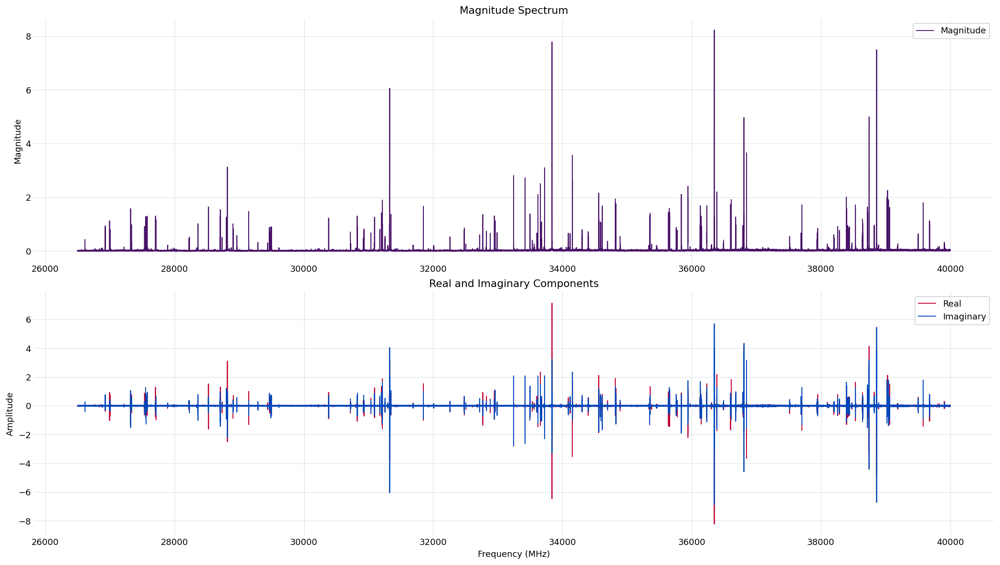

.. index::
   single: Fourier transform
   single: persisted FT settings
   single: active region
   single: frequency trim
   single: molecular frequency
   single: sideband

Stage 1: Fourier Transform
==========================

Overview
--------

Stage 1 transforms the raw free-induction decay into the frequency-domain spectrum
and fixes the settings that define it. It selects the active region of the record,
removes its DC offset, computes the discrete Fourier transform, maps the result
onto molecular frequency, and restricts it to the analysis band. The settings that
govern this transform -- the active region, the analysis band (``trim``), and the
display scale -- are the experiment's *persisted* FT settings: once stored, they are
the agreed active region and analysis band every later stage builds from. Noise
estimation, peak detection, window assignment, and fitting do not measure on this
zero-substituted spectrum directly; each rebuilds the **active FT** (see
:doc:`stage2_noise`) -- the transform of just the active region, unpadded -- from
the persisted FID and these same settings, so they all work from one consistent
recipe even though the array they measure on differs from the one shown here.

The transform yields a complex spectrum on a molecular-frequency axis in MHz. The
spectrum is not stored in the ``.ftmw`` file; instead, Stage 1 persists the
resolved settings, and the lightweight file model recomputes the spectrum
on demand from the stored FID and those settings. Recomputation is deterministic,
so any interface that opens the file reconstructs exactly the same spectrum. The
file model, and what is stored versus recomputed, is described on
:doc:`file_format`.

Method
------

Stage 1 performs a fixed sequence of operations, none of which weights or
interpolates the FID samples: the active region is selected and its DC offset
removed, the discrete Fourier transform is taken at native length, the baseband
axis is mapped to molecular frequency, and the spectrum is restricted to the
analysis band (``trim``).

The transform is unconditionally **unapodized, un-windowed, and native-length** —
no window function is applied to the FID, no exponential decay is multiplied in, and
the record is not zero-padded. This is a deliberate choice. Apodization trades
frequency resolution for lower sidelobes and biases the line shape, and zero-padding
interpolates the spectrum between true bins, which corrupts the per-bin noise
statistics that Stage 2 measures and the χ² statistics that the Stage 5 fit relies
on. The robust per-window fit is the pipeline's substitute for those conventional
display-time treatments: it models the finite-acquisition line shape directly on the
unmodified spectrum, so the FT is left faithful to the data.

The only operations performed on the FID are data *selection* and a baseline
correction:

* **Active-region selection** (``start_us`` / ``end_us``) zeroes the record outside
  the chosen time window. The default ``start_us`` is the recommended start from
  :doc:`Stage 0 <stage0_import>`, which clears the excitation chirp and switch
  ring-down; an explicit value overrides it.
* **DC removal** subtracts the mean of the active region before the transform,
  suppressing the zero-frequency spike. This is automatic.

Molecular frequency and sideband
--------------------------------

The transform is taken over the digitizer's baseband frequencies, which are then
mapped to molecular frequency using the probe frequency and the sideband recorded
at import. For an upper-sideband measurement the molecular frequency is the probe
frequency plus the baseband frequency; for a lower-sideband measurement it is the
probe frequency minus the baseband frequency. The resulting axis is in MHz and
increases with molecular frequency, so downstream stages and plots read directly in
laboratory units.

Running the stage
-----------------

The command computes the FT and persists the resolved settings:

.. code-block:: console

   $ ftmwpipeline ft run exp_2638.ftmw --trim 26500:40000

The same operation on the Python interfaces:

.. code-block:: python

   import ftmwpipeline.api as ftmw
   ftmw.compute_ft("exp_2638.ftmw", trim=(26500, 40000))

   # or, object-oriented
   from ftmwpipeline import Pipeline
   pipe = Pipeline.open("exp_2638.ftmw")
   pipe.compute_ft(trim=(26500, 40000))

Because the FT is unapodized and native-length, the only parameters are
the active-region bounds, the analysis band, and a display scale:

.. list-table::
   :header-rows: 1
   :widths: 24 18 58

   * - Parameter
     - CLI flag
     - Meaning
   * - ``trim``
     - ``--trim MIN:MAX``
     - The analysis band in MHz, given as a colon-delimited range. The spectrum is
       restricted to this range, which is the active FT that later stages operate
       on. For the example experiment the active band is ``26500:40000``.
   * - ``start_us``
     - ``--start-us``
     - Start of the active region in microseconds. Defaults to the Stage 0
       recommended start.
   * - ``end_us``
     - ``--end-us``
     - End of the active region in microseconds. Defaults to the end of the record.
   * - ``units_power``
     - ``--units-power``
     - Power-of-ten display amplitude scale (``6`` for µV). Affects only the
       reported amplitudes, not the analysis.

The ``--trim`` range uses the same ``MIN:MAX`` form as the persisted settings and
the whole-pipeline :doc:`run command <quickstart>`. How an explicit value resolves
against a persisted or recommended one is described on :doc:`settings_and_presets`.

Committing and re-running the transform
---------------------------------------

When the transform is run as a user action (the CLI ``ft run``, or
:func:`~ftmwpipeline.api.compute_ft` with explicit settings), the resolved settings
(including the frequency ``trim``) are written as the experiment's persisted FT
settings, and Stage 1 is marked complete. Every later stage reads back exactly
these settings and rebuilds its own working spectrum (the active FT) from them, so
the noise estimate, the peak list, the window plan, and the fit are all defined
against one consistent set of settings.

Changing these settings therefore invalidates that downstream work. If
``ft run`` is repeated with settings that differ from the stored ones, the results
that depend on the FT (Stage 2 noise and everything after it) are removed and a
warning is logged, so they are recomputed against the new settings rather than
silently mixed with stale results. Repeating the transform with identical settings
changes nothing, which keeps re-running an import-and-FT cell in a notebook safe.

Inspecting the transform
------------------------

``ft show`` renders the complete FID-to-spectrum workflow (the raw FID with the
active-region bounds marked, the active FID -- just the active-region slice,
DC-removed -- and the magnitude and real/imaginary spectrum panels) for a set of
parameters, without storing them. The spectrum panels render the zero-padded,
active-band **display** FT (the same surface :doc:`Stage 5 <stage5_fitting>`'s
report and ``fit show`` use to interpolate the magnitude curve between native
bins); it is a display convenience only -- Stage 2's noise estimate and the
Stage 5 fit still measure on the unpadded, native-length active FT described
above. This is the tool for trying parameters before committing them with
``ft run``:

.. code-block:: console

   $ ftmwpipeline ft show exp_2638.ftmw --start-us 2.0 --trim 26500:40000

The view is interactive by default; ``--no-interactive --output <path>`` writes a
static image instead. Visualization never persists settings — once a choice looks
right, re-run ``ft run`` with it to persist it.

   The zero-padded, active-band display FT of the example experiment over the
   ``26500:40000`` MHz active band. *Top:* the magnitude spectrum. *Bottom:* the
   real and imaginary components on the same molecular-frequency axis. Display
   only: the extra zero-fill bins interpolate the magnitude curve between the
   native bins and are never scored on -- Stage 2's noise estimate and the
   Stage 5 fit both measure on the unpadded, native-length active FT instead.

The persisted settings are the input to :doc:`Stage 2 <stage2_noise>`, which
rebuilds the active FT and measures the per-bin noise on it.
