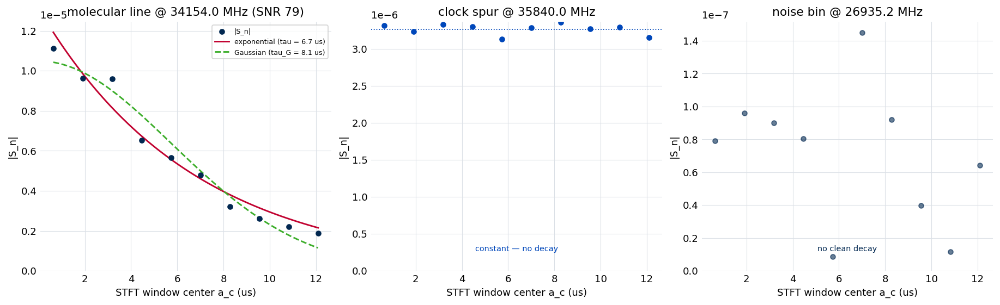
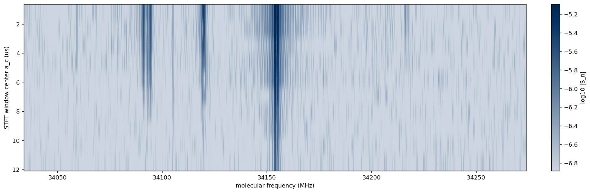
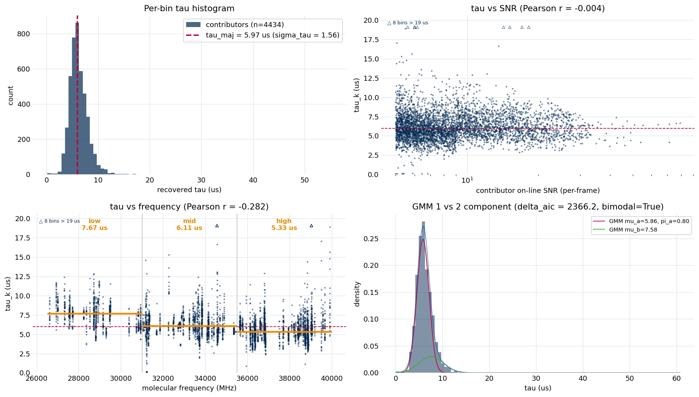

.. index::
   single: decay time
   single: tau calibration
   single: line shape; recommendation
   single: short-time Fourier transform
   single: per-band decay time
   single: clock spur; catalog

Stage 2b: Decay-Time Calibration
================================

A molecular free-induction decay rings down with a characteristic time constant
:math:`\tau`. That decay time sets the natural linewidth of every peak (a longer
:math:`\tau` is a narrower line), so the per-window fit in :doc:`Stage 5
<stage5_fitting>` needs a good starting value and a sensible prior for it.
Stage 2b measures :math:`\tau` directly from the raw FID — before any peak is
detected — and produces a single data-driven decay time :math:`\tau_{maj}` with
a robust spread :math:`\sigma_\tau`, optionally broken down by frequency band.
The same machinery also recommends which **line shape** the fit should use.

The measurement is fit-free: it does not run a least-squares peak fit. It slides
a short analysis window across the FID and reads how the magnitude at each
frequency decays from one window position to the next. A real molecular line
decays; a clock spur does not; noise gives no clean decay at all. The decay
rates of the surviving bins form a histogram, and the calibration reports its
majority.

Stage 2b sits between :doc:`Stage 2 <stage2_noise>` (noise) and :doc:`Stage 3
<stage3_peaks>` (peak detection). It is optional — Stages 3 and 5 run without it
and fall back to a default decay time — but running it is what lets the fit
anchor its line widths on the instrument's real decay physics rather than a
guess.

What the calibration produces
-----------------------------

A completed Stage 2b run persists, for the chosen line shape:

- :math:`\tau_{maj}` and :math:`\sigma_\tau` — the band-wide majority decay time
  and its robust spread;
- **per-band majorities** — the same quantity computed separately on frequency
  bands (by default, the three arithmetic thirds of the analysis range), which
  the fit can route to window-by-window;
- a **clock-spur catalog** — the constant-magnitude (non-decaying) bins, grouped
  into one entry per tone, which later stages use to mask instrumental
  artifacts;
- a set of **acceptance flags** recording whether the calibration is
  well-determined;
- a **line-shape recommendation** stamped onto the file for Stages 3 and 5 to
  read.

The sliding-window STFT
-----------------------

For a single damped cosine
:math:`s(t) = A\,e^{-t/\tau}\cos(2\pi f_0 t + \phi)`, take a short sub-interval
of length :math:`T_w` starting at time :math:`a`, zero everything outside it,
and transform the full-length record. The on-line magnitude is

.. math::

   |S(a, f_0)| = \tfrac{1}{2} A\,\tau\,\bigl(1 - e^{-T_w/\tau}\bigr)\,e^{-a/\tau}
               = \text{constant} \times e^{-a/\tau}.

Sliding the window start :math:`a` across the record traces out a pure
exponential in :math:`a` whose rate is :math:`1/\tau` directly — a
single-parameter read, with no least-squares peak model and no blend ambiguity.
The calibration splits the active region into ``n_seg`` non-overlapping windows
(default ten), so each frequency bin yields a short time series of magnitudes
versus window position.

The transform is taken at the **full record length** with the window's samples
in place and the rest zero-filled, never on the truncated window. Zero-filling
preserves the full-record bin spacing :math:`\Delta f = 1/T_\text{full}`, so
every frame shares one frequency grid and the per-bin time series are directly
comparable. Truncating to :math:`T_w` would double the bin width and break the
comparison.

What each kind of bin looks like across the frames is the whole basis of the
method:

.. list-table::
   :header-rows: 1
   :widths: 34 66

   * - Bin
     - Magnitude versus window position
   * - real molecular line
     - exponential decay :math:`e^{-a/\tau}`
   * - clock spur (continuous tone)
     - constant — no decay
   * - noise bin
     - random walk, no clean exponential
   * - skirt of a strong line
     - same decay rate as its parent line

Because a line's leakage skirt decays at the parent's rate, skirt bins reinforce
the real-line cluster in the histogram rather than forming a spurious one.

   The per-bin magnitude-versus-window series the classifier fits, for three
   representative bins of the example experiment. Left: a strong molecular line,
   with the exponential and Gaussian decay fits overlaid — its decay time is the
   single parameter each contributor bin reports, and the two shape fits are
   what the line-shape vote compares. Center: a clock spur, constant across the
   windows. Right: a noise bin, with no clean decay. The three classes are
   visually distinct, which is what makes the fit-free read robust.

Classifying each bin
--------------------

At each frequency bin the calibration fits the magnitude-versus-position series
to an exponential and sorts the bin into one of four classes:

#. **Discard** — the strongest frame's magnitude is below ``t_sigma`` times the
   per-frame noise floor. Most bins land here.
#. **Spur** — the constant model is preferred over the exponential, or the
   fitted decay time saturates against its upper bound (a continuous tone has
   effectively infinite :math:`\tau`).
#. **Bad fit** — the exponential residual is too large, marking dense or
   contaminated bins (overlapping skirts, mid-blend positions) that should not
   enter the histogram.
#. **Contributor** — everything else. These bins carry the decay times that are
   aggregated into :math:`\tau_{maj}`.

The per-frame noise floor comes from the FID tail, not the :doc:`Stage 2
<stage2_noise>` spectral :math:`\sigma`. The tail slightly over-estimates the
true noise because it still carries decaying signal, and that inflation is
deliberately kept: it acts as a stricter above-threshold gate that admits only
well-determined on-line bins, which is what holds the per-band decay times on an
independent fit-based reference.

From contributors to a decay time
---------------------------------

The contributor decay times are combined into a **signal-to-noise-weighted
majority**: a weighted median, with each bin weighted by its on-line
signal-to-noise. Weighting collapses the estimate onto the strong on-line bins;
a plain median is biased high by near-threshold skirt bins whose noisy fits tend
to run long. The spread :math:`\sigma_\tau` is the weighted interquartile range
rescaled to a standard deviation.

Two refinements run on top:

- **Polish.** The fast log-linear per-bin fit carries a small positive bias at
  intermediate record-length-to-:math:`\tau` ratios. One Gauss-Newton refinement
  step per contributor removes it. The polish is applied only to contributors
  below a signal-to-noise cap (``polish_snr_cap``), because the bias concentrates
  at modest signal-to-noise and the same step over-corrects the strongest bins.
- **Per-band majorities.** The same weighted majority is computed on contributor
  subsets inside each frequency band. A band with too few contributors falls
  back to the band-wide value, so a sparse band never introduces a worse local
  anchor.

A one- versus two-component Gaussian-mixture test runs on the histogram and
flags multimodality. On a single-species recording the decay time is expected to
be unimodal; a genuinely bimodal histogram is surfaced as a flag for a human to
audit rather than acted on automatically.

Two line shapes
----------------

The calibration runs in one of two shape variants, selected by the ``shape``
argument (``--gaussian`` on the command line):

- **Lorentzian** (the default) fits a pure exponential decay
  :math:`e^{-a/\tau}` and is consumed by a Lorentzian Stage 5 fit. Its result is
  stored at ``/stage2b_tau_calibration``.
- **Gaussian** fits a pure-Gaussian envelope :math:`e^{-(a/\tau_G)^2}` and is
  consumed by a Gaussian Stage 5 fit. It keeps only the bins where the Gaussian
  describes the data better than the exponential (by a reduced-:math:`\chi^2`
  margin) and applies a higher signal-to-noise floor, so its eligible pool is
  smaller. Its result is stored at ``/stage2b_tau_G_calibration``.

The two variants are alternative-shape fits to the **same** underlying decay —
one forces a pure-exponential envelope, the other a pure-Gaussian one — not two
physical decay times the molecule has at once. Both can be stored on a single
``.ftmw`` file simultaneously: when the shape vote (below) names the variant a
run did not just compute, the run also builds that one, so whichever shape the
Stage 5 fit ends up using, its matching decay time is already on the file. If the
matching variant is absent, the fit falls back to a default decay time of one
third of the active-region length.

The line-shape recommendation
------------------------------

Which shape *should* the fit use? The recommendation answers this from the data.
On the strong on-line bins it fits all three candidates — exponential, Gaussian,
and Voigt — and holds a signal-to-noise-weighted vote using a small-sample
information criterion. When one pure shape wins by a clear margin the
recommendation is ``lorentzian`` or ``gaussian``; when neither pulls ahead it is
left unset and the fit falls back to its configured default. The verdict is
stamped on the file as a ``recommended_shape`` attribute that :doc:`Stage 3
<stage3_peaks>` and :doc:`Stage 5 <stage5_fitting>` read.

Running a Lorentzian or Gaussian calibration runs the recommendation
automatically (controlled by ``auto_recommend``, on by default) and, when the
vote names the *other* shape, also builds that shape's calibration — so a single
call leaves the file with whichever decay time the fit will actually consume. The
vote can also be run on its own.

Running the calibration
-----------------------

Stage 2b requires Stages 0–2. The default (Lorentzian) calibration:

.. code-block:: console

   $ ftmwpipeline tau run exp_2638.ftmw

The Gaussian variant, and the shape vote on its own:

.. code-block:: console

   $ ftmwpipeline tau run --gaussian exp_2638.ftmw
   $ ftmwpipeline tau recommend exp_2638.ftmw

The same operations on the Python interfaces:

.. code-block:: python

   import ftmwpipeline.api as ftmw

   tau = ftmw.calibrate_tau("exp_2638.ftmw")                     # Lorentzian
   tau_g = ftmw.calibrate_tau("exp_2638.ftmw", shape="gaussian") # Gaussian
   rec = ftmw.recommend_shape("exp_2638.ftmw")

   # or, object-oriented
   from ftmwpipeline import Pipeline
   pipe = Pipeline.open("exp_2638.ftmw")
   tau = pipe.calibrate_tau()
   tau_g = pipe.calibrate_tau(shape="gaussian")

Re-running Stage 2b invalidates the downstream stages that depend on it.

The defaults are calibrated for the reference instrument and need no adjustment
for routine use. The behavior is controlled by the knobs below, set with
per-knob flags on ``tau run`` (e.g. ``--n-seg``), through a preset, or via
``settings=TauCalibrationSettings(...)`` on the Python interfaces; how explicit,
preset, persisted, and recommended values resolve is described on
:doc:`settings_and_presets`.

.. list-table::
   :header-rows: 1
   :widths: 28 14 58

   * - Knob
     - Default
     - Role
   * - ``n_seg``
     - ``10``
     - Number of sliding windows. More windows sharpen each per-bin decay fit
       but lower the per-window signal-to-noise.
   * - ``t_sigma``
     - ``5``
     - Above-threshold gate: a bin's strongest frame must clear this multiple of
       the per-frame noise to be considered.
   * - ``rss_gate_factor``
     - ``5``
     - Strength of the bad-fit gate that rejects dense or contaminated bins.
   * - ``relative_gate_fraction``
     - ``0.05``
     - Signal-proportional branch of the bad-fit gate, needed so clean
       high-signal bins are not over-rejected.
   * - ``min_contributors``
     - ``200`` / ``50``
     - Acceptance floor on the contributor count (Lorentzian / Gaussian).
   * - ``sigma_tau_fraction_max``
     - ``0.20``
     - Acceptance ceiling on the relative spread
       :math:`\sigma_\tau/\tau_{maj}`.
   * - ``polish`` / ``polish_snr_cap``
     - ``true`` / ``9``
     - Apply the Gauss-Newton bias-removal step, to contributors below this
       signal-to-noise.
   * - ``compute_band_majorities``
     - ``true``
     - Compute the per-band decay times the fit routes on.
   * - ``spur_cluster_multiplier``
     - ``1.0``
     - Adjacency, in analysis-grid bins, for collapsing neighboring spur bins
       into one tone.

The Gaussian variant adds its own knobs (the signal-to-noise floor ``snr_min``,
the :math:`\tau_G` fit bounds, and the reduced-:math:`\chi^2` eligibility margin
``delta_chi2r_min``); the per-band split is configurable through
``band_edges_mhz`` and ``band_labels``.

Reading the diagnostics
-----------------------

``tau show`` renders two views (``--gaussian`` selects the Gaussian group). The
**heatmap** (``--kind heatmap``) shows the magnitude across the sliding windows
and the analysis band, so real lines appear as streaks that fade down the
window axis while clock spurs hold constant brightness:

.. code-block:: console

   $ ftmwpipeline tau show --kind heatmap exp_2638.ftmw

   The STFT magnitude heatmap, zoomed to a strong-line neighborhood of the
   example experiment and with the color range clipped so the decays read.
   Window position runs from the earliest at the top to the latest at the
   bottom; a real line is a column that is darkest at the top and fades
   downward, while a clock spur holds the same shade down the whole column.

The **distribution** view (``--kind distribution``) shows the contributor
histogram and the recovered decay time:

.. code-block:: console

   $ ftmwpipeline tau show --kind distribution exp_2638.ftmw

   The decay-time distribution on the example experiment. Top left: the
   contributor histogram with the signal-to-noise-weighted majority
   :math:`\tau_{maj}` overlaid. Top right: per-bin decay time versus
   signal-to-noise. Bottom left: decay time versus molecular frequency, showing
   the band-to-band trend the per-band majorities capture. Bottom right: the
   one- versus two-component Gaussian-mixture fit used for the multimodality
   flag. The two decay-time scatters cap their axis at one and a half times the
   active-region length — decay times beyond that are not reliably measurable —
   and flag any contributor above the cap as an open triangle along the top
   edge.

The same figures are available from Python through
:func:`ftmwpipeline.api.visualize_tau_distribution` and
:func:`ftmwpipeline.api.visualize_tau_heatmap` (and the matching ``Pipeline``
methods), each taking a ``shape`` argument.

When to trust the calibration
-----------------------------

The calibration always returns a decay time, but it records whether that value
is well-determined through three acceptance pre-conditions: enough contributors,
a relative spread :math:`\sigma_\tau/\tau_{maj}` below ``sigma_tau_fraction_max``,
and no strong unexplained bimodality. Failing a pre-condition logs a warning and
sets ``preconditions_passed`` to ``False`` but does **not** block the downstream
stages from consuming :math:`\tau_{maj}` — the flag is guidance for the analyst,
not a gate. On a band whose decay time genuinely varies with frequency, the
band-wide spread can exceed the ceiling while each per-band spread stays
comfortably inside it; the per-band majorities are then the values to trust.

Frequency dependence
--------------------

On the reference instrument the decay time decreases smoothly from the low end
of the band to the high end — roughly a third shorter across the W-band span.
This is a real, reproducible structure, not scatter: the per-band sampling error
is far smaller than the trend. It is consistent with the transmit/receive horn
geometry (a fixed-gain horn's beamwidth narrows with frequency, so the molecular
beam spends less time in the coherent interaction region at higher frequency,
shortening the observed decay). Because the trend is geometric rather than
molecular, the per-band decay times — not a single global value — are the
faithful description, which is why per-band routing is on by default.

What the later stages consume
-----------------------------

- :doc:`Stage 3 <stage3_peaks>` reads the recommended shape and the matching
  decay time as the basis for its gap-pass matched filter.
- :doc:`Stage 5 <stage5_fitting>` uses :math:`\tau_{maj}` (or the per-band value
  for each window, when per-band routing is on) as the starting decay time and
  as the center of a bidirectional prior that resists both over-broadening and
  over-narrowing of the fitted lines, and consumes the spur catalog to mask
  instrumental tones. The :math:`\sigma_\tau` that sets the prior width is
  floored so a very tight histogram cannot make the prior over-confident.

Limitations
-----------

- The strongest on-line bins are classified as bad fits, because real lines are
  not pure single exponentials; their decay times are excluded. The contributor
  population is nonetheless large and representative.
- A spur whose leakage skirt overlaps a real line within about one analysis-grid
  bin can capture that line into the spur class. Lines that close to a strong
  tone were unlikely to fit cleanly in any case.
- Genuinely multi-species recordings, where a minor histogram cluster is a
  distinct species rather than a band-of-the-same-species effect, would need a
  per-species decay time; the calibration flags the multimodality but reports the
  dominant cluster.

The decay-time calibration is the last preparation step before
:doc:`Stage 3 <stage3_peaks>` detects peaks on the noise-referenced spectrum.
