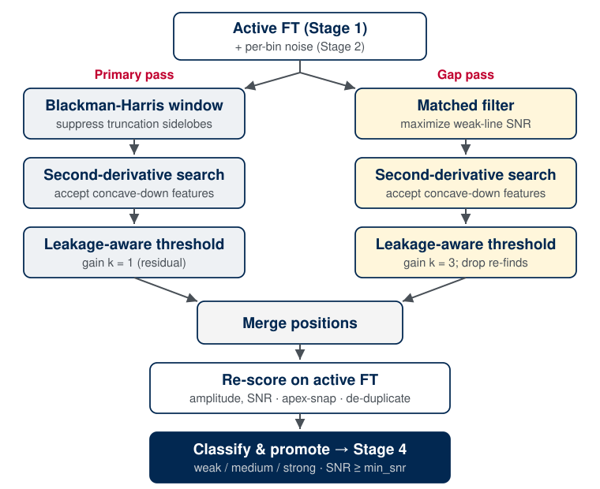

.. index::
   single: peak detection
   single: matched filter
   single: gap pass
   single: leakage-aware detection floor
   single: SNR classification
   single: promotion cutoff
   single: sub-bin position

Stage 3: Peak Detection
=======================

Overview
--------

Stage 3 locates candidate spectral lines in the noise-referenced spectrum from
:doc:`Stage 2 <stage2_noise>` and records them as a classified peak list for
window assignment (:doc:`Stage 4 <stage4_windows>`) and fitting
(:doc:`Stage 5 <stage5_fitting>`). It is a seeding step, not the final line
list: because the pipeline fits unwindowed, full-resolution spectra, lines that
the detector cannot separate are pulled apart later by the per-window fit.
Stage 3 therefore has two objectives: supply the seeds from which Stage 4 builds
its analysis windows, and ensure that no line above the signal-to-noise threshold
is missed.

These objectives fix the operating point. A missed weak line is never fit and is
lost permanently, whereas a spurious or coarse candidate costs little, because the
fit resolves or discards it. Detection is consequently biased toward recall: it
detects aggressively where lines crowd and leaves the final say to the fit and to
the analyst.

A completed run persists an ordered peak list. Each peak carries its **frequency**
and **magnitude** on the active spectrum, its **signal-to-noise ratio**
against the Stage 2 noise, an **SNR classification** (``weak``, ``medium``, or
``strong``), the **pass** that found it (``primary`` or ``gap``), a **promoted**
flag marking whether it clears the cutoff that advances peaks to Stage 4, and its
detection **provenance** (frequency and SNR on the internal detection grid) for
curation. Every detected peak is stored, not only the promoted ones, so the
promotion threshold can be re-chosen without re-running detection, and the list is
a flat enough structure to be hand-edited between Stage 3 and Stage 4 (see
:ref:`stage3-handedit`).

Method
------

Detection proceeds in four steps. First, the active region is transformed twice
through complementary apodizations (a Blackman-Harris window that suppresses
truncation sidelobes, and the line's matched filter that maximizes weak-line
sensitivity), because no single window satisfies both requirements at once.
Second, peaks are localized on each spectrum by a Savitzky-Golay second-derivative
search that accepts only concave-down features. Third, each pass raises its
detection threshold continuously by the local coherent-leakage amplitude,
rejecting a strong line's sidelobe skirt without masking the line itself. Finally,
the merged positions are re-measured on the active FT (the unapodized,
native-length transform that Stage 5 fits), placing every peak on a
common amplitude and signal-to-noise scale, after which peaks are classified and
flagged for promotion. The remainder of this page expands each step.

   The Stage 3 detection workflow. The two passes run on separate apodizations
   and converge on the active FT, where amplitude and signal-to-noise
   are measured once for every peak.

Dual-pass detection
-------------------

A single detector cannot meet both of Stage 3's objectives. A strong line in a
boxcar-truncated spectrum is surrounded by coherent truncation-leakage sidelobes —
a sinc-like ripple skirt that an unapodized detector reads as a picket fence of
spurious weak lines. Suppressing that ripple with a strong window function
broadens every line and buries genuine weak lines next to strong ones. The two
requirements are opposed, so Stage 3 runs two passes on two apodizations and
merges the results.

The **primary pass** establishes robust strong-line positions. It transforms the
active region through a Blackman-Harris window, which all but eliminates the
truncation sidelobes, and locates peaks on the resulting magnitude spectrum. On
the reference experiment this reduces the sidelobe-suspect detection fraction
roughly five-fold. The apodization broadens the lines and loses some weak ones,
which is acceptable: the primary pass need only return a clean, sidelobe-free list
of the strong lines, which also seeds the second pass.

The **gap pass** recovers the weak lines the apodization smears away. It transforms
the active region through the line's matched filter — the time-domain envelope that
maximizes signal-to-noise for a decaying line, :math:`e^{-t/\tau}` for a Lorentzian
instrument and :math:`e^{-(t/\tau)^2}` for a Gaussian one. The decay constant
:math:`\tau` and the envelope shape both come from the
:doc:`Stage 2b <stage2b_tau>` calibration (its majority decay time, or the
Gaussian twin when the line-shape vote recommends Gaussian); absent Stage 2b, the
gap pass falls back to a 5 µs basis. Detections within a small exclusion radius of
a primary peak are discarded as re-finds, so the gap pass contributes only new
lines.

The matched filter is the optimal linear detector for a decaying line: it
concentrates the line energy that an unweighted transform spreads across the skirt,
so at a fixed false-positive load the gap pass recovers more real lines from fewer
candidates. The :doc:`matched-filter methods note
<methods/matched_filter_detection>` derives this result and validates the recall.
The gap pass is enabled by default (``run_gap_pass=False`` / ``--no-gap-pass`` to
disable).

Peak localization
-----------------

Both passes localize peaks with the same operator: a Savitzky-Golay smoothed
second-derivative search. It flags a peak only where the second derivative is
negative (a genuinely concave-down feature) and retains the sharpest such points.
This structural test is what makes the matched filter usable: a per-bin
signal-to-noise threshold alone would accept every bin of a strong line's
monotonically decaying skirt, but those skirt bins are not concave-down maxima and
are rejected, while true line centers are kept. The smoothing window spans about
four line-widths, derived at run time from the grid spacing and the calibrated
line-width (floored at five bins for polynomial stability); on the reference grid
this reproduces the empirical eleven-bin primary-pass window.

Leakage-aware detection threshold
---------------------------------

Neither pass masks a strong line's leakage skirt, because the strong lines are
themselves the source of the coherent leakage and a hard cutoff would delete them.
Each pass instead raises its detection threshold continuously by the local
coherent-leakage amplitude:

.. math::

   \text{threshold}(f) = \text{min\_snr}\cdot\sigma(f)
       + k \cdot \frac{S_\text{coh}(f)}{\sqrt{M}} \cdot \sigma(f).

The added term is the size of the coherent ripple at that frequency, measured by a
complex-domain edge-coherence statistic :math:`S_\text{coh}` over a band of
:math:`M` bins. A genuine line stands well above this floor; a strong line's skirt
ripple, which is that leakage, sits at it and is rejected. The statistic is
computed on the de-ramped spectrum, which exposes the leakage rather than averaging
it away under the active-region phase ramp.

The two passes require different gains :math:`k` because they run on
opposite-leakage spectra. The Blackman-Harris primary has already suppressed most
of the leakage, so its floor is a small residual correction
(``primary_leakage_floor_k = 1``). The matched-filter gap pass retains the full
leakage, so its floor carries all of the suppression and needs a larger gain
(``gap_leakage_floor_k = 3``). Both are per-instrument knobs; setting either to
zero disables that floor.

Amplitude and signal-to-noise estimation
----------------------------------------

The two passes determine positions only. Every reported amplitude, signal-to-noise,
and classification is re-measured on the single **active FT** (the unapodized,
native-length spectrum that :doc:`Stage 5 <stage5_fitting>` fits), so
that all peaks share one signal-to-noise scale and the overlay matches the spectrum
the fit sees. The apodized primary and matched-filter spectra are detection
scaffolding; no apodized amplitude is ever reported.

Re-measuring on the active grid also corrects two position artifacts. The
second-derivative locator lands a few points off the true apex for ultra-narrow
lines, so each detection is **apex-snapped** to the nearest local maximum on the
scoring spectrum, recovering the correct peak height — without this, ultra-narrow
lines under-report their amplitude by tens of percent. Detections that snap to the
same grid point (split-strong-line artifacts, or a line found by both passes) are
then **de-duplicated**, keeping the strongest.

Detection always runs on the Stage 1 active FT, including its frequency trim; there
is no separate Stage 3 trim or zero-padding. Set the analysis band by
running :doc:`Stage 1 <stage1_ft>` with the desired ``--trim`` beforehand.

Classification and promotion
----------------------------

Each peak is classified by signal-to-noise alone into ``weak``, ``medium``, or
``strong`` using two absolute boundaries (default ``10`` and ``50``). Absolute
cutoffs are used rather than percentiles because the detected-peak SNR distribution
is anchored at the detection floor with a heavy upper tail in every regime: across
the reference fixtures, which span three orders of magnitude in line strength, all
three tiers stay populated and the fixed boundaries generalize, where percentile
boundaries would brand half of a sparse spectrum's real lines ``weak``. Only the
``strong`` tier drives the later stages: a strong line is a leakage source, so
:doc:`Stage 4 <stage4_windows>` uses the ``strong`` tier to anchor its window
grouping and to decide which lines are attached as fixed contributors to
neighboring windows their skirts reach. The ``weak``/``medium`` distinction is
curation and reporting labeling, carried for the analyst rather than consumed by an
algorithm.

Detection and promotion are separated, which is what allows aggressive detection
without flooding the later stages:

- The user-facing ``min_snr`` (default ``3``) is the **promotion cutoff**: the
  active-grid signal-to-noise at or above which a peak advances to Stage 4. The
  default sits at the cross-fixture knee where the candidate count transitions from
  noise-and-leakage structure to the real-line plateau.
- Detection itself runs at a fixed lower **internal floor** (``2.0``), independent
  of the promotion cutoff. Detecting at the promotion cutoff and then re-measuring
  on the active grid would lose lines that genuinely clear the cutoff there;
  detecting lower recovers them, and below the internal floor there is only noise.

Each detected peak is persisted with a ``promoted`` flag derived from the stored
cutoff, so re-thresholding is free and an edited list re-derives the flag cleanly.

.. figure:: figures/stage3_peaks.png
   :width: 95%
   :align: center

   Stage 3 detection on the example experiment. Top: the classified peaks over
   the active spectrum (gray) and its per-bin noise, colored by SNR
   tier (green ``weak``, orange ``medium``, red ``strong``), marker-styled by
   pass (circles primary, triangles gap), and filled when promoted or open when
   below the promotion cutoff. The log magnitude axis renders the noise floor and
   the hundreds-of-times stronger lines on one scale. Bottom: the curation panel,
   the signal-to-noise distribution of every detected peak with the promotion
   cutoff marked, used to set the threshold against the visible split between the
   near-noise hump and the real-line tail before peaks move to Stage 4.

Running the stage
-----------------

Stage 3 requires Stages 1 and 2, and consumes :doc:`Stage 2b <stage2b_tau>` when
present:

.. code-block:: console

   $ ftmwpipeline peaks run exp_2638.ftmw
   $ ftmwpipeline peaks show --snr-histogram exp_2638.ftmw

The same operations on the Python interfaces:

.. code-block:: python

   import ftmwpipeline.api as ftmw

   peaks = ftmw.detect_peaks("exp_2638.ftmw")   # all detected peaks
   ftmw.visualize_peaks("exp_2638.ftmw", show_snr_histogram=True)

   # or, object-oriented
   from ftmwpipeline import Pipeline
   pipe = Pipeline.open("exp_2638.ftmw")
   peaks = pipe.detect_peaks()
   promoted = [p for p in peaks if p.properties["promoted"]]

``detect_peaks`` returns the full candidate list (the curation substrate); Stage 4
consumes only the promoted subset. Re-running detection invalidates any Stage 4
window plan built on the old peaks.

The defaults are calibrated for the reference instrument and need no adjustment for
routine use. The behavior is controlled by the knobs below, set with per-knob flags
on ``peaks run`` (e.g. ``--min-snr``), through a preset, or via
``settings=PeakDetectionSettings(...)`` on the Python interfaces; how explicit,
preset, persisted, and recommended values resolve is described on
:doc:`settings_and_presets`.

.. list-table::
   :header-rows: 1
   :widths: 30 14 56

   * - Knob
     - Default
     - Role
   * - ``min_snr``
     - ``3``
     - Promotion cutoff: the active-grid signal-to-noise at or above which a peak
       advances to Stage 4. The main detection control.
   * - ``weak_medium_snr`` / ``medium_strong_snr``
     - ``10`` / ``50``
     - The SNR classification boundaries.
   * - ``run_gap_pass``
     - ``true``
     - Run the matched-filter gap pass that recovers weak lines (``--no-gap-pass``
       to skip it).
   * - ``primary_window``
     - ``blackmanharris``
     - The primary-pass apodization window (sidelobe suppression; affects
       positions only, never reported amplitude).
   * - ``min_exclusion_mhz``
     - ``0.0``
     - Half-width around each primary peak that the gap pass treats as a re-find.
   * - ``sg_window`` / ``sg_order``
     - ``11`` / ``3``
     - The primary-pass Savitzky-Golay smoothing window and polynomial order.

Advanced knobs flow through a preset or a settings bundle rather than per-flag: the
internal detection floor (``internal_min_snr``), the leakage-floor gains
(``primary_leakage_floor_k``, ``gap_leakage_floor_k``), the detection-grid
zero-padding (``detection_zpf``, ``gap_active_zpf``), the grid-aware Savitzky-Golay
rule (``sg_fwhm_coverage``, ``sg_min_window``), and the scatter knobs for the
primary pass's own apodized-domain noise estimate. These rarely need touching.

Inspecting the result
---------------------

``peaks show`` overlays the classified peaks on the active spectrum on a log
magnitude axis. Adding ``--snr-histogram`` appends the curation panel of the
figure above (the signal-to-noise distribution of every detected peak with the
promotion cutoff marked), the view for choosing a promotion threshold
deliberately. By default the command opens an interactive window;
``--no-interactive`` together with ``-o`` saves a static image to the given path
instead.

.. _stage3-handedit:

Curation and the handoff to Stage 4
-----------------------------------

Detection and window assignment are deliberately separate stages, so the
detected-peak list is a curation point: an analyst can load it, add or remove
peaks, adjust the promotion threshold, and re-save before windows are built. The
peak list is persisted as a flat set of equal-length parallel arrays plus the
detection parameters, an on-disk form built to edit. The loader validates the
structure loudly: a missing column, mismatched lengths, or an unknown
classification label raises an error rather than silently dropping data, so a
malformed edit fails immediately rather than corrupting the fit.

The promoted peaks then drive two downstream consumers.
:doc:`Stage 4 <stage4_windows>` builds the analysis windows from the promoted
peaks, using the strong-line classification to decide which clusters need dedicated
handling, and :doc:`Stage 5 <stage5_fitting>` seeds its starting positions from the
detected peaks within each window.

Limitations
-----------

- Detection deliberately smears close lines together where the primary pass's
  apodization or the grid spacing cannot resolve them. This is by design (the
  per-window fit separates them) and means the Stage 3 count is a candidate count,
  not the final line count.
- The continuous leakage floor suppresses, but does not perfectly remove, the
  ripple at the skirts of the very strongest lines; a few near-skirt candidates can
  survive into the list, where the fit and the curation pass resolve them.
- Detection runs on the trimmed active band, so a line outside it is never seen.
  Set the band wide enough at Stage 1 to cover every region of interest.

With a classified, curated peak list in hand, :doc:`Stage 4 <stage4_windows>`
groups the promoted peaks into the disjoint analysis windows the fit runs on.
