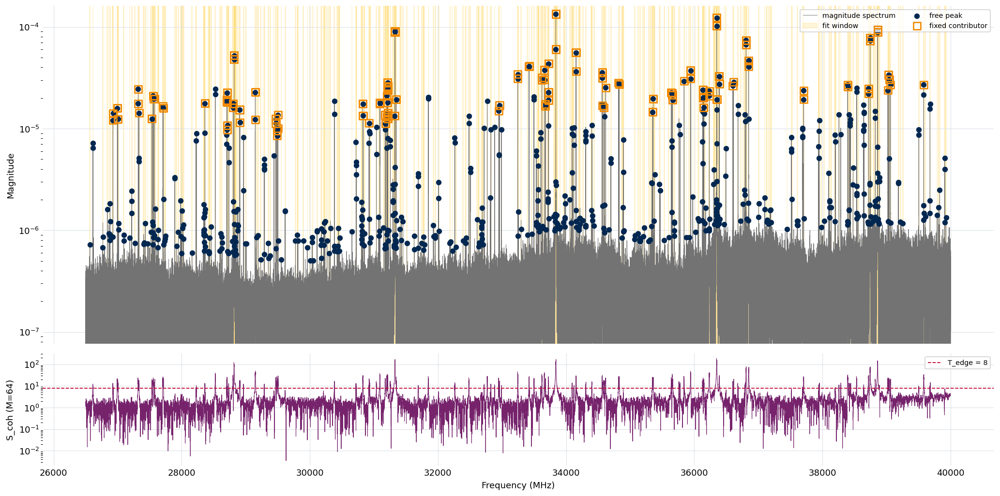

.. index::
   single: window assignment
   single: analysis windows
   single: edge coherence
   single: fixed contributors
   single: leakage skirt
   single: fit dependency order
   single: parallel batches

Stage 4: Window Assignment
==========================

Window assignment turns the promoted peak list from :doc:`Stage 3 <stage3_peaks>`
into a **fit plan**: a set of disjoint frequency windows, each carrying the peaks
:doc:`Stage 5 <stage5_fitting>` should fit freely, the strong neighboring lines
whose leakage skirt must be carried frozen, and a fit-ordering dependency. Stage 4
is **purely structural** — it makes no fits and changes no spectrum. It *classifies
and proposes*; the per-window fit decides the rest, and may revise the plan where
coupling is only visible once the lines are fit.

The reason a fit needs a plan at all is leakage. In a boxcar-truncated spectrum
every strong line is wrapped in a coherent **truncation-leakage skirt** — a
sinc-like ripple that reaches tens of megahertz from the line. A window that
ignores a neighboring strong line's skirt under-fits the lines inside it. Stage 4's
job is to draw window boundaries that do not cut through coherent leakage, and to
attach each strong line's skirt to every window it reaches — so the fit always sees
a complete model of what is in its band.

Two kinds of grouping
---------------------

The plan keeps two distinct notions separate, and conflating them is the usual
source of confusion:

- **Fit windows** are the contiguous frequency spans whose points enter a window's
  least-squares residual. Fit windows are **disjoint and cover each spectrum point
  at most once** — the hard Stage 4 invariant. It guarantees no point's residual is
  double-counted and no line is fit twice.
- **Contributor sets** are the lines whose model terms are *evaluated* over a
  window: its own **free** peaks (amplitude, frequency, and phase fit freely in
  Stage 5) and the out-of-band **fixed contributors** (strong lines fit in *their
  own* window, parameters frozen, contributing only their leakage skirt here).
  Contributor sets **overlap across windows by design** — that is exactly how one
  strong line's leakage is represented in every window it reaches without ever being
  fit twice.

So the plan is not a flat partition of the band. It is an ordered set of fit windows,
each carrying ``(free peaks, fixed contributors)`` and a position in a fit
**dependency graph** — a window depends on the windows that fit its fixed
contributors, because a frozen skirt can only be drawn once its source line has been
fit.

What the plan contains
----------------------

A completed Stage 4 run persists a window plan in which each window carries:

- its **frequency range** — the disjoint span that enters its residual;
- its **free peaks** — references into the Stage 3 list of the lines fit freely here
  (leakage artifacts already pruned out);
- its **fixed contributors** — the out-of-band strong lines whose frozen leakage is
  carried here, each with the id of its owning (primary) window and a
  **freeze-eligibility** flag;
- its **batch** — a parallel-execution group; all windows in a batch are mutually
  independent and depend only on earlier batches;
- per-window **diagnostics** — the trimmed width, the edge-coherence statistic at the
  window edges, the count of pruned leakage artifacts, and so on.

At the plan level it carries the **dependency edges**, a valid **topological order**
for fitting them, and plan-wide diagnostics — including any coherent region that
carries leakage but contains no promoted peak, an early hint that detection may have
missed a line.

The plan is curation substrate, like the peak list: it is persisted in a flat,
hand-editable form (see :ref:`stage4-handedit`) rather than recomputed on demand, so
an analyst can merge, split, or re-scope windows before the fit runs.

The edge-coherence test
-----------------------

Every boundary decision rests on one question: does a proposed window edge sit in
clean noise, or is it still carrying a coherent leakage skirt? A magnitude test
cannot answer it. The finite-acquisition leakage envelope is **phase-coherent**, and
its magnitude passes through zero at every sinc null — so the spectrum can look like
noise (in magnitude) while still carrying fully coherent leakage. The discriminator
is the phase, so the test is a complex-domain one.

For an :math:`M`-point band of complex spectrum values :math:`z_k` with per-bin
complex noise :math:`\sigma`, the **edge-coherence statistic** is

.. math::

   S_\text{coh} = \frac{\bigl|\sum_{k=1}^{M} z_k\bigr|}{\sigma\,\sqrt{M}}.

Under pure noise the complex values point in random directions and the sum grows only
as :math:`\sqrt{M}`, so :math:`S_\text{coh}` sits near :math:`\sqrt{\pi/4}\approx
0.89` regardless of :math:`M`. Under a coherent leakage tail the values share a phase
and add constructively, so the statistic grows as :math:`(L/\sigma)\sqrt{M}` for a
per-bin leakage amplitude :math:`L`. A threshold :math:`T_\text{edge}` therefore
corresponds to a per-bin leakage of :math:`L/\sigma = T_\text{edge}/\sqrt{M}`: the
default :math:`T_\text{edge}=8` at :math:`M=64` flags coherent leakage of at least
about one :math:`\sigma` per bin. The per-bin noise is the **local** value — the
window mean of the :doc:`Stage 2 <stage2_noise>` noise array, which varies several-fold
across the band — never a global median.

One subtlety makes the statistic work on the pipeline's full-record transform. A
strong line's leakage skirt carries a phase ramp from the active-region turn-on, and
that ramp makes the coherent sum cancel — the statistic would read noise-level over
genuine leakage. Stage 4 first **de-ramps** the spectrum to the active-region start,
which removes the ramp and exposes the leakage the test is looking for. The same
de-ramped statistic drives every boundary decision below.

Rolling the statistic across the whole spectrum and thresholding it at
:math:`T_\text{edge}` partitions the band into contiguous **leakage-touched
regions** — the stretches a strong line and its coherent skirt cover. Those regions
are what group the strong lines and attach the fixed contributors.

Building the windows
--------------------

The plan is built in a deterministic sequence — same spectrum in, same partition out,
no randomness:

#. **Leakage-touched map.** Roll :math:`S_\text{coh}` across the de-ramped spectrum
   and threshold it into the leakage-touched regions.
#. **Per-peak proposals.** Each promoted peak proposes a *tight* window — its position
   plus a fixed **margin** of noise on each side. The extent is deliberately *not* the
   leakage-touched run: a strong line's run is tens of megahertz wide, and its distant
   leakage is carried into other windows as a fixed contributor, not by widening this
   one.
#. **Strong-cluster grouping.** Strong lines that share one leakage-touched region are
   mutually coupled — the statistic stays above threshold all the way between them — so
   none can be a frozen background for the others. Their proposals are merged into a
   single joint window. The reference experiment's tight cluster near 36350 MHz is the
   canonical case: the strong doublet at 36349.95/36350.11 MHz and its half-dozen near
   neighbors fall inside one contiguous leakage-touched run, so they fit together in a
   single window. Lines far enough apart that the statistic drops below threshold in the
   gap are *not* joined: the same experiment's 36350 and 36389 MHz lines (39 MHz apart)
   land in separate windows, each carried into the other's neighborhood as a fixed
   contributor rather than by widening one window to span both.
#. **Merge and cap.** Overlapping proposals merge to a fixpoint, giving disjoint spans.
   A span whose **peak content** exceeds the width cap is split at its sparsest interior
   peak gap, so a genuinely over-wide cluster is broken into within-cap windows while a
   cluster that already fits the cap is never bisected. The cap bounds *content* (the
   span between the first and last peak), not the padded width, so a correctly sized
   window is never cut just because of its noise margins.
#. **Trim.** Each window's edges are pulled in to the margin beyond its outermost peak,
   removing empty pedestals and re-centering the lines. A noise-only gap may open between
   two trimmed windows; that is fine — disjoint coverage only has to cover each point at
   most once, and distant leakage is carried by fixed contributors, not by window width.

The width cap is the one count-like bound, and it is a *width*, not a peak count. A
peak-count cap was tried and removed: it fragmented dense clusters into windows too
narrow for the Stage 5 fit to regulate itself, driving both under- and over-fitting.
Bounding by width alone leaves every window enough informative bins for the fit to
behave, while still keeping a dense, very-high-dynamic-range spectrum from collapsing
into one enormous window. The cap has a portable grid-point form
(``max_window_width_points``, the active default) alongside the megahertz form, because
the bin width changes with acquisition length across instruments and the fit's
statistics reason in bins.

Fixed contributors and freeze-eligibility
-----------------------------------------

For each window, every strong line that belongs to a *different* window is tested as a
candidate fixed contributor by predicting the mean amplitude of its leakage skirt on
this window's grid from the analytic finite-acquisition envelope. When that predicted
skirt rises above a small fraction of the window's noise
(``magnitude_attachment_threshold``, default :math:`0.1\,\sigma`), the line is attached
as a fixed contributor and a dependency edge is added — this window must be fit after the
line's own window. A fixed contributor is the strong line's frozen damped-cosine term
evaluated in the dependent window's model, consistent with the Stage 5 least-squares
contract; it is **not** subtracted from the data.

Freezing a line's parameters is only safe if those parameters are well determined. A
fixed contributor whose own signal-to-noise falls below ``min_freeze_snr`` (default
``50``) is flagged **not** freeze-eligible — a candidate for Stage 5's thaw-and-re-fit
handshake, where its parameters are reopened rather than trusted frozen.

Some leakage subtraction would be lost to fit ordering alone. On a dense,
high-dynamic-range spectrum the strong-line neighborhood is densely interdependent, and
forcing every contributor into the fit-ordering graph can create cycles that have to be
broken — dropping the edge, and with it the leakage subtraction. To keep the
subtraction without the ordering, the few most dominant orphaned contributors are kept as
**edge-free**: their frozen amplitude and phase are read directly from the spectrum at
fit time rather than from a predecessor fit, so they carry no ordering edge and survive
the cycle break. This recovery is deliberately capped at the most dominant neighbors so a
dense forest stays targeted rather than globally over-subtracted.

Pruning leakage artifacts
-------------------------

A strong line's skirt can still produce a few spurious weak detections that survived
:doc:`Stage 3 <stage3_peaks>`. Once that line is a contributor of a window — free in-band
or fixed — its analytic skirt explains those detections, so they must not also be fit as
independent lines. Stage 4 prunes a weak in-band peak from the free set when its measured
height sits below the strong contributor's analytic skirt envelope at that frequency; a
genuine nearby line that towers over the skirt is kept. The pruned count is recorded per
window, and the residual after the strong term is what defines the genuine free peaks.

Fit order: dependencies and batches
-----------------------------------

The dependency edges form a directed graph that Stage 4 topologically orders into
**parallel batches**: batch 0 is every window with no dependencies, batch 1 depends only
on batch 0, and so on. Stage 5 fits a batch's windows in parallel and advances batch by
batch, so a frozen contributor is always fit before the window that needs it. The graph is
acyclic by construction (the edge-free mechanism above is what keeps it so); on the rare
mutually-reaching pair that would form a cycle, the offending edge is dropped and recorded
in the diagnostics.

   Stage 4 window plan on the example experiment. Top: the fit windows (gold spans) over
   the canonical active spectrum (gray, log magnitude), with each window's free peaks
   (blue) and the strong lines attached to it as fixed contributors (open orange squares).
   The windows hug their line content — dense regions consolidate into a few windows, the
   strongest lines anchor their own — and noise-only gaps open between them. Bottom: the
   rolling edge-coherence statistic :math:`S_\text{coh}` with the :math:`T_\text{edge}`
   threshold (red) that set the leakage-touched regions; the statistic towers over
   threshold at every strong line and its skirt, and falls to the noise level
   (:math:`\approx 0.9`) in the clean gaps where the boundaries sit.

Running window assignment
-------------------------

Stage 4 requires :doc:`Stage 3 <stage3_peaks>` and consumes only the **promoted** peaks.
It operates on the Stage 1 canonical spectrum and the Stage 2 noise — the same surface the
peaks were scored on — and owns no transform settings of its own.

.. code-block:: console

   $ ftmwpipeline windows run exp_2638.ftmw
   $ ftmwpipeline windows show exp_2638.ftmw

The same operations on the Python interfaces:

.. code-block:: python

   import ftmwpipeline.api as ftmw

   plan = ftmw.assign_windows("exp_2638.ftmw")
   print(plan.n_windows, plan.n_batches)

   # or, object-oriented
   from ftmwpipeline import Pipeline
   pipe = Pipeline.open("exp_2638.ftmw")
   plan = pipe.assign_windows()
   for w in plan.windows:
       print(w.window_id, w.freq_range, w.n_free_peaks, len(w.fixed_contributors))

Re-running assignment supersedes any Stage 5 fit built on the old plan. The plan is
deterministic, so a re-run on the same inputs reproduces it exactly.

The defaults are calibrated for the reference instrument and need no adjustment for routine
use. The behavior is controlled by the knobs below, set with per-knob flags on
``windows run``, through a preset, or via ``settings=WindowPlanningSettings(...)`` on the
Python interfaces; how explicit, preset, persisted, and recommended values resolve is
described on :doc:`settings_and_presets`.

.. list-table::
   :header-rows: 1
   :widths: 32 12 56

   * - Knob
     - Default
     - Role
   * - ``edge_threshold``
     - ``8``
     - The :math:`S_\text{coh}` cutoff :math:`T_\text{edge}` for flagging leakage-touched
       regions. The main partition control: lower flags fainter leakage (more
       contributors, wider coupling); higher is stricter.
   * - ``max_window_width_mhz``
     - ``40``
     - Width cap: a window whose peak content is wider is split at its sparsest interior
       gap. Superseded by ``max_window_width_points`` when that is positive.
   * - ``max_window_width_points``
     - ``96``
     - The width cap in active-FT grid points — the portable form (bin width varies with
       acquisition length across instruments). ``0`` defers to the megahertz cap.
   * - ``min_freeze_snr``
     - ``50``
     - Signal-to-noise floor for fixed-contributor freeze-eligibility; below it a
       contributor is flagged for Stage 5's thaw-and-re-fit.
   * - ``magnitude_attachment_threshold``
     - ``0.1``
     - Predicted mean skirt (in units of the window's per-quadrature noise) above which a
       strong line is attached as a fixed contributor.
   * - ``min_window_half_width_points``
     - ``32``
     - The window margin: the noise budget kept on each side of a window's outermost peak.
       Superseded form ``min_window_half_width_mhz`` applies when this is ``0``.

Advanced knobs flow through a preset or a settings bundle rather than per-flag: the
coherence band widths (``edge_m``, ``trim_m``), the per-window peak cap
(``max_peaks_per_window``, ``0`` = width-bounded), and the assumed leakage decay constant
(``leakage.tau_us``, ``None`` = the boxcar limit). These rarely need touching; the Stage 2b
decay time is not auto-fed into ``tau_us``, so set it explicitly if a damped envelope is
wanted.

Reading ``windows show``
------------------------

``windows show`` overlays the plan on the canonical active spectrum, exactly the figure
above: the fit windows shaded, each window's free peaks and fixed contributors marked, and
the rolling edge-coherence statistic with its threshold in a lower panel. It is the view to
use when checking that the boundaries sit in clean gaps and that every strong line anchors a
window. By default the command opens an interactive window; ``--no-interactive`` together
with ``-o`` saves a static image to the given path instead.

The ``windows run`` summary also reports the window count, the free-peak and
fixed-contributor totals, the dependency and parallel-batch counts, and a warning for any
coherent region that carries leakage but holds no promoted peak — a prompt to revisit
detection there.

.. _stage4-handedit:

The Stage 4 → Stage 5 boundary
------------------------------

Like the peak list, the window plan is a curation point. It is persisted as a flat,
obvious structure — one group per window with its frequency range, free-peak indices, and
fixed-contributor columns — so an analyst can load it, merge or split windows, re-scope the
free set, and re-save before fitting. The loader validates the structure loudly: a missing
attribute or dataset, or mismatched contributor columns, raises an error rather than
silently dropping data, so a malformed edit fails immediately instead of corrupting the fit.

The renegotiation handshake with Stage 5
----------------------------------------

Some coupling is only visible once the lines are actually fit. Stage 4 deliberately does not
over-provision its windows up front; instead it exposes a **re-plan** entry point. When a
Stage 5 fit finds a window edge still carrying a coherent feature with no contributor to
account for it — a real line crossing the boundary — it emits a request to merge the two
adjacent windows, and the plan is revised in place with its revision counter bumped. The
boundary-trim resolution is fine enough that this fires on genuine coupling, not on routine
edge error, so renegotiation is rare in practice.

What the later stages consume
-----------------------------

- :doc:`Stage 5 <stage5_fitting>` fits each window's free peaks against the canonical active
  spectrum, drawing each fixed contributor's frozen skirt into the model, and walks the
  parallel batches in dependency order. It may emit the re-plan requests above.
- The final review and reports (:doc:`Stage 6 <stage6_review>`) read the plan's shape — its
  window widths and per-window peak counts — alongside the fit results.

Limitations
-----------

- Stage 4 classifies and proposes; it does not fit. Where coupling is only resolvable at fit
  time, the ideal split may differ from the proposed one, which is what the Stage 5
  renegotiation handshake is for.
- The boundaries rest on the edge-coherence statistic, which is calibrated against the
  reference instrument's noise and leakage. On a very different acquisition the partition is
  still sound, but ``edge_threshold`` (and the grid-point width cap) are the knobs to check
  first with ``windows show``.
- A fixed contributor's leakage model is the analytic finite-acquisition envelope at the
  assumed decay; with the boxcar default it is the undamped limit. A strongly damped
  instrument may warrant setting ``leakage.tau_us`` explicitly.

With the promoted peaks grouped into disjoint, leakage-aware windows and ordered for the
fit, :doc:`Stage 5 <stage5_fitting>` fits the lines within each window.
