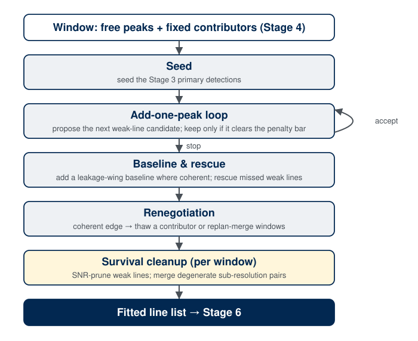
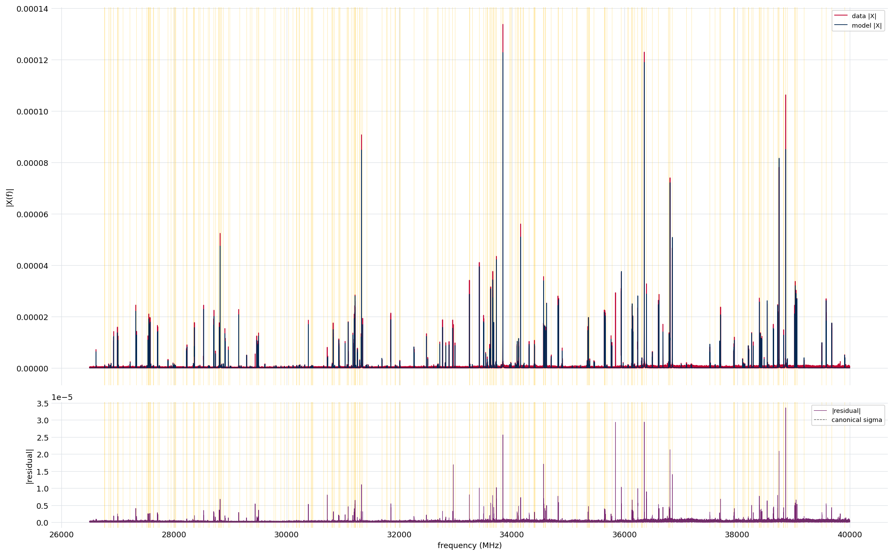
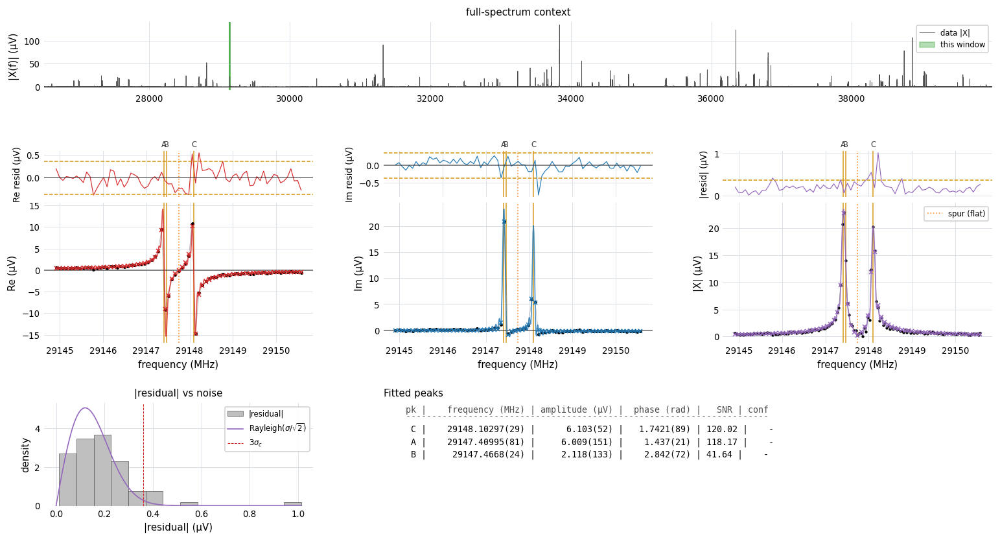

.. index::
   single: peak fitting
   single: nonlinear least squares
   single: line shape
   single: finite-acquisition response
   single: decay time
   single: leakage-wing baseline
   single: residual rescue
   single: spur masking
   single: fit acceptance

Stage 5: Peak Fitting
=====================

Overview
--------

Stage 5 turns the :doc:`Stage 4 <stage4_windows>` window plan into the
**fitted line list**: for every line it recovers a frequency, an amplitude, a
phase, and a decay time, each with an uncertainty, by fitting a
finite-acquisition line-shape model to the complex spectrum window by window.
This is where the spectroscopic numbers (the line positions a catalog is built
from) actually come out.

The fit is deliberately conservative. Rather than fit a fixed number of lines
per window, it *grows* each window's model one line at a time and keeps a new
line only when the data demand it on a formal statistical test. Everything that
makes a real instrument's spectrum hard (truncation leakage, blended lines,
clock spurs, under-modeled skirt wings) is handled by an explicit mechanism
rather than by smoothing it away, so the reported parameters and their
uncertainties stay trustworthy.

Method
------

Stage 5 fits each window of the :doc:`Stage 4 <stage4_windows>` plan independently,
growing the window's model one line at a time and keeping a line only when a formal
test demands it. A window is **seeded** with its strongest peak; the **add-one-peak
loop** then proposes the next residual peak and accepts it only when its fit
improvement clears a window-size-independent penalty bar, stopping when no candidate
clears it. A **leakage-wing baseline** is added where the residual stays coherent, a
**rescue** pass recovers weak lines the loop missed, and a **renegotiation** with
Stage 4 thaws a frozen contributor or merges windows when a coherent edge remains.
Windows are fit in the plan's dependency-ordered parallel batches, so a frozen skirt
is always available before the window that needs it. Once every window is fit, a
global **survival pass** prunes lines that fell below the detection floor and merges
sub-resolution pairs the fit cannot justify. The model the fit uses, and the frame it
runs in, come first; each mechanism is then taken in turn.

   The Stage 5 fit lifecycle. Each window (blue) is seeded, grown by the
   add-one-peak loop (which iterates while a proposed line clears the penalty bar),
   then refined by the baseline, rescue, and renegotiation steps; the windows run in
   dependency-ordered batches. Once all windows are fit, a global survival pass
   (gold) finalizes the merged line list.

Line-shape model
----------------

A molecular line in an FTMW experiment is an exponentially damped cosine,
excited at the active-region turn-on and observed over a finite acquisition of
length :math:`T`. Its complex Fourier transform is **not** a Lorentzian: the
finite observation window wraps every line in a coherent
**truncation-leakage skirt**, a sinc-like ripple that reaches tens of megahertz
from the line center. Stage 5 fits the exact finite-:math:`T` response rather
than fighting the leakage with apodization (which would broaden the lines and
bias the shape, and is why the :doc:`active FT <stage1_ft>` is left
unwindowed).

Each line in a window carries three free parameters: an amplitude :math:`A`, a
baseband frequency offset :math:`\Delta f` (MHz) from the window reference, and a
phase :math:`\varphi`. All lines in the window additionally **share one decay time**,
rather than fitting it per line (`Shared decay time`_ covers when it is free and when
it is held). For the default **Lorentzian** envelope
:math:`e^{-t/\tau}`, one line's modeled response is

.. math::

   X(\Delta f) \approx \tfrac{1}{2} A\, e^{i\varphi}\, h_T(\Delta f; \tau),
   \qquad
   h_T(\Delta f; \tau)
     = \frac{1 - \exp\!\bigl[-(1/\tau + i\,2\pi\,\Delta f)\,T\bigr]}
            {1/\tau + i\,2\pi\,\Delta f},

the exact finite-:math:`T` transform of a damped cosine observed over
:math:`[0, T]`. At line center :math:`h_T(0) = \tau_\text{eff} =
\tau\,(1 - e^{-T/\tau})`, and far from center its magnitude falls off as the
:math:`1/|\Delta f|` truncation-leakage skirt with a definite, coherent phase.
Because the model carries that skirt exactly, a strong line's leakage can be
subtracted from a neighboring window exactly — which is the entire basis of the
:doc:`Stage 4 <stage4_windows>` fixed-contributor scheme.

The **Gaussian** alternative replaces the exponential envelope with
:math:`e^{-(t/\tau_G)^2}`, for instruments whose lines relax with a Gaussian
profile. Its finite-:math:`T` response is the closed-form complex transform

.. math::

   h_T(\Delta f; \tau_G) = \frac{\sqrt{\pi}}{2}\,\tau_G\, e^{\beta^2}
       \bigl[\operatorname{erf}(T/\tau_G + \beta) - \operatorname{erf}(\beta)\bigr],
   \qquad \beta \equiv i\,\pi\,\tau_G\,\Delta f,

carrying the same :math:`\tfrac{1}{2} A\, e^{i\varphi}` amplitude–phase prefactor and
the same window-shared decay time (now :math:`\tau_G`). Its real prefactor
:math:`e^{\beta^2} = e^{-\pi^2\tau_G^2\,\Delta f^2}` is the Gaussian line core, and at
center :math:`h_T(0; \tau_G) = \tfrac{\sqrt{\pi}}{2}\,\tau_G\operatorname{erf}(T/\tau_G)
= \tau_{\text{eff},G}`. The envelope shape is normally not set by hand — the
:doc:`Stage 2b <stage2b_tau>` line-shape vote recommends it, and the fit consumes the
matching decay-time calibration (:math:`\tau` or :math:`\tau_G`).

Putting the terms together, the complete model of a window on its baseband-offset
grid :math:`u` (MHz from the window reference) is

.. math::

   M(u) =
     \underbrace{\sum_{j\,\in\,\text{free}} \tfrac{1}{2} A_j\, e^{i\varphi_j}\,
        h_T(u - \delta_j;\, \tau)}_{\text{free peaks (fitted)}}
     \;+\;
     \underbrace{\sum_{c\,\in\,\text{fixed}} \tfrac{1}{2} A_c\, e^{i\varphi_c}\,
        h_T(u - \delta_c;\, \tau_c)}_{\text{fixed contributors (frozen)}}
     \;+\;
     \underbrace{B(u)}_{\text{baseline}}.

Each **free peak** contributes three fitted parameters (amplitude :math:`A_j`,
offset :math:`\delta_j`, and phase :math:`\varphi_j`), and all free peaks share the
single decay time :math:`\tau` (fitted or held, per `Shared decay time`_). Each
**fixed contributor** :math:`c` is frozen at the parameters from its own window's fit
(amplitude, offset, phase, and its own decay time :math:`\tau_c`) and only adds its
leakage skirt here, never a free line. :math:`B(u)` is a low-order **complex baseline
polynomial**, present only when the leakage-wing trigger fires
(`Leakage coupling between windows`_). The same form holds for the Gaussian envelope,
with :math:`h_T` the Gaussian response and :math:`\tau_G` in place of :math:`\tau`.

The fit runs on the **active-portion FT** — the transform of just the active FID
samples, the same surface :doc:`Stage 2 <stage2_noise>` measured its noise on,
already in the :math:`[0, T]` form the model expects. Each window is sliced from the
active FT and its molecular-frequency grid is converted to a small signed
**baseband offset** about the window reference: a line near 36 GHz is fit as a ~MHz
offset, not as an absolute ~36 GHz number. The sideband sign relating molecular and
baseband frequency is taken from the experiment metadata; the opposite sign would
conjugate every leakage skirt and bias the fitted frequencies while leaving the
magnitude residual looking plausible.

Conservative add-one-peak loop
------------------------------

Each window is fit by growing its model one line at a time:

#. **Seed.** Start from the window's strongest promoted peak and fit a
   single-line model (amplitude, frequency, phase, and — where eligible — the
   shared decay time) by complex nonlinear least squares against the window's
   data, weighted by the :doc:`Stage 2 <stage2_noise>` per-bin noise.
#. **Propose.** Pick the strongest peak in the current residual that has not
   yet been tried and trial-fit it jointly with the lines already accepted.
#. **Accept or stop.** Keep the new line only when its chi-squared improvement
   clears a fixed penalized bar: the drop :math:`\Delta\chi^2` from adding the
   line must exceed :math:`2\lambda\,\Delta k`, where :math:`\Delta k` is the
   parameters the line costs and :math:`\lambda` is a single global strictness
   (a stricter, BIC-like setting of the textbook information criterion). Because
   the two models compared share the window's bins, :math:`\Delta\chi^2` is the
   *local* evidence for the line and the bar carries no window geometry — so a
   window padded with quiet noise cannot manufacture significance for an extra
   line. The chi-squared is scored against a per-bin noise inflated by the
   lineshape-fidelity budget where the model is bright, so a candidate that only
   absorbs a strong line's irreducible shape misfit cannot clear the bar. A
   candidate that fails is rejected, and the loop stops after a bounded run of
   consecutive rejections, when no candidate remains, or when a width or
   separation bound is reached.

Because the residual is weighted by the real per-bin noise, a converged window
sits at its noise-and-fidelity floor, and the window-size-independent bar keeps
the gate honest — the loop adds a line only on genuine local evidence, not to
chase a lineshape floor or to exploit a window's quiet bins. A classical F-test
on the :math:`\chi^2` drop is recorded at each step as a familiar diagnostic, but
it does not gate acceptance. The derivation of the gate, the window-size bias it
avoids, and its cross-instrument validation are in the
:doc:`fitting-statistics methods note <methods/stage5_fitting>`.

**Blend-aware seeding.** A single line fit to a close blend lands at the
blend's centroid and leaves an elevated reduced :math:`\chi^2`. When that
happens the seeder retries with two (then up to three) lines *straddling* the
feature rather than stacked at the drifted centroid, which recovers blends down
to about half a line width apart. This blend escalation, not a large patience
budget, is what makes the conservative loop resolve real doublets.

Shared decay time
-----------------

All lines in a window share **one decay time** — a single physical relaxation
governs the whole local spectrum, and sharing it keeps the fit well determined.
Whether that decay time is a free parameter depends on how much signal the
window carries:

- A window whose strongest line clears the free-:math:`\tau` floor
  (``fit_tau_min_snr``, default SNR ``10``) fits :math:`\tau` freely, bounded
  to a band around the :doc:`Stage 2b <stage2b_tau>` majority value
  :math:`\tau_\text{maj}` and softly anchored there by a penalty so it cannot
  run away.
- A weaker window **holds** :math:`\tau` fixed at :math:`\tau_\text{maj}` (the
  band-local value when per-band calibration is available, otherwise the
  band-wide value, otherwise :math:`T/3`). A faint window cannot determine its
  own decay time, so it borrows the calibrated one rather than letting
  :math:`\tau` absorb noise.

The penalty is a soft bidirectional prior centered on :math:`\tau_\text{maj}`
with a width set by the Stage 2b uncertainty :math:`\sigma_\tau`; it matters
most for the Gaussian shape, where an unconstrained :math:`\tau_G` can trade
against the baseline.

Leakage coupling between windows
--------------------------------

A window is not fit in isolation. The truncation-leakage skirt of every strong line
reaches well beyond its own window, so each window must account for the leakage of
its neighbors, absorb the residue the discrete model cannot capture, and, when
coupling only surfaces once the lines are fit, renegotiate its boundaries with
Stage 4.

**Fixed contributors and the fit order.** A window does not fit the strong lines
that live in *other* windows, but it must still account for their leakage reaching
into its band. Stage 4 attaches each such line as a **fixed contributor**: its
damped-cosine term, with parameters frozen at the values from its own fit, is
evaluated in this window's model (it is added to the model, never subtracted from the
data, consistent with the least-squares contract). A contributor whose own
signal-to-noise is too low to freeze confidently is flagged for the thaw handshake
below. Because a frozen skirt can only be drawn once its source line has been fit,
windows carry a dependency order: Stage 4 groups them into **parallel batches**
(batch 0 has no dependencies, batch 1 depends only on batch 0, and so on), and
Stage 5 fits each batch's windows concurrently, advancing batch by batch. The result
is identical to a strictly sequential fit; parallelism only shortens the wall-clock
time
(see :doc:`performance <performance>`).

**Leakage-wing baseline.** Hundreds of distant lines each contribute a little
coherent leakage that the discrete fixed-contributor set cannot fully represent, and
a single strong neighbor's skirt is never modeled perfectly. The residue is a smooth,
coherent pedestal under a window — not a narrow line, but enough to inflate
:math:`\chi^2` and bias the lines sitting on it. Stage 5 absorbs it with an
**evidence-triggered baseline**: a low-order complex polynomial added to the window's
model. It fires only where the evidence calls for it — when the residual at a window
edge is still coherent (the :doc:`edge-coherence statistic <stage4_windows>` exceeds
``edge_threshold``) or when a low-order polynomial explains a smooth in-band residual
on an F-test (``smooth_threshold``). When it fires, the window is refit with the
baseline and a re-freed :math:`\tau`, so the added flexibility is priced into the
per-line uncertainties. The default order (``4``) follows a pedestal's gentle ramp
and curvature while remaining far too smooth to mimic a real line (every window
spans many bins), and the F-test trigger is the guardrail against over-fitting.

**Renegotiation with Stage 4.** Some coupling is only visible once the lines are fit.
After a window converges, Stage 5 checks whether its edges still carry coherent
residual leakage, and if so it renegotiates rather than shipping an under-fit window:

- **Thaw.** When a *fixed contributor* is responsible (its frozen parameters no
  longer explain the boundary, or it was flagged not freeze-eligible), the
  contributor is unfrozen and co-fit jointly with the dependent window. This does not
  fit the line a second time: its single free fit is reopened and re-determined
  jointly across the coupled windows, replacing the frozen copy rather than adding
  another. It is the common, cheap case (the reference experiment's 36350/36389 MHz
  pair, each the other's contributor, resolves this way).
- **Structural replan.** When no contributor accounts for the coherent edge, because
  a real line straddles the boundary, Stage 5 asks Stage 4 to **merge** the two
  windows through its :doc:`re-plan entry point <stage4_windows>`, bumping the plan
  revision, and refits the affected batches.

Both are bounded by round caps for guaranteed termination, and every attempt,
accepted or not, is recorded in the fit's audit trail. A window *split* is
deliberately not part of the handshake; over-fitting is handled after the fact by the
survival pass below.

Refining the line list
----------------------

Three mechanisms shape the final line population: recovering real lines the initial
pass missed, excluding instrumental artifacts, and pruning lines the data do not
support.

**Residual rescue.** After the add loop converges, a **rescue** pass re-examines the
residual for weak lines the initial nomination missed — typically lines on the
shoulder of a strong neighbor, where the Stage 3 position was slightly off. It
nominates generously from residual prominence and then gates each candidate through
the same penalized acceptance the main loop uses, with a remove-and-refit cleanup
that drops any line the joint fit no longer supports and merges sub-resolution
duplicates. Rescue is bounded by a round cap and is what closes the gap between
detection and a complete fit on dense, high-dynamic-range spectra.

**Spur masking.** Clock and local-oscillator harmonics appear as **spurs**:
persistent continuous-wave tones that sit at integer megahertz and are a single bin
wide — narrower than any finite-:math:`T` line shape can be. Fitting one as a
molecular line would manufacture a spurious detection. Stage 5 identifies a spur by
combining an integer-megahertz position with either a frequency-domain narrowness
test or the :doc:`Stage 2b <stage2b_tau>` flat/saturated catalog, and excludes the
masked bins from peak nomination and from the :math:`\chi^2` / residual sums. A
:doc:`declared instrument clock tree <clock_declaration>` sharpens this: the
locked-clock intermodulation lattice replaces the bare integer-megahertz anchor, and
a drifting-tone lane handles a free-running digitizer clock.

.. _stage5-survival:

**Post-fit survival.** Two automatic cuts run on the merged line list once every
window is fit. Both leave hand-added (``user``-origin) lines untouched.

- **Signal-to-noise prune.** Every automatically fitted line whose post-fit SNR
  falls below the survival floor is dropped, windows left empty are removed, and
  partially pruned windows are refit so the survivors' parameters stay honest. The
  floor **tracks the Stage 3 promotion cutoff**: by default it is that cutoff scaled
  by ``snr_survival_factor`` (``1.1``), so a survivor never sits below the
  signal-to-noise that admitted the line at detection, and raising the Stage 3 cutoff
  raises the survival bar in step. Setting ``snr_survival_floor`` pins an absolute
  floor instead. The prune iterates to a fixed point, because removing a line and
  refitting can push a marginal neighbor below the floor.
- **Degenerate-pair merge.** A sub-resolution pair that the fit split into two lines
  is merged back into one when a member's amplitude is statistically unidentifiable —
  its amplitude variance-inflation factor
  :math:`\text{VIF} = (\sigma_A / A)\cdot\text{SNR}` reaches ``vif_collapse_threshold``
  (``4``) within about one resolution element. A prior-free fit cannot justify a
  sub-resolution *split*, and in the ambiguous band such splits are over-splits far
  more often than real doublets, so the default is to merge and flag the window for
  review, leaving the analyst to opt into a split with catalog support. A safety
  **veto** keeps the split when collapsing the pair would leave the one-line model
  fitting catastrophically badly (the data genuinely demand two components).

A separate, **observation-only** doublet-alternative pass refits each sub-resolution
pair as a single line and records the comparison statistics (:math:`\Delta\chi^2`,
orthogonal-evidence score) without ever changing a fitted peak, so the review surface
and the analyst can adjudicate the close calls themselves.

Running the stage
-----------------

Stage 5 requires :doc:`Stage 4 <stage4_windows>` and consumes the
:doc:`Stage 2b <stage2b_tau>` decay-time calibration when present (falling back
to :math:`T/3` if it is absent). Run window assignment first.

.. code-block:: console

   $ ftmwpipeline fit run exp_2638.ftmw
   $ ftmwpipeline fit show exp_2638.ftmw

The same operations on the Python interfaces:

.. code-block:: python

   import ftmwpipeline.api as ftmw

   fit = ftmw.fit_peaks("exp_2638.ftmw")
   print(fit.n_windows, fit.n_fitted_peaks)
   for pk in fit.fitted_peaks:
       tau_us = 1.0 / pk.decay_rate if pk.decay_rate else float("nan")
       print(f"{pk.frequency_mhz:.4f} MHz  A={pk.amplitude:.3g}  "
             f"tau={tau_us:.2f} us  SNR={pk.snr:.1f}")

   # or, object-oriented
   from ftmwpipeline import Pipeline
   pipe = Pipeline.open("exp_2638.ftmw")
   fit = pipe.fit_peaks()

The fit is deterministic: a re-run on the same inputs and settings reproduces it
exactly. Re-running supersedes any review or report built on the old fit.

   Stage 5 fit of the example experiment. Top: the fitted model (gold) overlaid
   on the active spectrum (gray, magnitude), with the fit windows shaded. The
   model tracks the data across the full dynamic range — the strong lines and the
   weak forest alike. Bottom: the magnitude residual (red) against the per-bin
   noise (gray dashed); across the band the residual sits at the noise level, the
   signature of a complete fit that has neither left real lines unmodeled nor
   manufactured spurious ones.

**Choosing the shape and the calibration.** The envelope shape is normally inherited
from the :doc:`Stage 2b <stage2b_tau>` line-shape vote, which also stamps the matching
decay-time calibration. Pass ``--shape gaussian`` (or ``shape=`` on the Python
interfaces) to fit the Gaussian envelope and consume the Gaussian :math:`\tau_G`
calibration instead; omit it to take the resolved default. A hand-tuned decay anchor
can be supplied for an A/B test with ``--tau-maj-override`` / ``--sigma-tau-override``
(an atomic pair). Settings resolve in the usual order (explicit flags, then a
persisted record, then a preset, then the recommended values, then the hard defaults)
as described on :doc:`settings_and_presets`. The packaged ``defaults`` preset is a
copy-and-edit template of every knob at its default; a preset composes with explicit
flags.

Inspecting, assessing, and tuning the fit
-----------------------------------------

Three tools close the loop of looking at a fit, grading it, and adjusting it:
``fit show`` to inspect, ``fit check`` to grade, and the knobs to tune.

**Inspecting.** With no selector, ``fit show`` draws the spectrum-wide overview
above (the model overlay and the magnitude residual), the
view for confirming the residual sits at the noise level everywhere. Window selectors
(``--window``, ``--window-list``, ``--freq``, ``--top-snr``, ``--all-windows``,
``--random``) draw a consolidated **per-window detail** instead: the real, imaginary,
and magnitude data with the model overlaid, the residual panels, a residual
histogram, and a table of the fitted peaks with their uncertainties, alongside the
printed fit log for that window. The detail figure is the tool for understanding
*why* a window fit the way it did. By default the command opens an interactive
window; ``--no-interactive`` with ``-o`` saves a static image.

   Per-window detail for a single window of the example experiment. The top strip
   locates the window in the full spectrum. The real, imaginary, and magnitude
   panels show the data (points) with the fitted model (lines, model values
   marked at the data bins) and the residual above each. The fit resolves a close
   blend (lines A and B sit about 0.06 MHz apart, well inside one linewidth)
   beside a third line C, while a clock spur (dotted) is masked from the fit. The
   residual histogram tracks the Rayleigh noise expectation, and the table lists
   each fitted line's frequency, amplitude, phase, and signal-to-noise with the
   fit uncertainty on the trailing digits, plus a ``qual`` determinacy score
   (below): the isolated line C scores ``4/4`` while the blended pair A and B
   score ``2/4`` — flagging that, though both are strong, they are not
   individually well determined.

The ``qual`` column is a per-line **determinacy score** — how many of four
independent checks the line clearly passes, written ``k/4``. The four checks are
**detected with margin** (signal-to-noise comfortably above the
:ref:`survival floor <stage5-survival>`), **amplitude identifiable** (the
amplitude variance-inflation factor is well below the degenerate-collapse bar),
**position pinned** (the frequency uncertainty is under a tenth of a resolution
element), and **isolated** (no fitted neighbor within a resolution element). Each
check reuses a threshold the pipeline already applies elsewhere, so the score
introduces no new tuning. It measures how firmly the data *determine* a line, not
whether the line is a real, assignable transition — a high score can still attach
to an unmasked spur or an unassigned feature, which is why it informs curation
rather than gating it.

**Grading.** ``fit check`` grades a completed fit against a signal-to-noise-aware
acceptance framework: it flags windows whose reduced
:math:`\chi^2` exceeds what the local noise regime allows (a high-SNR window is held
to a tighter standard than a faint one), reports the model-deficit tier, and, given
a catalog of expected frequencies, runs a match check so unexplained residual
structure stands out. It is read-only; it grades the fit without changing it.

**Tuning.** The defaults are calibrated for the reference instrument and generalize
across a wide signal-to-noise range; routine use needs no adjustment. The most
commonly touched knobs are below. Set them with per-knob flags on ``fit run``,
through a preset, or via ``settings=StageFitSettings(...)`` on the Python interfaces.

.. list-table::
   :header-rows: 1
   :widths: 34 12 54

   * - Knob
     - Default
     - Role
   * - ``shape``
     - ``lorentzian``
     - Per-line envelope: ``lorentzian`` (:math:`e^{-t/\tau}`) or ``gaussian``
       (:math:`e^{-(t/\tau_G)^2}`). Normally set by the Stage 2b vote.
   * - ``tau.fit_tau_min_snr``
     - ``10``
     - In-window SNR above which the decay time is fit freely; below it,
       :math:`\tau` is held at the Stage 2b majority value.
   * - ``tau.per_band_tau``
     - ``True``
     - Anchor :math:`\tau` to the per-band majority (``True``) or one band-wide
       value (``False``).
   * - ``conservative.significance``
     - ``0.05``
     - Significance :math:`\alpha` for the recorded F-test diagnostic and the
       rescue cleanup test. The main accept gate is the window-size-independent
       penalized bar (see the
       :doc:`methods note <methods/stage5_fitting>`), not this :math:`\alpha`.
   * - ``rescue.snr_threshold``
     - ``2.5``
     - Residual-peak nomination floor for the rescue pass (nominates generously;
       the F-test gates acceptance).
   * - ``thaw.residual_edge_threshold``
     - ``8``
     - Edge-coherence above which a window edge triggers the thaw / replan
       handshake.
   * - ``baseline.edge_threshold``
     - ``3.5``
     - Edge-coherence above which the leakage-wing baseline is added to a window.
   * - ``spur.enabled``
     - ``True``
     - Detect and mask clock/LO spurs (integer-megahertz CW tones).
   * - ``peak_survival.snr_survival_factor``
     - ``1.1``
     - Sets the post-fit survival floor as this multiple of the Stage 3
       promotion cutoff. Set ``peak_survival.snr_survival_floor`` to pin an
       absolute floor instead.

The full knob set — the seeder thresholds, the per-window peak and separation
caps, the phase/amplitude penalties, the rescue merge tiers, the spur and clock
declaration knobs, and the survival/VIF parameters — is grouped into
sub-settings (``tau``, ``seeder``, ``conservative``, ``penalties``, ``rescue``,
``thaw``, ``spur``, ``baseline``, ``doublet_alternative``, ``peak_survival``)
and reached through a preset or a settings bundle. Use :doc:`scan <performance>`
to sweep a knob and see its effect rather than guessing.

Outputs and the handoff to Stage 6
----------------------------------

A completed Stage 5 run stores a self-describing fit record: the per-window fit
results and the merged, frequency-sorted global line list (each line tagged with
its originating window); for every line the amplitude, frequency, phase, decay
time, and their uncertainties from the fit covariance; the per-window **audit
trail** (every candidate tested, its F-statistic, p-value, AIC, and the
accept/reject decision); the **thaw** and **replan** histories; the **rescue**
rounds; and the resolved parameters used, so the fit can be reproduced and
reviewed. Like the earlier stages it is persisted in a flat, inspectable form
rather than recomputed on demand.

For example, reloading the record exposes each line's fitted parameters with their
covariance uncertainties, its originating window, and its provenance:

.. code-block:: python

   fit = ftmw.load_fit("exp_2638.ftmw")     # the persisted fit record
   pk = fit.fitted_peaks[0]                  # one line on the merged, frequency-sorted list
   pk.frequency_mhz, pk.frequency_error      # frequency and its covariance uncertainty (MHz)
   pk.amplitude, pk.phase                    # the other free per-line parameters
   1.0 / pk.decay_rate                       # decay time tau (us); decay_rate is stored as 1/tau
   pk.snr, pk.window_id, pk.origin           # SNR, originating window, "auto"/"user" provenance

The per-window detail figure above renders exactly this stored record for one
window (the fitted parameters, the residual, and the add-loop decisions), so it is a
concrete picture of what the fit persists.

The fitted line list is the substrate for :doc:`Stage 6 <stage6_review>`, where it is
reviewed, curated, and turned into the final products. Hand-edits (adding a line the
fit missed, removing a spurious one, accepting or overruling a flagged merge) are
made there through the ``review`` surface, which performs a single-window refit and
marks the window as user-edited so the provenance of every line is preserved. A line
a user adds (``origin = "user"``) is immune to the automatic survival prune. Stage 6
reads the fitted line list, the per-window audit and renegotiation histories, the
covariance-derived uncertainties, and the survival/attention flags to drive the
review surface and the final reports.

Limitations
-----------

- The fit is prior-free: it claims a sub-resolution split only on the data's
  own evidence, and where that evidence is ambiguous it merges and flags for
  review rather than guessing. Resolving a genuine close doublet against an
  over-split is a curation decision, supported by the observation-only doublet
  statistics and, where available, a catalog.
- The reported uncertainties are the formal fit (precision) uncertainties from
  the covariance. Systematic frequency accuracy, the absolute calibration of
  the instrument's clocks, is a separate budget addressed by the
  :doc:`clock declaration <clock_declaration>` and the Stage 6 reports, not by
  the per-window fit.
- The line shape is the finite-acquisition damped cosine in the recommended
  envelope. A spectrum whose lines genuinely depart from both available shapes
  would show structured residual; ``fit check`` and ``fit show`` are the tools
  for spotting it.

With the lines fit and their parameters and uncertainties recovered,
:doc:`Stage 6 <stage6_review>` reviews the fit and produces the final line list
and reports.
