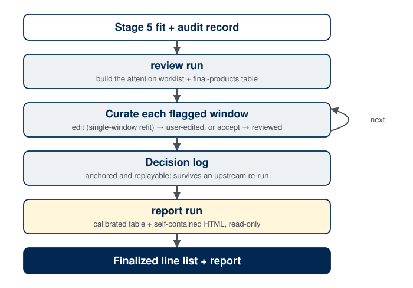
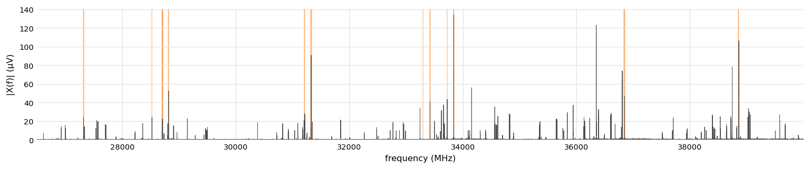

.. index::
   single: review
   single: finalization
   single: candidate ledger
   single: decision log
   single: attention routing
   single: final products
   single: frequency calibration
   single: uncertainty budget
   single: catalog cross-reference
   single: reports
   single: curation file

Stage 6: Review, Reports, and Finalization
==========================================

Overview
--------

Stage 6 is where a *person* enters. The pipeline through
:doc:`Stage 5 <stage5_fitting>` produces an automatic spectral model with a
complete audit record; Stage 6 turns that model into a **finalized, reportable
line list**. It does two things: it applies human decisions to the automatic fit
(adding a missed line, removing a spurious one, adjudicating a blend), and it
**consolidates and calibrates** the final data products the reports present.

A human decision is not a cosmetic annotation. **Every edit re-runs the fit for
the affected window** — a real nonlinear least-squares refit that updates the line
frequencies, amplitudes, phases, and their covariance uncertainties — so the
curated line list is as honestly fit as the automatic one. What a decision adds is
*provenance*, not a physics prior: Stages 0–5 extract the best model the data
support with no molecular-physics priors, and Stage 6 records *whose* decision
produced each line. Model-as-prior fitting (fitting a molecular Hamiltonian to
assign the lines) belongs to a separate program above this one; Stage 6 defines the
data products and the decisions that program would build on.

Two CLI objects carry the stage, both mirrored on the Python interfaces. The
**``review``** object builds the curation layer and applies edits; the
**``report``** object renders the finalized record and never recomputes the fit. One
distinction is worth fixing early, because it is easy to conflate:

- **``review run``** builds the worklist and the final-products table. It reads the
  existing fit and changes **no peaks** — it does not refit anything.
- **``review edit``**, ``accept --candidate``, and **``review apply``** are what
  *refit*: each applies a decision and re-runs the window's least-squares fit in
  place. A split or merge is not a separate verb here — it is what an ``edit``'s
  add/remove is read as when it changes the peak set that way (see :ref:`below
  <stage6-edit>`).
- **``review create``** is neither: it adds a *window* where the automatic pass
  left none, installing structure without touching any peak.

Method
------

``review run`` builds the curation layer over the Stage 5 fit: a single ranked
**attention worklist** of the windows that warrant a human look, and the
consolidated, calibrated **final-products table** the reports present. The analyst
works the worklist window by window, either **editing** it (which re-runs that
window's fit) or **accepting** the automatic fit unchanged; either way the flag
clears. Every edit is appended to an **anchored decision log** that replays against
the file when an upstream stage is re-run, so curation survives re-analysis. Finally,
``report`` renders the finalized record (the calibrated line table and a
self-contained HTML report), read-only. The sections below detail the flag model, the
worklist, the edit-and-refit verbs, the decision log, and the calibrated products.

   The Stage 6 curation loop. ``review run`` builds the worklist and the
   final-products table; the analyst edits or accepts each flagged window (blue), each
   edit re-running that window's fit and logging an anchored, replayable decision;
   ``report`` then renders the finalized record (gold), read-only.

Curation state and report-readiness
-----------------------------------

There is **no global "finalize" action** that freezes the record. Stage 6 is a
curation layer over the Stage 5 fit, carrying two **independent** flags per window,
shown as one combined label:

- **provenance** — ``auto`` (the fit produced it and no human has touched it),
  ``reviewed`` (a human looked and accepted the automatic fit unchanged), or
  ``user-edited`` (a decision was applied);
- **attention** — none, or ``needs-attention`` with one or more justified reasons.
  Attention is **advisory**: it never blocks a report. A window may legitimately stay
  ``auto · needs-attention``.

The two axes are orthogonal. A window can be ``user-edited · needs-attention``
(edited, but a neighboring spur still flags it) or ``user-edited`` with nothing left
to flag. Each **peak** additionally carries an ``origin`` of ``auto`` or ``user`` that
survives serialization, so a hand-added line is visibly marked wherever it appears.

Report-readiness is **computed, not asserted**. The only hard bar to generating a
report is a ``user-edited`` window whose decision has been **invalidated** by
re-running an upstream stage (see :ref:`the decision log <stage6-decisions>` below).
``needs-attention`` flags are reported honestly but never block.

Attention routing and the candidate ledger
-------------------------------------------

``review run`` builds one consolidated, ranked "needs attention" surface rather than a
scatter of per-feature lists, so the analyst has a single worklist. A window is
flagged for any of:

- **worst-ε** — the window's reduced :math:`\chi^2` fails the
  signal-to-noise-aware acceptance gate (the same standard ``fit check`` uses);
- **over-split** — a sub-resolution pair was auto-merged, or a member's amplitude
  variance-inflation factor flags a degenerate split for the analyst to confirm;
- **candidate-bearing** — the candidate ledger (below) holds a revivable rejected line
  with strong residual evidence (gated by a stiffer bar than the display ledger, so
  the surface stays actionable);
- **spur-adjacent** — a fitted line sits next to a masked clock/LO spur;
- **edge/boundary** — a line sits at a window edge, where leakage coupling is hardest.

A flag clears one of two ways: an **edit** (the window becomes ``user-edited``) or an
explicit ``review accept`` (the window becomes ``reviewed``, recording that a human
looked and was satisfied). Routing never forces a resolution; there is no
rubber-stamp. ``review rank --by <metric>`` re-sorts the whole worklist worst-first by
a chosen diagnostic (``min-snr``, ``max-vif``, ``chi2r``, ``candidate-evidence``,
``edge-distance``, ``spur-proximity``, or ``merged-chi2r``).

.. _stage6-ledger:

The candidate-bearing flag draws from a **candidate ledger** that Stage 6 derives, on
demand, from data the Stage 5 fit already persisted. Every line the fit *considered
and rejected* survives in the per-window audit trail and rescue history; the ledger
collects the add-loop rejects, the rescue candidates, the failed blend-split trials,
and the separation rejects, and normalizes them to **one entry per distinct molecular
frequency** (deduplicated across rescue rounds). Each entry carries its best evidence
seen, its rejection reasons, and the recorded seed needed to revive it. A **display
bar** keeps gate-killed dust off the worklist, so only candidates with real residual or
rescue evidence surface. Because the ledger is a pure function of the persisted Stage 5
data, ``review show --candidates`` renders it without re-fitting; it is the menu the
analyst draws from when a window is flagged candidate-bearing.

.. _stage6-edit:

Editing the fit
---------------

**Every edit verb refits the edited window and propagates into its dependents.** The
edited window re-seeds from its own persisted state (its fitted peaks as seeds, its
frozen contributors reconstructed from its own record), applies the add or remove, runs
one joint nonlinear least-squares fit with the production fitting primitive, and replaces
that window's entry in the stored fit. Because a strong line contributes its frozen
leakage skirt to neighboring windows, the edit then **cascades**: every window that froze
a skirt from the edited one has its frozen background rebuilt from the edited window's
*current* fit and is refit, in dependency order, so the file never carries a neighbor's
stale model of an edited line. The cascade refits are fit-only — no conservative
discovery, no rescue, no Stage 4 renegotiation — and are a deterministic consequence of
the edit rather than logged decisions of their own. The propagation is usually far below
the reported precision: a split or merge that preserves a line's total power and centroid
leaves its far-field skirt unchanged, so most edits move their dependents by
:math:`\ll\sigma_f`, and the case that matters is an edit that changes a strong line's
amplitude or position by a large amount. (Contrast ``review run``, which builds the
worklist and products but refits nothing.)

- ``review edit --window N --add F`` / ``--remove F`` — add or remove a line. ``--add``
  snaps to the nearest ledger candidate within tolerance (reviving its recorded seed)
  or seeds a fresh line at ``F``; ``--remove`` snaps to the nearest fitted peak. Both
  flags repeat, and a run of adds and removes on one window resolves into one refit.
- ``review accept --window N`` — the "looked, no change" dismissal (the window becomes
  ``reviewed``); the fit is untouched. With ``--candidate F`` it instead revives a
  ledger candidate, which *does* refit.

``add`` and ``remove`` are the whole grammar; there is no separate ``merge`` or
``split`` verb. An edit is read by what it does to the window's peak set, not by which
flags were typed:

- An ``add`` within snap tolerance of a fitted peak that is **not itself being
  removed** asks for a second component there, and is applied as a **split** of that
  peak into two, seeded at (the existing peak's position, the requested position).
- Removing two or more peaks that are mutually within snap tolerance — the components
  of one feature — while adding exactly one frequency inside their span is applied as
  a **merge**, seeded at the requested frequency (or at a recorded doublet-alternative
  seed, when the removed pair matches one).

Both readings require the peak set to actually change shape (a split raises the count,
a merge lowers it); an ordinary add or remove that does not match either shape is
applied exactly as typed. The decision log reports which reading was used
(``kind="split"``/``"merge"``) and stamps the request that was inferred from, so a
consumer of the log sees a physics-aware reseed rather than a literal add/remove pair.
All edits carry ``user`` provenance.

``review edit --add`` requires the frequency to lie inside the window when you
*name* one — naming the wrong window is an error, not a redirection. With
``--window`` omitted the window is derived from the frequency instead (windows
never overlap, so at most one covers it), and a frequency **no live window
covers** is not an error there: the window it needs is created as part of the
same edit. See :doc:`fit_curation` for the rules and the curation-file form.

Creating a window
~~~~~~~~~~~~~~~~~

- ``review create --at F`` — install a fit window covering ``F``, as an
  explicit, structural-only step. Creating one implicitly, as a side effect of
  the ``add`` that needs it, is usually what you want instead; this verb
  remains for pinning a window's id (what a replay writes) and for installing
  structure now to fill later.

Windows come from Stage 4, which builds them around the lines Stage 3 *promoted*.
A real line the detector missed therefore has no window to edit, and reaching it by
lowering the detection threshold re-runs Stage 3 — which invalidates Stages 5 and 6
and discards the entire curated edit set. ``review create`` supplies the missing
structure instead, so nothing already decided is lost.

It is deliberately **structural only**: the window is installed and fit with an empty
peak set. Putting the line in it is a separate ``review edit --window N --add F``, and
the log records the two operations as two decisions. Creating structure and changing a
window's peak set are different acts, and a log that spelled both ``add`` could not be
replayed or diffed without re-deriving window membership from scratch. A client is free
to offer both as one gesture; the log still shows two.

Three properties make the operation safe to build on:

- **Additive.** The new window reads its neighbors' frozen leakage skirts inward and
  contributes no outward dependency edge, so no existing window is re-fit or thawed —
  a window created for a line the automatic pass missed holds, by construction, a line
  below the freeze bar, whose own leakage into its neighbors is negligible.
- **Ids are only appended.** No existing window is ever renumbered, so a consumer that
  partitions peaks on ``window_id`` sees exactly the windows an edit touched rather
  than the whole spectrum.
- **Deterministic extent.** The window's bounds are a function of the anchor and the
  *base* Stage 4 plan — never of the current curated state — so replaying an edit set
  in order reproduces the same window. The window takes the plan's own margin each
  side of the anchor, shifted (not shrunk) when the gap cannot center it.

Two boundary cases resolve rather than fail. An anchor that already falls inside a
window is refused with a message pointing at ``review edit --add`` on that window —
that frequency has a home. And when the gap is too narrow to hold a fittable window,
the adjacent window is **widened** to absorb the anchor and re-fit over its new extent;
the result reports ``mode="widened"`` and the decision log records it, so the change to
an existing window is never silent. Windows Stage 5 dropped (all their peaks failed
their gates) are not treated as occupying their range: nothing is fit there.

**A user edit bypasses the accept gate but not the optimizer.** The analyst is the
gate: a user-added line is kept without the F-test the automatic loop applies. It still
faces the fit honestly, though — if the optimizer drives it to zero amplitude or
collapses it onto a neighbor, the result reports that rather than keeping a phantom.
Subsequent automatic passes are bound to the decision: the survival prune, the merge
cleanup, and the rescue pass will not prune a user-added line nor re-add a user-removed
one, because either would make the verb feel broken.

.. _stage6-decisions:

Every edit appends an entry to an **ordered decision log** persisted in the file, so
the ``.ftmw`` reproduces the curated analysis with no side channel. Each entry is
**anchored** to a window identity and a molecular frequency, and records its kind, its
``user`` provenance, and an evidence snapshot. ``review log`` lists the history;
``review undo`` reverts the most recent decisions by restoring the snapshotted
automatic fit and replaying the surviving decisions on top.

Because the decisions are anchored rather than baked in, re-running an upstream stage
does not silently discard them. **Replay re-applies each decision wherever its anchor
still resolves** — refitting the window just as the original edit did — and surfaces a
comparison (reduced :math:`\chi^2` with and without the decision, the peak-count and
frequency deltas) so the analyst can decide whether to revisit it. A decision is
**invalidated** only when its anchor no longer resolves: the window is gone, or the
frequency has fallen out of any window or out of band. An invalidated ``user-edited``
window is the sole hard bar to report generation; the report, when generated, logs the
Stage 6 decisions for honesty. Throughout, the curated result stays separable from the
automatic one, so a curated fixture never silently masquerades as an automatic
benchmark.

Final products and the frequency budget
---------------------------------------

``review run`` consolidates the **final-products table**: the single, calibrated line
list the reports present, persisted in the file and rebuilt after every edit so it is
never stale. Each row is one accepted line, carrying its calibrated and raw
frequencies, the amplitude, phase, and signal-to-noise with their uncertainties, the
three-term frequency budget, the originating window, the ``origin`` provenance, and any
clock-lattice flag. The exact columns are listed under
:ref:`the table output <stage6-table>` below.

Each row also carries a **derivation** tag: the decision-log index of the edit that
created or altered that line, or empty when the line came through unchanged. Because
one edit regenerates the whole curated peak set, a consumer that binds external state
to individual lines (a line assignment, say) has to decide across an edit which lines
are the *same line remeasured* and which are *replaced*. The tag answers that
directly — an untagged line survived the refit with its identity intact, while a
tagged one was added, or is a merge or split product, and must not silently inherit
the old binding. ``review undo`` renumbers the tags together with the log, so a tag
always indexes a decision that is actually in it.

Each row also carries the line's **knockout statistics**, the significance test
every window fit runs per peak: ``knockout_p_value`` (the F-test p-value of the
K-peak fit against the (K-1)-peak refit that drops this line),
``knockout_supported`` (whether the AICc gate prefers keeping it — ``False``
flags the line as redundant), and ``knockout_aicc_delta`` (the gate statistic
itself). These are carried through from the Stage 5 fitted peak rather than
recomputed, so a caller holding only a ``review preview`` result — which
persists nothing — has the same significance numbers an applied fit would have
written. All three are ``None`` when the source peak carries no knockout result
at all; ``nan`` (a float, not ``None``) when the test ran but its own refit did
not converge. They are fields on ``FinalPeak``, not columns of the exported
table. A line held out of a refit by a thaw is re-attached verbatim, so its
statistics describe its earlier fit while its neighbors' describe the new one.

The frequency uncertainty is composed as three independent terms in quadrature:

.. math::

   \sigma_f = \sqrt{\sigma_\text{stat}^2 \;+\; (\sigma_\varepsilon\, f_\text{baseband})^2
              \;+\; \sigma_\text{floor}^2}.

- :math:`\sigma_\text{stat}` is the **statistical precision** from the fit covariance,
  the per-line frequency error Stage 5 reports. For a line Stage 5 auto-merged from a
  degenerate pair this term also carries the unresolved-component spread (see
  :doc:`Stage 5 <stage5_fitting>`), and keeps carrying it across curation: every refit
  re-applies the widening to its own freshly computed formal error, including a refit a
  line reaches only as the cascaded dependent of an edit elsewhere.
- :math:`\sigma_\varepsilon\, f_\text{baseband}` is the **timebase-calibration
  residual**: a fractional digitizer-clock scale error :math:`\varepsilon` multiplies
  the line's baseband offset from the probe, so it grows with distance from the local
  oscillator. It is zero unless self-calibration ran.
- :math:`\sigma_\text{floor}` is a **user-settable systematic floor**
  (``review run --sigma-floor``, default ``0`` kHz), the home for an instrument's
  irreducible run-to-run accuracy term that the clock lattice cannot pin. The default of
  zero keeps the reported budget honest about precision and leaves any accuracy claim to
  the analyst who knows the instrument.

**Calibration is a reported state, never a report gate.** Whether the frequency axis
needs self-calibration is a property of the instrument's clock reference, declared
alongside the :doc:`clock tree <clock_declaration>`, and defaulting to "assume the axis
is absolutely calibrated" when nothing says otherwise. The table and the report state
one of three cases plainly:

- **Rb-locked** (declared, or the default) — the axis is absolutely calibrated by a
  frequency standard; :math:`\varepsilon \equiv 0` and self-calibration is a null
  operation. Frequencies are trusted as-is.
- **Free-running, self-calibrated** — ``timebase_calibration`` ran; the measured
  :math:`\varepsilon` is applied and its residual folded into the budget.
- **Free-running, not self-calibrated** — frequencies are reported uncalibrated with a
  strong recommendation to self-calibrate.

The timebase self-calibration handles exactly one topology: all signal-chain clocks
locked, with the **digitizer the single free-running source**, whose fractional scale
error it fits from how the locked spurs appear to drift. A declaration outside that
topology (a locked digitizer with some other free-running clock) reports as
free-running with self-cal *unavailable* rather than producing a wrong
:math:`\varepsilon`. This is a stated limitation, not a gap to be filled in this layer,
so ``timebase_calibration`` is a *soft* input: strongly recommended for a declared
free-running instrument, a null op for a locked one, and never a hard bar to a report.

Each line in the report and the per-window detail also carries the per-line **``qual``
determinacy score** introduced in :doc:`Stage 5 <stage5_fitting>` — how many of four
independent checks the line clearly passes, written ``k/4`` (detected with margin,
amplitude identifiable, position pinned, isolated). It is a per-*line* score, so it is
not one of the per-window ``review rank --by`` metrics (those are listed above). The
framing is the same here: it measures how firmly the data *determine* a
line, not whether the line is a real, assignable transition. A high score can still
attach to an unmasked spur or an unassigned feature, so it informs curation rather than
gating it.

Catalog cross-reference
-----------------------

Every report level accepts an optional ``--catalog`` of expected frequencies. For each
reported line the report flags the nearest catalog entry within a geometric tolerance
:math:`N\sqrt{\sigma_f^2 + \sigma_\text{cat}^2}` (``--catalog-nsigma``, default ``3``)
and echoes its **opaque label** — proximity annotation only, never an assignment. The
pipeline emits unassigned lines; the cross-reference is a cross-check, never a fit
input. The reader accepts a CSV/whitespace table (``frequency_mhz`` plus an optional
uncertainty and label, with the uncertainty unit read from the header) and the
Pickett/SPCAT ``.cat`` predicted-line catalog.

A catalog also unlocks the **pull calibration**: the distribution of
:math:`(f_\text{fit} - f_\text{cat}) / \sigma_f`, which should be a unit normal when the
:math:`\sigma_f` budget is honest. The report summarizes the pull (mean, spread) and
flags a spread much greater than one (an optimistic budget) or much less than one (a
conservative one). It validates the budget; it is not a shipped gate.

Running the stage
-----------------

Stage 6 requires :doc:`Stage 5 <stage5_fitting>`; the timebase calibration is a soft
input. ``review run`` builds the curation layer and the final-products table in one
pass, printing a summary of the worklist and the calibration state:

.. code-block:: console

   $ ftmwpipeline review run exp_2638.ftmw
   review run: 277 window(s), 5 needing attention
     candidate-bearing: 3
     over-split: 1
     spur-adjacent: 1
   final products: 638 peak(s), calibration Rb-locked (eps=±0.000 ppm), sigma_floor=0.000 kHz

   $ ftmwpipeline review rank --by chi2r --top 3 exp_2638.ftmw
   $ ftmwpipeline review edit --window 217 --add 31214.20 exp_2638.ftmw   # refits window 217
   $ ftmwpipeline report run exp_2638.ftmw --output-dir report/
   report run: wrote table to report/exp_2638_lines.csv
   report run: wrote self-contained full HTML report to report/exp_2638_report.html

The same operations on the Python interfaces, with the values each call returns:

.. code-block:: python

   import ftmwpipeline.api as ftmw

   result = ftmw.review_run("exp_2638.ftmw")
   print(result.n_windows, result.n_attention)        # -> 277 5
   print(result.reason_counts)                         # -> {'candidate-bearing': 3, ...}

   for w in ftmw.rank_windows("exp_2638.ftmw", by="chi2r", top=3):
       print(w.window_id, w.metric, round(w.value, 2), w.n_peaks)
   # 217 chi2r 3.81 2
   # 49  chi2r 2.94 5
   # 188 chi2r 2.40 1

   edit = ftmw.review_edit("exp_2638.ftmw", window_id=217, add=[31214.20])
   print(edit.n_peaks_before, edit.n_peaks_after, round(edit.chi2r_after, 2))   # -> 2 3 1.18

   paths = ftmw.report_run("exp_2638.ftmw", output_dir="report/")
   print(paths)   # -> {'table': 'report/exp_2638_lines.csv', 'html': 'report/exp_2638_report.html'}

   # or, object-oriented
   from ftmwpipeline import Pipeline
   pipe = Pipeline.open("exp_2638.ftmw")
   pipe.review_run()

   The Stage 6 review surface over the example experiment: the report's full-spectrum
   index overview. The finalized active spectrum (magnitude) runs across the whole
   band, with the windows the review flagged for attention shaded — the analyst's
   worklist at a glance. The bulk of the spectrum is settled ``auto`` model; attention
   is drawn only to the few windows where a close call, a candidate, or an
   edge-coherent residual warrants a human look.

Reports
-------

The ``report`` object renders the finalized record into an output directory (the
current directory by default); it never recomputes the fit.

.. _stage6-table:

``report table`` exports the **final-products table** on its own as CSV, JSON, or LaTeX
(``--format``; the LaTeX form is a ``booktabs`` table for a paper's supplementary
material). Spectroscopic fitting formats (Pickett ``.lin`` / SPFIT) are out of scope by
design, because the pipeline emits *unassigned* lines. The CSV is the canonical form: a
commented provenance header followed by one row per accepted line. Its columns, in
order, are ``frequency_mhz`` (calibrated), ``sigma_f_khz`` (the total budget), its
three components ``sigma_stat_khz`` / ``sigma_eps_khz`` / ``sigma_floor_khz``,
``frequency_raw_mhz`` (uncalibrated) and ``f_baseband_mhz``, ``amplitude`` /
``amplitude_err`` (in a header-declared unit), ``phase_rad`` / ``phase_err_rad``,
``snr`` / ``snr_err``, ``origin``, ``window_id``, ``clock_lattice``, and
``derivation``. With
``--catalog`` four columns append: ``catalog_label``, ``catalog_freq_mhz``,
``catalog_delta_khz``, and ``catalog_pull``. A representative excerpt:

.. code-block:: text

   # experiment: exp_2638
   # calibration_state: rb_locked
   # epsilon_ppm: 0.000
   # sigma_floor_khz: 0.000
   # probe_freq_mhz: 26000.000
   # sideband: upper
   # amplitude_unit: uV
   # n_peaks: 638
   frequency_mhz,sigma_f_khz,sigma_stat_khz,sigma_eps_khz,sigma_floor_khz,frequency_raw_mhz,f_baseband_mhz,amplitude,amplitude_err,phase_rad,phase_err_rad,snr,snr_err,origin,window_id,clock_lattice,derivation
   36350.112100,0.42,0.42,0.000,0.000,36350.112100,10350.112100,18.3,0.37,0.31,0.02,210.4,4.2,auto,217,,
   36389.044700,0.55,0.55,0.000,0.000,36389.044700,10389.044700,9.1,0.41,-1.12,0.05,71.6,3.2,auto,218,,

``report run`` is the default deliverable: it writes that table (``<stem>_lines.csv`` by
default) and a **self-contained HTML report** (``<stem>_report.html``), one portable
file with the stylesheet inlined and every figure embedded. The report opens
**read-only**, with an opt-in ``Curate`` toggle that collects edits in the browser and
exports them as a **curation file** for ``review apply`` to replay. Its anatomy, the
in-browser curation cart, and the curation-file language are documented on the
:doc:`Fit Curation <fit_curation>` page.

.. _stage6-diff:

``report diff`` is a **before/after review aid** for vetting a curation before
committing to it. It writes a self-contained ``<stem>_diff.html`` that compares the
**automatic fit** with the **current curated fit**, side by side, for every window the
curation changed *materially* — both the windows edited directly and the dependents the
contributor-edit cascade touched — so the changes can be
reviewed in one place without maintaining and diffing two separate files. Each window
shows its before and after :math:`|X|`-and-model panels (click either to zoom) with a
stat line giving the change in reduced :math:`\chi^2`, the shape-error fraction, and the
peak count; a window is included when a peak was added or removed, a peak moved
appreciably, or the fit quality shifted beyond a small threshold, which filters out the
sub-noise cascade jitter. The comparison is possible because the first curation edit
snapshots the automatic fit inside the file; before any edit (nothing to compare) the
report says so. Like the other ``report`` verbs it is read-only and never recomputes the
fit.

Limitations
-----------

- **The cascade is least-squares only.** Propagating an edit refits each dependent
  against the corrected skirt with the production primitive, but does not re-run line
  discovery or rescue on it: it re-determines a dependent's existing lines, and will not
  *add* a line that the corrected background newly reveals. A dependent that a large edit
  leaves visibly under- or over-fit (its reduced :math:`\chi^2` is the tell) is curated
  directly, which is consistent with the model — it becomes a directly-edited window.
- **Curation is recorded, not interpreted.** The decisions and their provenance
  persist, but adjudicating a genuine sub-resolution doublet against an over-split
  remains the analyst's call, supported by the observation-only doublet statistics and a
  catalog where one exists.
- **Precision, not accuracy, unless self-calibration ran.** The reported budget carries
  the formal precision plus whatever calibration the declared clock tree supports. An
  undeclared systematic offset is left to ``--sigma-floor``, not invented by the
  pipeline.

With the line list reviewed, calibrated, and finalized, the report renders the analysis
a reader can trust: the line positions, their uncertainty budget, and the provenance of
every decision that produced them.
