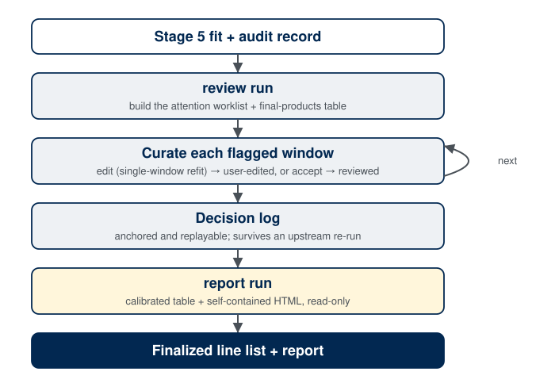
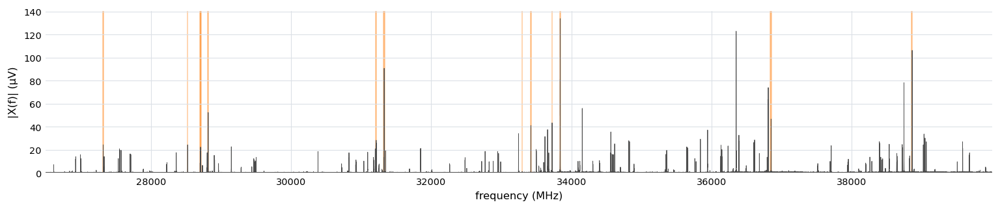

.. index::
   single: review
   single: finalization
   single: candidate ledger
   single: decision log
   single: attention routing
   single: final products
   single: frequency calibration
   single: uncertainty budget
   single: catalog cross-reference
   single: reports
   single: curation file

Stage 6: Review, Reports, and Finalization
==========================================

Overview
--------

Stage 6 is where a *person* enters. The pipeline through
:doc:`Stage 5 <stage5_fitting>` produces an automatic spectral model with a
complete audit record; Stage 6 turns that model into a **finalized, reportable
line list**. It does two things: it applies human decisions to the automatic fit
(adding a missed line, removing a spurious one, adjudicating a blend), and it
**consolidates and calibrates** the final data products the reports present.

A human decision is not a cosmetic annotation. **Every edit re-runs the fit for
the affected window** — a real nonlinear least-squares refit that updates the line
frequencies, amplitudes, phases, and their covariance uncertainties — so the
curated line list is as honestly fit as the automatic one. What a decision adds is
*provenance*, not a physics prior: Stages 0–5 extract the best model the data
support with no molecular-physics priors, and Stage 6 records *whose* decision
produced each line. Model-as-prior fitting (fitting a molecular Hamiltonian to
assign the lines) belongs to a separate program above this one; Stage 6 defines the
data products and the decisions that program would build on.

Two CLI objects carry the stage, both mirrored on the Python interfaces. The
**``review``** object builds the curation layer and applies edits; the
**``report``** object renders the finalized record and never recomputes the fit. One
distinction is worth fixing early, because it is easy to conflate:

- **``review run``** builds the worklist and the final-products table. It reads the
  existing fit and changes **no peaks** — it does not refit anything.
- **``review edit``**, ``accept --candidate``, and **``review apply``** are what
  *refit*: each applies a decision and re-runs the window's least-squares fit in
  place. A split or merge is not a separate verb here — it is what an ``edit``'s
  add/remove is read as when it changes the peak set that way (see :ref:`below
  <stage6-edit>`).
- **``review create``** is neither: it adds a *window* where the automatic pass
  left none, installing structure without touching any peak.

Method
------

``review run`` builds the curation layer over the Stage 5 fit: a single ranked
**attention worklist** of the windows that warrant a human look, and the
consolidated, calibrated **final-products table** the reports present. The analyst
works the worklist window by window, either **editing** it (which re-runs that
window's fit) or **accepting** the automatic fit unchanged; either way the flag
clears. Every edit is appended to an **anchored decision log** persisted in the
file. The curation belongs to the fit it was made on: re-running ``fit`` or any
earlier stage discards Stage 6 entirely, decision log and undo baseline included,
and the way to carry curation across a re-analysis is to keep it in a
:doc:`curation file <fit_curation>` and re-apply it with ``review apply``. Finally,
``report`` renders the finalized record (the calibrated line table and a
self-contained HTML report), read-only. The sections below detail the flag model, the
worklist, the edit-and-refit verbs, the decision log, and the calibrated products.

   The Stage 6 curation loop. ``review run`` builds the worklist and the
   final-products table; the analyst edits or accepts each flagged window (blue), each
   edit re-running that window's fit and logging an anchored decision;
   ``report`` then renders the finalized record (gold), read-only.

Curation state and report-readiness
-----------------------------------

There is **no global "finalize" action** that freezes the record. Stage 6 is a
curation layer over the Stage 5 fit, carrying two **independent** flags per window,
shown as one combined label:

- **provenance** — ``auto`` (the fit produced it and no human has touched it),
  ``reviewed`` (a human looked and accepted the automatic fit unchanged), or
  ``user-edited`` (a decision was applied);
- **attention** — none, or ``needs-attention`` with one or more justified reasons.
  Attention is **advisory**: it never blocks a report. A window may legitimately stay
  ``auto · needs-attention``.

The two axes are orthogonal. A window can be ``user-edited · needs-attention``
(edited, but a neighboring spur still flags it) or ``user-edited`` with nothing left
to flag. Each **peak** additionally carries an ``origin`` of ``auto`` or ``user`` that
survives serialization, so a hand-added line is visibly marked wherever it appears.

Nothing about curation gates a report. A report needs only the final-products table
that ``review run`` builds; ``needs-attention`` flags, edited windows, and
unreviewed windows are all reported honestly and never block it.

Attention routing and the candidate ledger
-------------------------------------------

``review run`` builds one consolidated, ranked "needs attention" surface rather than a
scatter of per-feature lists, so the analyst has a single worklist. Each reason has a
stable kind, the slug every output uses. A window enters the worklist (the review
queue) for any of:

- ``worst_eps`` — the window's reduced :math:`\chi^2` fails the
  signal-to-noise-aware acceptance gate (the same standard ``fit check`` uses);
- ``candidate_bearing`` — the candidate ledger (below) holds a revivable rejected line
  with strong residual evidence (gated by a stiffer bar than the display ledger, so
  the surface stays actionable);
- ``spur_adjacent`` — a fitted line sits on a gated clock/LO spur node;
- ``edge_boundary`` — a fitted line sits within one resolution element of a window
  edge, where leakage coupling is hardest;
- ``empty_window_residual`` — the fit holds no
  line in a window of its plan, yet Stage 5 measured a coherent residual on the
  window's edge (its edge-coherence ``S_coh`` stayed above the fit's
  ``residual_edge_threshold``, and neither a thaw nor a structural merge could act
  on it), and at least one of the Stage 3 peaks the plan put in the window sits off
  every gated spur, so a line may be missing. The flag lists the flagged edges and
  those Stage 3 peaks.

Three further kinds are **advisory**: they stay on the window's status, in
``review rank`` and in the report, but do not on their own put the window in the
queue.

- ``auto_merged_review`` — Stage 5 merged a degenerate sub-resolution pair into one
  line. The merge is usually the right call; the note marks a re-split opportunity
  (an ``add`` beside the line, read as a split) where a catalog or model supports two
  lines.
- ``flat_decay`` — a line in the ambiguous spur-decay band (a real line and a CW tone
  are indistinguishable there) was kept rather than masked; confirm it is molecular.
- ``empty_window_spur`` — as ``empty_window_residual``, but every Stage 3 peak in the
  window sits on a gated spur, so the edge residual is consistent with the spur's
  skirt reaching past its mask. The reason names the spur. (``review rank`` ranks
  fitted windows only, so it lists neither empty-window kind.) On the example
  experiment this is the case for windows 100, 158 and 227, each holding only a
  saturated spur.

A window flagged either way has no fit of its own, so it cannot be
edited by its id. To fit the line, create a window at it and add the line there::

   ftmwpipeline review create experiment.ftmw --at 30719.94 --frame raw
   ftmwpipeline review edit experiment.ftmw --window <new id> --add 30719.94 --frame raw

A created window takes the empty one over, and the flag clears, once it covers
the flagged Stage 3 peak (or, with no peak, the flagged edge); a created window
that merely overlaps the empty one leaves the flag where it is. To leave the
window empty, ``review accept --window N`` marks it reviewed. ``review show
--window N`` and the report show its data on the window's range; with nothing
fitted, the residual is the data.

A flag clears one of two ways: an **edit** (the window becomes ``user-edited``) or an
explicit ``review accept`` (the window becomes ``reviewed``, recording that a human
looked and was satisfied). Routing never forces a resolution; there is no
rubber-stamp. ``review rank --by <metric>`` re-sorts the whole worklist worst-first by
a chosen diagnostic (``min-snr``, ``max-vif``, ``chi2r``, ``candidate-evidence``,
``edge-distance``, ``spur-proximity``, or ``merged-chi2r``).

The worklist is never stale. A window's status is a function of the fits, the
decision log and the routing parameters, and every Stage 6 write (``review run``,
an edit, an accept, a create, an apply, an undo) recomputes every window's status
from what it leaves: the reasons from each window's current fit, a window an edit
refit only because it reads the edited one included, and the provenance from the
window's last decision (a plain ``accept`` gives ``reviewed``, any other decision
``user-edited``, none ``auto``). Undoing the create that took an empty window over
brings the empty window's flag back. The routing parameters are ``review run``'s
``--bar``, ``--attention-bar``, ``--kappa`` and ``--noise-floor``: the file records
the values a ``review run`` used (an option left out keeps its recorded value; a
file that records none uses the defaults), and every later write, an undo
included, routes attention under them.

.. _stage6-ledger:

The candidate-bearing flag draws from a **candidate ledger** that Stage 6 derives, on
demand, from data the Stage 5 fit already persisted. Every line the fit *considered
and rejected* survives in the per-window audit trail and rescue history; the ledger
collects the add-loop rejects, the rescue candidates, the failed blend-split trials,
and the separation rejects, and normalizes them to **one entry per distinct molecular
frequency** (deduplicated across rescue rounds). Each entry carries its best evidence
seen, its rejection reasons, and the recorded seed needed to revive it. A **display
bar** keeps gate-killed dust off the worklist, so only candidates with real residual or
rescue evidence surface. Because the ledger is a pure function of the persisted Stage 5
data, ``review show --candidates`` renders it without re-fitting; it is the menu the
analyst draws from when a window is flagged candidate-bearing.

.. _stage6-edit:

Editing the fit
---------------

**Every edit verb refits the edited window and propagates into its dependents.** The
edited window re-seeds from its own persisted state (its fitted peaks as seeds, its
frozen contributors reconstructed from its own record), applies the add or remove, runs
one joint nonlinear least-squares fit with the production fitting primitive, and replaces
that window's entry in the stored fit. Because a strong line contributes its frozen
leakage skirt to neighboring windows, the edit then **cascades**: every window that reads
the edited one has its frozen background rebuilt from the *current* fits of all the
windows it reads and is refit, in dependency order, so the file never carries a
neighbor's stale model of an edited line. Which windows a window reads is fixed by the
fitted plan (its fixed contributors that are not edge-free, among the windows Stage 5
fit) and, for a created window, by the plan that created it — never by the curated fits.
So an edit that leaves a window with no line strong enough to freeze takes its skirt out
of its dependents but not the dependency, and a later edit that gives it a strong line
again puts the skirt back in every one of them. The cascade refits are fit-only — no
conservative discovery, no rescue, no Stage 4 renegotiation — and are a deterministic
consequence of the edit rather than logged decisions of their own. The propagation is
usually far below the reported precision: a split or merge that preserves a line's total
power and centroid leaves its far-field skirt unchanged, so most edits move their
dependents by :math:`\ll\sigma_f`, and the case that matters is an edit that changes a
strong line's amplitude or position by a large amount. (Contrast ``review run``, which
builds the worklist and products but refits nothing.)

- ``review edit --window N --add F`` / ``--remove F`` — add or remove a line. ``--add``
  snaps to the nearest ledger candidate within tolerance (reviving its recorded seed)
  or seeds a fresh line at ``F``; ``--remove`` snaps to the nearest fitted peak. Both
  flags repeat, and a run of adds and removes on one window resolves into one refit.
- ``review accept --window N`` — the "looked, no change" dismissal (the window becomes
  ``reviewed``); the fit is untouched. With ``--candidate F`` it instead revives a
  ledger candidate, which *does* refit.

``add`` and ``remove`` are the whole grammar; there is no separate ``merge`` or
``split`` verb. An edit is read by what it does to the window's peak set, not by which
flags were typed:

- An ``add`` within snap tolerance of a fitted peak that is **not itself being
  removed** asks for a second component there, and is applied as a **split** of that
  peak into two, seeded at (the existing peak's position, the requested position).
- Removing two or more peaks that are mutually within snap tolerance — the components
  of one feature — while adding exactly one frequency inside their span is applied as
  a **merge**, seeded at the requested frequency (or at a recorded doublet-alternative
  seed, when the removed pair matches one).

Both readings require the peak set to actually change shape (a split raises the count,
a merge lowers it); an ordinary add or remove that does not match either shape is
applied exactly as typed. The decision log reports which reading was used
(``kind="split"``/``"merge"``) and stamps the request that was inferred from, so a
consumer of the log sees a physics-aware reseed rather than a literal add/remove pair.
All edits carry ``user`` provenance.

``review edit --add`` requires the frequency to lie inside the window when you
*name* one — naming the wrong window is an error, not a redirection. With
``--window`` omitted the window is derived from the frequency instead (windows
never overlap, so at most one covers it), and a frequency **no live window
covers** is not an error there: the window it needs is created as part of the
same edit. See :doc:`fit_curation` for the rules and the curation-file form.

Creating a window
~~~~~~~~~~~~~~~~~

- ``review create --at F`` — install a fit window covering ``F``, as an
  explicit, structural-only step. Creating one implicitly, as a side effect of
  the ``add`` that needs it, is usually what you want instead; this verb
  remains for installing structure now to fill later.

Windows come from Stage 4, which builds them around the lines Stage 3 *promoted*.
A real line the detector missed therefore has no window to edit, and reaching it by
lowering the detection threshold re-runs Stage 3 — which discards Stages 4, 5 and 6,
the entire curated edit set included. ``review create`` supplies the missing
structure instead, so nothing already decided is lost.

It is deliberately **structural only**: the window is installed and fit with an empty
peak set. Putting the line in it is a separate ``review edit --window N --add F``, and
the log records the two operations as two decisions (``create_window``, then
``add``). Creating structure and changing a window's peak set are different acts, and
a log that spelled both ``add`` could not be diffed without re-deriving window
membership from scratch. An ``add`` that *implies* its window — ``review edit
--add F`` with no ``--window``, or an omitted-window curation-file row, for a
frequency no live window covers — is different: the create is a mechanism the engine
chose, not a decision, so the log records the one ``add`` (into the new window).

Three properties make the operation safe to build on:

- **Additive.** The new window reads its neighbors' frozen leakage skirts inward, and no
  window that existed before the review ever reads a created one, so no existing window
  is re-fit or thawed — a window created for a line the automatic pass missed holds, by
  construction, a line below the freeze bar, whose own leakage into its neighbors is
  negligible. A later created window does read an earlier one it neighbors, whether or
  not that window holds a line above the freeze bar, so a line later added to the
  earlier window cascades into it. The skirts a new window starts from are read from
  its neighbors' *automatic* fits, never from their curated ones, and whenever a
  neighbor it reads has been edited (before the create or after it) its skirt from that
  neighbor is rebuilt from the neighbor's current fit, as the cascade rebuilds any
  dependent's. So a created window's fit does not depend on where its create sits in the
  log relative to the edits of the windows it reads, or to the adds into an earlier
  created window.
- **Ids are only appended.** No existing window is ever renumbered, so a consumer that
  partitions peaks on ``window_id`` sees exactly the windows an edit touched rather
  than the whole spectrum. Nor is an id ever reused: a new window takes an id above
  every id a create has taken since ``fit run`` started the curation lineage (the
  review's ``window_id_high_water``), so undoing a create never frees its id for a
  different window. A curation file may pin the id a create takes, but only above
  every created window the log still holds before it (``curation_conflict``,
  ``replay_conflict`` otherwise): created ids only increase along the log. The
  high-water mark bounds only the ids a create mints, so a pin may redo an undone
  create under its own id.
- **Deterministic extent.** The window's bounds are a function of the anchor, the
  *base* plan — the Stage 4 plan, or, when a structural merge revised it, the plan the
  fit was made on (see :doc:`stage5_fitting`) — and the windows the creates before it
  installed, never of any fit, so replaying an edit set in order reproduces the same
  window. A created window never takes an id a structural merge absorbed. The window
  takes the plan's own margin each side of the anchor, shifted (not shrunk) when the
  gap cannot center it.

Two boundary cases resolve rather than fail. An anchor that already falls inside a
window is refused (``bad_setting``, ``path`` ``anchor_mhz``) with a message pointing
at ``review edit --add`` on that window — that frequency has a home. And when the gap is too narrow to hold a fittable window,
the adjacent window is **widened** to absorb the anchor and re-fit over its new extent;
the result reports ``mode="widened"`` and the decision log records it, so the change to
an existing window is never silent. Windows Stage 5 dropped (all their peaks failed
their gates) are not treated as occupying their range: nothing is fit there.

**A user edit bypasses the accept gate but not the optimizer.** The analyst is the
gate: a user-added line is kept without the F-test the automatic loop applies. It still
faces the fit honestly, though — if the optimizer drives it to zero amplitude or
collapses it onto a neighbor, the result reports that rather than keeping a phantom.
Subsequent automatic passes are bound to the decision: the survival prune, the merge
cleanup, and the rescue pass will not prune a user-added line nor re-add a user-removed
one, because either would make the verb feel broken.

.. _stage6-decisions:

The decision log and undo
~~~~~~~~~~~~~~~~~~~~~~~~~

Every edit appends an entry to an **ordered decision log** persisted in the file, so
the ``.ftmw`` reproduces the curated analysis with no side channel. Each entry is
**anchored** to a window identity and a molecular frequency, and records its kind, its
``user`` provenance, and an evidence snapshot (the window's reduced :math:`\chi^2` and
peak count before and after, and for an inferred split or merge the frequency that was
requested). Each entry also names the peaks it acts on by identity: ``targets``, the
``peak_uid`` of every peak it removes (a remove's peak, a merge's parents, a split's
parent), and ``seeds_mhz`` / ``born_uids``, the seed position of every peak it births
and the uid that peak was stamped with from its seed. A request is resolved into its
entries before anything is fit, against the fit you see: a remove names the displayed
peak it resolved to (and is listed at that peak's fitted frequency, not at the
frequency you typed), and an add, merge or split stamps each new peak's uid from its
seed. An add whose new peak would carry a uid the window already holds (a second line
born at the same position) is refused (``curation_conflict``,
``line_already_fitted``), never moved to a free uid. Within one curation file or action
batch, an action after another on the same window resolves against the peaks the
other births at their seed positions. Each entry gets a **serial** when it is
recorded: its id, never reused or renumbered until ``fit run`` starts a new curation lineage. Entries are immutable: an
undo keeps every surviving entry exactly as it was written, and only its position
(``order_index``) changes. A coalesced edit logs one entry per add or remove it
carried; every entry also carries ``action_index`` in its evidence, the serial of the
first entry the same user action recorded (an action that logged one entry, a bare
accept included, carries its own serial). The entries sharing an ``action_index`` are
one **action group**. ``review log`` lists the history, by id.

**The curated state is a replay of the log.** The first Stage 6 write (an edit, an
accept, a create, an apply, or ``review run``) snapshots the automatic fit inside the
file, the **undo baseline**. From then on every write -- an edit, an accept, a
create, an apply, an undo, ``review run``, and a session's apply of a staged preview
-- builds the new log and review parameters and curates them: the log is replayed
from the baseline in one batch, each entry applied as recorded and in log order, then
one cascade refreshes every window that reads an edited one, and every window's status
is computed afresh. The file then holds exactly what that replay produces, fits,
statuses, final products and log alike, bit for bit, whatever order of calls led to
it. Three things follow, and are worth knowing:

- An edit applies to the window as the replay reaches it -- its automatic fit and its
  own earlier decisions -- and the cascade then refreshes it from its neighbours' final
  fits. What you saw is used only to resolve the request into its entries (which
  peak a remove names, where an add seeds). The result an edit returns compares the
  window as you saw it before the call with its curated fit after it, post-cascade.
- An entry's evidence (its :math:`\chi^2` and peak counts) is a snapshot taken when it
  was recorded, of the refit that entry ran in that write's replay. It is never
  updated; the current numbers are in the fits.
- A write whose fit-changing entries are the ones the log already held -- a bare
  accept, ``review run``, an undo of bare accepts -- refits nothing and keeps the fits
  as they are. A write that leaves the log with no fit-changing entry restores the
  automatic fit.
- A write that changes the log does not redo the whole replay: it refits only the
  windows whose result the change can reach -- a window whose own entries or geometry
  changed, and every window an edited window reaches through the cascade -- and keeps
  every other window's fit and final-product fields as they are, which is what the
  replay gives them anyway (every status is still recomputed). A window left with no
  entry and no edited window upstream gets its automatic fit back by copy. An edit
  of a window nothing else reads therefore costs one refit per action recorded on
  that window, replayed from its automatic fit; an edit of a window with many
  dependents (655's window 429 has 32) refits them all.

Two replays are bit-identical within one software environment; across numpy, SciPy or
BLAS versions they are not promised to be (a change of the fitting model itself is
marked by the analysis epoch, :ref:`stage6-epoch-gate`). The fits are the replay's in
the environment they were made in: after an upgrade that changes the analysis epoch, or
a change to a Stage 5 input such as the tau calibration, a write that refits nothing
keeps them as they were, and the first write that refits replays the whole log under
the running code.

``review undo --id N`` reverts the decisions it names (the ids ``review log`` lists:
serials), any of them, not only the most recent. An undo drops them from the log and
curates the rest: every surviving decision is replayed from the undo baseline, in log
order, and the surviving decisions keep their ids. A replay
applies each entry as recorded: it removes the peaks its ``targets`` name and births
its peaks at their recorded seeds under their recorded uids, never re-resolving a
frequency or re-reading an add as a split or merge. So a kept decision acts on the
same peaks however far the undo moves its window's lines (a cascade can move them by
several snap tolerances), and the peaks it births keep their uids. The replay goes
one user action at a time: a group's surviving entries replay together as one action
(one joint refit), exactly as the edit first applied them, so undoing part of a group
replays the rest of it jointly. ``--dry-run`` prints what would be undone and the
replay plan, one edit per action group (its seeds and the ``uid:N`` of its targets),
without writing. Every refusal of an undo comes before anything is fit.
An undo that would drop a created window surviving decisions still act on is refused
(``curation_conflict``, ``orphans_created_window``), as is one that would drop the
birth of a peak a surviving decision removes, merges or splits (``orphans_peak``; the
ids are the decisions to undo with it), one after which a surviving decision cannot be
applied as recorded (``replay_diverged``: its target is gone, or a peak it births is
already there, as after undoing the remove between an add and a re-add at the same
frequency), and an id the log does not hold (``not_found``, kind ``decision``).

A created window that survives an undo keeps its id, but its extent and the windows
it reads are planned again from the creates that survive, in log order, so undoing an
earlier create (one that bounded its gap, or that it read) can change them; undoing a
widening returns the widened window to its earlier extent. The undo is not refused for
that. It lists every window whose geometry it changes in
``geometry_changed_window_ids`` (``--dry-run`` lists the same; the CLI prints the ids,
and ``--json`` carries their count as ``n_geometry_changed``). The surviving creates are
planned before anything is fit, so one that can no longer take its id
(``curation_conflict``, ``replay_conflict``) leaves the file untouched.

A client that keeps its own position in the log (an editor whose undo steps back
through the decisions without re-fitting) aligns the file on its next real edit with
``review apply --log-prefix N`` (``log_prefix=N`` on the API): the decisions after
the first ``N`` are dropped and the kept ones are replayed (one action group at a time;
a prefix that cuts through a group replays that group's in-prefix entries jointly)
together with the new batch as one replay -- the same outcome as an undo of the dropped ids followed by an apply,
one cascade and one persist instead of two. The batch's frequencies and omitted window
ids resolve against the state the kept decisions describe (computed in memory first),
never the file as it stood.

Each of these calls is one unit. A write checks for a cancel before each action it
replays, between the windows its cascade refits, and once more before it persists,
and a cancel, a failing row, or a failing events callback discards the whole call,
an undo's included, leaving the file exactly as it was before the call. (The
guarantee is the call's single atomic write; see :doc:`machine_contract`.)

**The log belongs to the fit.** Re-running ``fit`` or any stage before it discards the
whole of Stage 6 — the attention layer, the final-products table, the decision log
and the undo baseline. Nothing is replayed onto the new fit. To carry curation across
a re-analysis, keep it in a :doc:`curation file <fit_curation>` (the report's
in-browser cart writes one) and apply that file to the new fit with ``review
apply``. Throughout, the curated result stays separable from the automatic one, so a
curated fixture never silently masquerades as an automatic benchmark.

**An edit changes the fit by adding or removing a line.** ``review edit`` needs at
least one ``--add`` or ``--remove``: an edit with neither would refit the window and
record no decision, so a later replay could not reproduce the file. It is refused
(``bad_setting``, path ``add``), on the command line, the ``Pipeline`` class and the
functional API alike, whether or not a window is named.

**Files curated before the replay engine.** A decision log is replayed from the
undo baseline, which needs every decision to carry a serial and every peak a
``peak_uid`` to address it by. A file whose Stage 5 fit has a peak without a
``peak_uid`` (a fit written before peak identity was persisted), or whose review or
undo baseline a build without the engine wrote, therefore cannot be curated: every
Stage 6 write, and a ``review preview``, is refused with ``curation_conflict`` and the
reason ``predates_peak_identity`` or ``predates_replay_engine``, and nothing is
converted or carried over. Reading still works (``review log``, ``review show``, the report), and
the file is flagged: ``review show`` and ``review log`` print the instruction, the
report shows a banner and no Undo buttons, and the review ``get_review_status``
returns has ``refit_required`` set. Re-run ``fit run``: it writes a fit that carries
peak identities and discards the file's curation, which then has to be redone (a
:doc:`curation file <fit_curation>` carries it over). The next edit starts a new
lineage, and serials start again at 0. A file whose review a *newer* engine wrote
is refused as ``file_incompatible`` instead, and ``refit_required`` reads
``file_incompatible``: upgrade ftmwpipeline rather than re-running ``fit run``,
which would discard that curation.

.. _stage6-merged-windows:

Windows after a structural merge
~~~~~~~~~~~~~~~~~~~~~~~~~~~~~~~~

A Stage 5 structural merge revises the windows the fit is made on: the survivor keeps
the lower id and the merged range, and the absorbed id is no longer a window (see
:doc:`stage4_windows`). Stage 6 works on that **fitted plan**, never on the Stage 4
plan as built. ``window_status`` reports it: one row per window of the fitted plan and
per created window, the survivor's row carrying ``merged_from``, the ids it absorbed.

- A curation call that names an absorbed id is refused as ``not_found`` (kind
  ``window``); name the survivor instead.
- A window Stage 6 creates never takes an absorbed id. A recorded window creation that
  is replayed (by an undo or a log-prefix apply) and no longer reproduces its window —
  it would now widen another window, or its id is taken — is refused
  (``curation_conflict``, ``replay_conflict``).
- A fit made before fits stored their plan holds merges whose geometry is not in the
  file. Edits that would refit such a merged window, directly or through the
  cascade, or create a window inside or against one, are refused before anything is
  fit (``curation_conflict``, ``fit_plan_unavailable``); re-running ``fit run`` stores
  the plan and clears the refusal.

.. _stage6-epoch-gate:

The analysis-epoch gate
~~~~~~~~~~~~~~~~~~~~~~~

A write that refits splices the windows it refits into a fit whose other windows were
fit earlier. If the fitting code changed in between — the file's Stage 5 fit was
produced under a different analysis epoch from the running package — the spliced
result would mix two fitting models inside one product. A write that refits
(``review edit``, ``accept --candidate``, ``create``, an ``apply`` or ``preview``
that changes a fit, an ``undo`` that leaves fit-changing decisions to replay)
therefore refuses with ``epoch_mismatch``, whose ``file_epoch`` and ``current_epoch``
name the two. A write that refits nothing keeps the fits as it finds them and is not
gated: ``review run``, a plain ``review accept``, an apply of bare accepts, and an
undo that drops only bare accepts or every fit-changing decision (which restores the
automatic fit). Reading the file is never gated. Two ways forward:

- ``fit run`` re-fits the whole spectrum under the current epoch (discarding the old
  Stage 6, as above); or
- ``review acknowledge-environment`` (``--reason TEXT`` optional) records in the file
  that the curation knowingly crosses the epoch boundary. Edits then proceed with a
  warning -- the first write that refits replays the whole decision log under the
  running package -- and the reports state that the curated fit mixes two analysis
  environments.

.. _stage6-refusals:

Refusals
~~~~~~~~

Every refusal leaves the file exactly as it was, and comes before anything is fit: a
request is resolved into its decisions, and a replayed log checked, against window
structure and peak identity alone. (An apply at a ``--log-prefix`` is the exception:
its batch resolves against the state the kept decisions describe, so a refusal of the
batch comes after that state is computed in memory.) Each is a typed error with a stable
``code``:
``bad_setting`` for a malformed request (its ``path`` names the
argument, cell or field, such as ``anchor_mhz`` or ``curation[line 3].freqs``),
``not_found`` for a peak, window, or decision id that does not resolve,
``curation_conflict`` for a valid request that conflicts with the file's review state
(its ``reason`` a stable slug, such as ``target_outside_window`` or
``replay_diverged``), ``epoch_mismatch`` for the gate above, and
``write_conflict`` when another process wrote the file during the call. On the
command line, ``--json`` prints the error as an ``ftmw/error@1`` object on stderr. The
full vocabulary, field by field, is in :doc:`machine_contract`; :doc:`fit_curation`
shows the refusals a curation file meets.

Final products and the frequency budget
---------------------------------------

``review run`` consolidates the **final-products table**: the single, calibrated line
list the reports present, persisted in the file and rebuilt after every edit so it is
never stale. Each row is one accepted line, carrying its calibrated and raw
frequencies, the amplitude, phase, and signal-to-noise with their uncertainties, the
three-term frequency budget, the originating window, the ``origin`` provenance, and any
clock-lattice flag. The exact columns are listed under
:ref:`the table output <stage6-table>` below.

Each row also carries a **derivation** tag: the serial of the decision that
created or altered that line, or empty when the line came through unchanged. Because
one edit regenerates the whole curated peak set, a consumer that binds external state
to individual lines (a line assignment, say) has to decide across an edit which lines
are the *same line remeasured* and which are *replaced*. The tag answers that
directly — an untagged line survived the refit with its identity intact, while a
tagged one was added, or is a merge or split product, and must not silently inherit
the old binding. The tag is the decision's serial, which an undo of other decisions
never renumbers, so a tag always names a decision that is actually in the log.

Each row also carries the line's **knockout statistics**, the significance test
every window fit runs per peak: ``knockout_p_value`` (the F-test p-value of the
K-peak fit against the (K-1)-peak refit that drops this line),
``knockout_supported`` (whether the AICc gate prefers keeping it — ``False``
flags the line as redundant), and ``knockout_aicc_delta`` (the gate statistic
itself). These are carried through from the Stage 5 fitted peak rather than
recomputed, so a caller holding only a ``review preview`` result — which
persists nothing — has the same significance numbers an applied fit would have
written. All three are ``Absent.NOT_RUN`` when the knockout test never ran for
the source peak; ``knockout_p_value`` and ``knockout_aicc_delta`` are
``Absent.UNDEFINED`` when the test ran but the value is not finite (its own
refit did not converge; for ``knockout_p_value`` also a degenerate F-test, one with
no residual degrees of freedom or a non-positive chi-squared). They are fields on ``FinalPeak``, not columns of the exported
table. From ``ANALYSIS_EPOCH`` 6 a thawed line stays frozen in the dependent
and is listed once, in its own window, so a refit of the dependent draws it as a
frozen contributor like any other. In a fit made before epoch 6 a thawed line
could sit among a dependent window's peaks; once the epoch mismatch is accepted,
a refit treats it as one of the dependent's own peaks and refits it on the
dependent's data alone.

The frequency uncertainty is composed as three independent terms in quadrature:

.. math::

   \sigma_f = \sqrt{\sigma_\text{stat}^2 \;+\; (\sigma_\varepsilon\, f_\text{baseband})^2
              \;+\; \sigma_\text{floor}^2}.

- :math:`\sigma_\text{stat}` is the **statistical precision** from the fit covariance,
  the per-line frequency error Stage 5 reports. For a line Stage 5 auto-merged from a
  degenerate pair this term also carries the unresolved-component spread (see
  :doc:`Stage 5 <stage5_fitting>`), and keeps carrying it across curation: every refit
  re-applies the widening to its own freshly computed formal error, including a refit a
  line reaches only as the cascaded dependent of an edit elsewhere. A line the fit
  left without a finite frequency error has no statistical term, so both its
  ``sigma_stat_khz`` and its total ``sigma_f_khz`` are ``Absent.UNDEFINED`` (empty
  cells in the exported table): the total is never computed with a term dropped.
- :math:`\sigma_\varepsilon\, f_\text{baseband}` is the **timebase-calibration
  residual**: a fractional digitizer-clock scale error :math:`\varepsilon` multiplies
  the line's baseband offset from the probe, so it grows with distance from the local
  oscillator. It is zero unless self-calibration ran.
- :math:`\sigma_\text{floor}` is a **user-settable systematic floor**
  (``review run --sigma-floor``, default ``0`` kHz), the home for an instrument's
  irreducible run-to-run accuracy term that the clock lattice cannot pin. The default of
  zero keeps the reported budget honest about precision and leaves any accuracy claim to
  the analyst who knows the instrument.

**Calibration is a reported state, never a report gate.** Whether the frequency axis
needs self-calibration is a property of the instrument's clock reference, declared
alongside the :doc:`clock tree <clock_declaration>`, and defaulting to "assume the axis
is absolutely calibrated" when nothing says otherwise. The table and the report state
one of three cases plainly:

- **Rb-locked** (declared, or the default) — the axis is absolutely calibrated by a
  frequency standard; :math:`\varepsilon \equiv 0` and self-calibration is a null
  operation. Frequencies are trusted as-is.
- **Free-running, self-calibrated** — ``timebase_calibration`` ran; the measured
  :math:`\varepsilon` is applied and its residual folded into the budget.
- **Free-running, not self-calibrated** — frequencies are reported uncalibrated with a
  strong recommendation to self-calibrate.

The timebase self-calibration handles exactly one topology: all signal-chain clocks
locked, with the **digitizer the single free-running source**, whose fractional scale
error it fits from how the locked spurs appear to drift. A declaration outside that
topology (a locked digitizer with some other free-running clock) reports as
free-running with self-cal *unavailable* rather than producing a wrong
:math:`\varepsilon`. This is a stated limitation, not a gap to be filled in this layer,
so ``timebase_calibration`` is a *soft* input: strongly recommended for a declared
free-running instrument, a null op for a locked one, and never a hard bar to a report.

Each line in the report and the per-window detail also carries the per-line **``qual``
determinacy score** introduced in :doc:`Stage 5 <stage5_fitting>` — how many of four
independent checks the line clearly passes, written ``k/4`` (detected with margin,
amplitude identifiable, position pinned, isolated). It is a per-*line* score, so it is
not one of the per-window ``review rank --by`` metrics (those are listed above). The
framing is the same here: it measures how firmly the data *determine* a
line, not whether the line is a real, assignable transition. A high score can still
attach to an unmasked spur or an unassigned feature, so it informs curation rather than
gating it.

Catalog cross-reference
-----------------------

Every report level accepts an optional ``--catalog`` of expected frequencies. For each
reported line the report flags the nearest catalog entry within a geometric tolerance
:math:`N\sqrt{\sigma_f^2 + \sigma_\text{cat}^2}` (``--catalog-nsigma``, default ``3``)
and echoes its **opaque label** — proximity annotation only, never an assignment. The
pipeline emits unassigned lines; the cross-reference is a cross-check, never a fit
input. The reader accepts a CSV/whitespace table (``frequency_mhz`` plus an optional
uncertainty and label, with the uncertainty unit read from the header) and the
Pickett/SPCAT ``.cat`` predicted-line catalog.

A catalog also unlocks the **pull calibration**: the distribution of
:math:`(f_\text{fit} - f_\text{cat}) / \sigma_f`, which should be a unit normal when the
:math:`\sigma_f` budget is honest. The report summarizes the pull (mean, spread) and
flags a spread much greater than one (an optimistic budget) or much less than one (a
conservative one). It validates the budget; it is not a shipped gate.

Running the stage
-----------------

Stage 6 requires :doc:`Stage 5 <stage5_fitting>`; the timebase calibration is a soft
input. ``review run`` builds the curation layer and the final-products table in one
pass, printing a summary of the worklist and the calibration state:

.. code-block:: console

   $ ftmwpipeline review run exp_2638.ftmw
   review run: 265 window(s), 6 needing attention
     auto_merged_review: 6
     candidate_bearing: 6
     empty_window_spur: 3
   final products: 511 peak(s), calibration self_calibrated (eps=+2.191 ppm), sigma_floor=0.000 kHz

The reason counts tally every reason recorded, advisory ones included; the six windows
needing attention are the six ``candidate_bearing`` ones (the ``auto_merged_review``
and ``empty_window_spur`` notes are advisory). The window count includes the three
empty windows the fit left in its plan.

Ranking the windows by fit quality, then editing window 59, one of the
candidate-bearing windows: its ledger holds a residual candidate at
28817.0306 MHz (``review show --window 59 --candidates``), and the add revives it.
The file is ``self_calibrated``, so the frequency's frame must be stated (see
:ref:`curation-frames`):

.. code-block:: console

   $ ftmwpipeline review rank --by chi2r --top 3 exp_2638.ftmw
   review rank by chi2r (window reduced chi-squared (fit quality)), worst first:
       win         value       freq_lo       freq_hi   peaks     chi2r  label
     ------------------------------------------------------------------------------
       179         193.5    33836.4336    33841.6968       2    193.48  auto·needs-attention[1]
       240         119.2    36346.4101    36354.9725       4    119.23  auto·—
       282         34.21    38857.4863    38863.5350       3     34.21  auto·needs-attention[1]

   $ ftmwpipeline review edit exp_2638.ftmw --window 59 --add 28817.03 --frame raw
   review edit  window=59  peaks 2 → 3  chi2r 24.43 → 5.817
     Added seeds (1): ['28817.0300']
         freq (MHz)         amp       snr  origin
     ----------------------------------------------
         28817.1677   1.396e-05     271.5    user
         28817.1875   2.702e-05     525.4    auto
         28817.3494   1.706e-05     331.8    auto

   $ ftmwpipeline report run exp_2638.ftmw --output-dir report/
   report run: wrote table to report/exp_2638_lines.csv
   report run: wrote self-contained full HTML report to report/exp_2638_report.html

The refit converged the added line to 28817.1677 MHz, 20 kHz from the strong
28817.1875 MHz line rather than at the seed, and :math:`\chi^2_r` fell from 24.4 to
5.8. A pair that close is a judgment call (its amplitude uncertainties, in the table
below, are as large as the amplitudes), which is what ``review show --window 59`` and
``report diff`` are for.

The same operations on the Python interfaces, with the values each call returns:

.. code-block:: python

   import ftmwpipeline.api as ftmw

   result = ftmw.review_run("exp_2638.ftmw")
   print(result.n_windows, result.n_attention)        # -> 265 6
   print(result.reason_counts)
   # -> {'auto_merged_review': 6, 'candidate_bearing': 6, 'empty_window_spur': 3}

   for w in ftmw.rank_windows("exp_2638.ftmw", by="chi2r", top=3):
       print(w.window_id, w.metric, round(w.value, 2), w.n_peaks)
   # 179 chi2r 193.48 2
   # 240 chi2r 119.23 4
   # 282 chi2r 34.21 3

   edit = ftmw.review_edit("exp_2638.ftmw", window_id=59, add=[28817.03], frame="raw")
   print(edit.n_peaks_before, edit.n_peaks_after, round(edit.chi2r_after, 2))   # -> 2 3 5.82

   paths = ftmw.report_run("exp_2638.ftmw", output_dir="report/")
   print(paths)   # -> {'table': 'report/exp_2638_lines.csv', 'html': 'report/exp_2638_report.html'}

   # or, object-oriented
   from ftmwpipeline import Pipeline
   pipe = Pipeline.open("exp_2638.ftmw")
   pipe.review_run()

   The Stage 6 review surface over the example experiment: the report's full-spectrum
   index overview. The finalized active spectrum (magnitude) runs across the whole
   band, with the windows the review flagged for attention shaded — the analyst's
   worklist at a glance. The bulk of the spectrum is settled ``auto`` model; attention
   is drawn only to the few windows where a close call, a candidate, or an
   edge-coherent residual warrants a human look.

Reports
-------

The ``report`` object renders the finalized record into an output directory (the
current directory by default); it never recomputes the fit.

.. _stage6-table:

``report table`` exports the **final-products table** on its own as CSV, JSON, or LaTeX
(``--format``; the LaTeX form is a ``booktabs`` table for a paper's supplementary
material). Spectroscopic fitting formats (Pickett ``.lin`` / SPFIT) are out of scope by
design, because the pipeline emits *unassigned* lines. The CSV is the canonical form: a
commented provenance header followed by one row per accepted line. Its columns, in
order, are ``frequency_mhz`` (calibrated), ``sigma_f_khz`` (the total budget), its
three components ``sigma_stat_khz`` / ``sigma_eps_khz`` / ``sigma_floor_khz``,
``frequency_raw_mhz`` (uncalibrated) and ``f_baseband_mhz``, ``amplitude`` /
``amplitude_err`` (in a header-declared unit), ``phase_rad`` / ``phase_err_rad``,
``snr`` / ``snr_err``, ``origin``, ``window_id``, ``clock_lattice``,
``derivation``, ``peak_uid``, and the per-line fit fields of the line's window:
``decay_time_us`` / ``decay_time_error_us`` (empty when ``tau`` was held fixed),
``shape``, ``fwhm_mhz``, ``detection_index``, and ``fit_window_low_mhz`` /
``fit_window_high_mhz`` (calibrated, like ``frequency_mhz``). An absent value is
an empty cell. With
``--catalog`` four columns append: ``catalog_label``, ``catalog_freq_mhz``,
``catalog_delta_khz``, and ``catalog_pull``. A representative excerpt:

.. code-block:: text

   # ftmwpipeline final products
   # experiment: exp_2638
   # calibration_state: self_calibrated
   # epsilon_ppm: +2.191 +- 0.074
   # sigma_floor_khz: 0.000
   # probe_freq_mhz: 40960.0000
   # sideband: lower
   # amplitude_unit: uV
   # n_peaks: 512
   # fit_environment: ftmwpipeline 0.1.0b6 (epoch 6), python 3.11.15, numpy 2.4.6, scipy 1.17.1
   # fit_blas: openblas 0.3.33 (1 threads)
   frequency_mhz,sigma_f_khz,sigma_stat_khz,sigma_eps_khz,sigma_floor_khz,frequency_raw_mhz,f_baseband_mhz,amplitude,amplitude_err,phase_rad,phase_err_rad,snr,snr_err,origin,window_id,clock_lattice,derivation,peak_uid,decay_time_us,decay_time_error_us,shape,fwhm_mhz,detection_index,fit_window_low_mhz,fit_window_high_mhz
   26613.613007,1.571,1.158,1.063,0,26613.581576,14346.418424,1.905,0.03924,-1.084,0.0306,34.58,0.7123,auto,1,,,18263000,8.50794,0.165,gaussian,0.118106,7,26611.091924,26616.747842
   28817.194312,7.492,7.438,0.8995,0,28817.167709,12142.832291,13.96,10.39,2.202,0.2736,271.5,202.1,user,59,,0,15458000,8.21607,0.0263,gaussian,0.120706,247,28814.700607,28819.885199
   28817.214055,21.44,21.42,0.8995,0,28817.187452,12142.812548,27.02,10.37,-0.2039,0.1491,525.4,201.7,auto,59,,,15457780,8.21607,0.0263,gaussian,0.120706,247,28814.700607,28819.885199

The excerpt is the table after the window 59 edit above: the first line came through
the fit unchanged, while the added line carries ``origin`` ``user`` and
``derivation`` ``0``, the index of the decision that created it. The calibrated
``frequency_mhz`` sits 31.4 kHz above ``frequency_raw_mhz`` at 26613 MHz and 26.6 kHz
above it at 28817 MHz: on this lower-sideband file the correction scales with the
baseband offset ``f_baseband_mhz``.

``report run`` is the default deliverable: it writes that table (``<stem>_lines.csv`` by
default) and a **self-contained HTML report** (``<stem>_report.html``), one portable
file with the stylesheet inlined and every figure embedded. The report opens
**read-only**, with an opt-in ``Curate`` toggle that collects edits in the browser and
exports them as a **curation file** that ``review apply`` applies. Its anatomy, the
in-browser curation cart, and the curation-file language are documented on the
:doc:`Fit Curation <fit_curation>` page.

.. _stage6-diff:

``report diff`` is a **before/after review aid** for vetting a curation before
committing to it. It writes a self-contained ``<stem>_diff.html`` that compares the
**automatic fit** with the **current curated fit**, side by side, for every window the
curation changed *materially* — both the windows edited directly and the dependents the
contributor-edit cascade touched — so the changes can be
reviewed in one place without maintaining and diffing two separate files. Each window
shows its before and after :math:`|X|`-and-model panels (click either to zoom) with a
stat line giving the change in reduced :math:`\chi^2`, the shape-error fraction, and the
peak count; a window is included when a peak was added or removed, a peak moved
appreciably, or the fit quality shifted beyond a small threshold, which filters out the
sub-noise cascade jitter. The comparison is possible because the first curation edit
snapshots the automatic fit inside the file; before any edit (nothing to compare) the
report says so. Like the other ``report`` verbs it is read-only and never recomputes the
fit.

Limitations
-----------

- **The cascade is least-squares only.** Propagating an edit refits each dependent
  against the corrected skirt with the production primitive, but does not re-run line
  discovery or rescue on it: it re-determines a dependent's existing lines, and will not
  *add* a line that the corrected background newly reveals. A dependent that a large edit
  leaves visibly under- or over-fit (its reduced :math:`\chi^2` is the tell) is curated
  directly, which is consistent with the model — it becomes a directly-edited window.
- **Curation is recorded, not interpreted.** The decisions and their provenance
  persist, but adjudicating a genuine sub-resolution doublet against an over-split
  remains the analyst's call, supported by the observation-only doublet statistics and a
  catalog where one exists.
- **Precision, not accuracy, unless self-calibration ran.** The reported budget carries
  the formal precision plus whatever calibration the declared clock tree supports. An
  undeclared systematic offset is left to ``--sigma-floor``, not invented by the
  pipeline.

With the line list reviewed, calibrated, and finalized, the report renders the analysis
a reader can trust: the line positions, their uncertainty budget, and the provenance of
every decision that produced them.
